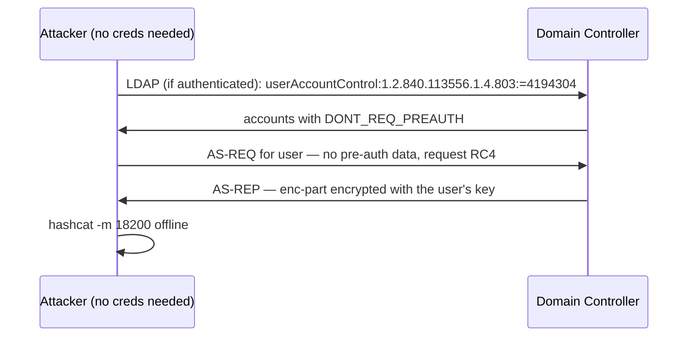

# AS-REP Roasting { #as-rep-roasting }

<div class="dfir-meta" markdown>
**MITRE ATT&CK:** T1558.004 (Kerberos 티켓 탈취 또는 위조: AS-REP Roasting) · **전술:** 자격 증명 접근 · **최종 수정:** 2026-10-07
</div>

!!! abstract "요약"
    보통 사용자는 DC가 AS-REP를 돌려주기 전에 비밀번호를 안다는 것을 증명해야 합니다(**Kerberos 사전 인증**). 그런데 어떤 계정에 **"Do not require Kerberos preauthentication"**(`DONT_REQ_PREAUTH`, userAccountControl 플래그 `0x400000`)이 설정되어 있으면, *누구든* DC에 그 계정의 AS-REP를 요청할 수 있습니다 — 그리고 그 일부는 계정의 비밀번호 해시로 암호화되어 있습니다. 공격자는 [Kerberoasting](kerberoasting.md)처럼 이것을 오프라인에서 크랙합니다. 차이점: 공격자가 DC에 닿을 수 있고 사용자 이름을 추측하거나 열거할 수 있다면, AS-REP roasting은 **도메인 자격 증명이 전혀 없어도** 통합니다.

## 공격 원리 { #how-the-attack-works }



이 플래그가 존재하는 이유: 아주 오래된 Kerberos 클라이언트와 일부 Unix/레거시 연동은 사전 인증을 할 수 없었습니다. 오늘날 대부분의 환경에서 이것은 **잘못된 설정**입니다 — 문제 해결 중에 한 번 설정하고 잊어버린 경우가 많습니다.

## 공격 도구 / 명령 { #attacker-tooling-commands }

```text
# Enumerate + roast with domain creds
Rubeus.exe asreproast /format:hashcat /outfile:asrep.txt
Get-DomainUser -PreauthNotRequired      # PowerView

# Without creds — supply a username list
GetNPUsers.py corp.local/ -usersfile users.txt -no-pass -dc-ip 10.0.0.1 -format hashcat

# Crack
hashcat -m 18200 asrep.txt wordlist.txt
```

## 영향받는 Windows 버전 { #affected-windows-versions }

**모든 Active Directory 버전**에 있는 설정상의 약점입니다. 계정은 `DONT_REQ_PREAUTH`가 설정된 경우에만 노출되며 — 모든 버전에서 새 계정은 **기본적으로 꺼져 있습니다**. 노출 정도는 도메인의 암호화 설정에 따라 다릅니다: RC4가 꺼져 있으면 공격자는 AES로 암호화된 AS-REP(`etype 18`)를 받게 되는데, 크랙이 훨씬 느리지만 약한 비밀번호라면 여전히 크랙됩니다.

## 남는 흔적 { #artifacts-left-behind }

| 위치 | 아티팩트 | 찾을 것 |
|---|---|---|
| DC Security 로그 | **`Pre_Authentication_Type=0`**이고 `Ticket_Encryption_Type=0x17`인 **4768** (TGT 요청) | 사전 인증 없이 RC4로 발급된 TGT — roasting |
| DC Security 로그 | 한 IP에서 `Result_Code=0x6`(알 수 없는 주체)인 **4768**이 다수 | 목록을 이용한 사용자 이름 열거 (자격 증명 없는 변형) |
| AD | `0x400000`이 포함된 `userAccountControl` | 노출 그 자체 — 감사하세요 |
| DC Security 로그 | 변경 내용이 `Don't Require Preauth`를 설정한 **4738** (사용자 계정 변경) | 누군가 플래그를 켬 (공격자가 자신이 제어하는 대상에 이를 설정하기도 함, "targeted AS-REP roasting") |
| 네트워크 | [Zeek `kerberos.log`](../network/zeek/index.md) — 도메인에 속하지 않은 호스트에서 `request_type=AS`, 성공, 암호 RC4 | 네트워크상의 흔적 |

## 탐지 { #detection }

=== "Splunk — 사전 인증 없는 AS-REP"

    ```spl
    index=botsv3 sourcetype=WinEventLog EventCode=4768 Result_Code=0x0 Pre_Authentication_Type=0
    | stats count, values(Ticket_Encryption_Type) as etype, values(Client_Address) as src by Account_Name
    | sort - count
    ```

    `4768` = Kerberos TGT가 요청됨. `Result_Code=0x0` = 성공. `Pre_Authentication_Type=0`은 사전 인증이 제공되지 않았다는 뜻입니다(정상 로그온은 비밀번호면 `2`, 스마트카드/PKINIT이면 `15`/`16`). 걸리는 것은 모두 알려진 레거시 연동(허용 목록에 넣으세요)이거나 roasting입니다.

=== "Splunk — 열거"

    ```spl
    index=botsv3 sourcetype=WinEventLog EventCode=4768 Result_Code=0x6
    | bin _time span=5m
    | stats dc(Account_Name) as users by _time, Client_Address
    | where users > 20
    ```

    `Result_Code=0x6` = `KDC_ERR_C_PRINCIPAL_UNKNOWN` (사용자 이름이 존재하지 않음). 한 IP에서 5분 안에 서로 다른 알 수 없는 이름이 많이 나오면 roasting 전의 사용자 이름 스프레이입니다.

=== "PowerShell — 노출된 계정 찾기"

    ```powershell
    Get-ADUser -Filter 'DoesNotRequirePreAuth -eq $true' -Properties DoesNotRequirePreAuth, PasswordLastSet |
      Select-Object SamAccountName, PasswordLastSet
    ```

    위생 점검으로 실행하세요. 목록은 비어 있거나, 아주 긴 비밀번호를 가진 문서화된 레거시 계정만 있어야 합니다.

## 대응 { #response }

정말 필요하지 않은 모든 계정에서 플래그를 해제하고, roasting당한 계정은 **비밀번호를 재설정하세요**(크랙될 것이라고 가정하세요). 플래그를 유지해야 하는 계정이라면 30자 이상의 무작위 비밀번호를 주고 로그온할 수 있는 곳을 제한하세요.

### Windows 버전별 대응책 { #remediation-by-windows-version }

| 대응책 | 막는 것 | 적용 가능 버전 |
|---|---|---|
| 모든 계정에서 `DONT_REQ_PREAUTH` 제거; 이를 설정하는 4738에 경보 | 노출 전체 | 모든 AD 버전 |
| 예외 계정에 길고 무작위인 비밀번호 | 크랙을 사실상 불가능하게 함 | 모든 버전 |
| Kerberos에서 RC4 끄기 (AES 전용) | 느린 AES 크랙을 강제 | 7 / 2008 R2+에서 설정 가능 |
| **Kerberos Authentication Service** 감사 (성공 + 실패) | 사전 인증 유형이 담긴 4768 생성 | 고급 감사 정책 **2008 R2+** (2003은 기본 계정 로그온 감사) |
| 특권 계정에 **Protected Users** | 항상 AES로 사전 인증을 요구 | DFL 2012 R2+ |

## 참고 자료 { #references }

- [MITRE ATT&CK — T1558.004](https://attack.mitre.org/techniques/T1558/004/)
- 관련 페이지: [Kerberoasting](kerberoasting.md) · [Windows 이벤트 ID](../basics/windows-event-ids.md) · [버전별 강화](hardening-by-version.md)
