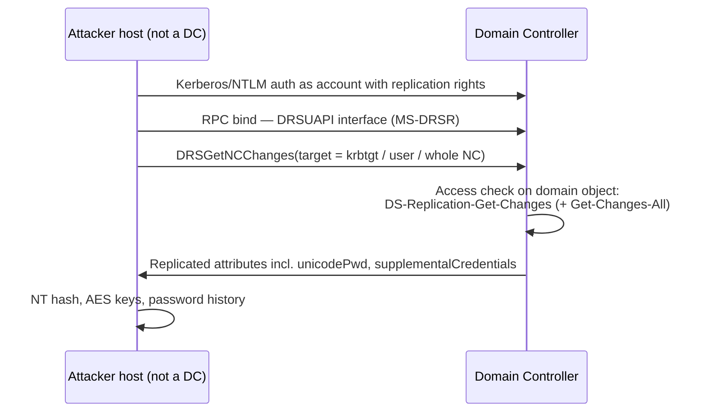

# DCSync { #dcsync }

<div class="dfir-meta" markdown>
**MITRE ATT&CK:** T1003.006 (OS 자격 증명 덤프: DCSync) · **전술:** 자격 증명 접근 · **최종 수정:** 2026-10-07
</div>

!!! abstract "요약"
    도메인 컨트롤러들은 **Directory Replication Service (DRS) Remote Protocol**로 서로 동기화합니다. 도메인 개체에 *복제* 권한을 가진 계정이라면 누구든 `DRSGetNCChanges`를 호출해서 비밀번호 해시를 받을 수 있습니다 — DC가 하는 것과 똑같이요. DCSync는 이것을 악용합니다: 평범한 워크스테이션에서, DC에 코드를 실행하지도 파일을 복사하지도 않고, 공격자는 `krbtgt`, Domain Admin, 또는 도메인 전체의 해시를 가져옵니다. [NTDS.dit 추출](sam-ntds-extraction.md)보다 조용하며, 보통 [Golden Ticket](golden-silver-tickets.md) 바로 전 단계입니다.

## 공격 원리 { #how-the-attack-works }



중요한 확장 권한은 세 가지이며, 모두 **도메인 naming context 루트**(`DC=corp,DC=local`)에 부여됩니다:

| 권한 | GUID | 중요한 이유 |
|---|---|---|
| DS-Replication-Get-Changes | `1131f6aa-9c07-11d1-f79f-00c04fc2dcd2` | 모든 복제에 필요 |
| DS-Replication-Get-Changes-All | `1131f6ad-9c07-11d1-f79f-00c04fc2dcd2` | **비밀** 속성(비밀번호 해시)을 받는 데 필요 |
| DS-Replication-Get-Changes-In-Filtered-Set | `89e95b76-444d-4c62-991a-0facbeda640c` | 필터링된 속성 집합 (RODC 관련) |

기본적으로 이 권한은 **Domain Controllers, Enterprise DCs, Administrators, Domain Admins, Enterprise Admins**가 갖고 있습니다. 공격자는 탈취한 DA 자격 증명을 쓰거나, 지속성을 위해 **눈에 띄지 않는 계정에 조용히 권한을 부여합니다** — 이 ACL 변경이 기법 전체에서 가장 은밀한 부분입니다.

## 공격 도구 / 명령 { #attacker-tooling-commands }

```text
# Mimikatz
lsadump::dcsync /domain:corp.local /user:krbtgt
lsadump::dcsync /domain:corp.local /all /csv

# Impacket
secretsdump.py -just-dc        CORP/da_user@dc01.corp.local
secretsdump.py -just-dc-user krbtgt CORP/da_user@dc01.corp.local

# Persistence variant — grant DCSync rights to a normal account (PowerView)
Add-DomainObjectAcl -TargetIdentity "DC=corp,DC=local" -PrincipalIdentity svc_backup -Rights DCSync
```

## 영향받는 Windows 버전 { #affected-windows-versions }

DCSync는 OS 버그가 아닙니다 — 복제 프로토콜이 설계대로 동작하는 것입니다. **Windows 2000 Server부터 Server 2025까지 모든 Active Directory 버전**에서 통합니다. 공격자가 실행하는 *클라이언트*는 어떤 OS든 됩니다(Windows, 또는 Impacket을 쓰는 Linux). 버전에 따라 달라지는 것은 오직 이를 탐지하고 제한하는 여러분의 능력뿐입니다(대응책 표 참고).

## 남는 흔적 { #artifacts-left-behind }

| 위치 | 아티팩트 | 찾을 것 |
|---|---|---|
| **DC** Security 로그 | `Properties`에 위의 Get-Changes / Get-Changes-All GUID가 들어 있고, `Account_Name`이 **DC 컴퓨터 계정(`...$`)이 아닌** **4662** (개체에 작업이 수행됨) | 핵심 탐지. **Audit Directory Service Access**를 켜고 도메인 개체에 감사 SACL이 있어야 합니다 |
| DC Security 로그 | 직전에 같은 계정으로 공격자 IP에서 온 **4624 Type 3** | 복제 요청을 출발지 호스트와 연결해 줍니다 |
| DC Security 로그 | 도메인 루트에서 `nTSecurityDescriptor`가 바뀐 **5136** (디렉터리 개체 수정) | 누군가 DCSync 권한을 **부여함** — 지속성 변형 |
| 네트워크 | [Zeek `dce_rpc.log`](../network/zeek/index.md) — **DC가 아닌** IP에서 온 `endpoint=drsuapi`, `operation=DRSGetNCChanges` | 네트워크상의 같은 신호로, 4662 감사가 꺼져 있어도 잡아냅니다 |
| 네트워크 | Zeek `conn.log` — 워크스테이션에서 DC로 135/tcp 후 높은 동적 RPC 포트 | 보조 맥락 |
| 공격자 호스트 | mimikatz/이름 바꾼 바이너리의 [Prefetch](../windows/prefetch.md)/[Amcache](../windows/amcache.md); Linux 점프 박스에서 Impacket용 Python | 요청이 어디서 왔는지 |

## 탐지 { #detection }

=== "Splunk — DC가 아닌 곳에서의 4662 복제"

    ```spl
    index=botsv3 sourcetype=WinEventLog EventCode=4662
    | where match(Properties,"(?i)1131f6aa-9c07-11d1-f79f-00c04fc2dcd2|1131f6ad-9c07-11d1-f79f-00c04fc2dcd2|89e95b76-444d-4c62-991a-0facbeda640c")
    | where NOT match(Account_Name,"\$$")
    | stats count, values(Properties) as rights by host, Account_Name, Logon_ID
    ```

    `4662` = AD 개체에 작업이 수행됨. `Properties`에는 사용된 권한의 GUID가 들어 있고, 첫 번째 `where`는 복제 권한만 남깁니다. 두 번째 `where`는 `$`로 끝나는 계정(정상적으로 복제하는 DC 컴퓨터 계정)을 뺍니다. **사용자** 계정이 복제를 한다면 DCSync입니다 — 또는 기준선을 잡고 이름으로 허용 목록에 넣어야 하는 AD Connect / 백업 서비스입니다. `Logon_ID`로 짝이 맞는 4624와 조인해서 출발지 IP를 찾을 수 있습니다.

=== "Splunk — 권한 부여 (지속성)"

    ```spl
    index=botsv3 sourcetype=WinEventLog EventCode=5136 LDAP_Display_Name=nTSecurityDescriptor
    | where match(Value,"(?i)1131f6aa|1131f6ad|89e95b76")
    | table _time, host, Account_Name, DN, Value
    ```

    `5136` = 디렉터리 서비스 개체가 수정됨. 수정된 속성이 보안 설명자이고 새 값에 복제 권한 GUID가 들어 있다면, 누군가 방금 어떤 주체에게 DCSync 권한을 준 것입니다. `DN`은 어떤 개체가 바뀌었는지 보여 줍니다(도메인 루트여야 함).

=== "Zeek — dce_rpc.log"

    ```bash
    zeek-cut ts id.orig_h id.resp_h endpoint operation < dce_rpc.log \
      | awk '$5=="DRSGetNCChanges"' \
      | grep -v -F -f known_dc_ips.txt
    ```

    `dce_rpc.log`는 각 RPC 호출을 기록합니다. `DRSGetNCChanges`만 남기고 출발지가 알려진 DC인 줄을 지우면 — 남는 것은 DC가 아닌 곳에서 요청한 복제입니다.

## 대응 { #response }

요청된 모든 해시가 탈취되었다고 가정하세요. `krbtgt`를 가져갔다면 즉시 **krbtgt 이중 재설정**을 시작하세요([Golden & Silver 티켓](golden-silver-tickets.md) 참고). DCSync에 쓰인 계정을 재설정하고 그 계정이 어떻게 권한을 얻었는지 조사하세요 — 도메인 루트의 ACL 전체를 검토하고(`Get-Acl "AD:DC=corp,DC=local"` 또는 BloodHound) **복제 권한을 가진 기본값이 아닌 주체를 모두 제거하세요**.

### Windows 버전별 대응책 { #remediation-by-windows-version }

| 대응책 | 하는 일 | 적용 가능 버전 |
|---|---|---|
| **Directory Service Access** 감사 + 도메인 루트에 SACL | 복제 권한에 대해 4662 생성 | 고급 감사 정책: **2008 R2+** DC (기본 DS Access 감사는 2003에도 있음) |
| **Directory Service Changes** 감사 | ACL 변경에 대해 5136 생성 | **2008+** DC |
| 복제 권한 보유자 최소화; 분기별 ACL 검토 | DCSync할 수 있는 계정 수를 줄임 | 모든 AD 버전 |
| **계층화된 관리** — DA 자격 증명은 Tier 0에서만 | 애초에 워크스테이션에서 DA 해시가 수집되지 않게 함 | 프로세스 통제 — 모든 버전 |
| 관리자를 위한 **Protected Users** 그룹 | NTLM 없음, RC4 없음, 위임 없음, 짧은 TGT → 쓸 만한 DA 자격 증명을 얻기 어려움 | 도메인 기능 수준 **2012 R2+**; 클라이언트 보호는 8.1 / 2012 R2+ (7 / 2008 R2는 KB2871997로) |
| 네트워크 ACL: DC만 다른 DC의 RPC 동적 포트에 접근 가능 | 워크스테이션이 DRSUAPI를 직접 호출할 수 없음 | 방화벽 / 호스트 방화벽 — 모든 버전 |
| Microsoft Defender for Identity (또는 동급) | DC 트래픽에 대한 내장 "suspected DCSync" 탐지 | DC **2012 R2+** (센서 지원) |

## 참고 자료 { #references }

- [MITRE ATT&CK — T1003.006](https://attack.mitre.org/techniques/T1003/006/)
- [Microsoft — MS-DRSR IDL_DRSGetNCChanges](https://learn.microsoft.com/openspecs/windows_protocols/ms-drsr/)
- 관련 페이지: [SAM 및 NTDS 추출](sam-ntds-extraction.md) · [Golden & Silver 티켓](golden-silver-tickets.md) · [횡적 이동 / 도메인 플레이북](../playbooks/lateral-domain.md)
