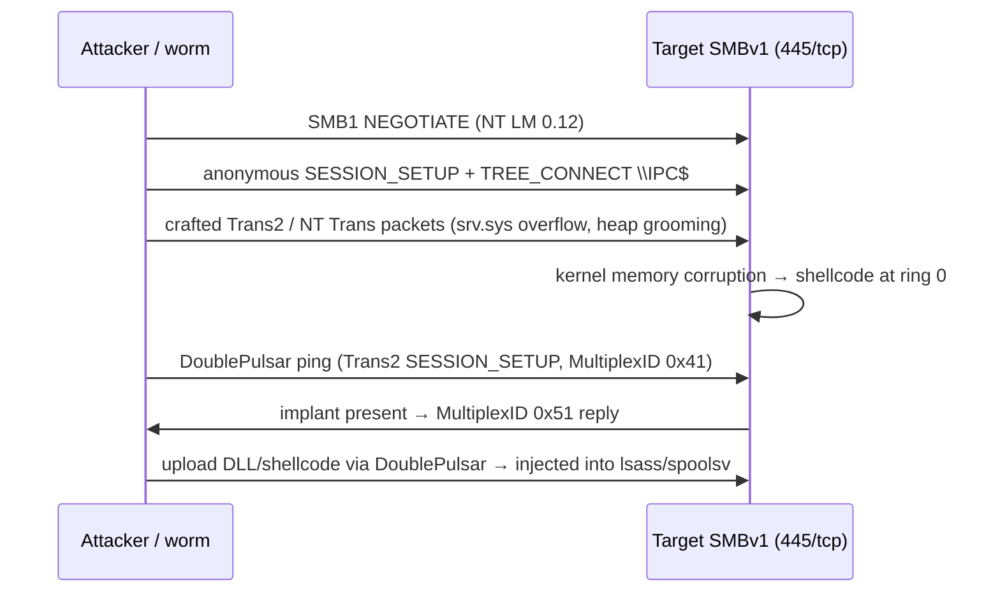

# EternalBlue와 SMBv1 익스플로잇 { #eternalblue-smbv1-exploitation }

<div class="dfir-meta" markdown>
**MITRE ATT&CK:** T1210 (원격 서비스 익스플로잇) · T1190 (공개 애플리케이션 익스플로잇, 445가 노출된 경우) · **CVE / 보안 공지:** MS17-010 (CVE-2017-0143 → 0148) · **전술:** 횡적 이동 / 초기 접근 · **최종 수정:** 2026-10-07
</div>

!!! abstract "요약"
    **EternalBlue**는 **SMBv1** 서버(`srv.sys`)의 버퍼 오버플로를 악용해 커널에서 SYSTEM 권한으로 코드를 실행합니다 — **자격증명도, 사용자 상호작용도 필요 없습니다**. 2017년 4월 Shadow Brokers가 NSA의 도구 모음에서 유출한 이 익스플로잇은 몇 주 만에 **WannaCry**와 **NotPetya** 웜의 동력이 되었고, 지금도 패치되지 않은 내부 호스트, OT/임베디드 Windows, 잊힌 서버를 상대로 쓰이고 있습니다. 함께 쓰이는 **DoublePulsar**는 EternalBlue가 보통 설치하는 커널 백도어 임플란트입니다. 최신 패치가 적용된 네트워크에서 이 페이지는 주로 **레거시 호스트**에 관한 내용이며 — 그래서 버전별 관점이 중요합니다.

## 공격 원리 { #how-the-attack-works }



## 공격 도구 / 명령 { #attacker-tooling-commands }

```text
nmap -p445 --script smb-vuln-ms17-010 10.0.0.0/24     # scanning (also used by defenders)
msfconsole: exploit/windows/smb/ms17_010_eternalblue    # 7 / 2008 R2 x64 most reliable
            exploit/windows/smb/ms17_010_psexec         # EternalRomance/Synergy/Champion — older + 2012/2016
            auxiliary/scanner/smb/smb_ms17_010
# Worms: WannaCry, NotPetya (also used PsExec/WMI with stolen creds), various coin miners
```

## 영향받는 Windows 버전 { #affected-windows-versions }

| 버전 | MS17-010 상태 | 메모 |
|---|---|---|
| **XP / Server 2003** | 취약 — WannaCry 이후 2017년 5월에 **긴급(out-of-band) 패치 KB4012598** 배포 | 익스플로잇이 덜 안정적이지만(자주 BSOD) 동작함 |
| **Vista / 2008** | 취약 — 2017년 3월 패치 | |
| **7 / 2008 R2** | 취약 — 2017년 3월 패치 | **주요 표적**; 가장 안정적인 익스플로잇 경로 |
| **8 / 8.1 / 2012 / 2012 R2** | 취약 — 패치됨 (8은 KB4012598 긴급 패치로) | EternalBlue는 덜 안정적; EternalRomance/Synergy 변형 사용 |
| **10 ≤ 1607 / 2016** | 취약 — 2017년 3월 패치 | |
| **10 1703+ / 2019 / 11 / 2022 / 2025** | 출시 상태로 취약하지 않음 | 10 1709 이상 / 2016 1709 이상을 새로 설치하면 SMBv1이 **기본으로 설치되지 않으며**(서버 구성요소), 최신 11에는 아예 없음 |

버그만이 아니라 프로토콜 자체가 문제입니다: SMBv1에는 인증 전 무결성 검사와 최신 암호화가 없고, 다른 SMBv1 버그도 존재합니다. Microsoft는 2014년부터 **SMBv1을 완전히 제거하라**고 권고해 왔습니다.

## 남는 흔적 { #artifacts-left-behind }

| 위치 | 아티팩트 | 찾을 것 |
|---|---|---|
| 네트워크 | IDS 시그니처 (Suricata/Snort ET `ETERNALBLUE`, `DOUBLEPULSAR`) | 익스플로잇과 임플란트 트래픽 — 가장 신뢰할 만한 탐지 |
| 네트워크 | [Zeek `conn.log`](../network/zeek/conn-log.md) — 한 출발지에서 445로 **많은** 호스트에 접속; `smb` 분석기 로그의 SMB1 dialect | 웜 방식의 스캐닝 |
| 네트워크 | MultiplexID **0x41** 요청 / **0x51 / 0x52** 응답을 가진 Trans2 `SESSION_SETUP` | DoublePulsar 체크인 |
| 호스트 | 오래된 호스트의 System 로그 **BSOD / 예기치 않은 재부팅** (41, 1001 BugCheck) | 익스플로잇 시도 실패 시 커널이 다운됨 |
| 호스트 | 페이로드 행위 — 새 서비스 (7045), `lsass.exe` / `spoolsv.exe`가 `cmd.exe`나 `rundll32.exe`를 생성 | 커널에 주입된 코드에 의한 사후 익스플로잇 활동 |
| 호스트 | WannaCry: `tasksche.exe`, `mssecsvc.exe` 서비스, `@WanaDecryptor@.exe`, `.WNCRY` 파일 | 알려진 악성코드 계열의 아티팩트 |
| 메모리 | `srv.sys` 디스패치 테이블의 DoublePulsar 후킹 (Volatility) | 커널 내 임플란트 |
| 호스트 설정 | `Get-SmbServerConfiguration`: `EnableSMB1Protocol=True` | 노출 여부 |

## 탐지 { #detection }

=== "Splunk — SMB 팬아웃"

    ```spl
    index=botsv3 sourcetype=bro:conn:json id.resp_p=445
    | bin _time span=5m
    | stats dc(id.resp_h) as targets by _time, id.orig_h
    | where targets > 25
    | sort - targets
    ```

    Splunk에 들어간 Zeek `conn.log`(`bro:conn:json`): 출발지(`id.orig_h`), 목적지(`id.resp_h`), 목적지 포트(`id.resp_p`)가 담긴 모든 연결입니다. 출발지별로 5분마다 445의 서로 다른 목적지 수를 세면 웜과 스캐너를 찾을 수 있습니다; 정상 클라이언트는 몇 개의 파일 서버하고만 통신합니다.

=== "Splunk — 익스플로잇 후 서비스 / lsass 자식 프로세스"

    ```spl
    index=botsv3 sourcetype="XmlWinEventLog:Microsoft-Windows-Sysmon/Operational" EventID=1
    | eval parent=lower(replace(ParentImage,".*\\\\",""))
    | where parent IN ("lsass.exe","spoolsv.exe","services.exe") AND match(lower(Image),"cmd\.exe|powershell\.exe|rundll32\.exe")
    | table _time, host, parent, Image, CommandLine
    ```

    DoublePulsar는 보통 `lsass.exe`나 `spoolsv.exe`에 주입됩니다. 이 프로세스들은 셸을 실행하는 일이 거의 없습니다.

=== "PowerShell — SMBv1 노출 찾기"

    ```powershell
    Get-SmbServerConfiguration | Select EnableSMB1Protocol        # 8 / 2012+
    Get-WindowsOptionalFeature -Online -FeatureName SMB1Protocol  # 8.1 / 10 / 11
    # 7 / 2008 R2: HKLM\SYSTEM\CurrentControlSet\Services\LanmanServer\Parameters\SMB1 (absent or 1 = enabled)
    ```

## 대응 { #response }

감염된 호스트를 즉시 네트워크 수준에서 격리하세요 — 웜처럼 퍼질 수 있습니다. 워크스테이션 서브넷 사이의 445를 차단하고, SMBv1이 켜져 있으면서 MS17-010이 누락된 호스트는 모두 패치하거나 격리하고, 의심 호스트의 메모리에서 DoublePulsar를 검사하세요. WannaCry 유형의 랜섬웨어라면 [랜섬웨어 플레이북](../playbooks/ransomware.md)을 따르세요.

### Windows 버전별 대응책 { #remediation-by-windows-version }

| 대응책 | 막는 것 | 적용 가능 버전 |
|---|---|---|
| **MS17-010** (2017년 3월) / XP, 2003, 8용 **KB4012598** | EternalBlue/Romance/Synergy | 위에 나열된 모든 버전 |
| **SMBv1 제거** — `Disable-WindowsOptionalFeature -FeatureName SMB1Protocol` / `Set-SmbServerConfiguration -EnableSMB1Protocol $false` | SMBv1 공격 유형 전체 | 8.1 / 2012 R2 이상은 기능(feature)으로; 7 / 2008 R2는 레지스트리로; **XP / 2003은 SMBv1 없이 동작 불가** → 격리 |
| 먼저 SMBv1 사용 감사 (`Set-SmbServerConfiguration -AuditSmb1Access $true`, `SMBServer/Audit`의 이벤트 **3000**) | 제거 전에 레거시 클라이언트 파악 | 10 / 2016 이상 |
| 경계와 워크스테이션 세그먼트 사이에서 **445/139** 차단 | 외부 노출 및 웜 확산 | 전체 (호스트 방화벽은 Vista 이상; XP SP2는 기본 방화벽) |
| 패치할 수 없는 레거시(OT, 의료, 임베디드 XP)에 대한 네트워크 분리 / 격리 | 고칠 수 없는 호스트의 노출 | 전체 |
| 내부 병목 지점에 ET 규칙을 적용한 IDS | 탐지 | 네트워크 |

## 참고 자료 { #references }

- [Microsoft — MS17-010](https://learn.microsoft.com/security-updates/securitybulletins/2017/ms17-010)
- [Microsoft — Customer guidance for WannaCrypt (XP/2003 OOB patch)](https://msrc.microsoft.com/blog/2017/05/customer-guidance-for-wannacrypt-attacks/)
- [Microsoft — How to detect, enable and disable SMBv1](https://learn.microsoft.com/windows-server/storage/file-server/troubleshoot/detect-enable-and-disable-smbv1-v2-v3)
- 관련 페이지: [PsExec와 SMB](psexec-smb.md) · [Zeek conn.log](../network/zeek/conn-log.md) · [랜섬웨어 플레이북](../playbooks/ransomware.md)
