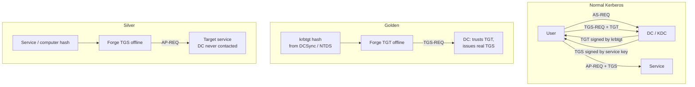

# Golden, Silver 티켓과 Pass-the-Ticket { #golden-silver-tickets-pass-the-ticket }

<div class="dfir-meta" markdown>
**MITRE ATT&CK:** T1558.001 (Golden Ticket) · T1558.002 (Silver Ticket) · T1550.003 (Pass the Ticket) · **전술:** 자격 증명 접근 / 횡적 이동 · **최종 수정:** 2026-10-07
</div>

!!! abstract "요약"
    Kerberos는 올바른 키로 암호화된 티켓이라면 무엇이든 신뢰합니다. **Pass-the-Ticket**은 메모리에서 훔친 진짜 티켓을 재사용합니다. **Golden Ticket**은 `krbtgt` 키로 서명한 *위조 TGT*입니다 — `krbtgt` 비밀번호가 바뀌지 않는 한, 공격자는 어떤 사용자로든, 어떤 그룹에든 속해서, 도메인의 어떤 서비스에든 접근할 수 있습니다. **Silver Ticket**은 서비스 계정 또는 컴퓨터 계정 하나의 키로 서명한 *위조 서비스 티켓(TGS)*입니다 — 범위는 더 좁지만 DC를 전혀 거치지 않아서 DC 로그에는 아무것도 보이지 않습니다. 한 번의 침해를 장기적인 도메인 지속성으로 바꾸는 기법들입니다.

## 공격 원리 { #how-the-attack-works }



| 변형 | 필요한 키 | 얻는 것 | DC를 거치나? |
|---|---|---|---|
| Pass-the-Ticket | 없음 — LSASS에서 기존 티켓을 훔침 | 티켓이 만료될 때까지 그 사용자의 접근 권한 (기본 10시간, 7일까지 갱신 가능) | 새 TGS 요청 때만 |
| **Golden** | `krbtgt` NT 해시 또는 AES 키 | 어떤 신원이든, 어떤 그룹이든, 도메인 전체 | 예 — TGS 요청 시 (하지만 **AS-REQ / 4768은 없음**) |
| **Silver** | 대상 서비스 계정 / 컴퓨터 계정 키 | **그 서비스 하나**에 대해 어떤 신원이든 (CIFS, HOST, HTTP, MSSQL…) | **아니요** |
| Diamond / Sapphire | `krbtgt` 키 + 진짜 TGT | 처음부터 위조하는 대신 *진짜* TGT의 PAC를 수정 — "TGT 없는 TGS" 탐지를 회피 | 예 |

## 공격 도구 / 명령 { #attacker-tooling-commands }

```text
# Pass-the-Ticket — export and inject
mimikatz  sekurlsa::tickets /export
mimikatz  kerberos::ptt  ticket.kirbi
Rubeus.exe dump  /  Rubeus.exe ptt /ticket:<base64>

# Golden ticket (needs krbtgt key + domain SID)
mimikatz  kerberos::golden /user:Administrator /domain:corp.local /sid:S-1-5-21-... /krbtgt:<hash> /ptt
ticketer.py -nthash <krbtgt> -domain-sid S-1-5-21-... -domain corp.local Administrator

# Silver ticket (service key + SPN)
mimikatz  kerberos::golden /user:x /domain:corp.local /sid:S-1-5-21-... /target:fs01.corp.local /service:cifs /rc4:<fs01$ hash> /ptt
```

## 영향받는 Windows 버전 { #affected-windows-versions }

Kerberos 티켓 위조는 유효한 키를 쓰기 때문에 **모든 Active Directory 도메인(2000 → 2025)**에서 통합니다. 최근 업데이트 중 일부는 *엉성한* 위조를 실패하게 만듭니다:

| 변경 | 위조 티켓에 미치는 영향 | 적용 대상 |
|---|---|---|
| **KB5008380** (2021년 11월, CVE-2021-42287 "noPac") — PAC *요청자* 검증; 2022년 10월부터 기본 강제 | **존재하지 않는 사용자 이름 / 맞지 않는 RID**의 Golden 티켓은 거부됨; 공격자는 실제 계정으로 위조해야 함 | 지원되는 모든 DC (당시 2012 R2 → 2022) |
| **KB5020805** (2022년 11월, CVE-2022-37967) — 새 PAC 서명; 2023년에 걸쳐 단계적으로 강제 | 새 full-PAC 서명을 계산하지 못하는 오래된 도구가 만든 티켓은 패치된 DC가 거부함 | 2023+로 패치된 지원 DC |
| RC4 비활성화 / AES 전용 도메인 | RC4로 암호화한 위조 티켓(`/rc4:`)이 눈에 띄거나 실패함; 공격자는 AES 키를 써야 함 | 2008+에서 설정 가능; 2025 시대 Windows Server에서 RC4 폐기가 진행 중 |

이 중 어느 것도 **최신 도구와 진짜 `krbtgt` AES 키**로 만든 위조는 막지 못합니다. `krbtgt`가 탈취된 뒤의 유일한 진짜 해결책은 그것을 교체하는 것입니다.

## 남는 흔적 { #artifacts-left-behind }

| 위치 | 아티팩트 | 찾을 것 |
|---|---|---|
| DC Security 로그 | 그 호스트에서 **선행하는 4768**(TGT 요청)이 **없는** 계정의 **4769**(서비스 티켓 요청) | Golden 티켓 — 이 DC가 TGT를 발급한 적이 없음 |
| DC Security 로그 | `Account_Domain`이 이상하거나(소문자 FQDN, 빈 값, `eo.oe.kiwi`) 계정 이름이 존재하지 않는 4769 / 4624 | 전형적인 위조 실수 |
| 대상 호스트 Security 로그 | 사용자의 Kerberos 인증 **4624 Type 3**이 있는데, 그 시각 그 서비스에 대한 **4769가 어느 DC에도 없음** | **Silver 티켓** — 대상에서만 보임 |
| 대상 호스트 | 일반 사용자인데 로그온에 예상치 못한 특권 그룹(예: RID 512, 519)이 보이는 **4627** 그룹 멤버십 | 위조된 PAC 클레임 |
| 호스트 (공격자) | TGT 수명이 **10년**으로 보이는 `klist` (mimikatz 기본값) | 세션 안의 Golden 티켓 |
| 메모리 | LSASS의 Kerberos 티켓 — [메모리: 자격 증명](../memory/credentials-registry.md) 참고 | 주입된 티켓 |
| 네트워크 | [Zeek `kerberos.log`](../network/zeek/index.md) — 시간 범위 안에 AS-REQ가 없는 클라이언트의 TGS-REQ; `till`이 아주 먼 미래 | 네트워크상의 Golden 티켓 |

## 탐지 { #detection }

=== "Splunk — TGT 없는 TGS (golden)"

    ```spl
    index=botsv3 sourcetype=WinEventLog (EventCode=4768 OR EventCode=4769) Failure_Code=0x0
    | eval user=lower(mvindex(split(Account_Name,"@"),0))
    | eval ip=replace(Client_Address,"::ffff:","")
    | stats values(EventCode) as codes, min(_time) as first by user, ip
    | where mvcount(codes)=1 AND codes="4769"
    | where NOT match(user,"\$$")
    | convert ctime(first)
    ```

    `4768` = TGT 요청됨 (AS-REQ); `4769` = 서비스 티켓 요청됨 (TGS-REQ). `split(...,"@")` + `mvindex(...,0)`은 `@DOMAIN` 접미사를 떼어 냅니다. `stats values(EventCode)`는 각 사용자/IP 쌍이 만든 이벤트 종류를 모으고, `mvcount(codes)=1 AND codes="4769"`는 서비스 티켓은 요청했지만 TGT는 **한 번도** 받지 않은 쌍만 남깁니다. 검색 범위 이전에 발급된 티켓 때문에 생기는 오탐을 피하려면 TGT 수명보다 긴 시간 범위(예: 24시간)로 실행하세요.

=== "Splunk — 있을 수 없는 계정 정보"

    ```spl
    index=botsv3 sourcetype=WinEventLog ((EventCode=4624 Authentication_Package=Kerberos) OR EventCode=4769)
    | where Account_Domain!="CORP" AND Account_Domain!="corp.local" AND isnotnull(Account_Domain)
    | stats count by EventCode, Account_Name, Account_Domain, host
    ```

    `CORP` / `corp.local`을 여러분의 NetBIOS 및 DNS 도메인 이름으로 바꾸세요. 위조 티켓에는 실제 로그온이라면 나올 수 없는 도메인 필드가 자주 들어 있습니다.

=== "Splunk — silver 티켓 (대상 쪽)"

    ```spl
    index=botsv3 sourcetype=WinEventLog EventCode=4624 Logon_Type=3 Authentication_Package=Kerberos
    | eval key=lower(Account_Name)."|".lower(host)
    | join type=left key
        [ search index=botsv3 sourcetype=WinEventLog EventCode=4769
          | eval key=lower(mvindex(split(Account_Name,"@"),0))."|".lower(mvindex(split(Service_Name,"$"),0))
          | stats count as tgs by key ]
    | where isnull(tgs)
    | table _time, host, Account_Name, Source_Network_Address
    ```

    서버의 모든 Kerberos 네트워크 로그온에 대해, 같은 사용자와 그 서버에 대한 4769가 DC에 있는지 찾습니다. `join type=left`는 짝이 없어도 로그온을 유지하고, `isnull(tgs)`는 DC가 발급한 티켓이 없는 것만 남깁니다 — silver 티켓 후보입니다. 무거운 검색이니 중요도가 높은 서버로 범위를 좁히세요.

## 대응 { #response }

**Pass-the-Ticket:** 영향받은 호스트에서 티켓을 비우고(`klist purge`), 사용자를 재설정하며, 티켓을 어디서 훔쳤는지(LSASS 접근) 찾으세요. **Golden 티켓:** `krbtgt`를 **두 번** 재설정하되, 재설정 사이에 복제가 끝나기를(그리고 최소한 최대 티켓 수명, 기본 10시간을) 기다리세요 — 첫 번째 재설정은 예전 키를 "이전 비밀번호"로 유효하게 남겨 두고, 두 번째가 그것을 지웁니다. 안전하게 하려면 Microsoft의 `New-KrbtgtKeys.ps1` 스크립트를 쓰세요. **Silver 티켓:** 표적이 된 컴퓨터/서비스 계정 비밀번호를 재설정하세요(컴퓨터 계정: `Reset-ComputerMachinePassword` 또는 도메인 재가입). 어떤 경우든 원래의 키 탈취 지점([DCSync](dcsync.md), [NTDS](sam-ntds-extraction.md), [LSASS](lsass-dumping.md))을 찾아야 합니다. 그러지 않으면 다시 위조당합니다.

### Windows 버전별 대응책 { #remediation-by-windows-version }

| 대응책 | 막는 것 | 적용 가능 버전 |
|---|---|---|
| `krbtgt`를 정기적으로(예: 180일마다) 그리고 DC 침해 후에 교체 | Golden 티켓의 수명을 제한 | 모든 AD 버전 |
| DC 패치 (KB5008380, KB5020805 이후) | 많은 단순 위조를 거부 | 지원되는 DC — 지원 종료된 DC(2003/2008/2012)는 이 보호를 받을 **수 없음** |
| 엔드포인트의 **Credential Guard** | TGT와 키를 LSASS에서 격리 — PtT 탈취를 제한 | 10 Enterprise/Education 1511+, Server 2016+; 조건을 갖춘 11 22H2+ Enterprise에서는 기본 켜짐 |
| **Protected Users** | 갱신 불가 4시간 TGT, AES 전용, 위임 없음 | DFL 2012 R2+ |
| Kerberos에서 **RC4** 끄기 (`msDS-SupportedEncryptionTypes`, GPO "Configure encryption types allowed for Kerberos") | RC4 기반 위조와 roasting | 7 / 2008 R2+에서 설정 가능 |
| 컴퓨터 계정 비밀번호 교체 (기본 30일 — 끄지 마세요) | Silver 티켓의 수명 | 모든 버전 |
| 서비스의 **PAC 검증** | 서비스가 DC에 PAC 확인을 요청 — 그 서비스에 대한 silver 티켓을 무력화 | 설정 가능; LocalSystem으로 실행되는 서비스는 기본 꺼짐 |

## 참고 자료 { #references }

- [MITRE ATT&CK — T1558.001](https://attack.mitre.org/techniques/T1558/001/) · [T1558.002](https://attack.mitre.org/techniques/T1558/002/) · [T1550.003](https://attack.mitre.org/techniques/T1550/003/)
- [Microsoft — KB5008380 PAC changes](https://support.microsoft.com/help/5008380) · [KB5020805](https://support.microsoft.com/help/5020805)
- 관련 페이지: [DCSync](dcsync.md) · [Kerberoasting](kerberoasting.md) · [Windows 이벤트 ID](../basics/windows-event-ids.md)
