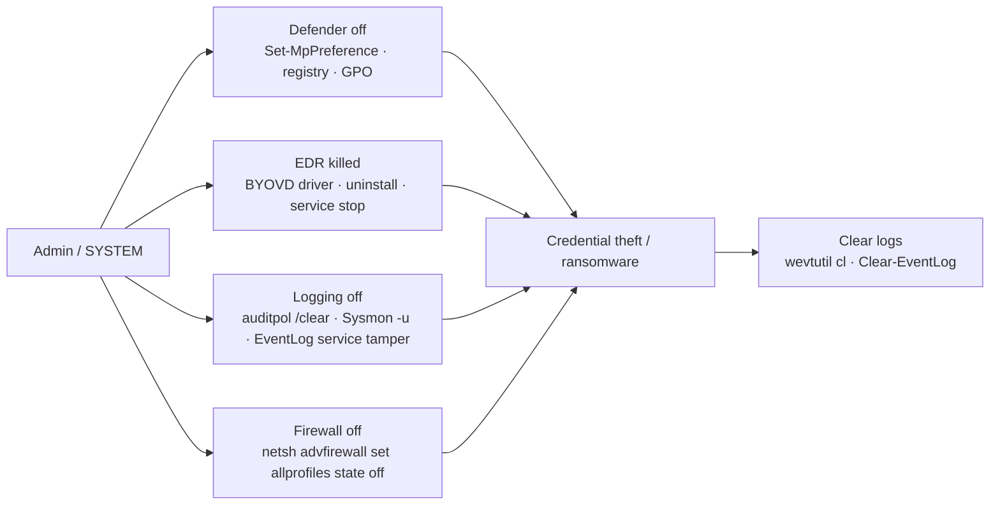

# 방어 무력화와 로그 삭제 (Impair Defenses & Log Clearing) { #impair-defenses-log-clearing }

<div class="dfir-meta" markdown>
**MITRE ATT&CK:** T1562.001 (도구 비활성화 또는 수정) · T1562.002 (Windows 이벤트 로깅 비활성화) · T1562.004 (시스템 방화벽 비활성화 또는 수정) · T1070.001 (Windows 이벤트 로그 삭제) · **전술:** 방어 회피 · **최종 수정:** 2026-10-07
</div>

!!! abstract "요약"
    자격증명 덤프나 대량 암호화처럼 침입에서 시끄러운 단계에 들어가기 전에, 공격자는 자신을 볼 수 있는 것들을 꺼 버립니다: Defender 실시간 보호, EDR 에이전트, Sysmon, 감사 정책, 방화벽. 그리고 끝난 뒤에는 조사를 늦추려고 이벤트 로그를 지웁니다. 랜섬웨어 운영자는 이 두 가지를 표준 절차로 수행하며, 스크립트로 수백 대의 호스트에서 한꺼번에 실행하는 경우가 많습니다. 다행인 점: **센서를 끄는 행위 자체가 시끄럽고**, 이미 호스트 밖으로 전달된 로그는 지울 수 없습니다.

## 공격 원리 { #how-the-attack-works }



**BYOVD (Bring Your Own Vulnerable Driver)** 는 따로 짚을 만합니다: 공격자는 정상적으로 서명되었지만 취약한 커널 드라이버를 로드한 뒤, 이를 이용해 커널 모드에서 보호된 EDR 프로세스를 종료합니다. *EDRSandBlast*, *Terminator* / *Spyboy*, *AuKill* 같은 도구와 이들이 쓰는 드라이버(`RTCore64.sys`, `gdrv.sys`, `procexp152.sys`, `zamguard64.sys`)는 이제 랜섬웨어 침입에서 흔히 볼 수 있습니다.

## 공격 도구 / 명령 { #attacker-tooling-commands }

```text
# Defender
Set-MpPreference -DisableRealtimeMonitoring $true -DisableIOAVProtection $true
Add-MpPreference -ExclusionPath C:\ -ExclusionExtension .exe
reg add "HKLM\SOFTWARE\Policies\Microsoft\Windows Defender" /v DisableAntiSpyware /t REG_DWORD /d 1
"C:\Program Files\Windows Defender\MpCmdRun.exe" -RemoveDefinitions -All

# Logging
auditpol /clear /y          ·   auditpol /set /category:* /success:disable /failure:disable
sysmon64.exe -u force
wevtutil sl Security /e:false
# EventLog service thread killing (Invoke-Phant0m) — service stays "running" but logs nothing

# Clearing
wevtutil cl Security  ·  wevtutil el | foreach { wevtutil cl $_ }
Clear-EventLog -LogName Security,System,Application

# Firewall
netsh advfirewall set allprofiles state off
```

## 영향받는 Windows 버전 { #affected-windows-versions }

| 버전 | 메모 |
|---|---|
| **XP / 2003** | 이벤트 로그는 `.evt` 파일; 기본 내장 AV 없음 (Windows Firewall은 XP SP2부터). 관리자라면 누구나 로그 삭제 가능; **517** = "감사 로그가 삭제됨" (예전 ID) |
| **Vista / 2008 → 7** | `.evtx`, `wevtutil`, 고급 보안이 포함된 Windows Firewall. **1102** (Security 로그 삭제) / **104** (기타 로그 삭제) 도입. Defender = 안티스파이웨어 기능만; 7에서는 MSE 선택 설치 |
| **8 / 8.1 / 2012 R2** | Defender가 완전한 AV가 됨 (8 이상); `Set-MpPreference` 사용 가능 |
| **10 / 2016 / 2019** | Tamper Protection (1903 이상); ETW-TI; Vulnerable Driver Blocklist (이전 빌드에서는 선택 적용) |
| **11 / 2022 / 2025** | **Vulnerable Driver Blocklist 기본 활성화** (11 22H2 이상 / HVCI 사용 시); 일반 사용자 기기와 다수의 관리 기기에서 Tamper Protection 기본 활성화; 최신 Defender 플랫폼에서는 `DisableAntiSpyware` 정책이 무시됨 |

## 남는 흔적 { #artifacts-left-behind }

| 위치 | 아티팩트 | 찾을 것 |
|---|---|---|
| Security 로그 | **1102** — 감사 로그가 삭제됨 (**누가** 지웠는지 포함) | 항상 조사하세요; 정상적인 삭제는 극히 드뭅니다 |
| System 로그 | **104** — 로그(System, Application, PowerShell, Sysmon…)가 삭제됨 | 위와 같음, Security 이외의 로그용 |
| Security 로그 | **1100** — 이벤트 로깅 서비스가 종료됨 | 로깅 중단 (또는 호스트 종료 — System 6006/6008 확인) |
| Security 로그 | **4719** — 시스템 감사 정책이 변경됨 (하위 범주의 성공/실패 감사 제거) | `auditpol` 조작 |
| Defender Operational | **5001** (실시간 보호 비활성화), **5007** (구성 변경 — 예외 항목을 포함한 이전/새 값 표시), **5010/5012** (검사 비활성화), **5013** (Tamper Protection이 변경을 차단) | Defender 조작; 5013 = 시도가 차단됨 |
| System 로그 | `WinDefend`, `Sense`, `Sysmon64`, EDR 서비스의 **7036/7040** 서비스 중지/시작 유형 변경; **7045** 새 커널 드라이버 서비스 (BYOVD) | 센서 종료 / 취약한 드라이버 로드 |
| Sysmon | **4** (Sysmon 서비스 상태 변경), **16** (Sysmon 구성 변경), **6** (드라이버 로드 — `Signature`와 해시를 loldrivers.io와 대조) | Sysmon 조작과 BYOVD |
| 방화벽 | `Microsoft-Windows-Windows Firewall With Advanced Security/Firewall` **2003** (프로필 설정 변경), **2004/2005/2006** 규칙 추가/수정/삭제 | 방화벽 비활성화 또는 C2용 규칙 추가 |
| SIEM 쪽 | 네트워크에는 여전히 살아 있는데 **이벤트 전송이 끊긴 호스트** | 가장 견고한 탐지 — heartbeat 모니터링 |

## 탐지 { #detection }

=== "Splunk — 로그 삭제"

    ```spl
    index=botsv3 ((sourcetype=WinEventLog:Security EventCode=1102) OR (sourcetype=WinEventLog:System EventCode=104) OR (sourcetype=WinEventLog EventCode IN (1102,104)))
    | eval who=coalesce(Account_Name, SubjectUserName, user)
    | table _time, host, EventCode, who, Message
    ```

    `1102` = Security 로그 삭제; `104` = 그 밖의 로그 삭제. 이벤트와 TA 버전에 따라 필드 이름이 다르기 때문에 `coalesce()`로 비어 있지 않은 첫 번째 사용자 필드를 고릅니다. 결과가 하나라도 나오면 모두 경보를 울리세요.

=== "Splunk — Defender 조작"

    ```spl
    index=botsv3 source="*Windows Defender/Operational*" EventCode IN (5001,5007,5010,5012,5013)
    | eval detail=coalesce(New_Value, Message)
    | table _time, host, EventCode, detail
    | sort 0 host _time
    ```

    가장 유용한 것은 `5007`입니다: `New_Value`에 정확히 어떤 설정이 바뀌었는지 나옵니다. 예를 들어 `...\Exclusions\Paths\C:\`는 공격자가 드라이브 전체를 예외로 지정한 것입니다. `5013`은 Tamper Protection이 변경을 차단했다는 뜻입니다(시도했지만 성공하지 못함 — 그래도 침해 지표입니다).

=== "Splunk — 조용해진 호스트 (heartbeat)"

    ```spl
    | tstats latest(_time) as last_seen where index=botsv3 by host
    | eval hours_silent=round((now()-last_seen)/3600,1)
    | where hours_silent > 2
    | sort - hours_silent
    | convert ctime(last_seen)
    ```

    `tstats`는 원본 이벤트가 아닌 인덱싱된 메타데이터를 읽기 때문에 매우 빠릅니다. 호스트별로 가장 최근 이벤트 시각을 돌려주며, 2시간 넘게 조용한 호스트는 꺼져 있거나 — 눈이 가려진 것입니다. DHCP/네트워크 데이터로 그 호스트가 아직 살아 있는지 교차 확인하세요.

## 대응 { #response }

사고 중에 1102/104나 Defender 비활성화가 보이면 공격자가 그 호스트에서 **지금 바로** 활동 중이라는 뜻입니다 — 봉쇄를 최우선으로 하세요. 삭제된 이벤트는 SIEM/WEF 사본에서 복구하고, 호스트에서는 비할당 영역에서 `.evtx` 레코드를 카빙하고 `C:\Windows\System32\winevt\Logs`의 VSS 사본을 확인하세요. 추가된 Defender 예외를 모두 제거하고(`Get-MpPreference | Select Exclusion*`), 취약한 드라이버 서비스(`Type: kernel mode driver`인 7045)가 있는지 확인하세요.

### Windows 버전별 대응책 { #remediation-by-windows-version }

| 대응책 | 막는 것 | 적용 가능 버전 |
|---|---|---|
| 거의 실시간으로 **로그를 호스트 밖으로 전달** (WEF → 수집기, 또는 SIEM 에이전트) | 로그 삭제를 무의미하게 만듦 | WEF Vista / 2008 이상 (WinRM 추가 구성요소가 있는 XP SP2 / 2003 SP1) |
| **Tamper Protection** | 로컬 관리자/스크립트에 의한 Defender 설정 변경 | 10 1903 이상, 11, Defender for Endpoint에 등록된 Server 2016 이상 |
| **Vulnerable Driver Blocklist** + **HVCI** | BYOVD 방식 EDR 종료 도구 | 10 (선택 적용, 1809 이상), **11 22H2 이상 기본 활성화** |
| EDR 변조 방지 / 제거 비밀번호 | 에이전트 제거 | 벤더에 따라 다름 |
| 감사 정책 변경 감사(4719) + 갱신할 때마다 다시 적용되는 GPO 강제 감사 정책 | `auditpol /clear`의 효과 지속 | 2008 이상 고급 감사 정책 |
| SIEM **heartbeat / 누락 호스트** 경보 | Invoke-Phant0m을 포함한 모든 눈가림 기법 | 전체 |
| 로컬 관리자 제한, LAPS, 계층화(Tiering) | 위의 모든 기법은 관리자 권한이 필요함 | 전체 |

## 참고 자료 { #references }

- [MITRE ATT&CK — T1562.001](https://attack.mitre.org/techniques/T1562/001/) · [T1070.001](https://attack.mitre.org/techniques/T1070/001/)
- [LOLDrivers — vulnerable driver list](https://www.loldrivers.io/)
- [Microsoft — Vulnerable driver blocklist](https://learn.microsoft.com/windows/security/application-security/application-control/app-control-for-business/design/microsoft-recommended-driver-block-rules)
- 관련 페이지: [이벤트 로그](../windows/event-logs.md) · [랜섬웨어 플레이북](../playbooks/ransomware.md) · [Windows 이벤트 ID](../basics/windows-event-ids.md)
