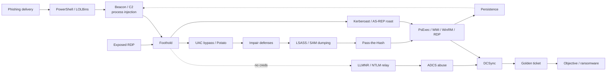

# 공격 기법 { #adversary-techniques }

MITRE ATT&CK에 매핑한 공격 기법들로, 모든 페이지가 같은 구성으로 작성되어 있습니다: **공격 원리 → 공격자 명령 → 영향받는 Windows 버전 → 남는 흔적(호스트 + 네트워크) → 탐지(Splunk/Zeek) → 대응 및 Windows 버전별 대응책**. 모든 페이지는 바탕이 되는 아티팩트와 쿼리가 있는 [Windows](../windows/index.md), [네트워크](../network/index.md), [Splunk](../splunk/index.md) 섹션으로 다시 연결됩니다.

!!! tip "여러 버전이 섞인 환경이라면 여기서 시작하세요"
    [Windows 버전별 강화](hardening-by-version.md)가 교차 참조 페이지입니다: XP / 2003부터 11 / Server 2025까지의 모든 통제를 하나의 매트릭스에 담았고, 기법 → 통제 맵도 있습니다.

## ATT&CK 전술별 { #by-attck-tactic }

| 전술 | 기법 | ATT&CK | 페이지 |
|---|---|---|---|
| 초기 접근 / 실행 | 피싱 → 사용자 실행 (매크로, LNK, ISO, 크래들) | T1566, T1204 | [피싱 전달](phishing-delivery.md) |
| 실행 / 방어 회피 | PowerShell 다운로드 크래들과 인코딩된 명령 | T1059.001 | [PowerShell 크래들](powershell-cradles.md) |
| 실행 / 방어 회피 | 서명된 바이너리 프록시 실행 (mshta, regsvr32, certutil…) | T1218, T1105 | [LOLBins](lolbins.md) |
| 자격 증명 접근 | LSASS 메모리 덤프 | T1003.001 | [LSASS 덤프](lsass-dumping.md) |
| 자격 증명 접근 | SAM, LSA Secrets, NTDS.dit 추출 | T1003.002/.003/.004 | [SAM과 NTDS](sam-ntds-extraction.md) |
| 자격 증명 접근 | DCSync | T1003.006 | [DCSync](dcsync.md) |
| 자격 증명 접근 | Kerberoasting | T1558.003 | [Kerberoasting](kerberoasting.md) |
| 자격 증명 접근 | AS-REP roasting | T1558.004 | [AS-REP roasting](asrep-roasting.md) |
| 자격 증명 접근 / 지속성 | Golden, Silver 티켓과 Pass-the-Ticket | T1558.001/.002, T1550.003 | [Golden과 Silver 티켓](golden-silver-tickets.md) |
| 자격 증명 접근 / 횡적 이동 | LLMNR/NBT-NS 포이즈닝, NTLM 릴레이, 강제 인증(coercion) | T1557.001, T1187 | [LLMNR과 NTLM 릴레이](llmnr-ntlm-relay.md) |
| 자격 증명 접근 / 권한 상승 | AD 인증서 서비스 악용 (ESC1/ESC8) | T1649 | [ADCS 악용](adcs-abuse.md) |
| 횡적 이동 / 방어 회피 | Pass-the-Hash | T1550.002 | [Pass-the-Hash](pass-the-hash.md) |
| 횡적 이동 / 실행 | PsExec와 SMB 관리 공유 | T1021.002, T1569.002 | [PsExec와 SMB](psexec-smb.md) |
| 횡적 이동 / 실행 | WMI와 WinRM 원격 실행 | T1047, T1021.006 | [WMI와 WinRM](wmi-winrm.md) |
| 초기 접근 / 횡적 이동 | RDP 무차별 대입, 횡적 RDP, 세션 하이재킹 | T1021.001, T1133, T1563.002 | [RDP](rdp.md) |
| 권한 상승 | UAC 우회 | T1548.002 | [UAC 우회](uac-bypass.md) |
| 권한 상승 | 토큰 가장과 Potato 공격 | T1134 | [토큰과 Potato](token-impersonation-potato.md) |
| 방어 회피 / 권한 상승 | 프로세스 인젝션과 할로잉 | T1055 | [프로세스 인젝션](process-injection.md) |
| 방어 회피 | AV/EDR/로깅 무력화, BYOVD, 로그 삭제 | T1562, T1070.001 | [방어 무력화](impair-defenses-log-clearing.md) |
| 지속성 | 서비스, 예약 작업, Run 키 | T1543.003, T1053.005, T1547.001 | [지속성](persistence.md) |
| 횡적 이동 (익스플로잇) | EternalBlue / SMBv1 (MS17-010) | T1210 | [EternalBlue](eternalblue-smbv1.md) |
| 권한 상승 / 횡적 이동 (익스플로잇) | PrintNightmare와 Print Spooler | T1068, T1210 | [PrintNightmare](printnightmare.md) |

## 이 섹션의 페이지로 본 전형적인 침해 흐름 { #a-typical-intrusion-in-this-sections-pages }

왼쪽에서 오른쪽으로 읽으세요: 미끼나 노출된 RDP로 거점을 얻고, 공격자가 권한을 올리고 센서를 무력화한 뒤, 자격증명을 훔치고(메모리, 디스크, Kerberos, 또는 네트워크에서), 횡적으로 이동해, DCSync로 DC에 도달하고, 지속성을 위해 티켓을 위조합니다. 각 상자는 하나의 페이지이고, 각 화살표는 탐지하고 봉쇄할 수 있는 지점입니다.

## 페이지 { #pages }

-   **[버전별 강화](hardening-by-version.md)** — XP → 11 통제 매트릭스, 기법 → 통제 맵
-   **[피싱 전달](phishing-delivery.md)** — 매크로/LNK/ISO → 셸, Mark-of-the-Web
-   **[PowerShell 크래들](powershell-cradles.md)** — `-enc` 디코딩, 4104 점수화, 메모리 내 로딩
-   **[LOLBins](lolbins.md)** — mshta, regsvr32, certutil, BITS; 부모/자식 및 네트워크 단서
-   **[LSASS 덤프](lsass-dumping.md)** — Sysmon 10 접근 마스크, comsvcs/procdump
-   **[SAM과 NTDS](sam-ntds-extraction.md)** — reg save, VSS, ntdsutil IFM, HiveNightmare
-   **[DCSync](dcsync.md)** — 4662 복제 GUID, 네트워크상의 DRSUAPI
-   **[Kerberoasting](kerberoasting.md)** — 4769 RC4, SPN 열거, 오프라인 크래킹
-   **[AS-REP roasting](asrep-roasting.md)** — 4768 사전 인증 type 0, DONT_REQ_PREAUTH
-   **[Golden과 Silver 티켓](golden-silver-tickets.md)** — TGT 없는 TGS, krbtgt 두 번 재설정
-   **[LLMNR과 NTLM 릴레이](llmnr-ntlm-relay.md)** — Responder, ntlmrelayx, 이름/IP 불일치
-   **[ADCS 악용](adcs-abuse.md)** — ESC1/ESC8, 4886/4887, PKINIT 로그온
-   **[Pass-the-Hash](pass-the-hash.md)** — NTLM type-3/type-9, 해시 재사용
-   **[PsExec와 SMB](psexec-smb.md)** — ADMIN$ 쓰기 + 7045 서비스 체인
-   **[WMI와 WinRM](wmi-winrm.md)** — wmiprvse/wsmprovhost 부모, WMI 지속성
-   **[RDP](rdp.md)** — Type 10, 1149, 비트맵 캐시, tscon 하이재킹
-   **[UAC 우회](uac-bypass.md)** — fodhelper/eventvwr 레지스트리 하이재킹
-   **[토큰과 Potato](token-impersonation-potato.md)** — SeImpersonate → SYSTEM
-   **[프로세스 인젝션](process-injection.md)** — Sysmon 8/10/25, 인자 없는 rundll32
-   **[방어 무력화](impair-defenses-log-clearing.md)** — 1102/104, Defender 5001/5007, BYOVD
-   **[지속성](persistence.md)** — 서비스, 작업, Run 키, ASEP
-   **[EternalBlue](eternalblue-smbv1.md)** — MS17-010, 버전별 SMBv1 제거
-   **[PrintNightmare](printnightmare.md)** — Spooler 드라이버 로드, PrinterBug 강제 인증

## 조사에서 이 페이지들을 쓰는 방법 { #how-to-use-these-pages-in-an-investigation }

관찰한 것(의심스러운 프로세스, 알림, 비컨)에서 출발해 해당 페이지의 **흔적** 표를 읽고 무엇을 더 수집할지 파악한 다음, **탐지** 쿼리를 실행해 얼마나 퍼졌는지 범위를 정하세요. **대응** 섹션은 무엇을 봉쇄하고 교체할지 알려 주고, **Windows 버전별 대응책** 표는 영향받는 호스트에 실제로 어떤 조치를 적용할 수 있는지 알려 줍니다. 바탕이 되는 원리 — 특정 이벤트 ID의 의미, 아티팩트를 파싱하는 방법, 정확한 SPL 명령 — 는 [Windows](../windows/index.md), [네트워크](../network/index.md), [Splunk](../splunk/index.md)로 이어지는 링크를 따라가세요.

!!! info "기법 추가하기"
    `python new.py adversary/<name> -t technique` — 템플릿에 이미 다섯 부분 구조가 들어 있습니다. 위 페이지들과 맞추려면 *영향받는 Windows 버전* 섹션과 *Windows 버전별 대응책* 표를 추가하고, [버전별 강화](hardening-by-version.md#technique-controls)에 행을 하나 추가하세요. 사이드바에는 자동으로 나타납니다.
