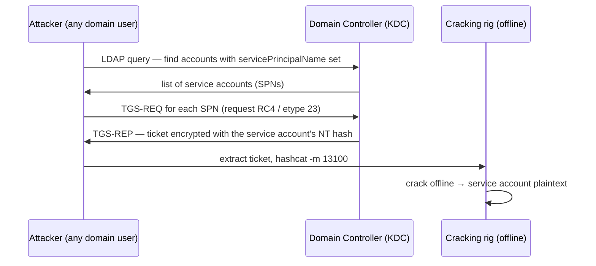

# Kerberoasting { #kerberoasting }

<div class="dfir-meta" markdown>
**MITRE ATT&CK:** T1558.003 (Kerberos 티켓 탈취 또는 위조: Kerberoasting) · **전술:** 자격증명 접근 · **최종 수정:** 2026-09-17
</div>

!!! abstract "요약"
    모든 도메인 사용자는 서비스 주체 이름(SPN)이 있는 어떤 계정에 대해서든 Kerberos 서비스 티켓(TGS)을 요청할 수 있습니다. 그 티켓의 일부는 **서비스 계정의 비밀번호 해시**로 암호화돼 있습니다. 공격자는 서비스 계정의 티켓을 요청해 내보낸 뒤 **오프라인**으로 크랙합니다 — 대상 서비스로의 트래픽도, 로그온 실패도 없이, 평범해 보이는 Kerberos 요청뿐입니다. 서비스 계정은 비밀번호가 약하고 만료되지 않는 경우가 많아서 통하는 공격입니다.

## 공격 원리 { #how-the-attack-works }



DC는 인증된 *모든* 사용자에게 티켓을 내줍니다 — 설계가 그렇습니다. AES 대신 **RC4(etype 0x17/23)**를 요청하면 해시를 훨씬 빨리 크랙할 수 있어서 도구들은 일부러 낮춥니다.

## 공격 도구 / 명령 { #attacker-tooling-commands }

```text
# Rubeus (Windows)
Rubeus.exe kerberoast /outfile:hashes.txt
Rubeus.exe kerberoast /rc4opsec        # only accounts that support RC4, quieter

# Impacket (Linux)
GetUserSPNs.py CORP/user:password -dc-ip 10.0.0.1 -request

# PowerView — enumerate first
Get-DomainUser -SPN | select samaccountname, serviceprincipalname

# Crack offline
hashcat -m 13100 hashes.txt wordlist.txt
```

## 남는 흔적 { #artifacts-left-behind }

| 위치 | 아티팩트 | 찾을 것 |
|---|---|---|
| **DC** 이벤트 로그 | **`Ticket_Encryption_Type = 0x17`**(RC4)이고 `Failure_Code = 0x0`인 Security **4769** (Kerberos 서비스 티켓 요청) | 정상 앱은 대부분 AES(0x12)를 씀; 한 사용자가 많은 SPN에 RC4 요청을 몰아서 하면 신호 |
| DC 이벤트 로그 | 몰아치기 직전의 **4768** (TGT 요청); **4769** 양 급증 | 계정이 인증한 뒤 수확함 |
| DC / LDAP | **4662** 또는 디렉터리 서비스 로그: `servicePrincipalName=*`로 거르는 LDAP 쿼리 | 열거 단계 (PowerView/Rubeus가 SPN을 찾음) |
| 네트워크 | [Zeek `kerberos.log`](../network/zeek/index.md) — `request_type=TGS`, `cipher` RC4, 한 `client`에서 서로 다른 `service` 다수 | 네트워크상의 같은 패턴; SPN 열거는 [`ldap.log`](../network/zeek/index.md) |
| 호스트 | `Rubeus.exe`/이름 바꾼 것의 [Prefetch](../windows/prefetch.md)/[Amcache](../windows/amcache.md); PowerView는 [PowerShell 4104](../splunk/security-searches.md) | 도구가 실행된 곳 |

!!! warning "AES만 쓰는 환경에서는 신호가 달라집니다"
    도메인이 AES를 강제하면 RC4 티켓(0x17) 자체가 이상 징후가 됩니다. 하지만 공격자는 여전히 AES로 Kerberoasting할 수 있고(`-m 19700`) — 크랙은 느리지만 RC4 필터는 놓칩니다. 그럴 땐 **행동** 신호로 돌아가세요: etype과 상관없이 한 계정이 짧은 시간에 유난히 많은 서로 다른 SPN의 서비스 티켓을 요청하는 것.

## 탐지 { #detection }

=== "Splunk — RC4 TGS 몰아치기"

    ```spl
    index=botsv3 sourcetype=WinEventLog EventCode=4769 Ticket_Encryption_Type=0x17 Failure_Code=0x0
    | where NOT match(Service_Name, "\\$$|krbtgt")
    | bin _time span=10m
    | stats dc(Service_Name) as spns, values(Service_Name) as services by _time, Account_Name, Client_Address
    | where spns >= 5
    | sort - spns
    ```

    `4769` = Kerberos 서비스 티켓 요청 (DC에 기록). `Ticket_Encryption_Type=0x17`은 RC4 — 크래킹 도구가 요청하는 것; `Failure_Code=0x0`은 성공한 발급만 남깁니다. `$`로 끝나는 이름과 `krbtgt`를 빼면 컴퓨터 계정과 TGT 서명 계정이 빠집니다. `bin _time span=10m`은 10분 구간으로 나누고; `dc(Service_Name)`은 고유 SPN 수를 셉니다. 한 사용자가 10분 안에 서로 다른 서비스 티켓을 다섯 개 이상 요청하면 Kerberoasting입니다; `values(Service_Name)`이 어떤 계정이 표적이었는지 보여 주므로 무엇을 교체할지 알 수 있습니다.

=== "Splunk — 행동 기반 (etype 무관)"

    ```spl
    index=botsv3 sourcetype=WinEventLog EventCode=4769 Failure_Code=0x0
    | where NOT match(Service_Name, "\\$$|krbtgt")
    | stats dc(Service_Name) as spns, values(Ticket_Encryption_Type) as etypes by Account_Name, Client_Address
    | eventstats avg(spns) as avg, stdev(spns) as sd
    | eval z=round((spns-avg)/if(sd=0,1,sd),1)
    | where spns >= 10 OR z > 3
    | sort - spns
    ```

    같은 이벤트지만 암호화 유형을 믿는 대신, 고유 SPN 수가 절대적으로 많거나 전체 평균보다 훨씬 높은 계정을 표시합니다(`eventstats`가 전체 평균/표준편차를, `z`가 표준편차 거리를 줌). AES Kerberoasting도 잡습니다.

=== "Zeek — kerberos.log"

    ```bash
    zeek-cut -d ts id.orig_h client service cipher request_type < kerberos.log \
      | awk '$6=="TGS"' | sort | uniq -c | sort -rn | head
    # cluster by client to see one principal pulling many distinct services with RC4
    ```

    `kerberos.log`는 `client`, `service`, `cipher`, `request_type`을 기록합니다. 한 `client`가 서로 다른 `service` 값을 많이 요청하면, 특히 RC4로, DC 쪽 탐지를 네트워크에서 그대로 비춘 것입니다.

## 대응 { #response }

크랙된 자격증명은 서비스 계정 비밀번호이므로 **요청된 모든 SPN 계정을 교체하고**(`values(Service_Name)` 목록), 권한 있는 서비스 계정은 완전히 탈취된 것으로 다루세요. 서비스 계정은 여러 시스템에서 재사용되는 경우가 많으니, 로스팅 시각 이후 그 계정들의 로그온을 헌팅하세요. 강화: 서비스 계정에 **길고 무작위인 비밀번호**를 주거나 자동으로 교체되는 **그룹 관리 서비스 계정(gMSA)**으로 옮기고, 가능하면 **AES**를 강제하고 RC4를 끄고, `4769` RC4를 상시 모니터링하고, SPN이 있는 계정 수를 줄이세요. 고권한 계정에서는 SPN을 아예 없애세요 (SPN이 있는 Domain Admin은 로스팅을 기다리는 재앙입니다).

## 참고 자료 { #references }

- [MITRE ATT&CK — T1558.003](https://attack.mitre.org/techniques/T1558/003/)
- [Microsoft — Detecting Kerberoasting activity](https://techcommunity.microsoft.com/t5/microsoft-security-baselines/bg-p/Microsoft-Security-Baselines)
- 관련 페이지: [Windows 이벤트 ID](../basics/windows-event-ids.md) · [Zeek kerberos/ldap](../network/zeek/index.md) · [보안 검색](../splunk/security-searches.md)
