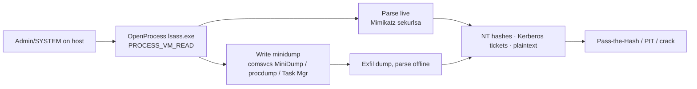

# LSASS 자격증명 덤프 { #lsass-credential-dumping }

<div class="dfir-meta" markdown>
**MITRE ATT&CK:** T1003.001 (OS 자격증명 덤프: LSASS 메모리) · **전술:** 자격증명 접근 · **최종 수정:** 2026-09-17
</div>

!!! abstract "요약"
    로컬 보안 기관 하위 시스템 서비스(`lsass.exe`)는 로그온한 모든 사람의 자격증명 자료를 메모리에 갖고 있습니다 — NT 해시, Kerberos 티켓, 그리고 (WDigest가 켜져 있다면) 평문 비밀번호. 관리자/SYSTEM 권한을 가진 공격자는 LSASS 메모리를 읽거나 덤프해서 이 비밀을 꺼내고, 그것이 곧바로 [Pass-the-Hash](pass-the-hash.md), pass-the-ticket, Kerberoast 크래킹으로 이어집니다. "한 대"에서 "도메인 전체"로 넘어가는 전환점입니다.

## 공격 원리 { #how-the-attack-works }

공격자는 `PROCESS_VM_READ`(보통 `PROCESS_QUERY_INFORMATION`도)로 `lsass.exe` 핸들을 열고, 메모리를 라이브로 파싱하거나(Mimikatz `sekurlsa::logonpasswords`) **미니덤프**를 디스크에 써서 오프라인으로 파싱합니다. Living-off-the-land 변형은 서명된 Windows 바이너리(`comsvcs.dll` `MiniDump`, 작업 관리자, `procdump`)를 써서 눈에 띄게 악성인 것이 디스크에 닿지 않게 합니다.



## 공격 도구 / 명령 { #attacker-tooling-commands }

```text
# Mimikatz (live)
privilege::debug
sekurlsa::logonpasswords

# LOLBin minidump via comsvcs.dll (very common, signed binary)
rundll32.exe C:\Windows\System32\comsvcs.dll, MiniDump <lsass_PID> C:\Temp\l.dmp full

# procdump (signed Sysinternals)
procdump.exe -accepteula -ma lsass.exe lsass.dmp

# Task Manager: right-click lsass -> Create dump file  (GUI, no CLI trace)
# nanodump / dumpert  — direct syscalls to evade EDR hooks
```

## 남는 흔적 { #artifacts-left-behind }

| 위치 | 아티팩트 | 찾을 것 |
|---|---|---|
| 호스트 **Sysmon** | **10** (ProcessAccess) `TargetImage=...\lsass.exe`, `GrantedAccess` `0x1010`, `0x1410`, `0x143a`, `0x1fffff` | 가장 강한 신호 — 읽기/덤프 권한으로 LSASS를 여는 프로세스. `SourceImage`/`CallTrace`가 도구를 알려 줌 |
| 호스트 Sysmon | temp/사용자 경로의 `*.dmp` **11** (FileCreate); `procdump`, `rundll32 ... comsvcs ... MiniDump`, 이름을 바꾼 mimikatz의 **1** | 덤프 파일과 도구 |
| 호스트 Security 로그 | 명령줄에 `comsvcs`, `MiniDump`, `procdump -ma lsass`, `-ma lsass`가 있는 **4688** | LOLBin 실행 |
| 호스트 Defender | `Microsoft-Windows-Windows Defender/Operational` **1116/1117** (`Behavior:Win32/…LSASS…`) | AV/EDR 행위 탐지 |
| 호스트 | 도구의 [Prefetch](../windows/prefetch.md)/[Amcache](../windows/amcache.md); `.dmp`의 생성+삭제는 [$MFT/$UsnJrnl](../windows/mft-usn.md); 다운로드했다면 `Zone.Identifier` | 파일시스템 흔적, 정리해도 남음 |
| 레지스트리 | 미리 설정된 [WDigest `UseLogonCredential=1`](../windows/registry-keys.md#system-identity-timing) | 공격자가 평문 캐싱을 켬 |
| 네트워크 | `.dmp` 유출 — [SRUM](../windows/srum.md) 앱별 바이트, SMB/HTTP로 복사됐다면 [Zeek `files.log`](../network/zeek/files-log.md) | 덤프가 간 곳 |

!!! warning "GrantedAccess는 시끄럽지만 결정적입니다"
    정상 소프트웨어(AV, EDR, 일부 백업·모니터링 에이전트)도 LSASS를 엽니다. 요령은 **알려진 정상 `SourceImage`를 허용 목록에 넣고** 나머지에 경보를 거는 것입니다. 예상 밖의 프로세스에서 덤프와 함께 `0x10`(VM_READ)이나 `0x0400`(QUERY_INFORMATION)을 포함한 접근 마스크 — `0x1010`, `0x1410`, `0x143a` — 가 쫓아야 할 것입니다.

## 탐지 { #detection }

=== "Splunk — LSASS 접근 (Sysmon 10)"

    ```spl
    index=botsv3 sourcetype="XmlWinEventLog:Microsoft-Windows-Sysmon/Operational" EventID=10 TargetImage="*\\lsass.exe"
    | eval src=lower(replace(SourceImage,".*\\\\",""))
    | search NOT src IN ("wmiprvse.exe","csrss.exe","wininit.exe","services.exe","msmpeng.exe","mssense.exe","sensecncproxy.exe","taniumclient.exe")
    | stats count, values(GrantedAccess) as access, values(CallTrace) as calls by host, SourceImage
    | sort - count
    ```

    Sysmon `10` = 한 프로세스가 다른 프로세스의 핸들을 엶. `TargetImage`를 `lsass.exe`로 거르고 정상 접근자 기준선을 빼면 수상한 것만 남습니다; `GrantedAccess`는 요청한 권한을, `CallTrace`는 흔히 `dbghelp.dll`/`comsvcs.dll`(미니덤프)이나 파일 기반이 아닌 메모리(주입된 도구)를 보여 줍니다. 제외 목록은 사용하는 EDR/AV에 맞게 조정하세요.

=== "Splunk — LOLBin / procdump로 덤프"

    ```spl
    index=botsv3 (sourcetype="XmlWinEventLog:Microsoft-Windows-Sysmon/Operational" EventID=1) OR (sourcetype=WinEventLog EventCode=4688)
    | eval cmd=lower(coalesce(CommandLine, Process_Command_Line))
    | where match(cmd,"comsvcs.*minidump|procdump.*(-ma\s+)?lsass|-ma\s+lsass|rundll32.*minidump|dumpert|nanodump|sqldumper.*lsass|createdump.*lsass")
    | table _time, host, User, Image, New_Process_Name, cmd
    | sort 0 _time
    ```

    Sysmon과 Security 프로세스 생성 이벤트 양쪽에서 흔한 덤프 명령줄 — `comsvcs.dll MiniDump`, `procdump -ma lsass`, 이름 있는 도구들 — 과 일치합니다.

=== "Splunk — .dmp 파일 생성"

    ```spl
    index=botsv3 sourcetype="XmlWinEventLog:Microsoft-Windows-Sysmon/Operational" EventID=11 TargetFilename="*.dmp"
    | where match(TargetFilename,"(?i)\\\\(temp|users\\\\public|programdata|windows\\\\temp|perflogs)\\\\")
    | table _time, host, Image, User, TargetFilename
    ```

    Sysmon `11` = 파일 생성. 준비 폴더에 쓰인 `.dmp`, 특히 `rundll32`/`taskmgr`/`procdump`가 쓴 것은 덤프의 디스크 쪽 절반입니다.

## 대응 { #response }

**그 호스트에 캐시된 모든 자격증명이 유출됐다고** 가정하세요 — 가장 심각한 자격증명 사건입니다. 덤프 시점에 로그온해 있던 모든 계정(대화형 사용자, 서비스 계정, 관리자)을 교체하고, Domain Admin이나 `krbtgt`와 관련된 자료가 노출됐다면 도메인 전체 자격증명 재설정을 계획하세요. `.dmp`가 어디로 갔는지([SRUM](../windows/srum.md), [Zeek files.log](../network/zeek/files-log.md))와 훔친 자격증명이 그 뒤 어디에 쓰였는지([Pass-the-Hash](pass-the-hash.md) 헌팅) 추적하세요. 강화: **LSASS 보호**(`RunAsPPL`)와 **Credential Guard**를 켜고, WDigest를 **끄고**(`UseLogonCredential=0`), ASR 규칙 "Block credential stealing from lsass.exe"를 배포하고, EDR이 LSASS 핸들 열기를 감시하는지 확인하고, 평문 캐싱을 끄세요. 이 탐지에는 투자할 가치가 있습니다 — 횡적 이동 직전의 길목이기 때문입니다.

## 참고 자료 { #references }

- [MITRE ATT&CK — T1003.001](https://attack.mitre.org/techniques/T1003/001/)
- [Microsoft — Configuring additional LSA protection (RunAsPPL)](https://learn.microsoft.com/en-us/windows-server/security/credentials-protection-and-management/configuring-additional-lsa-protection)
- 관련 페이지: [Pass-the-Hash](pass-the-hash.md) · [레지스트리 키](../windows/registry-keys.md) · [SRUM](../windows/srum.md) · [보안 검색](../splunk/security-searches.md)
