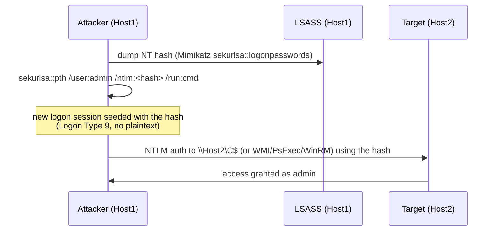

# Pass-the-Hash (PtH) { #pass-the-hash-pth }

<div class="dfir-meta" markdown>
**MITRE ATT&CK:** T1550.002 (대체 인증 자료 사용: Pass the Hash) · **전술:** 횡적 이동 / 방어 회피 · **최종 수정:** 2026-09-17
</div>

!!! abstract "요약"
    NTLM 인증은 비밀번호의 **NT 해시**를 갖고 있음을 증명하는 방식으로 비밀번호를 안다는 것을 증명합니다 — 평문은 절대 확인하지 않습니다. 그래서 NT 해시를 훔친 공격자는(LSASS, SAM, DC에서) 해시를 NTLM 핸드셰이크에 그대로 넣어 **크랙하지 않고도** 그 사용자로 인증할 수 있습니다. 비밀번호 없이, 완전한 접근.

## 공격 원리 { #how-the-attack-works }

NTLM은 챌린지-응답 프로토콜입니다: 서버가 무작위 챌린지를 보내면, 클라이언트가 사용자의 NT 해시로 암호화하고, 서버(또는 DC)가 검증합니다. 평문 비밀번호는 로컬에서 NT 해시를 *만드는* 데만 쓰입니다 — 전송 프로토콜과 검증 모두 해시로 동작합니다. PtH가 악용하는 설계 결함이 바로 이것입니다.



전제 조건은 LSASS를 읽기 위한 첫 호스트의 관리자/SYSTEM 권한입니다. 그 뒤로는 그 계정이 권한을 갖고 NTLM을 받아 주는 곳 어디서든 해시가 통합니다.

## 공격 도구 / 명령 { #attacker-tooling-commands }

재현이 아니라 알아보기 위한 예시:

```text
# Mimikatz — spawn a process with the hash injected into a new logon session
sekurlsa::pth /user:Administrator /domain:CORP /ntlm:<32-hex-NT-hash> /run:"cmd.exe"

# Impacket (from Linux) — auth with -hashes LMHASH:NTHASH
psexec.py CORP/Administrator@10.0.0.5 -hashes :<NThash>
wmiexec.py CORP/Administrator@10.0.0.5 -hashes :<NThash>
smbexec.py / atexec.py  -hashes :<NThash>

# CrackMapExec / NetExec
nxc smb 10.0.0.0/24 -u Administrator -H <NThash> --local-auth
```

## 남는 흔적 { #artifacts-left-behind }

| 위치 | 아티팩트 | 찾을 것 |
|---|---|---|
| **출발지 호스트** 이벤트 로그 | Security **4624 Logon Type 9** (NewCredentials), `Logon Process = seclogo`, `Authentication Package = Negotiate` | Mimikatz `pth`가 공격자 머신에 type 9 세션을 만듦 |
| 출발지 호스트 Sysmon | 접근 `0x1010`/`0x1410`으로 `lsass.exe`를 겨냥한 **10** (ProcessAccess); `mimikatz`/이름 바꾼 것의 **1** | 해시가 먼저 여기서 덤프됨 — [LSASS 덤프](lsass-dumping.md) 참고 |
| **대상 호스트** 이벤트 로그 | **4624 Logon Type 3**, `Authentication Package = NTLM`, `Key Length = 0` | Kerberos 도메인에서 워크스테이션 간 **NTLM** 로그온은 비정상 |
| 대상 호스트 | 같은 Logon ID의 **4672** (관리자 권한); **5140/5145** (`ADMIN$`/`C$` 접근); PsExec라면 **7045** | 횡적 이동의 결과 — [PsExec와 SMB](psexec-smb.md) 참고 |
| 네트워크 | [Zeek `ntlm.log`](../network/zeek/index.md) — `username`, `hostname`, `domainname`; 내부→내부 SMB (`445`) | 출발지가 평소 건드리지 않는 호스트로의 NTLM 인증 |
| 호스트 아티팩트 | 덤프 도구의 [Prefetch](../windows/prefetch.md)/[Amcache](../windows/amcache.md); [레지스트리](../windows/registry-keys.md) `WDigest UseLogonCredential=1` (평문 자격증명 준비) | 자격증명 탈취의 전조 |

!!! warning "단서는 type 9가 아니라 type 3 NTLM입니다"
    Type 9는 공격자 자신의 머신에만, 그것도 일부 도구에서만 나타납니다. 호스트를 넘나드는 지속적인 신호는 모두 Kerberos여야 하는 환경에서 워크스테이션 간의 **Authentication Package = NTLM인 Logon Type 3**입니다. 이상이 눈에 띄도록 정상적으로 NTLM을 쓰는 호스트(일부 앱, 일부 장비)의 기준선을 잡으세요.

## 탐지 { #detection }

=== "Splunk — 대상 쪽 NTLM 횡적 이동"

    ```spl
    index=botsv3 sourcetype=WinEventLog EventCode=4624 Logon_Type=3 Authentication_Package=NTLM
    | eval src=Source_Network_Address, user=mvindex(Account_Name,1)
    | where NOT cidrmatch("0.0.0.0/32", src) AND src!="-" AND NOT match(user,"\\$$")
    | stats dc(host) as targets, values(host) as where, count by user, src
    | where targets >= 2
    | sort - targets
    ```

    `4624` = 로그온 성공; `Logon_Type=3` = 네트워크 로그온 (SMB/WMI/WinRM); `Authentication_Package=NTLM`은 Kerberos가 아닌 NTLM으로 좁힙니다. `mvindex(Account_Name,1)`은 로그온한 계정을 가져오고, `$`로 끝나는 이름을 빼면 컴퓨터 계정이 빠집니다. `dc(host)`는 그 사용자+출발지 쌍이 닿은 서로 다른 머신 수를 셉니다 — 자격증명 하나가 NTLM으로 여러 호스트에 닿으면 PtH의 모양입니다.

=== "Splunk — 출발지 쪽 pth (type 9)"

    ```spl
    index=botsv3 sourcetype=WinEventLog EventCode=4624 Logon_Type=9 Logon_Process=seclogo Authentication_Package=Negotiate
    | table _time, host, Account_Name, Logon_ID, Process_Name
    | sort 0 _time
    ```

    로그온 프로세스 `seclogo`와 패키지 `Negotiate`가 붙은 Logon Type 9(NewCredentials)는 Mimikatz `sekurlsa::pth`가 실행된 머신에 남기는 정확한 시그니처입니다.

=== "Zeek — SMB 위의 NTLM"

    ```bash
    # Internal->internal NTLM auth: who authenticated as whom, where
    zeek-cut -d ts id.orig_h id.resp_h username domainname hostname success < ntlm.log \
      | awk '$2 ~ /^10\./ && $3 ~ /^10\./'
    ```

    `ntlm.log`는 NTLM `username`/`domain`/`hostname`을 평문으로 기록합니다(해시는 아니지만 신원은 보임). 출발지가 평소 접촉하지 않는 호스트로의 내부 간 NTLM이 네트워크 쪽 신호이고, 시간과 바이트는 `uid`를 [`conn.log`](../network/zeek/conn-log.md)로 피벗해서 보세요.

## 대응 { #response }

출발지 호스트를 격리하고 탈취된 계정을 비활성화/교체해서 봉쇄하세요 — **두 번 재설정하세요**, 그러지 않으면 예전 NT 해시가 계속 통합니다. 해시가 곧 자격증명이므로 대응은 비밀번호 복잡도가 아니라 **자격증명 위생**입니다: 계정을 교체하고(`krbtgt` 관련 계정과 특권 계정은 두 번), 그 계정이 건드린 모든 호스트를 헌팅하세요. 출발지 호스트에서 수집할 것: LSASS 접근 이벤트, 덤프 도구([Prefetch](../windows/prefetch.md)/[Amcache](../windows/amcache.md)), 전체 [호스트 타임라인](../splunk/security-searches.md#build-a-host-timeline-everything-about-one-machine). 앞으로의 강화: LSASS 보호(RunAsPPL, Credential Guard), WDigest 끄기, 가능하면 NTLM 거부, 워크스테이션 해시가 서버에 닿지 못하게 관리자 계정 계층화, 로컬 관리자 해시가 머신 간에 공유되지 않도록 **Protected Users** 그룹과 LAPS 사용.

## 참고 자료 { #references }

- [MITRE ATT&CK — T1550.002](https://attack.mitre.org/techniques/T1550/002/)
- [Microsoft — Mitigating Pass-the-Hash and Other Credential Theft (v2)](https://www.microsoft.com/en-us/download/details.aspx?id=36036)
- 관련 페이지: [LSASS 덤프](lsass-dumping.md) · [PsExec와 SMB](psexec-smb.md) · [Windows 이벤트 ID](../basics/windows-event-ids.md) · [보안 검색](../splunk/security-searches.md)
