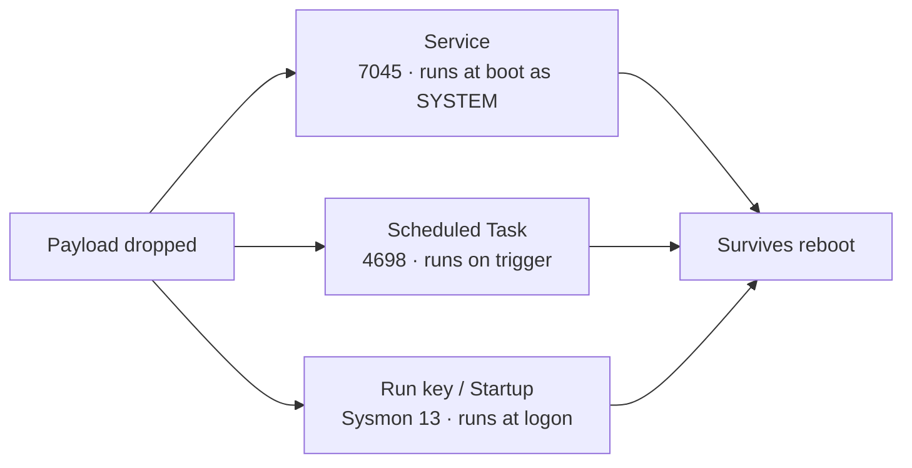

# 지속성 — 서비스, 예약 작업, Run 키 { #persistence-services-tasks-run-keys }

<div class="dfir-meta" markdown>
**MITRE ATT&CK:** T1543.003 (Windows 서비스) · T1053.005 (예약 작업) · T1547.001 (레지스트리 Run 키) · **전술:** 지속성 · **최종 수정:** 2026-09-17
</div>

!!! abstract "요약"
    지속성(persistence)은 공격자가 재부팅이나 로그오프 후에도 살아남는 방법입니다. 가장 흔한 Windows 메커니즘 세 가지는 **서비스**(부팅 시 SYSTEM으로 실행), **예약 작업**(트리거 — 로그온, 시간, 이벤트 — 에 따라 실행), **Run 키**(사용자 로그온 시 실행)입니다. 각각 분명하고 감사 가능한 기록을 남기고, 각각 정상적인 쌍둥이가 있습니다 — 그래서 탐지의 핵심은 메커니즘 자체가 아니라 *비정상적인* 인스턴스를 찾아내는 것입니다.

## 공격 원리 { #how-the-attack-works }

공격자는 자신의 페이로드를 가리키는 자동 시작 항목을 등록합니다 — 사용자가 쓸 수 있는 경로의 바이너리, 인코딩된 PowerShell 한 줄짜리, 또는 LOLBin 다운로드 크래들. 다음 트리거(부팅, 로그온, 예약 시각)가 오면 Windows가 대신 실행해 줍니다. 노련한 공격자는 주변에 섞여 드는 이름(`WindowsUpdater`, `GoogleUpdateTask`)과 그럴듯해 보이는 경로를 고릅니다.



[레지스트리 키 → ASEP](../windows/registry-keys.md#autostart-persistence-asep) 페이지에 수십 개의 자동 시작 위치(Winlogon, IFEO, COM 하이재킹, WMI, AppInit 등)가 더 정리되어 있습니다. 이 페이지는 실제 사고에서 압도적으로 많이 나오는 세 가지를 다룹니다.

## 공격 도구 / 명령 { #attacker-tooling-commands }

```text
# Service
sc create WindowsHealth binPath= "C:\Users\Public\svc.exe" start= auto
sc create X binPath= "cmd /c powershell -nop -w hidden -enc <b64>"    # Cobalt Strike style

# Scheduled task
schtasks /create /tn "GoogleUpdateTaskMachine" /tr "powershell -enc <b64>" /sc onlogon /ru SYSTEM
schtasks /create /tn Updater /tr "C:\ProgramData\u.exe" /sc minute /mo 30

# Run key
reg add HKCU\Software\Microsoft\Windows\CurrentVersion\Run /v Updater /d "C:\Users\Public\u.exe"
# Startup folder
copy payload.exe "%APPDATA%\Microsoft\Windows\Start Menu\Programs\Startup\"
```

## 남는 흔적 { #artifacts-left-behind }

| 메커니즘 | 위치 | 아티팩트 |
|---|---|---|
| **서비스** | System 로그 | **7045** (서비스 설치) — `Service_Name`, `Service_File_Name`, `Service_Start_Type` |
| | Security 로그 | **4697** (서비스 설치 — 감사 정책 필요) |
| | 레지스트리 | `HKLM\SYSTEM\CurrentControlSet\Services\<name>` — [레지스트리 키](../windows/registry-keys.md#autostart-persistence-asep) |
| | System 로그 | **7034/7036/7040** (서비스 비정상 종료/상태/시작 유형 변경) |
| **예약 작업** | Security 로그 | **4698** (생성), **4702** (수정), **4699** (삭제), **4700/4701** (활성화/비활성화) — 작업 XML은 `Task_Content`에 있음 |
| | TaskScheduler/Operational | **106** (등록), **140** (수정), **200/201** (동작 실행/완료) |
| | 디스크 | `C:\Windows\System32\Tasks\<name>` XML + 레지스트리 `...\Schedule\TaskCache\Tree` — 한쪽에만 있는 작업 = **숨겨진 작업** |
| **Run 키 / 시작 프로그램** | Sysmon | `...\CurrentVersion\Run`, `RunOnce`, Winlogon `Shell`/`Userinit`에 대한 **13** (레지스트리 값 설정) |
| | 레지스트리 | 키의 LastWrite 시간; 값 데이터 = 페이로드 경로 |
| | 디스크 / autoruns | 시작 프로그램 폴더의 `.lnk`/`.exe`; **Autoruns** 오프라인 스캔 |
| 공통 | 호스트 | 페이로드의 [Prefetch](../windows/prefetch.md)/[Amcache](../windows/amcache.md); 떨어뜨린 시점은 [$MFT](../windows/mft-usn.md); 실행 여부는 [UserAssist/BAM](../windows/registry-keys.md#program-execution-per-user-unless-noted) |

## 탐지 { #detection }

=== "Splunk — 의심스러운 서비스"

    ```spl
    index=botsv3 sourcetype="WinEventLog:System" EventCode=7045
    | eval bin=lower(Service_File_Name)
    | where match(bin,"-enc |frombase64|powershell|%comspec%|cmd\.exe|\\\\users\\\\|\\\\programdata\\\\|\\\\temp\\\\|\\\\public\\\\|\\\\appdata\\\\|rundll32|regsvr32|mshta")
        OR match(lower(Service_Name),"^[a-z0-9]{8}$")
    | table _time, host, Service_Name, Service_File_Name, Service_Start_Type, Account_Name
    | sort 0 _time
    ```

    `7045` = 서비스가 설치됨. 정상 서비스는 `Program Files`/`System32`의 서명된 바이너리를 실행합니다. 이 정규식은 바이너리가 인코딩된 PowerShell 한 줄짜리, LOLBin, 또는 사용자가 쓸 수 있는 경로의 파일인 서비스를 잡아내고, Cobalt Strike 기본값인 무작위 8글자 서비스 이름도 잡아냅니다.

=== "Splunk — 명령 추출을 포함한 예약 작업"

    ```spl
    index=botsv3 sourcetype=WinEventLog EventCode IN (4698,4702)
    | rex field=Task_Content "<Command>(?<cmd>[^<]+)</Command>"
    | rex field=Task_Content "<Arguments>(?<args>[^<]+)</Arguments>"
    | eval full=cmd." ".args
    | where match(lower(full),"-enc |frombase64|powershell|mshta|rundll32|regsvr32|\\\\users\\\\|\\\\temp\\\\|\\\\public\\\\|http") OR isnull(cmd)
    | table _time, host, Subject_Account_Name, Task_Name, cmd, args
    | sort 0 _time
    ```

    `4698` = 작업 생성, `4702` = 작업 수정. 작업의 동작은 `Task_Content` XML 안에 묻혀 있으므로, `rex` 추출 두 개로 `<Command>`와 `<Arguments>`를 꺼낸 뒤 같은 의심 명령 필터를 적용합니다. 실제 작업을 흉내 내지만(`GoogleUpdateTask*`, `Windows*`) 이상한 경로에서 실행되는 작업을 주의해서 보세요.

=== "Splunk — Run 키 쓰기 (Sysmon 13)"

    ```spl
    index=botsv3 sourcetype="XmlWinEventLog:Microsoft-Windows-Sysmon/Operational" EventID=13
    | where match(TargetObject,"(?i)\\\\CurrentVersion\\\\Run(Once)?\\\\|\\\\Winlogon\\\\(Shell|Userinit)|\\\\Policies\\\\Explorer\\\\Run")
    | table _time, host, User, Image, TargetObject, Details
    | sort 0 _time
    ```

    Sysmon `13` = 레지스트리 값이 설정됨. `TargetObject`는 키 경로(Run/RunOnce/Winlogon), `Details`는 기록된 값(페이로드 경로), `Image`는 그 값을 쓴 프로세스입니다 — 설치 프로그램이 아닌 프로세스가 Run 키를 쓰면 의심스럽습니다.

## 대응 { #response }

지속성을 제거하고(서비스/작업/값을 기록해 둔 **뒤에** 삭제), 그것이 가리키는 **페이로드**를 찾아 제거하고, **어떻게 거기 들어왔는지** 밝혀내세요 — 지속성은 증상이지 근본 원인이 아닙니다. 같은 서비스 이름, 작업 이름, Run 값이 있는지 환경 전체를 훑으세요: 공격자는 여러 호스트에 똑같은 지속성을 심습니다. 전체 ASEP 목록을 얻으려면 **Autoruns**를 실행하세요(이미지에 대해서는 오프라인 모드) — 여기서 다룬 세 메커니즘이 흔하긴 하지만 [레지스트리 ASEP 목록](../windows/registry-keys.md#autostart-persistence-asep)에는 훨씬 더 많습니다. 페이로드의 시점을 파악하기 위해 [Prefetch](../windows/prefetch.md)/[Amcache](../windows/amcache.md)/[$MFT](../windows/mft-usn.md)를 보존하세요. 강화: 서비스와 작업 생성을 감사하고(`4697`/`4698`), 비표준 바이너리에 대한 `7045`에 알림을 걸고, 서비스/작업을 만들 수 있는 사람을 제한하고, Sysmon으로 Run 키 쓰기를 모니터링하세요.

## 참고 자료 { #references }

- [MITRE ATT&CK — T1543.003](https://attack.mitre.org/techniques/T1543/003/) · [T1053.005](https://attack.mitre.org/techniques/T1053/005/) · [T1547.001](https://attack.mitre.org/techniques/T1547/001/)
- [Sysinternals Autoruns](https://learn.microsoft.com/en-us/sysinternals/downloads/autoruns)
- 관련 페이지: [레지스트리 키 — ASEP](../windows/registry-keys.md#autostart-persistence-asep) · [이벤트 로그](../windows/event-logs.md) · [보안 검색](../splunk/security-searches.md)
