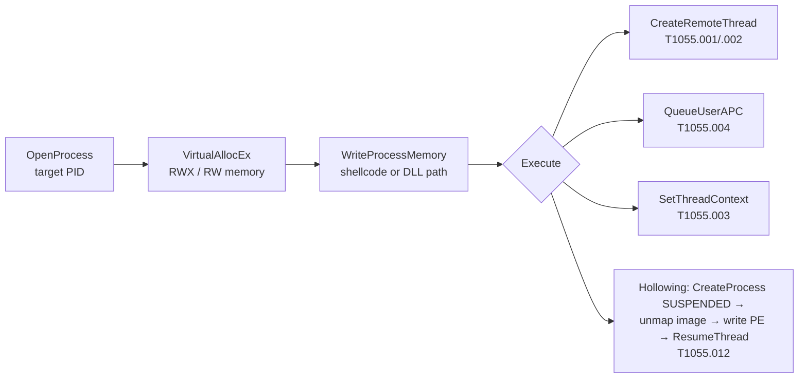

# 프로세스 인젝션 (Process Injection) { #process-injection }

<div class="dfir-meta" markdown>
**MITRE ATT&CK:** T1055 (프로세스 인젝션) — .001 DLL 인젝션 · .002 PE 인젝션 · .003 스레드 실행 하이재킹 · .004 APC · .012 프로세스 할로잉 · **전술:** 방어 회피 / 권한 상승 · **최종 수정:** 2026-10-07
</div>

!!! abstract "요약"
    악성코드는 `evil.exe`로 실행하는 대신, 정상 프로세스(`explorer.exe`, `svchost.exe`, `rundll32.exe`, 브라우저)의 메모리에 자기 코드를 써 넣고 거기서 실행합니다. 그러면 악성 활동이 신뢰할 수 있는 서명된 프로세스에서 나오는 것처럼 *보이고*, 그 프로세스의 토큰과 네트워크 권한을 물려받으며, 디스크에 파일로 존재하지 않는 경우도 많습니다. 모든 C2 프레임워크(Cobalt Strike, Sliver, Havoc, Brute Ratel)가 사후 공격 작업에 인젝션을 씁니다. 메모리 포렌식 쪽은 [메모리: 프로세스와 인젝션](../memory/processes-injection.md)을 참고하세요.

## 공격 원리 { #how-the-attack-works }

고전적인 순서는 Windows API 호출 네 개입니다:



| 변종 | 핵심 아이디어 | 메모리 단서 |
|---|---|---|
| DLL 인젝션 | 원격 스레드가 DLL 경로로 `LoadLibrary` 호출 | 이상한 경로(`%TEMP%`, `ProgramData`)에서 로드된 DLL |
| Reflective DLL / 셸코드 | DLL이 스스로 매핑 — 로더에 등록되지 않음 | **파일에 연결되지 않은 private 실행 메모리** (`malfind` 탐지) |
| 프로세스 할로잉 | 정상 프로세스를 일시 정지 상태로 시작한 뒤 이미지를 교체 | 디스크의 이미지 경로 ≠ 메모리의 코드; `PEB` 이미지 베이스 불일치 |
| APC / Early Bird | 스레드가 시작하기 전에 코드를 큐에 넣음 | 셸코드와 같음 |
| 모듈 스톰핑 / threadless | 정상 로드된 DLL의 `.text`를 덮어씀 | 파일에 연결돼 있지만 변조됨 — 더 어려움; 디스크와 비교 |

## 공격 도구 / 명령 { #attacker-tooling-commands }

```text
# C2 frameworks
Cobalt Strike:  inject <pid> x64 <listener> · spawnto · shinject · execute-assembly (fork & run)
Metasploit:     migrate <pid> · post/windows/manage/shellcode_inject
Sliver / Havoc / Brute Ratel: equivalent commands

# Common spawn-to sacrificial processes
rundll32.exe (no arguments!) · dllhost.exe · werfault.exe · gpupdate.exe · svchost.exe -k
```

!!! tip "희생 프로세스가 정체를 드러낸다"
    Cobalt Strike의 기본 `spawnto`는 **명령줄 인자가 없는** `rundll32.exe`입니다 — 진짜 `rundll32`는 항상 DLL 인자가 있습니다. 빈 명령줄의 `rundll32.exe`가 네트워크 연결을 하는 것은 Windows에서 가장 효과 좋은 헌팅 중 하나입니다.

## 영향받는 Windows 버전 { #affected-windows-versions }

인젝션은 문서화된 API를 쓰므로 **XP부터 11 / Server 2025까지 모든 Windows 버전**에서 동작합니다. 시간이 지나며 바뀐 것은 방어자의 가시성과 쓸 수 있는 강화 기능입니다:

| 버전 | 관련 변화 |
|---|---|
| XP / 2003 | 대부분의 앱에 기본 ASLR/DEP 없음 (DEP는 XP SP2부터, 선택 사항) — 인젝션과 익스플로잇이 매우 쉬움 |
| **Vista / 2008** | ASLR, 무결성 수준 — Medium 프로세스는 High/SYSTEM 프로세스에 인젝션할 수 없음 |
| 8.1 / 2012 R2 | AV와 LSASS(RunAsPPL 사용 시)에 **Protected Process Light (PPL)** — 일반 관리자 권한으로 인젝션 불가 |
| **10** | Control Flow Guard, **ETW Threat-Intelligence** 공급자(EDR이 `WriteProcessMemory`/`QueueUserAPC`를 봄), Exploit Protection (ACG, CIG), **HVCI** |
| 11 | 새 설치에서 HVCI / 메모리 무결성 기본 켜짐; Smart App Control; 하드웨어 기반 스택 보호 |

## 남는 흔적 { #artifacts-left-behind }

| 위치 | 아티팩트 | 찾을 것 |
|---|---|---|
| Sysmon | **8** (CreateRemoteThread) — `SourceImage` ≠ `TargetImage`, `StartModule`이 비어 있거나 `StartFunction` = `LoadLibraryA/W` | 다른 프로세스에 원격 스레드 생성 |
| Sysmon | `GrantedAccess`에 `0x1F0FFF`, `0x1F3FFF`, `0x143A` (`VM_WRITE`+`VM_OPERATION`+`CREATE_THREAD`)가 있고 `CallTrace`에 `UNKNOWN(...)`이 있는 **10** (ProcessAccess) | 인젝션용 핸들 열기; `UNKNOWN` 프레임 = 파일에 연결되지 않은 메모리에서 호출 |
| Sysmon | **25** (ProcessTampering) — `Type: Image is replaced` | 프로세스 할로잉 / herpaderping |
| Sysmon | **1** — **인자 없는** `rundll32.exe`/`dllhost.exe`/`werfault.exe`; **3** — 그 프로세스들의 외부 연결 | 희생용 spawn-to 프로세스 |
| Sysmon | **7** (ImageLoad) — 사용자 쓰기 가능 경로의 서명 없는 DLL이 서명된 프로세스에 로드됨 | DLL 인젝션 / 사이드로딩 |
| 메모리 | Volatility `windows.malfind` (MZ / 셸코드가 있는 PAGE_EXECUTE_READWRITE private 영역), `windows.hollowprocesses`, `ldrmodules` 불일치 | 결정적 증거 — [메모리: 프로세스와 인젝션](../memory/processes-injection.md) 참고 |
| 네트워크 | 원래 인터넷과 통신하지 않는 프로세스(`notepad.exe`, `rundll32.exe`)의 [비커닝](../network/beaconing-c2.md) | 인젝션된 C2 |

## 탐지 { #detection }

=== "Splunk — 원격 스레드"

    ```spl
    index=botsv3 sourcetype="XmlWinEventLog:Microsoft-Windows-Sysmon/Operational" EventID=8
    | eval src=lower(replace(SourceImage,".*\\\\","")), tgt=lower(replace(TargetImage,".*\\\\",""))
    | search NOT src IN ("csrss.exe","wininit.exe","services.exe","msmpeng.exe","vmtoolsd.exe")
    | stats count, values(StartFunction) as func, values(StartModule) as mod by host, src, tgt
    | sort - count
    ```

    Sysmon `8` = 프로세스가 **다른** 프로세스에 스레드를 만듦. 정상 사례(AV, 디버거, `csrss`)도 있으므로 `NOT ... IN (...)` 목록으로 알려진 정상 출발지를 뺍니다 — 이 목록은 여러분 환경의 기준선으로 만드세요. Office, 브라우저, `powershell.exe`, `%TEMP%`의 무언가가 원격 스레드를 만들면 반증되기 전까지 악성입니다.

=== "Splunk — 인자 없는 rundll32의 외부 통신"

    ```spl
    index=botsv3 sourcetype="XmlWinEventLog:Microsoft-Windows-Sysmon/Operational" EventID=1 Image="*\\rundll32.exe"
    | where match(CommandLine,"(?i)rundll32(\.exe)?\"?\s*$")
    | table _time, host, User, ParentImage, CommandLine, ProcessGuid
    | join type=left ProcessGuid
        [ search index=botsv3 sourcetype="XmlWinEventLog:Microsoft-Windows-Sysmon/Operational" EventID=3
          | stats values(DestinationIp) as dst, values(DestinationPort) as dport by ProcessGuid ]
    ```

    `where`는 명령줄이 실행 파일 이름 바로 뒤에서 *끝나는* `rundll32`만 남깁니다 — DLL 인자가 없음. `ProcessGuid`는 Sysmon의 고유 프로세스 ID이고, `join`은 같은 프로세스가 만든 네트워크 연결(Sysmon `3`)을 붙여 줍니다.

=== "Splunk — 할로잉"

    ```spl
    index=botsv3 sourcetype="XmlWinEventLog:Microsoft-Windows-Sysmon/Operational" EventID=25
    | table _time, host, User, Image, Type
    ```

    Sysmon `25` (Sysmon 13+) = 프로세스 이미지가 디스크에서 매핑된 것과 달라짐.

## 대응 { #response }

메모리가 증거입니다. **프로세스를 죽이기 전에 RAM을 수집**하고([이미징과 수집](../tools/imaging-collection.md) 참고), Volatility로 분석하세요. 인젝션한 프로세스(Sysmon 8/10 `SourceImage`)를 찾으세요 — 그게 진짜 악성코드이고, 대상은 숙주일 뿐입니다. 인젝션된 프로세스에서 보인 C2 목적지를 차단합니다.

### Windows 버전별 대응책 { #remediation-by-windows-version }

| 대응책 | 막는 것 | 적용 가능 버전 |
|---|---|---|
| 커널 콜백 + ETW-TI를 쓰는 **EDR** | 할당-쓰기-실행 패턴 탐지/차단 | 7 → 11 (벤더에 따라 다름; ETW-TI는 10+) |
| **ASR 규칙** — *Block Office applications from injecting code into other processes*, *Block credential stealing from LSASS* | 흔한 인젝션 시작 지점 | 10 1709+, Server 2019+ (Defender AV) |
| **Exploit Protection** — 프로세스별 ACG, CIG, *Block low-integrity images*, *Code integrity guard* | 보호된 프로세스의 서명 없는 코드 / 동적 코드 | 10 1709+ |
| **HVCI / 메모리 무결성** | 커널 모드 인젝션, 취약 드라이버 악용 | 10+; 새 11 설치에서 기본 켜짐 |
| AV와 LSASS에 **PPL** (`RunAsPPL`) | 보안 프로세스로의 인젝션 | 8.1 / 2012 R2+ |
| WDAC | 서명 없는 인젝터 바이너리 / DLL | 10 / 2016+ |
| 이벤트 8, 10, 25를 켠 Sysmon | 가시성 | 이벤트 25는 Sysmon 13+ 필요 |
| XP / 2003 / 7 퇴역 | 현대적 완화 기능이 없음 | — |

## 참고 자료 { #references }

- [MITRE ATT&CK — T1055](https://attack.mitre.org/techniques/T1055/)
- 관련 페이지: [메모리: 프로세스와 인젝션](../memory/processes-injection.md) · [비커닝과 C2](../network/beaconing-c2.md) · [LSASS 덤프](lsass-dumping.md)
