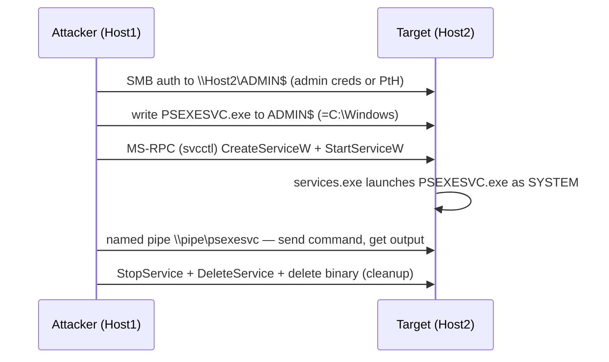

# PsExec와 SMB 횡적 이동 { #psexec-smb-lateral-movement }

<div class="dfir-meta" markdown>
**MITRE ATT&CK:** T1021.002 (SMB/Windows 관리 공유) + T1569.002 (서비스 실행) · **전술:** 횡적 이동 / 실행 · **최종 수정:** 2026-09-17
</div>

!!! abstract "요약"
    관리자 자격증명(또는 훔친 해시)을 가진 공격자는 SMB로 대상의 숨겨진 **`ADMIN$`** 공유에 서비스 바이너리를 복사한 뒤, 그것을 실행하는 **Windows 서비스**를 원격으로 만들고 시작합니다 — 그 결과 원격 호스트에서 SYSTEM 수준의 명령 실행을 얻습니다. Sysinternals PsExec가 원조이고, Impacket `psexec.py`, Cobalt Strike `jump psexec`, 그리고 수많은 복제품이 같은 패턴을 따릅니다.

## 공격 원리 { #how-the-attack-works }



관찰 가능한 세 단계는 **관리 공유에 대한 SMB 쓰기**, **서비스 생성**, **서비스 시작**이고, 여기에 입출력용 named pipe가 더해집니다. 정리(cleanup) 과정에서 바이너리와 서비스를 지우는 경우가 많지만, 서비스 설치에 대한 이벤트 로그 기록은 남습니다.

## 공격 도구 / 명령 { #attacker-tooling-commands }

```text
# Sysinternals
PsExec.exe \\HOST2 -s -accepteula cmd.exe

# Impacket
psexec.py CORP/admin:pass@10.0.0.5           # drops RemComSvc-style service
smbexec.py CORP/admin@10.0.0.5 -hashes :<hash>   # semi-interactive, no binary drop
wmiexec.py ...                                    # WMI variant — see WMI/WinRM page

# Cobalt Strike
jump psexec HOST2 smb              # or psexec64 / psexec_psh (no binary on disk)
```

## 남는 흔적 { #artifacts-left-behind }

| 위치 | 아티팩트 | 찾을 것 |
|---|---|---|
| **대상** Security 로그 | **4624 Logon Type 3** (네트워크 로그온, 관리자 계정) | 들어오는 관리자 인증 |
| 대상 Security 로그 | 같은 Logon ID의 **4672** (관리자 권한) | 특권 세션 |
| 대상 Security 로그 | `ADMIN$`, `IPC$`, `C$`에 대한 **5140** (네트워크 공유 접근) / **5145** (공유 객체 확인) | 바이너리 복사와 pipe 접근; `PSEXESVC.exe` 같은 `Relative_Target_Name` |
| 대상 System 로그 | **7045** (서비스 설치) — `Service_File_Name`, `Service_Name` | `PSEXESVC`, `RemComSvc`, 또는 무작위 8글자 이름; `C:\Windows\`나 임시 경로에 있는 바이너리 |
| 대상 System 로그 | **7036** (서비스 상태) / **7034** (비정상 종료) | 서비스의 시작/중지 |
| 대상 Sysmon | **1** (SYSTEM으로 실행된 `PSEXESVC.exe` 자식 프로세스), **11** (바이너리 기록), **17/18** (named pipe `\psexesvc`, `\RemCom_communicaton`) | 파일이 삭제된 뒤에도 남는 프로세스 + pipe 증거 |
| 대상 호스트 | [Prefetch](../windows/prefetch.md) `PSEXESVC.EXE-*.pf`; [$UsnJrnl/$MFT](../windows/mft-usn.md)에 바이너리 생성+삭제가 보임 | 정리 후에도 남음 |
| **출발지** 호스트 | Security **4648** (명시적 자격증명), [Prefetch](../windows/prefetch.md) `PSEXEC.EXE`, [ShellBags/LNK](../windows/lnk-jumplists.md) | 이동이 시작된 곳 |
| 네트워크 | [Zeek `smb_files.log`](../network/zeek/index.md) — `ADMIN$`에 `*.exe`를 `WRITE`; [`dce_rpc.log`](../network/zeek/index.md) — `svcctl` 작업; [`conn.log`](../network/zeek/conn-log.md) 내부→내부 `445` | 네트워크상의 복사 + 서비스 생성 |

## 탐지 { #detection }

=== "Splunk — 대상에서 전체 체인"

    ```spl
    index=botsv3 (sourcetype=WinEventLog EventCode IN (4624,5140,5145)) OR (sourcetype="WinEventLog:System" EventCode=7045)
    | eval share=coalesce(Share_Name, Relative_Target_Name)
    | where EventCode!=4624 OR Logon_Type=3
    | eval src=coalesce(Source_Network_Address, Source_Address)
    | stats values(EventCode) as codes, values(share) as shares, values(Service_File_Name) as svc_bin, min(_time) as first, max(_time) as last by host, src
    | where match(mvjoin(codes,","),"514[05]") AND match(mvjoin(codes,","),"7045")
    | convert ctime(first) ctime(last)
    | sort first
    ```

    이 쿼리는 로그온(`4624/3`), 공유 접근(`5140`/`5145`), 서비스 설치(`7045`)를 대상 호스트 + 출발지 IP별로 모은 뒤, 공유 접근 코드와 서비스 설치를 **둘 다** 가진 그룹만 남깁니다 — 이것이 PsExec를 정의하는 시그니처입니다. `values(Service_File_Name)`은 떨어뜨린 바이너리 경로를 보여 주고, `mvjoin`은 다중값 코드 목록을 하나의 문자열로 펼쳐서 `match`로 검사할 수 있게 합니다.

=== "Splunk — 의심스러운 7045 단독"

    ```spl
    index=botsv3 sourcetype="WinEventLog:System" EventCode=7045
    | eval bin=lower(Service_File_Name)
    | where match(bin,"psexesvc|remcom|paexec|\\\\windows\\\\[a-z0-9]{8}\\.exe|-enc |powershell|%comspec%|\\\\temp\\\\|\\\\users\\\\public")
    | table _time, host, Service_Name, Service_File_Name, Account_Name
    | sort 0 _time
    ```

    `7045` = 서비스가 설치됨. 이 정규식은 알려진 PsExec 서비스 이름, `C:\Windows`의 무작위 8글자 바이너리, 그리고 바이너리가 인코딩된 PowerShell 한 줄짜리이거나 사용자/임시 경로에 있는 서비스를 잡아냅니다 — 모두 정상 서비스로서는 비정상입니다.

=== "Zeek — SMB 쓰기 + RPC 서비스 제어"

    ```bash
    # Executable written to an admin share
    zeek-cut -d ts id.orig_h id.resp_h path name action size < smb_files.log \
      | grep -iE 'ADMIN\$|C\$' | grep -iE '\.(exe|dll)\b'

    # Service-control RPC operations (svcctl) between internal hosts
    zeek-cut -d ts id.orig_h id.resp_h operation < dce_rpc.log | grep -iE 'svcctl|CreateService|StartService'
    ```

    `smb_files.log`는 바이너리가 `ADMIN$`/`C$`에 쓰이는 것을 보여 주고, `dce_rpc.log`는 그 뒤에 이어지는 `svcctl` `CreateServiceW`/`StartServiceW` 호출을 보여 줍니다. 둘을 합치면 네트워크상의 PsExec이고, 시간 정보는 `uid`로 [`conn.log`](../network/zeek/conn-log.md)에 피벗해서 보세요.

## 대응 { #response }

두 호스트(출발지와 대상)를 모두 격리하고, 사용된 관리자 자격증명은 탈취된 것으로 취급하세요 — 교체하고 그 계정이 인증한 모든 곳을 헌팅하세요(`5140`/`4648` 흔적). 서비스 설치와 named pipe 아티팩트는 공격자의 정리 후에도 남으므로, 바이너리가 사라졌더라도 `7045` + Sysmon 17/18 + [$UsnJrnl](../windows/mft-usn.md)로 체인을 재구성하세요. 양쪽 모두에서 [Prefetch](../windows/prefetch.md)를 보존하세요. 강화: `ADMIN$`/`C$`에 인증할 수 있는 대상을 제한하고(공유 자체는 없앨 수 없지만 방화벽과 계층화로 SMB 접근을 제한할 수 있음), 로컬 관리자 해시 하나로 모든 호스트가 열리지 않도록 LAPS를 적용하고, 서비스 생성과 named pipe 규칙을 갖춘 Sysmon을 배포하고, 비표준 바이너리에 대한 `7045`를 상시 알림으로 거세요.

## 참고 자료 { #references }

- [MITRE ATT&CK — T1021.002](https://attack.mitre.org/techniques/T1021/002/) · [T1569.002](https://attack.mitre.org/techniques/T1569/002/)
- [JPCERT — Detecting lateral movement (tool analysis)](https://jpcertcc.github.io/ToolAnalysisResultSheet/)
- 관련 페이지: [Pass-the-Hash](pass-the-hash.md) · [WMI와 WinRM](wmi-winrm.md) · [MFT/USN](../windows/mft-usn.md) · [Zeek SMB](../network/zeek/index.md) · [보안 검색](../splunk/security-searches.md)
