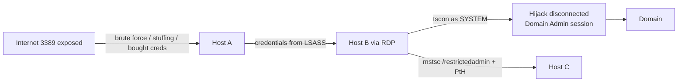

# RDP — 원격 데스크톱 악용 { #rdp-remote-desktop-abuse }

<div class="dfir-meta" markdown>
**MITRE ATT&CK:** T1021.001 (원격 서비스: Remote Desktop Protocol) · T1133 (외부 원격 서비스) · T1110 (무차별 대입) · T1563.002 (RDP 하이재킹) · **전술:** 초기 접근 / 횡적 이동 · **최종 수정:** 2026-10-07
</div>

!!! abstract "요약"
    RDP는 완전한 대화형 데스크톱을 제공합니다. 인터넷에 노출된 RDP는 랜섬웨어의 가장 주요한 **초기 접근** 경로 중 하나이며(무차별 대입하거나 구매한 자격증명), 네트워크 안에서는 비밀번호를 손에 넣은 운영자가 가장 즐겨 쓰는 **횡적 이동** 수단입니다 — 평범한 관리 작업처럼 보이기 때문입니다. 추가로 두 가지 기법이 있습니다: **RDP 세션 하이재킹**(SYSTEM 권한의 `tscon`으로 연결이 끊긴 관리자의 세션을 비밀번호 없이 가로챔)과 **Restricted Admin pass-the-hash**(NT 해시만으로 RDP 접속)입니다.

## 공격 원리 { #how-the-attack-works }



## 공격 도구 / 명령 { #attacker-tooling-commands }

```text
# Brute force / spray (external)
hydra -L users.txt -P pass.txt rdp://target · crowbar · ncrack · nxc rdp

# Lateral
mstsc /v:host  ·  xfreerdp /u:admin /d:CORP /pth:<NThash> /v:host   (Restricted Admin PtH)

# Session hijack (needs SYSTEM on the host)
query user
sc create hj binpath= "cmd /k tscon 2 /dest:rdp-tcp#5"  &  sc start hj

# Enable RDP on a host remotely
reg add "HKLM\System\CurrentControlSet\Control\Terminal Server" /v fDenyTSConnections /t REG_DWORD /d 0 /f
netsh advfirewall firewall set rule group="remote desktop" new enable=Yes

# Tunnelling RDP through C2 (no 3389 on the wire)
ngrok / chisel / plink -R 3389
```

## 영향받는 Windows 버전 { #affected-windows-versions }

| 버전 | 노출 | 버전별 메모 |
|---|---|---|
| **XP / 2003** | 서버 쪽 NLA 없음; 세션이 수립된 뒤에 자격증명 전송 | **BlueKeep (CVE-2019-0708)** — 인증 전 웜 전파 가능한 RCE; MS가 XP/2003용 긴급(out-of-band) 패치 배포 |
| **Vista / 2008** | NLA 사용 가능 (CredSSP) | BlueKeep의 영향도 받음 |
| **7 / 2008 R2** | 새 구성에서 NLA 기본 활성화 | **BlueKeep** (7 / 2008 R2가 마지막 영향 버전); **DejaBlue** (CVE-2019-1181/1182) |
| **8.1 / 2012 R2** | Restricted Admin 모드 도입 (7 / 2008 R2에도 백포트) — 대상에 자격증명이 남지 않지만 **RDP를 통한 PtH**를 가능하게 함 | DejaBlue는 8.1 / 10 / 2012 R2 – 2019에 영향 |
| **10 / 2016+** | Remote Credential Guard (1607 이상); SYSTEM 권한 `tscon`을 통한 세션 하이재킹은 여전히 동작 | |
| **11 / 2022 / 2025** | 새로 설치한 11 22H2 이상에서 계정 잠금 정책 기본 적용 (10회 시도 / 10분) | 자격증명 재사용과 무차별 대입이 여전히 주된 위협 |

## 남는 흔적 { #artifacts-left-behind }

| 위치 | 아티팩트 | 찾을 것 |
|---|---|---|
| **대상** Security 로그 | **4624 Logon Type 10** (RemoteInteractive) — `Source_Network_Address` = 클라이언트; 재연결 시 Type **7**; **4625** 실패 (Type 10, NLA 사용 시 Type 3) | 누가 어디서 로그온했는가. NLA 환경의 무차별 대입은 주로 **4625 Type 3**으로 보임 |
| 대상 | **4778** (세션 재연결) / **4779** (세션 연결 끊김) — 클라이언트 이름 및 IP 포함 | 세션 하이재킹은 그 사용자의 새 4624 *없이* 4778이 나타남 |
| 대상 | `TerminalServices-RemoteConnectionManager/Operational` **1149** — "User authentication succeeded" (사용자, 도메인, 출발지 IP) | 네트워크 수준 연결로, 완전한 로그온 전에도 기록됨 |
| 대상 | `TerminalServices-LocalSessionManager/Operational` **21** (로그온), **22** (셸 시작), **24** (연결 끊김), **25** (재연결), **39/40** | 세션 전체 타임라인; 다른 출발지의 **25** = 하이재킹 가능성 |
| 대상 | `RdpCoreTS` **131** (연결 수락, 출발지 IP:포트) | 실패한 시도라도 클라이언트를 잡아냄 |
| **출발지** 호스트 | `TerminalServices-RDPClient/Operational` **1024 / 1102** (목적지 호스트 이름 / IP) | 공격자가 이 호스트*에서* 어디로 갔는가 |
| 출발지 호스트 레지스트리 | `NTUSER\Software\Microsoft\Terminal Server Client\Servers\<host>` (UsernameHint)와 `Default` MRU | 사용자별 횡적 이동 목적지 — [레지스트리 키](../windows/registry-keys.md) 참고 |
| 출발지 호스트 파일 | `%LOCALAPPDATA%\Microsoft\Terminal Server Client\Cache\bcache*.bmc` / `Cache*.bin` | **비트맵 캐시** — 공격자가 원격 화면에서 본 것의 조각 이미지 (`bmc-tools`로 파싱) |
| Restricted Admin | **`Restricted_Admin_Mode = Yes`** 인 4624 Type 10 | RDP를 통한 PtH 후보 |
| 네트워크 | [Zeek `rdp.log`](../network/zeek/index.md) — `cookie` (사용자 이름), `client_name`, `security_protocol`; 인터넷에서 들어온 3389 `conn.log` | 네트워크상의 사용자 이름과 무차별 대입 규모 |

## 탐지 { #detection }

=== "Splunk — 외부 RDP 로그온"

    ```spl
    index=botsv3 sourcetype=WinEventLog EventCode=4624 Logon_Type IN (10,7)
    | where NOT cidrmatch("10.0.0.0/8",Source_Network_Address) AND NOT cidrmatch("172.16.0.0/12",Source_Network_Address) AND NOT cidrmatch("192.168.0.0/16",Source_Network_Address)
    | iplocation Source_Network_Address
    | table _time, host, Account_Name, Source_Network_Address, Country, City
    ```

    `Logon_Type 10` = RemoteInteractive (RDP); `7` = 잠금 해제/재연결. `cidrmatch()`는 IP가 특정 범위에 속하는지 검사합니다 — 세 개의 `NOT` 필터가 RFC1918 사설 주소를 제거해서 공인 출발지만 남깁니다. `iplocation`은 지리 위치 필드를 추가합니다.

=== "Splunk — 무차별 대입 / 스프레이"

    ```spl
    index=botsv3 sourcetype=WinEventLog EventCode=4625 Logon_Type IN (3,10)
    | bin _time span=15m
    | stats count as fails, dc(Account_Name) as users by _time, host, Source_Network_Address
    | where fails > 20 OR users > 10
    ```

    `4625` = 로그온 실패. 한 사용자에 대한 많은 실패 = 무차별 대입; 여러 사용자에 걸친 적은 실패 = 패스워드 스프레이. 그다음에는 **같은 출발지의 4624**가 뒤따르는지 찾으세요 — 그것이 성공입니다.

=== "Splunk — 세션 하이재킹"

    ```spl
    index=botsv3 (sourcetype="XmlWinEventLog:Microsoft-Windows-Sysmon/Operational" EventID=1) OR (sourcetype=WinEventLog EventCode=4688)
    | eval cmd=lower(coalesce(CommandLine, Process_Command_Line))
    | where match(cmd,"tscon(\.exe)?\s+\d+\s+/dest:")
    | table _time, host, User, ParentImage, cmd
    ```

    `tscon <id> /dest:<session>`은 한 세션을 다른 세션에 연결합니다. `SYSTEM`으로 실행하면(이 목적만을 위해 만든 서비스에서 실행되는 경우가 많으니 같은 시각의 7045를 확인하세요) 비밀번호가 필요 없습니다.

## 대응 { #response }

사용된 계정을 비활성화/재설정하고, 출발지 IP를 차단하고, 외부 노출을 즉시 막으세요. 공격자가 RDP로 들어간 모든 호스트에서 **출발지** 아티팩트(RDPClient 로그, Terminal Server Client 레지스트리, 비트맵 캐시)를 확인해 이후의 연결 고리를 따라가세요. 비트맵 캐시로 공격자가 무엇을 봤는지 확인하세요.

### Windows 버전별 대응책 { #remediation-by-windows-version }

| 대응책 | 막는 것 | 적용 가능 버전 |
|---|---|---|
| **인터넷에 RDP 노출 금지** — **MFA**를 적용한 VPN / RD Gateway | 외부 무차별 대입, BlueKeep 노출 | 전체 |
| **BlueKeep** / DejaBlue 패치 | 인증 전 RCE | XP / 2003 (긴급 패치), Vista, 7, 2008 / R2 (BlueKeep); 8.1 – 2019 (DejaBlue) |
| **Network Level Authentication** 필수 | 인증 전 노출, 자원 고갈; BlueKeep 완화 | 서버 Vista / 2008 이상; XP SP3 클라이언트는 NLA 지원 |
| 계정 잠금 정책 | 무차별 대입 | 전체; 새로 설치한 11 22H2 이상에서 기본 적용 |
| **Remote Credential Guard** (`mstsc /remoteGuard`) | RDP 대상에서의 자격증명 탈취 | 10 1607 이상 / 2016 이상 (양쪽 모두) |
| Restricted Admin — 의도적으로만 사용; 쓰지 않는 곳에서는 **비활성화** (`DisableRestrictedAdmin=1`) | RDP를 통한 PtH | 8.1 / 2012 R2 이상 (7 / 2008 R2에 백포트) |
| *원격 데스크톱 서비스를 통한 로그온 허용(Allow log on through Remote Desktop Services)* 을 관리자 그룹으로 제한; 로컬 계정은 거부 | 수집한 사용자 계정으로의 횡적 RDP | 전체 |
| 세션 시간 제한: 연결 끊긴 세션 로그오프 (*Set time limit for disconnected sessions*) | 유휴 관리자 세션 하이재킹 | 전체 |
| 호스트 방화벽: 점프 호스트 / PAW에서만 3389 허용 | 횡적 RDP | Vista / 2008 이상 (WFAS) |

## 참고 자료 { #references }

- [MITRE ATT&CK — T1021.001](https://attack.mitre.org/techniques/T1021/001/) · [T1563.002](https://attack.mitre.org/techniques/T1563/002/)
- [Microsoft — CVE-2019-0708 (BlueKeep)](https://msrc.microsoft.com/update-guide/vulnerability/CVE-2019-0708)
- 관련 페이지: [이벤트 로그](../windows/event-logs.md) · [레지스트리 키](../windows/registry-keys.md) · [횡적 이동 플레이북](../playbooks/lateral-domain.md)
