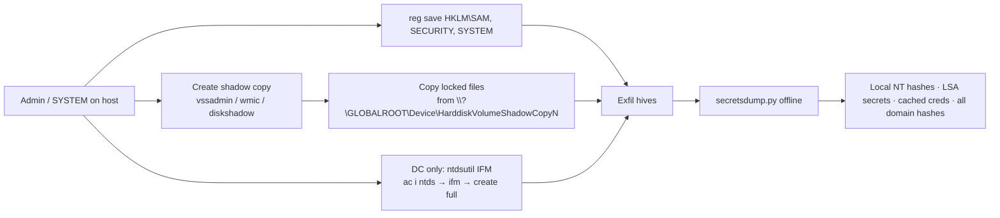

# SAM, LSA Secrets 및 NTDS.dit 추출 { #sam-lsa-secrets-ntdsdit-extraction }

<div class="dfir-meta" markdown>
**MITRE ATT&CK:** T1003.002 (Security Account Manager) · T1003.004 (LSA Secrets) · T1003.003 (NTDS) · **전술:** 자격 증명 접근 · **최종 수정:** 2026-10-07
</div>

!!! abstract "요약"
    [LSASS 덤프](lsass-dumping.md)는 *메모리에 있는* 것을 훔칩니다. 이 페이지는 그 반대편인 *디스크* 쪽입니다: **SAM** 하이브(로컬 계정 NT 해시), **SECURITY** 하이브(LSA Secrets — 서비스 계정 비밀번호, 캐시된 도메인 로그온, 머신 계정 시크릿), 그리고 도메인 컨트롤러에서는 **`NTDS.dit`**(`krbtgt`를 포함한 모든 도메인 계정의 해시)입니다. 이 파일들은 모두 **SYSTEM** 하이브에서 나온 키로 암호화되어 있어서, 공격자는 항상 SYSTEM도 함께 가져갑니다. Windows가 실행 중일 때는 이 파일들이 잠겨 있기 때문에, 공격자는 레지스트리 API, **Volume Shadow Copy**(볼륨 섀도 복사본), 또는 `ntdsutil`의 "Install From Media"를 통해 복사합니다.

## 공격 원리 { #how-the-attack-works }



대응자가 알아야 할 핵심: **파일이 호스트를 떠나면 크랙과 파싱은 오프라인에서 일어납니다**. 탐지할 수 있는 모든 것은 호스트에서 복사가 일어나는 짧은 순간에 발생합니다.

## 공격 도구 / 명령 { #attacker-tooling-commands }

```text
# Registry API — no shadow copy needed (local hives)
reg save HKLM\SAM     C:\Windows\Temp\sam.save
reg save HKLM\SYSTEM  C:\Windows\Temp\system.save
reg save HKLM\SECURITY C:\Windows\Temp\security.save

# Shadow copy route (for NTDS.dit or locked files)
vssadmin create shadow /for=C:
copy \\?\GLOBALROOT\Device\HarddiskVolumeShadowCopy1\Windows\NTDS\ntds.dit C:\Temp\
esentutl.exe /y /vss C:\Windows\NTDS\ntds.dit /d C:\Temp\ntds.dit

# DC: Install From Media (legitimate admin feature, abused)
ntdsutil "ac i ntds" "ifm" "create full C:\Temp\ifm" q q

# In-memory / remote equivalents
mimikatz  lsadump::sam  /  lsadump::secrets  /  lsadump::cache
secretsdump.py  CORP/admin@10.0.0.5          # remote: uses RemoteRegistry + temp files
secretsdump.py -sam sam.save -system system.save -security security.save LOCAL
```

## 영향받는 Windows 버전 { #affected-windows-versions }

| 버전 | 노출 | 버전별 메모 |
|---|---|---|
| **XP / Server 2003** | 취약 | 기본으로 **LM 해시**를 저장합니다(`NoLMHash` 꺼짐) — LM은 몇 초 만에 크랙됩니다. SYSKEY는 가리기만 할 뿐 보호하지 못합니다 |
| **Vista / 2008** | 취약 | 이 버전부터 기본값이 `NoLMHash=1` — NT 해시만 저장됩니다 |
| **7 / 2008 R2 · 8.1 / 2012 R2** | 취약 | 같은 기법; 캐시된 도메인 로그온(`CachedLogonsCount`, 기본 10)이 SECURITY 하이브에 있습니다 |
| **10 / 2016 / 2019** | 취약 | **HiveNightmare / SeriousSAM (CVE-2021-36934)**: 10 **1809 → 21H1**에서 `C:\Windows\System32\config\*`의 ACL이 너무 느슨해서, **관리자가 아닌** 사용자도 기존 섀도 복사본에서 SAM을 읽을 수 있었습니다 |
| **11 / 2022 / 2025** | 취약 | 초기 Windows 11 빌드도 패치 전까지 CVE-2021-36934의 영향을 받았습니다. Credential Guard는 SAM이나 NTDS.dit을 보호하지 **않습니다** |

!!! warning "HiveNightmare는 버전 함정입니다"
    2021년 7/8월 패치는 `config\`의 ACL을 고쳤지만 **이미 존재하던 섀도 복사본은 고치지 않았습니다** — 그 복사본에는 여전히 읽을 수 있는 사본이 남아 있었습니다. Microsoft의 조치는 `icacls %windir%\system32\config\*.* /inheritance:e`를 실행하고 **기존 섀도 복사본을 삭제한** 뒤, 새 복원 지점을 만드는 것이었습니다. 1809–21H1로 구축된 Windows 10 호스트 중 패치만 한 곳은 아직 노출되어 있을 수 있습니다.

## 남는 흔적 { #artifacts-left-behind }

| 위치 | 아티팩트 | 찾을 것 |
|---|---|---|
| Security 로그 | **4688** 명령줄: `reg save hklm\sam`, `vssadmin create shadow`, `ntdsutil ... ifm`, `esentutl /y /vss`, `wmic shadowcopy call create` | 복사 방법. 4688 = 새 프로세스 생성 (명령줄 감사가 켜져 있어야 함) |
| Sysmon | **1** (프로세스 생성) 같은 문자열; `System32\config` 밖에서 `*.save`, `ntds.dit`, `SYSTEM`, `SAM`의 **11** (파일 생성) | `Temp`, `ProgramData`, `PerfLogs`에 준비된 하이브 파일 |
| Application 로그 (DC) | `ntdsutil`과 같은 시각 즈음의 **ESENT 216, 325, 326, 327** | `ntdsutil` IFM과 `esentutl` 복사는 새 데이터베이스 사본을 열고/연결합니다 — ESENT가 이를 기록합니다 |
| System 로그 | 평소 백업을 하지 않는 호스트에서 **7036** "Volume Shadow Copy service entered the running state" | 백업 시간대 밖의 섀도 복사본 생성 |
| Security 로그 | `\REGISTRY\MACHINE\SAM` 또는 `SECURITY`에 대한 **4656 / 4663** 개체 접근 (SACL 필요) | 하이브 직접 접근 |
| 원격 (secretsdump) | **7045/7036** RemoteRegistry 시작; `\\host\ADMIN$`와 `IPC$` → `winreg` 파이프에 대한 **5145** 접근 | 원격 덤프는 대상에 서비스와 named pipe 흔적을 남깁니다 |
| 파일 시스템 | `*.save` / `ntds.dit` 사본의 생성 + 삭제가 담긴 [$MFT / $UsnJrnl](../windows/mft-usn.md); `ntdsutil.exe`, `vssadmin.exe`, `esentutl.exe`의 [Prefetch](../windows/prefetch.md) | 공격자가 준비 파일을 지워도 남습니다 |
| 네트워크 | [Zeek `smb_files.log`/`files.log`](../network/zeek/files-log.md) — DC를 떠나는 `ntds.dit` 또는 하이브 이름의 큰 파일 | 유출 |

## 탐지 { #detection }

=== "Splunk — 복사 명령"

    ```spl
    index=botsv3 (sourcetype="XmlWinEventLog:Microsoft-Windows-Sysmon/Operational" EventID=1) OR (sourcetype=WinEventLog EventCode=4688)
    | eval cmd=lower(coalesce(CommandLine, Process_Command_Line))
    | where match(cmd,"reg(\.exe)?\s+save\s+hklm\\\\(sam|system|security)|vssadmin.*create\s+shadow|shadowcopy\s+call\s+create|ntdsutil.*ifm|esentutl.*/vss|diskshadow")
    | table _time, host, User, cmd
    | sort 0 _time
    ```

    `coalesce()`는 존재하는 명령줄 필드를 가져옵니다(Sysmon `CommandLine` 또는 Security 로그 `Process_Command_Line`). `match()`는 정규식 검사입니다. 이 패턴은 네 가지 복사 경로를 다룹니다: 민감한 하이브의 `reg save`, 섀도 복사본 생성, `ntdsutil` IFM, VSS를 통한 `esentutl` 복사. 문서화된 백업 작업 밖에서 워크스테이션이나 DC에 걸리면 신뢰도가 높습니다.

=== "Splunk — 준비된 하이브 파일"

    ```spl
    index=botsv3 sourcetype="XmlWinEventLog:Microsoft-Windows-Sysmon/Operational" EventID=11
    | where match(TargetFilename,"(?i)(ntds\.dit|\\\\(sam|system|security)(\.save|\.hiv|\.bak)?$)")
    | where NOT match(TargetFilename,"(?i)\\\\windows\\\\system32\\\\config\\\\")
    | table _time, host, Image, User, TargetFilename
    ```

    Sysmon `11` = 파일 생성. 두 번째 `where`는 진짜 하이브 위치를 빼서 *사본*만 남깁니다.

=== "Splunk — DC의 ESENT"

    ```spl
    index=botsv3 sourcetype=WinEventLog:Application SourceName=ESENT EventCode IN (216,325,326,327)
    | stats values(EventCode) as codes, values(Message) as msg by host, _time
    ```

    `IN (...)`은 목록 중 아무거나 일치시킵니다. ESENT 325 = 새 데이터베이스 생성, 326 = 데이터베이스 연결, 327 = 데이터베이스 분리, 216 = 데이터베이스 위치 변경. DC에서 `ntdsutil` 실행 근처에 이런 묶음이 보이면 NTDS 탈취입니다.

## 대응 { #response }

`NTDS.dit`이 탈취되었다면 **도메인 전체 침해**로 취급하세요: `krbtgt`와 모든 서비스 계정을 포함한 모든 비밀번호 해시가 이제 오프라인에 있습니다. `krbtgt`를 **두 번** 교체하고([Golden & Silver 티켓](golden-silver-tickets.md) 참고), 특권 계정과 서비스 계정 비밀번호를 재설정하며, 도메인 전체 비밀번호 재설정을 계획하세요. 워크스테이션 SAM의 경우 당장의 위험은 로컬 관리자 해시 재사용([Pass-the-Hash](pass-the-hash.md))입니다 — 그 로컬 관리자 비밀번호가 여러 호스트에서 공유되는지 확인하세요.

### Windows 버전별 대응책 { #remediation-by-windows-version }

| 대응책 | 막는 것 | 적용 가능 버전 |
|---|---|---|
| LM 해시 저장 끄기(`NoLMHash=1`)와 비밀번호 변경 강제 | 쉽게 크랙되는 LM 해시 | **Vista / 2008+** 기본값; **XP / 2003**에서는 GPO로 설정해야 함 (기존 LM 해시는 다음 비밀번호 변경 후에야 사라짐) |
| **LAPS** — 호스트마다 고유한 무작위 로컬 관리자 비밀번호 | 탈취한 SAM 해시를 전체 장비에서 재사용하는 것 | **Windows LAPS** 내장: 10 20H2+, 11, Server 2019 / 2022 / 2025 (2023년 4월 업데이트). 지원되는 이전 OS는 **Legacy LAPS** (MSI) |
| CVE-2021-36934 패치 **및** 오래된 섀도 복사본 삭제 | 관리자 아닌 사용자의 SAM 읽기 (HiveNightmare) | 10 1809 → 21H1, 초기 11 |
| `CachedLogonsCount` 낮추기 (서버는 0–2) | SECURITY 하이브의 캐시된 도메인 자격 증명 탈취 | 모든 버전 |
| **BitLocker** | 도난된 디스크나 VM 이미지에서 하이브 / `ntds.dit`를 오프라인으로 훔치는 것 | Vista Enterprise/Ultimate, 7 Enterprise/Ultimate, 8+ Pro/Enterprise, Server 2008+ |
| DC, 백업, 하이퍼바이저의 Tier 0 격리 | `ntds.dit`, DC 백업, DC VM 디스크에 대한 접근 | 프로세스 통제 — 모든 버전 |
| 관리자 권한 제거; 위 명령에 대해 4688 + Sysmon 1 모니터링 | 이 페이지의 모든 것은 먼저 관리자 권한이 필요함 | 모든 버전 (4688의 명령줄은 **8.1 / 2012 R2**부터, KB3004375로 7 / 2008 R2에 백포트) |

## 참고 자료 { #references }

- [MITRE ATT&CK — T1003.002](https://attack.mitre.org/techniques/T1003/002/) · [T1003.003](https://attack.mitre.org/techniques/T1003/003/) · [T1003.004](https://attack.mitre.org/techniques/T1003/004/)
- [Microsoft — CVE-2021-36934 guidance](https://msrc.microsoft.com/update-guide/vulnerability/CVE-2021-36934)
- 관련 페이지: [LSASS 덤프](lsass-dumping.md) · [DCSync](dcsync.md) · [버전별 강화](hardening-by-version.md) · [메모리: 자격 증명과 레지스트리](../memory/credentials-registry.md)
