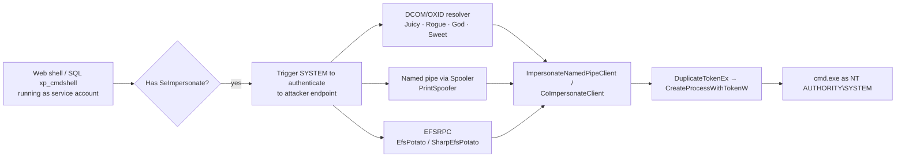

# 토큰 가장과 Potato 공격 { #token-impersonation-potato-attacks }

<div class="dfir-meta" markdown>
**MITRE ATT&CK:** T1134.001 (토큰 가장/탈취) · T1134.002 (토큰으로 프로세스 생성) · **전술:** 권한 상승 / 방어 회피 · **최종 수정:** 2026-10-07
</div>

!!! abstract "요약"
    모든 Windows 프로세스는 **액세스 토큰**을 갖고 실행됩니다. **`SeImpersonatePrivilege`**(또는 `SeAssignPrimaryTokenPrivilege`)를 가진 프로세스는 자기에게 접속한 어떤 클라이언트의 신원이든 가장할 수 있습니다. 서비스 계정 — IIS 앱 풀, MSSQL, `LOCAL SERVICE`, `NETWORK SERVICE` — 은 설계상 이 권한을 갖습니다. "**Potato**" 계열 익스플로잇은 **SYSTEM** 프로세스를 속여 공격자가 제어하는 엔드포인트(COM/DCOM, named pipe, RPC)에 접속하게 만들고, 그 SYSTEM 토큰을 가장합니다. 그래서 "`IIS APPPOOL\DefaultAppPool`로 웹 셸을 얻었다"는 거의 항상 1분 뒤 "SYSTEM이 됐다"로 바뀝니다.

## 공격 원리 { #how-the-attack-works }



고전적인 **토큰 탈취**(Mimikatz `token::elevate`, Meterpreter `incognito`)는 관리자 권한에서 같은 아이디어를 쓰는 것입니다: 다른 사용자 소유 프로세스(예: Domain Admin의 `explorer.exe`)를 열어 그 토큰을 복제합니다.

## 공격 도구 / 명령 { #attacker-tooling-commands }

```text
whoami /priv                 # look for SeImpersonatePrivilege  Enabled

PrintSpoofer64.exe -i -c cmd                 # 10 / 2016 / 2019, needs Spooler
JuicyPotato.exe -l 1337 -p cmd.exe -t * -c {CLSID}    # ≤ 10 1803 / 2016
GodPotato -cmd "cmd /c whoami"               # 2012 → 2022, 8 → 11
SweetPotato.exe / RoguePotato.exe / EfsPotato.exe

mimikatz  token::elevate /domainadmin
incognito list_tokens -u ; impersonate_token "CORP\\da_user"
```

## 영향받는 Windows 버전 { #affected-windows-versions }

| 변종 | 동작 버전 | 메모 |
|---|---|---|
| Hot / Rotten Potato | 7, 8, 10 (초기), 2008 R2 – 2016 | 로컬 WPAD/DCOM을 통한 NTLM 반사 — 대부분 패치됨 |
| **JuicyPotato** | 7 → 10 **1803**, 2008 R2 → 2016 | **10 1809 / Server 2019**의 DCOM 변경으로 막힘 |
| **RoguePotato** | 10 1809+, 2019 | 원격 OXID resolver 리디렉션 필요 (TCP 135 외부 통신) |
| **PrintSpoofer** | 8.1 → 11, 2012 R2 → 2022 | **Print Spooler** 실행 중이어야 함 |
| **GodPotato** | 8 → 11, 2012 → 2022 | DCOM RPCSS 악용; 요즘 널리 쓰임 |
| 토큰 탈취 (incognito / mimikatz) | XP → 11, 모든 Server | 이미 관리자/SYSTEM이어야 함; 대상 사용자가 로그온 중이어야 함 |
| **XP / 2003** | 서비스 계정이 흔히 **SYSTEM**으로 직접 실행 | Network Service/Local Service가 있었지만 많은 앱이 LocalSystem으로 실행 — Potato가 필요 없음 |

기본 권한 모델은 Windows 11 / Server 2025에서도 그대로입니다 — 옛 트리거가 막히면 새 변종이 나옵니다.

## 남는 흔적 { #artifacts-left-behind }

| 위치 | 아티팩트 | 찾을 것 |
|---|---|---|
| Sysmon 1 / 4688 | `ParentImage` = `w3wp.exe`, `sqlservr.exe`, `httpd.exe`, `tomcat*.exe`, `php-cgi.exe` → 자식 `cmd.exe` / `powershell.exe`이고 `User=NT AUTHORITY\SYSTEM` | 서비스 부모 아래에서 서비스 계정 → SYSTEM으로 뛰어오름 |
| Sysmon | `\pipe\*\pipe\spoolss` 같은 이름이나 무작위 GUID 파이프의 **17/18** (파이프 생성/연결) | PrintSpoofer와 파이프 기반 변종 |
| Security 로그 | 웹/SQL 프로세스 체인에 묶인 SYSTEM 세션의 **4672** (새 로그온에 특수 권한 할당) | 특권 토큰 사용 |
| Security 로그 | `SYSTEM`이나 컴퓨터 계정으로 `127.0.0.1` / `::1`에 대한 **4624 Type 3**, 뒤이어 프로세스 생성 | 로컬 NTLM 반사 (옛 Potato) |
| 파일 시스템 | IIS 웹 루트, `C:\ProgramData`, `C:\Users\Public`의 도구; [Prefetch](../windows/prefetch.md) / [Amcache](../windows/amcache.md) | Potato 바이너리는 작고 이름을 자주 바꿈 |
| IIS 로그 | 직전의 웹 셸 요청 | 최초 거점 — [웹 셸 플레이북](../playbooks/webshell-server.md) 참고 |

## 탐지 { #detection }

=== "Splunk — 서비스 부모가 SYSTEM 셸 실행"

    ```spl
    index=botsv3 sourcetype="XmlWinEventLog:Microsoft-Windows-Sysmon/Operational" EventID=1
    | eval parent=lower(replace(ParentImage,".*\\\\","")), child=lower(replace(Image,".*\\\\",""))
    | where parent IN ("w3wp.exe","sqlservr.exe","httpd.exe","php-cgi.exe","java.exe","tomcat9.exe")
       AND child IN ("cmd.exe","powershell.exe","pwsh.exe","whoami.exe","net.exe","rundll32.exe")
    | table _time, host, User, parent, child, CommandLine, ParentUser
    ```

    웹이나 DB 서버 프로세스 아래의 셸은 그것만으로 조사할 가치가 있습니다. 결정적 단서는 `ParentUser`가 앱 풀이나 SQL 서비스 계정인데 `User` = `NT AUTHORITY\SYSTEM`인 것입니다 — 일어나서는 안 되는 권한 점프입니다.

=== "Splunk — 의심스러운 named pipe"

    ```spl
    index=botsv3 sourcetype="XmlWinEventLog:Microsoft-Windows-Sysmon/Operational" EventID IN (17,18)
    | where match(PipeName,"(?i)\\\\pipe\\\\.+\\\\pipe\\\\|\\\\[0-9a-f]{8}-[0-9a-f]{4}-")
    | stats count by host, Image, PipeName
    ```

    Sysmon `17` = named pipe 생성, `18` = 파이프 연결. 경로에 두 번째 `\pipe\`가 들어 있으면 PrintSpoofer 기법입니다; Microsoft가 아닌 바이너리가 만든 GUID 이름 파이프는 여러 Potato 도구에서 공통으로 보입니다.

=== "헌팅 — 누가 권한을 갖고 있나"

    ```powershell
    # On a server: which services run as accounts with SeImpersonate?
    Get-CimInstance Win32_Service | Select Name, StartName, State | Sort StartName
    secedit /export /cfg C:\Temp\secpol.inf ; Select-String "SeImpersonatePrivilege" C:\Temp\secpol.inf
    ```

## 대응 { #response }

서버가 SYSTEM 수준으로 침해됐다고 보세요: SYSTEM이면 공격자가 LSASS와 컴퓨터 계정을 덤프할 수 있습니다. 거점(웹 셸, SQL 인젝션)을 찾아 제거하세요 — 거점을 고치지 않고 Potato만 막으면 다음 변종이 쓰일 뿐입니다.

### Windows 버전별 대응책 { #remediation-by-windows-version }

| 대응책 | 막는 것 | 적용 가능 버전 |
|---|---|---|
| **거점** 패치·강화 (웹 앱, SQL `xp_cmdshell` 비활성화) | 애초에 서비스 계정 셸을 얻는 것 | 모든 버전 |
| 서비스를 최소 권한의 **가상 계정 / gMSA**로 실행; 사용자 정의 서비스 계정에 `SeImpersonate` 부여 금지 | 그 권한을 가진 프로세스를 제한 | 가상 계정 7 / 2008 R2+; gMSA 2012+ |
| 인쇄하지 않는 서버에서 **Print Spooler 끄기** | PrintSpoofer 트리거 | 모든 버전 |
| OS 패치 유지 (DCOM 강화, 예: KB5004442 DCOM 인증 강화) | 옛 트리거 차단 | 지원 버전만 |
| ASR 규칙 *Block process creations originating from PSExec and WMI commands* / EDR 웹 셸 보호 | 서버 프로세스 아래 셸 생성 | 10 1709+ / Server 2019+ (Defender) |
| 서버에 WDAC | 서명 없는 Potato 바이너리 실행 불가 | 10 / 2016+ |

## 참고 자료 { #references }

- [MITRE ATT&CK — T1134](https://attack.mitre.org/techniques/T1134/)
- [itm4n — PrintSpoofer: abusing impersonation privileges](https://itm4n.github.io/printspoofer-abusing-impersonate-privileges/)
- 관련 페이지: [UAC 우회](uac-bypass.md) · [웹 셸 플레이북](../playbooks/webshell-server.md) · [PrintNightmare와 Spooler](printnightmare.md)
