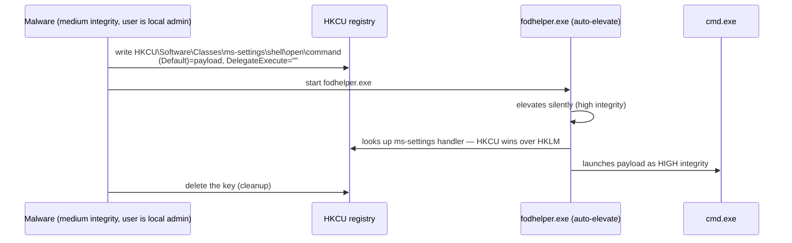

# UAC 우회 (UAC Bypass) { #uac-bypass }

<div class="dfir-meta" markdown>
**MITRE ATT&CK:** T1548.002 (권한 상승 제어 메커니즘 악용: 사용자 계정 컨트롤 우회) · **전술:** 권한 상승 / 방어 회피 · **최종 수정:** 2026-10-07
</div>

!!! abstract "요약"
    로컬 Administrators 그룹 구성원이 로그온하면(Vista 이후) Windows는 **필터링된 중간 무결성(medium-integrity) 토큰**을 줍니다; 무언가를 "관리자로" 실행하려면 UAC 프롬프트를 거쳐 **높은 무결성(high-integrity)** 토큰으로 바꿔야 합니다. 일부 서명된 Windows 바이너리는 **auto-elevate**로 표시돼 있어 기본 UAC 수준에서 프롬프트 없이 높은 토큰을 받습니다. UAC 우회는 이런 자동 상승 바이너리가 공격자의 명령을 실행하게 만드는 것으로, 보통 그 바이너리가 읽는 **사용자별(HKCU) 레지스트리 키**에 값을 심는 방식입니다. 결과: 프롬프트가 안 뜨는, 이미 관리자인 사용자에게서 관리자 수준 코드 실행. Microsoft는 UAC를 보안 경계로 보지 **않기** 때문에, 많은 우회 기법이 몇 년씩 패치되지 않고 남아 있습니다.

## 공격 원리 { #how-the-attack-works }



주요 계열: **레지스트리 핸들러 하이재킹**(fodhelper, computerdefaults, `mscfile`을 통한 eventvwr, sdclt), **환경 변수 / 경로 하이재킹**(SilentCleanup 같은 예약 작업의 `%windir%` 리디렉션), 자동 상승 바이너리의 **DLL 하이재킹**, **상승된 COM 인터페이스**(ICMLuaUtil). 오픈 소스 **UACME** 프로젝트가 70개 이상의 방법과 각각이 동작하는 Windows 빌드를 정리해 두었습니다.

## 공격 도구 / 명령 { #attacker-tooling-commands }

```text
# fodhelper (Windows 10/11) — what the registry write looks like
reg add HKCU\Software\Classes\ms-settings\shell\open\command /d "C:\Users\Public\p.exe" /f
reg add HKCU\Software\Classes\ms-settings\shell\open\command /v DelegateExecute /f
fodhelper.exe

# eventvwr (Windows 7 – early 10)
reg add HKCU\Software\Classes\mscfile\shell\open\command /d "cmd.exe" /f
eventvwr.exe

# Frameworks
UACME (Akagi64.exe <method#>) · Metasploit bypassuac_* · Cobalt Strike elevate uac-token-duplication
```

## 영향받는 Windows 버전 { #affected-windows-versions }

| 버전 | UAC 여부 | 메모 |
|---|---|---|
| **XP / 2003** | **UAC 없음** | 사용자가 보통 완전한 관리자로 실행 — 우회가 필요 없음; 권한 상승은 커널/서비스 익스플로잇을 사용 |
| **Vista / 2008** | 있음 — 하지만 모든 것에 프롬프트, 자동 상승 바이너리가 적음 | 우회가 덜 흔함 |
| **7 / 2008 R2** | 있음 — 자동 상승과 슬라이더 도입(기본값 "앱이 변경하려고 할 때만 알림") | eventvwr, sdclt, DLL 하이재킹 우회가 널리 쓰임 |
| **8.1 / 10** | 있음 | fodhelper (10+), computerdefaults, SilentCleanup 환경 변수 하이재킹; eventvwr는 10 1703에서 수정 |
| **11** | 있음 | 대부분의 레지스트리 하이재킹 방법이 기본 수준에서 여전히 동작. **Administrator protection**(Windows Hello 뒤의 just-in-time 관리자 토큰, 최근 11 빌드에 배포 중)이 켜진 곳에서는 자동 상승 모델이 깨짐 |
| **Server** | 있음, 하지만 기본 제공 Administrator(RID 500)는 기본적으로 예외 (`FilterAdministratorToken=0`) | 서버에서는 공격자가 이미 전체 토큰을 가진 경우가 많음 |

## 남는 흔적 { #artifacts-left-behind }

| 위치 | 아티팩트 | 찾을 것 |
|---|---|---|
| Sysmon | `HKCU\Software\Classes\<ms-settings, mscfile, exefile, Folder>\shell\open\command` 또는 `HKCU\Environment\windir` 아래 **12/13** (레지스트리 키 생성 / 값 설정) | 하이재킹 그 자체 — 정상인 경우가 거의 없음 |
| Sysmon / 4688 | **1** — `ParentImage`가 `fodhelper.exe`, `computerdefaults.exe`, `eventvwr.exe`, `sdclt.exe`, `wsreset.exe`, `slui.exe`, `changepk.exe`이고 자식이 셸/LOLBin/서명 없는 exe | 자동 상승 부모 아래에서 시작한 페이로드 |
| Sysmon 1 / 4688 | 부모 체인이 Medium에서 시작했는데 중간에 `consent.exe` 없이 `IntegrityLevel=High`인 프로세스 | 프롬프트 없는 상승 |
| 레지스트리 (오프라인) | [NTUSER.DAT](../windows/registry-keys.md) `Software\Classes\...\shell\open\command` — 값이 지워졌어도 키 **LastWrite 시간** | 타임라인 증거 |
| Security 로그 | 페이로드의 **4688** `Token_Elevation_Type` = `%%1937` (TokenElevationTypeFull) | Type 2 = 전체 토큰 |

## 탐지 { #detection }

=== "Splunk — 레지스트리 하이재킹"

    ```spl
    index=botsv3 sourcetype="XmlWinEventLog:Microsoft-Windows-Sysmon/Operational" EventID IN (12,13)
    | where match(TargetObject,"(?i)\\\\Software\\\\Classes\\\\(ms-settings|mscfile|exefile|folder|launcher\.systemsettings)\\\\shell\\\\open\\\\command|\\\\Environment\\\\windir")
    | table _time, host, User, Image, EventType, TargetObject, Details
    ```

    Sysmon `12` = 레지스트리 키 생성/삭제; `13` = 레지스트리 값 설정. `TargetObject`는 전체 키 경로, `Details`는 쓰인 값입니다. 정규식은 흔한 우회 기법들이 쓰는 핸들러 키와 `windir` 환경 변수 하이재킹을 다룹니다.

=== "Splunk — 자동 상승 부모 → 셸"

    ```spl
    index=botsv3 sourcetype="XmlWinEventLog:Microsoft-Windows-Sysmon/Operational" EventID=1
    | eval parent=lower(replace(ParentImage,".*\\\\",""))
    | where parent IN ("fodhelper.exe","computerdefaults.exe","eventvwr.exe","sdclt.exe","wsreset.exe","slui.exe","changepk.exe")
    | where NOT like(lower(Image),"%\\mmc.exe")
    | table _time, host, User, parent, Image, CommandLine, IntegrityLevel
    ```

    `replace(ParentImage,".*\\\\","")`는 폴더를 떼고 파일 이름만 남깁니다. `eventvwr.exe`는 원래 `mmc.exe`를 실행하므로 제외합니다; 이 바이너리들이 띄운 그 밖의 것은 모두 의심스럽습니다.

## 대응 { #response }

UAC 우회가 있었다는 것은 사용자 계정이 이미 로컬 관리자이고 공격자가 이제 높은 무결성을 가졌다는 뜻입니다 — 호스트를 완전히 침해된 것으로 보고 범위를 잡으세요(보통 자격 증명 덤프가 뒤따릅니다). 레지스트리 키를 지우고, 페이로드를 수집하고, 같은 사용자가 다른 컴퓨터에서도 관리자인지 확인합니다.

### Windows 버전별 대응책 { #remediation-by-windows-version }

| 대응책 | 막는 것 | 적용 가능 버전 |
|---|---|---|
| 사용자는 **로컬 관리자가 아님**; 관리자 계정 분리 | 모든 UAC 우회의 전제 조건 제거 | 모든 버전 (XP: 유일한 실질적 통제) |
| UAC 수준 **항상 알림** (`ConsentPromptBehaviorAdmin=2`) | 조용한 자동 상승을 끔 — 대부분의 레지스트리 하이재킹 우회 차단 | Vista+ (7+에 슬라이더) |
| *보안 데스크톱에서 자격 증명 요구* (`ConsentPromptBehaviorAdmin=1`) | 관리자가 비밀번호를 입력해야 함 — 더 강함 | Vista+ |
| `FilterAdministratorToken=1` (RID 500용 관리자 승인 모드) | 기본 제공 Administrator도 필터링된 토큰을 받음 | Vista+ (서버에서 중요) |
| **Administrator protection** | 격리된 just-in-time 관리자 토큰 | 켜져 있는 최근 Windows 11 빌드 |
| 사용자 쓰기 가능 경로에 WDAC / AppLocker | `%TEMP%` / `Public`의 페이로드는 상승돼도 실행 불가 | AppLocker 7 Ent+; WDAC 10+ |
| 위 키에 대한 Sysmon 레지스트리 모니터링 규칙 | 탐지 | 10 / 2012 R2+의 Sysmon (7은 이전 빌드) |

## 참고 자료 { #references }

- [MITRE ATT&CK — T1548.002](https://attack.mitre.org/techniques/T1548/002/)
- [UACME — catalogue of methods and fixed-in builds](https://github.com/hfiref0x/UACME)
- 관련 페이지: [토큰 가장과 Potato](token-impersonation-potato.md) · [레지스트리 키](../windows/registry-keys.md) · [Windows 이벤트 ID](../basics/windows-event-ids.md)
