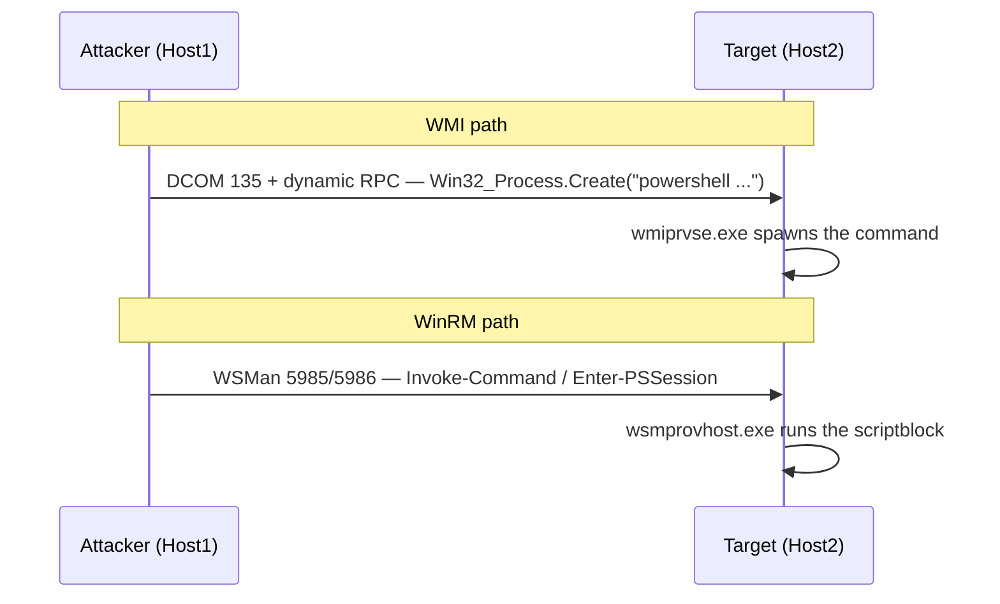

# WMI와 WinRM 실행 { #wmi-winrm-execution }

<div class="dfir-meta" markdown>
**MITRE ATT&CK:** T1047 (Windows Management Instrumentation) + T1021.006 (Windows Remote Management) · **전술:** 실행 / 횡적 이동 · **최종 수정:** 2026-09-17
</div>

!!! abstract "요약"
    WMI와 WinRM은 Windows에 내장된 원격 관리 채널입니다. **WMI**(DCOM 위, 포트 135 + 동적 RPC)를 쓰면 공격자가 `Win32_Process.Create`로 원격 호스트에 프로세스를 띄울 수 있습니다 — 바이너리를 떨어뜨리지 않고, 실행은 `wmiprvse.exe` 아래에 나타납니다. **WinRM/PowerShell Remoting**(HTTP **5985** / HTTPS **5986** 위의 WSMan)은 `wsmprovhost.exe` 아래에서 명령을 실행합니다. 둘 다 정상 관리 트래픽에 섞여 드는 "파일리스(fileless)" 횡적 이동입니다.

## 공격 원리 { #how-the-attack-works }



둘 다 ([PsExec](psexec-smb.md)와 달리) 서비스 바이너리를 떨어뜨리지 않으므로 파일 시스템 흔적이 적습니다 — 증거는 대상의 **부모 프로세스**와 인증/프로토콜 로그입니다.

## 공격 도구 / 명령 { #attacker-tooling-commands }

```text
# WMI
wmic /node:HOST2 /user:CORP\admin process call create "powershell -enc <b64>"
Invoke-WmiMethod -ComputerName HOST2 -Class Win32_Process -Name Create -ArgumentList "cmd /c ..."
wmiexec.py CORP/admin@10.0.0.5 -hashes :<hash>       # Impacket
# Cobalt Strike:  jump winrm / remote-exec wmi

# WinRM / PS Remoting
Invoke-Command -ComputerName HOST2 -ScriptBlock { whoami }
Enter-PSSession -ComputerName HOST2
evil-winrm -i 10.0.0.5 -u admin -H <hash>            # PtH over WinRM
```

## 남는 흔적 { #artifacts-left-behind }

| 위치 | 아티팩트 | 찾을 것 |
|---|---|---|
| **대상** Sysmon | `ParentImage = ...\wmiprvse.exe` (WMI) 또는 `...\wsmprovhost.exe` (WinRM)인 **1** | 이 부모들이 `cmd`/`powershell`/무엇이든 띄우면 = 원격 실행 |
| 대상 Security 로그 | **4624 Logon Type 3** (둘 다), 사용된 계정 | 들어오는 네트워크 로그온 |
| 대상 WinRM 채널 | `Microsoft-Windows-WinRM/Operational` **91** (세션 생성), **168** (인증 사용자) | WinRM 서버 쪽 |
| 대상 WMI 채널 | `Microsoft-Windows-WMI-Activity/Operational` **5857–5861** | WMI provider 로드 / 작업; **5861** = 새 **영구(permanent)** consumer (단순 실행이 아니라 지속성) |
| 대상 PowerShell | **4104** (script block), **400** (`HostApplication`이 포함된 엔진 시작) | 실제로 무엇이 실행됐는지 |
| 대상 호스트 | [Prefetch](../windows/prefetch.md) `WMIPRVSE.EXE`/`WSMPROVHOST.EXE`; 그 부모들이 붙은 **4688** | 실행 증거 |
| **출발지** 호스트 | **4648** (명시적 자격증명), `wmic.exe`/`Invoke-Command`에 대한 Sysmon 1, PowerShell 히스토리 | 출처 |
| 네트워크 | [Zeek `conn.log`](../network/zeek/conn-log.md) 내부→내부 `135`+동적 포트(WMI) 또는 `5985/5986`(WinRM); `IWbemServices`에 대한 [`dce_rpc.log`](../network/zeek/index.md); WinRM은 5985/5986에서 `http`/`ssl`로 보임 | 프로토콜 흔적 |

!!! warning "wmiprvse/wsmprovhost는 정상입니다 — 단서는 자식 프로세스입니다"
    `wmiprvse.exe`와 `wsmprovhost.exe`는 항상 정상적으로 실행됩니다. 이상한 것은 이들이 **띄우는** 것입니다: 대화형 셸, 인코딩된 PowerShell, 탐색 명령(`whoami`, `net`, `nltest`), 또는 디스크에 무언가를 쓰는 모든 것. 정상적인 WMI/WinRM 부모-자식 관계의 기준선을 잡아 두면 이런 것들이 눈에 띕니다.

## 탐지 { #detection }

=== "Splunk — 부모 프로세스로 원격 실행 찾기"

    ```spl
    index=botsv3 sourcetype="XmlWinEventLog:Microsoft-Windows-Sysmon/Operational" EventID=1
        (ParentImage="*\\wmiprvse.exe" OR ParentImage="*\\wsmprovhost.exe")
    | eval method=if(match(ParentImage,"wmiprvse"),"WMI","WinRM")
    | table _time, host, method, User, ParentImage, Image, CommandLine
    | sort 0 _time
    ```

    Sysmon `1` = 프로세스 생성. 두 원격 관리 부모로 필터링하면 대상에서 WMI나 WinRM으로 실행된 모든 프로세스가 드러나고, `method`가 어느 채널인지 표시합니다. 깨끗한 환경에서는 대부분이 정상 관리 도구이므로 `Image`/`CommandLine`을 읽고 셸, 인코딩된 PowerShell, 탐색 명령을 표시하세요.

=== "Splunk — WMI 지속성 (이벤트 consumer)"

    ```spl
    index=botsv3 (sourcetype="XmlWinEventLog:Microsoft-Windows-Sysmon/Operational" EventID IN (19,20,21))
    | eval kind=case(EventID==19,"WMI Filter",EventID==20,"WMI Consumer",EventID==21,"WMI Binding")
    | table _time, host, kind, User, Operation, EventNamespace, Name, Query, Destination
    | sort 0 _time
    ```

    Sysmon `19`(이벤트 filter), `20`(이벤트 consumer), `21`(filter-consumer 바인딩)이 함께 나타나면 고전적인 **파일리스 WMI 지속성**입니다 — 필터(예: "시스템 시작 시")가 스크립트를 실행하는 consumer에 바인딩된 구조입니다. 변경 작업 시간대 밖의 `20`/`21`은 모두 자세히 살펴볼 가치가 있습니다.

=== "Zeek — 네트워크상의 WinRM과 WMI"

    ```bash
    # WinRM (5985/5986) internal->internal
    zeek-cut -d ts id.orig_h id.resp_h id.resp_p service < conn.log | awk '($4==5985 || $4==5986) && $2 ~ /^10\./ && $3 ~ /^10\./'
    # WMI: DCE-RPC IWbemServices
    zeek-cut -d ts id.orig_h id.resp_h operation < dce_rpc.log | grep -iE 'IWbemServices|ExecMethod'
    ```

    WinRM은 5985/5986의 HTTP(S)이므로 내부→내부 통신을 쉽게 찾을 수 있습니다. WMI는 DCOM/RPC를 타므로, `dce_rpc.log`가 `Win32_Process.Create`를 뒷받침하는 `IWbemServices`/`ExecMethod` 작업을 기록합니다.

## 대응 { #response }

대상을 격리하고, 사용된 계정을 교체하고, 그 계정이 type 3 로그온을 한 모든 호스트를 헌팅하세요. 떨어뜨린 바이너리가 없으므로 오래 남는 증거는 **부모 프로세스** 관계와 WinRM/WMI 운영 로그입니다 — 이것들과 PowerShell 4104를 수집하세요. Sysmon 19/20/21에 WMI 지속성이 보이면 filter/consumer/바인딩을 제거하고(`Get-WmiObject -Namespace root\subscription -Class __EventFilter` 등) 다른 호스트에도 같은 구독이 있는지 확인하세요. 강화: WinRM을 관리 서브넷과 점프 호스트로 제한하고, 전사적으로 PowerShell script-block 로깅을 켜고, WMI 구독 및 의심스러운 부모 프로세스 규칙을 갖춘 Sysmon을 배포하고, 필요 없는 곳에서는 WMI/WinRM을 끄고, 관리자 계정을 계층화하세요.

## 참고 자료 { #references }

- [MITRE ATT&CK — T1047](https://attack.mitre.org/techniques/T1047/) · [T1021.006](https://attack.mitre.org/techniques/T1021/006/)
- [Mandiant — WMI for detection and response](https://www.mandiant.com/resources/blog)
- 관련 페이지: [PsExec와 SMB](psexec-smb.md) · [PowerShell 크래들](powershell-cradles.md) · [Windows 이벤트 ID](../basics/windows-event-ids.md) · [보안 검색](../splunk/security-searches.md)
