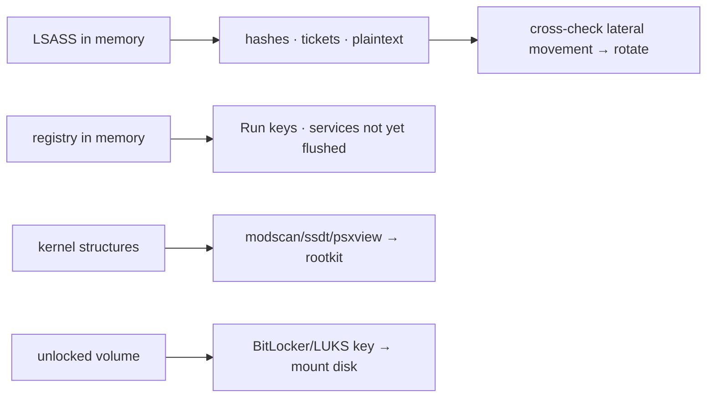

# 메모리 속 자격증명, 레지스트리, 루트킷 { #credentials-registry-rootkits-in-memory }

<div class="dfir-meta" markdown>
**분류:** 메모리 포렌식 · **최종 수정:** 2026-09-17
</div>

!!! abstract "한 줄 요약"
    RAM에는 디스크에 없거나 있을 수 없는 것이 있습니다: 공격자가 노린 **LSASS 안의 비밀**, **실행 중이던 그대로의 레지스트리**(아직 기록되지 않은 키 포함), 볼륨이 잠금 해제된 동안의 **BitLocker/LUKS 키**, 그리고 루트킷이 변조한 **커널 구조**. 모두 메모리 이미지에서 복구할 수 있습니다.

## 메모리 속 자격증명 { #credentials-in-memory }

자격증명 탈취가 일어나는 곳([LSASS 덤프](../adversary/lsass-dumping.md))이자 비밀이 머무는 곳이 메모리입니다:

```bash
vol -f mem.raw windows.hashdump                   # local SAM account NT hashes
vol -f mem.raw windows.lsadump                     # LSA secrets (service account passwords, DPAPI keys, cached creds)
vol -f mem.raw windows.cachedump                   # cached domain credentials (MSCACHE)
```

- **`hashdump`**는 메모리의 SAM+SYSTEM 하이브에서 로컬 계정 NT 해시를 꺼냅니다 — [Pass-the-Hash](../adversary/pass-the-hash.md) 분석에 쓰이고, 이 이미지를 덤프한 공격자가 무엇을 재사용할 수 있었는지 보여 줍니다.
- **`lsadump`**는 LSA 시크릿을 복구합니다: 서비스 계정 평문 비밀번호, 머신 계정, DPAPI 마스터 키, 자동 로그온 비밀번호.
- **`cachedump`**는 캐시된 도메인 로그온(DC에 닿지 못할 때 쓰는 해시)을 가져옵니다 — 오프라인 크래킹 가능.

플러그인 외에도, LSASS 프로세스 메모리 자체(`memmap --pid <lsass> --dump`)를 **Mimikatz**(`sekurlsa::minidump`)나 **pypykatz**로 가져가서 Kerberos 티켓, WDigest 평문(켜져 있다면) 등을 꺼낼 수 있습니다 — 공격자의 [LSASS 덤프](../adversary/lsass-dumping.md)가 얻는 것과 같은 재료입니다.

```bash
# Extract LSASS and parse offline with pypykatz (no Mimikatz needed)
vol -f mem.raw windows.memmap --pid <lsass_pid> --dump --output-dir ./lsass
pypykatz lsa minidump ./lsass/*.dmp
```

!!! tip "누구의 자격증명이고, 사용됐나?"
    여기서 복구할 수 있는 것은 이 시스템을 이미징(또는 덤프)한 공격자도 얻었습니다. 출력에 나온 모든 자격증명을 유출된 것으로 취급하고, [횡적 이동](../adversary/pass-the-hash.md)과 대조해 재사용됐는지 확인한 뒤 교체하세요 — [도메인 침해 플레이북](../playbooks/lateral-domain.md) 참고.

## 실행 중인 레지스트리 { #the-registry-live }

메모리 속 레지스트리는 **실행 중인** 상태를 반영합니다 — 써졌지만 아직 디스크 하이브에 기록되지 않은 값, 디스크에 절대 기록되지 않는 휘발성 키까지 포함합니다:

```bash
vol -f mem.raw windows.registry.hivelist                          # hives mapped in memory + their offsets
vol -f mem.raw windows.registry.printkey --key "Software\\Microsoft\\Windows\\CurrentVersion\\Run"
vol -f mem.raw windows.registry.printkey --offset 0x... --key "..."   # target a specific hive
vol -f mem.raw windows.registry.userassist                        # UserAssist (GUI program execution) from memory
```

메모리가 디스크 하이브보다 나을 때가 있는 이유: 이미징 직전에 공격자가 설정한 값은 메모리에만 있을 수 있고(아직 기록 안 됨), `CurrentControlSet`이 올바르게 해석되며(라이브 심볼릭 링크이므로), 휘발성 키(`HKLM\SYSTEM\CurrentControlSet\Control\...` 런타임 상태, 일부 악성코드 설정)는 여기에만 있습니다. 디스크 [레지스트리 분석](../windows/registry-keys.md)과 대조하세요.

## 디스크 암호화 키 { #disk-encryption-keys }

BitLocker/LUKS/FileVault 볼륨이 **마운트된** 동안 키는 RAM에 있습니다. 잠금 해제된 라이브 머신에서 뜬 메모리 이미지로 키를 얻을 수 있습니다 — 그래서 암호화된 호스트는 [전원을 끄기 전에 RAM을 이미징](../tools/imaging-collection.md)해야 합니다:

- **BitLocker**: `Elcomsoft Forensic Disk Decryptor`나 `bulk_extractor` 같은 도구로 메모리 이미지에서 FVEK를 카빙할 수 있고, Volatility 커뮤니티 플러그인도 있습니다.
- **LUKS**: 마스터 키가 RAM의 커널 키링 / dm-crypt 구조에 있습니다.
- 키를 얻으면 디스크 이미지를 마운트해 전체 분석을 하세요. 키가 없으면 전원이 꺼진 암호화 디스크는 그냥 암호문입니다.

## 루트킷과 커널 변조 { #rootkits-kernel-tampering }

모든 유저랜드 도구로부터 숨는 커널 수준 조작을 잡는 곳이 메모리입니다:

```bash
vol -f mem.raw windows.modscan                    # scan for kernel modules (finds UNLINKED = hidden driver)
vol -f mem.raw windows.ssdt                         # System Service Descriptor Table — hooks = tampering
vol -f mem.raw windows.driverirp                    # driver IRP hooks
vol -f mem.raw windows.callbacks                    # kernel callbacks (some rootkits register here)
vol -f mem.raw windows.psxview                       # cross-view: process visible to some sources, hidden from others
```

- **`modscan` vs `modules`**: 스캔에는 있고 목록에는 없는 드라이버는 연결이 끊긴 것(DKOM) — 숨겨진 루트킷 드라이버.
- **`ssdt`**: 알려진 모듈 밖을 가리키는 항목 = 루트킷이 가로채고 숨기려고 쓰는 전형적인 시스템 콜 훅.
- **`psxview`**: 각 프로세스를 여러 열거 방법(pslist, psscan, 스레드 스캔, 핸들 테이블 등)으로 나열합니다. **어떤 열에는 보이고 다른 열에는 숨겨진** 프로세스는 적극적으로 숨겨지고 있는 것 — 강한 루트킷/은닉 신호입니다.

## 종합하기 { #bringing-it-together }



메모리는 "어떤 비밀이 노출됐고, 어떤 설정이 실행 중이었고, 커널 수준에서 뭔가 숨고 있나" — 디스크 포렌식이 답하지 못하는 질문 — 에 답합니다. 그다음 모든 것을 다시 연결하세요: 자격증명 → [횡적 이동](../adversary/pass-the-hash.md), 레지스트리 → [지속성](../adversary/persistence.md), 키 → 디스크 이미지, 루트킷 → 디스크의 드라이버 파일.

## 참고 자료 { #references }

- [Volatility 3 — registry, hashdump, lsadump, modscan, ssdt, psxview](https://volatility3.readthedocs.io/en/latest/volatility3.plugins.html)
- [pypykatz (parse LSASS offline)](https://github.com/skelsec/pypykatz)
- [The Art of Memory Forensics](https://www.memoryanalysis.net/amf)
- 관련 페이지: [LSASS 덤프](../adversary/lsass-dumping.md) · [Pass-the-Hash](../adversary/pass-the-hash.md) · [레지스트리 키](../windows/registry-keys.md) · [도메인 침해 플레이북](../playbooks/lateral-domain.md) · [이미징](../tools/imaging-collection.md)
