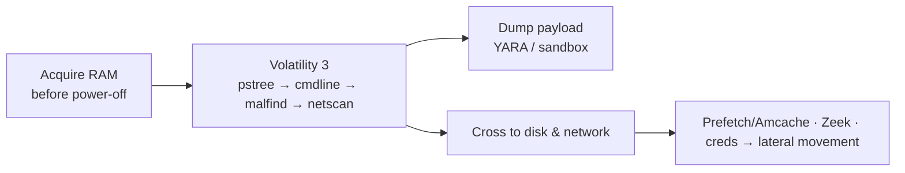

# 메모리 포렌식 { #memory-forensics }

Volatility 3로 휘발성 메모리를 수집하고 분석합니다. 메모리는 디스크와 로그가 답하지 못하는 것 — 파일리스 코드와 주입된 코드를 포함해 **실행 중이던** 것 — 을 알려 주지만, 수집한 그 순간에 대해서만이므로 타임라인을 대체하는 게 아니라 보완합니다.

## 왜 메모리인가 { #why-memory }

| 메모리만 확실하게 보여 주는 것… | 이유 |
|---|---|
| **파일리스 / 주입된 악성코드** | 디스크에 닿은 적이 없음 — 정상 프로세스의 메모리 안에 존재 ([인젝션](processes-injection.md)) |
| 숨겨진 것을 포함한 **실제 실행 중인 프로세스** | `psscan`/`psxview`는 루트킷이 연결을 끊은 목록도 뚫어 봄 |
| **프로세스가 실행한 것** (전체 명령줄, 디코딩됨) | `cmdline`이 인코딩된 PowerShell, C2 URL을 복구 |
| 닫히거나 숨겨진 것을 포함한 **라이브 네트워크 연결** | `netscan`이 RAM에서 카빙 |
| **LSASS 안의 자격증명** | NT 해시, Kerberos 티켓, 평문 ([자격증명](credentials-registry.md)) |
| **디스크 암호화 키** | 볼륨이 잠금 해제된 동안 RAM에 있음 — 전원을 끄기 전에 이미징 |
| **커널 루트킷 변조** | SSDT 훅, 연결이 끊긴 드라이버 — 유저랜드에서는 안 보임 |
| **아직 디스크에 기록되지 않은 레지스트리** | 수집 직전에 쓰인 값 |

## 질문 → 페이지 { #question-page }

| 질문 | 페이지 |
|---|---|
| Volatility 3를 어떻게 돌리고, 어떤 플러그인을 무엇에 쓰나? | [Volatility 3 워크플로](volatility-workflow.md) |
| 주입된 / 파일리스 / 할로잉된 코드가 있나? 어느 프로세스가 악성인가? | [프로세스와 인젝션](processes-injection.md) |
| 어떤 자격증명이 노출됐나? 라이브 레지스트리에 무엇이 있었나? 루트킷이 있나? | [자격증명, 레지스트리, 루트킷](credentials-registry.md) |
| 애초에 RAM은 어떻게 수집하나? | [이미징과 수집](../tools/imaging-collection.md) |

## 페이지 { #pages }

-   **[Volatility 3 워크플로](volatility-workflow.md)** — 설치, 심볼, 질문별 플러그인 순서, 결과 읽기
-   **[프로세스와 인젝션](processes-injection.md)** — 프로세스 트리 이상, `malfind`, 할로잉, 인젝션 단서
-   **[자격증명, 레지스트리, 루트킷](credentials-registry.md)** — hashdump/lsadump, 라이브 레지스트리, 암호화 키, 커널 변조

## 조사에서의 위치 { #where-it-sits-in-the-investigation }

RAM을 먼저 수집하고(가장 휘발성이 큰 증거이자 위 항목들의 유일한 출처), [Volatility 워크플로](volatility-workflow.md)를 진행한 뒤, 모든 발견을 디스크 아티팩트([Windows](../windows/index.md)), 네트워크([Zeek/Arkime](../network/index.md)), 그리고 그것을 만들어 낸 [공격 기법](../adversary/index.md)으로 다시 연결하세요. 암호화된 디스크가 잠금 해제된 상태라면 RAM 이미지가 키를 얻을 유일한 기회이기도 합니다.

!!! info "이 섹션에 페이지 추가하기"
    `python new.py memory/<name> -t concept` — 사이드바에 자동으로 나타납니다.
