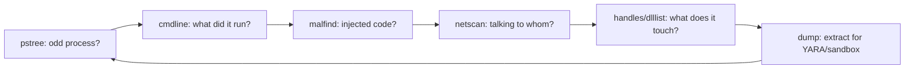

# Volatility 3 워크플로 { #volatility-3-workflow }

<div class="dfir-meta" markdown>
**분류:** 메모리 포렌식 · **도구:** Volatility 3 · **최종 수정:** 2026-09-17
</div>

!!! abstract "한 줄 요약"
    Volatility 3는 RAM 이미지를 실행 중이던 시스템이 갖고 있던 OS 구조로 파싱합니다 — 프로세스, 네트워크 연결, 로드된 모듈, 주입된 코드, 메모리의 레지스트리 하이브, 자격증명. *실행 중이던* 것을 보기 때문에(디스크에 닿지 않은 파일리스 악성코드 포함) **디스크 아티팩트로는 답할 수 없는** 질문에 답합니다. 이 페이지는 질문별 플러그인 워크플로이고, [수집](../tools/imaging-collection.md)이 먼저입니다.

## 설치 { #setup }

```bash
pip install volatility3          # or: git clone + pip install -e .
vol -h                            # 'vol' or 'python3 vol.py'

# Volatility 3 auto-detects the OS and builds symbols on the fly (no --profile like v2)
vol -f mem.raw windows.info      # confirm it reads the image + OS build
vol -f mem.raw banners.Banners   # Linux/Mac: find the kernel banner → get matching ISF symbols
```

Volatility 3에는 v2의 프로필이 없습니다 — OS를 자동으로 식별하고 심볼 테이블(ISF)을 내려받거나 만듭니다. **Linux/macOS**는 보통 맞는 심볼 테이블이 필요합니다: `banners.Banners`로 커널 배너를 얻고, 올바른 ISF JSON을 심볼 경로에 넣으세요(또는 `dwarf2json`으로 만드세요).

## 워크플로 — 질문별 플러그인 { #the-workflow-plugin-by-question }

대략 이 순서로 실행하세요. 각 답이 다음 단계로 이어집니다.

### 1. 방향 잡기 { #1-orient }

```bash
vol -f mem.raw windows.info                    # OS, build, arch, time the image was taken
vol -f mem.raw windows.pslist                  # processes from the linked list (EPROCESS)
vol -f mem.raw windows.pstree                   # the same, as a parent/child tree — read this
```

읽기는 `pstree`에서 시작합니다: [수상한 부모→자식 쌍](../adversary/phishing-delivery.md) (Office→셸, `services.exe`→이상한 자식), 부모가 없는 프로세스, 중복된 `lsass`/`svchost`를 찾으세요.

### 2. 숨겨진 프로세스 찾기 { #2-find-hidden-processes }

```bash
vol -f mem.raw windows.psscan                   # scans memory for EPROCESS signatures — finds UNLINKED (hidden) procs
# Compare pslist vs psscan: anything in psscan but NOT pslist was hidden (DKOM rootkit / terminated)
```

`pslist`는 OS 자체의 프로세스 목록을 따라가고(루트킷이 연결을 끊어 숨길 수 있음), `psscan`은 목록과 상관없이 원시 메모리에서 프로세스 객체를 카빙합니다. `psscan`에는 있고 `pslist`에는 없는 프로세스는 **숨겨졌거나** 최근에 종료된 것 — 둘 다 볼 가치가 있습니다.

### 3. 명령줄과 핸들 { #3-command-lines-handles }

```bash
vol -f mem.raw windows.cmdline                  # full command line per process — the "what ran" gold
vol -f mem.raw windows.dlllist --pid 1234       # DLLs loaded by a process
vol -f mem.raw windows.handles --pid 1234       # files, keys, mutexes it holds (mutex = malware family marker)
vol -f mem.raw windows.getsids --pid 1234       # which user/SID it runs as
```

`cmdline`은 디스크 아티팩트가 단서만 주는 인코딩된 PowerShell, C2 URL, 도구 인수를 복구해 주는 경우가 많습니다.

### 4. 인젝션과 악성 코드 { #4-injection-malicious-code }

```bash
vol -f mem.raw windows.malfind                  # regions of memory that are RWX / private+executable with no backing file
vol -f mem.raw windows.malfind --dump           # dump those regions for YARA / disassembly
vol -f mem.raw windows.hollowprocesses          # process hollowing detection (image mismatch)
vol -f mem.raw windows.ldrmodules               # DLLs in memory NOT in the 3 PEB load lists (unlinked/injected)
```

`malfind`는 [코드 인젝션](processes-injection.md)의 주력 도구입니다: 정상적으로 로드된 모듈이 아닌 실행 가능 메모리(셸코드, 리플렉티브 로딩된 페이로드, Cobalt Strike 비콘)를 찾습니다. 출력 읽는 법은 인젝션 페이지를 보세요.

### 5. 네트워크 { #5-network }

```bash
vol -f mem.raw windows.netscan                  # TCP/UDP endpoints + owning PID (even closed/hidden ones)
vol -f mem.raw windows.netstat                  # active connections
```

`netscan`은 라이브 `netstat`이 놓쳤거나 이미 닫힌 연결을 복구합니다 — 목적지 IP는 [비코닝/C2](../network/beaconing-c2.md)로, 소유 PID는 다시 `pstree`로 피벗하세요.

### 6. 지속성과 모듈 { #6-persistence-modules }

```bash
vol -f mem.raw windows.svcscan                  # services (incl. hidden) with binary paths
vol -f mem.raw windows.modules                   # loaded kernel modules (list)
vol -f mem.raw windows.modscan                    # scan for modules (finds unlinked = rootkit)
vol -f mem.raw windows.ssdt                       # SSDT hooks (kernel rootkit tampering)
vol -f mem.raw windows.registry.printkey --key "Software\\Microsoft\\Windows\\CurrentVersion\\Run"
```

### 7. 자격증명과 레지스트리 { #7-credentials-registry }

```bash
vol -f mem.raw windows.registry.hivelist          # registry hives mapped in memory
vol -f mem.raw windows.hashdump                   # SAM local account NT hashes
vol -f mem.raw windows.lsadump                     # LSA secrets
vol -f mem.raw windows.cachedump                   # cached domain creds
```

[자격증명과 레지스트리](credentials-registry.md)를 보세요 — Mimikatz 류의 비밀과 잠금 해제된 디스크 키는 메모리에 있습니다.

### 8. 더 깊은 분석을 위한 추출 { #8-extract-for-deeper-analysis }

```bash
vol -f mem.raw windows.dumpfiles --pid 1234        # cached files from a process's memory
vol -f mem.raw windows.pslist --dump               # dump process executables
vol -f mem.raw windows.memmap --pid 1234 --dump     # full address space of a process
# Then: strings, YARA, upload the dumped payload to a sandbox / VT
```

## 결과 읽기 — 반복 루프 { #reading-the-results-the-loop }



`pstree`의 수상한 프로세스 하나에 기준을 두고, 그 명령줄, 주입된 영역, 네트워크, 핸들을 차례로 보고, 마지막으로 덤프하세요. 디스크 아티팩트로 넘어가기: PID의 이미지 경로 → [Prefetch/Amcache](../windows/prefetch.md), 네트워크 IP → [Zeek](../network/index.md), 자격증명 → [횡적 이동](../adversary/pass-the-hash.md).

## 주의할 점 { #gotchas }

- **Linux/macOS 심볼**: ISF가 없으면 분석도 없습니다. 배너를 얻고 심볼 테이블부터 맞추거나 만드세요.
- **수집 품질**: 번진(smeared) 이미지(시스템이 매우 바쁠 때 떴거나 나쁜 도구로 뜬 것)는 구조가 일관되지 않습니다 — pslist/psscan이 엉뚱한 이유로 크게 어긋납니다. 믿을 만한 [수집 도구](../tools/imaging-collection.md)를 쓰고 페이지 파일도 가져오세요.
- **시간**: `windows.info`가 이미지 시각을 알려 주고, 프로세스 타임스탬프는 UTC입니다.
- **v2와 v3는 플러그인 이름이 다릅니다**: v3는 `windows.pslist.PsList` 형태입니다(짧은 `windows.pslist`도 동작). `--profile`과 `pslist`를 쓰는 오래된 블로그 글은 Volatility **2**입니다.
- 메모리는 수집한 순간만 보여 줍니다 — 디스크/로그 타임라인을 대체하는 게 아니라 보완합니다.

## 참고 자료 { #references }

- [Volatility 3 documentation](https://volatility3.readthedocs.io/)
- [Volatility 3 plugin list](https://volatility3.readthedocs.io/en/latest/volatility3.plugins.html)
- [dwarf2json (build Linux/Mac symbols)](https://github.com/volatilityfoundation/dwarf2json)
- 관련 페이지: [이미징과 수집](../tools/imaging-collection.md) · [프로세스와 인젝션](processes-injection.md) · [자격증명과 레지스트리](credentials-registry.md)
