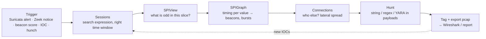

# Arkime로 침입 탐지 { #intrusion-detection-with-arkime }

**분류:** 헌팅 워크플로 · **도구:** Arkime + Suricata + WISE · **최종 수정:** 2026-09-16

!!! abstract "한 줄 요약"
    Arkime는 시그니처 엔진이 아닙니다 — 경보, Zeek 이상 징후, 또는 직감이 **증거**가 되는 곳입니다: 세션을 찾고, 같은 대상과 또 누가 통신했는지 보고, 증명할 문자열을 페이로드에서 검색하고, pcap을 내려받습니다. 이 페이지는 그 일을 반복 가능하게 해 주는 워크플로 모음이고, Suricata와 WISE를 연결해서 탐지와 회수를 한 화면에서 하는 방법도 다룹니다.

## 핵심 루프 { #the-core-loop }

모든 단계는 같은 **검색식**을 좁히거나 넓힙니다 — 진행하면서 메모 파일에 적어 두세요. 최종 검색식이 *곧* 증거 쿼리입니다.

## 워크플로 1 — Suricata 경보에서 증거까지 { #workflow-1-from-a-suricata-alert-to-proof }

**suricata viewer 플러그인**은 Suricata 경보를 Arkime 세션에 써 넣을 수 있습니다(`eve.json`을 읽고 5-튜플 + 시각으로 맞춘 뒤 `suricata.*` 필드를 추가). 그다음:

1. **경보가 붙은 세션 찾기**: `suricata.severity == 1 && ip.src == 10.0.0.0/8` (또는 `suricata.signature == "*ET MALWARE*"`). 시간 범위를 경보 주변으로 설정.
2. **세션 열기** → 펼치기 → 디코딩된 페이로드 읽기. HTTP는 요청/응답이, TLS는 핸드셰이크(SNI, 인증서, JA3)가 보입니다. 판단: 진짜 양성인가?
3. **넓히기**: 목적지 IP 우클릭 → `ip.dst == X`, 시간 범위를 일주일로. 다른 호스트도 통신했나? 언제 시작됐나?
4. **같은 호스트의 다른 트래픽**을 경보 직전과 직후에 확인: ±10분 범위의 `ip.src == <피해 호스트>`. DNS 쿼리, 다운로드, 후속 비콘을 찾으세요.
5. 세션에 **태그** 달기 (`Actions → Add Tags`, 예: `inc-2026-0916-c2`) — 나중에 모두가 찾을 수 있게. 그리고 보고서용으로 **Export PCAP**.

!!! tip
    오탐이 많은 규칙은 SPIView에서 바로 보입니다: 내부 → 내부 트래픽에 수백 건씩 걸린 `suricata.signature` 상위 값들. 개수로 정렬하고 꼬리 쪽을 보세요 — 진짜는 드문 시그니처에 숨어 있습니다.

## 워크플로 2 — SPIGraph로 비콘 헌팅 { #workflow-2-beacon-hunting-with-spigraph }

1. 검색식: 내부 → 외부, 흔한 C2 포트, 허용 목록 제외:
   `ip.src == 10.0.0.0/8 && ip.dst != 10.0.0.0/8 && port.dst == [443, 80, 8443, 8080] && ip.dst != $known_saas`
2. **SPIGraph → 필드 `ip.dst`** (또는 `host.tls`, `host.http`), 시간 범위 24시간, **구간 1–5분**. 각 행은 목적지 하나와 그 작은 타임라인입니다. **빗살무늬** — 밤낮없이 같은 높이로 고르게 늘어선 막대 — 가 비콘이고, 웹 브라우징은 업무 시간에 뭉친 덩어리처럼 보입니다.
3. 빗살무늬를 클릭 → `ip.dst == X`가 됩니다. 이제 **SPIView**: `ip.src`가 몇 개인지(한 호스트 = 수상, 500대 = SaaS), `tls.ja3`(지문 하나), `cert.issuer.cn`(자체 서명? 막 발급된 Let's Encrypt?), `http.user-agent`, `databytes.src`/`.dst` 분포(일정하게 작은 크기 = 대기 중 체크인).
4. 시간순 정렬한 **Sessions**: 간격을 직접 읽으세요(Arkime는 시작 시각을 보여 줌; 60초 ± 지터로 일정). 긴 연결 하나라면 `session.segments`/`rootId`를 쓰세요.
5. [Zeek 간격 분석 / RITA](../beaconing-c2.md)로 뒷받침한 뒤 호스트로 가세요 (Sysmon 3 → 프로세스).

브라우저처럼 보여도 임플란트를 드러내는 필드: `http.request.header` (`accept-language`/`referer` 없음), 전사에서 다른 누구도 공유하지 않는 `tls.ja3`, 아주 짧은 `cert.validfor`, 443에서 `host.tls != EXISTS!`, Win11 환경에서 "Windows 6.1의 MSIE 7/9" 계열 `http.user-agent`.

## 워크플로 3 — Connections로 횡적 이동 보기 { #workflow-3-lateral-movement-with-connections }

1. 검색식: 사고 시간대의 `ip.src == 10.0.0.0/8 && ip.dst == 10.0.0.0/8 && port.dst == [445, 135, 139, 3389, 5985, 5986, 22]`.
2. **Connections** 보기, 출발 `ip.src`, 목적 `ip.dst`, 세션 수로 가중치. **별 모양**(한 호스트가 수십 대로 퍼짐) = 관리용 점프 박스 *또는* 공격자의 피벗; **사슬 모양**(몇 시간에 걸친 A→B→C→D) = 사람이 직접 조작하는 이동.
3. 목적 필드를 `smb.user`나 `krb5.cname`으로 바꾸면 → *어떤 계정*이 이동했는지. 한 계정이 많은 호스트를 건드림 = 탈취된 자격증명; 서비스 계정이 워크스테이션에서 대화형으로 쓰임 = 오용.
4. 파고들기: `protocols == smb && smb.fn == [*.exe, *.dll, *.ps1, *PSEXESVC*] && smb.share == *ADMIN$*` → 도구 스테이징; 바로 뒤의 `protocols == dcerpc && ip.dst == <대상>` → 서비스 생성 (pcap을 내보내 Wireshark `svcctl.opnum == 12`). `port.dst == 5985` → WinRM; `port.dst == 3389 && session.length > 600000` → `4624 type 10`과 짝지어 볼 만한 RDP 세션.
5. 경로에 태그를 달고, 호스트 목록을 엔드포인트 팀에 넘기세요 (`psexesvc`/`wsmprovhost`의 [Prefetch](../../windows/prefetch.md), `7045`, `4624 type 3`).

## 워크플로 4 — Hunt: 페이로드에서 문자열 검색 { #workflow-4-hunt-searching-payloads-for-a-string }

Hunt는 SPI가 아니라 일치하는 세션의 **패킷 안**을 검색합니다. Arkime가 색인하지 않는 것에 쓰세요: 명령 문자열, 웹셸 파라미터, 바이너리 안의 호스트명, YARA 규칙.

1. **Hunt** 탭 → *Create a Hunt*. 이름 붙이기(`hunt-webshell-cmd`). **검색식**(`protocols == http && ip.dst == <웹서버>`)과 **시간 범위**로 범위를 정하세요 — 범위가 좁으면 몇 시간이 몇 분으로 줄어듭니다.
2. 유형 선택: **ASCII**(대소문자 무시 옵션), **hex**, **regex**, **YARA**(규칙 붙여 넣기). 페이로드 방향 **src / dst / both** 선택. 앞부분만 필요하면 세션당 패킷 수를 제한하세요.
3. 실행. 일치한 것은 **태그**가 붙고(`huntId:<name>`) 목록으로 나오며, Hunt에서 바로 세션을 열 수 있습니다.
4. 흔한 Hunt: `cmd.exe /c`, `powershell -enc`, `whoami`, `net user`, `mimikatz`, `IEX(`, `FromBase64String`, 유출된 API 키나 호스트명, 실행 파일이 아닌 URI의 HTTP 응답 본문 속 `MZ`, `PSEXESVC`, 알려진 C2 URI 패턴, 비콘 설정용 YARA.
5. Hunt는 무겁습니다 — 디스크에서 pcap을 읽습니다. 좁힌 검색식으로, 한가한 시간에 돌리고, 운영 센서라면 **Stats**에서 I/O 영향을 확인하세요.

## 워크플로 5 — IOC 훑기 (IP / 도메인 / 해시 / JA3 / 인증서) { #workflow-5-ioc-sweep-ip-domain-hash-ja3-cert }

| IOC 유형 | 검색식 | 넓히는 방법 |
|---|---|---|
| IP | `ip == 203.0.113.7` | `asn.dst == "*<같은 ASN>*"`, `country.dst` |
| 도메인 | `host == *evil.example*` (`host.dns`, `host.http`, `host.tls`, `host.email` 모두 포함) | 응답의 `dns.ip` → `ip.dst == [응답들]` |
| URL 경로 | `http.uri == */gate.php*` | 결과의 `http.user-agent`, `http.request.header` |
| JA3 / JA4 | `tls.ja3 == <hash>` | SPIView `ip.dst`, `host.tls` — 이 클라이언트 소프트웨어가 또 어디로 가나 |
| 인증서 | `cert.hash == <sha1>` 또는 `cert.serial == …` 또는 `cert.subject.cn == …` | `cert.issuer.cn`, 시간에 따라 이 인증서를 내미는 다른 IP |
| 파일 해시 | `http.md5 == …`, `email.md5 == …` (본문 해싱이 켜져 있다면) | `http.bodymagic`, `email.fn` |
| SSH 클라이언트 | `ssh.hassh == <hash>` | `ssh.ver`, 목적지 |
| Community ID (Zeek/Suricata에서) | `communityId == "1:…"` | 직접 피벗 |

재사용할 목록은 **Shortcuts**(`$c2_ips`, `$known_saas`)로 저장해 검색식에서 참조하고, 인텔리전스는 **WISE**로 자동으로 넣으세요.

## 워크플로 6 — 유출 { #workflow-6-exfiltration }

1. `ip.src == 10.0.0.0/8 && ip.dst != 10.0.0.0/8 && databytes.src > 50000000` — 내부 호스트가 50 MB 넘게 **보낸** 세션.
2. `ip.dst`, `host.tls`, `host.http`, `asn.dst`에 SPIView: 클라우드 스토리지와 메일은 예상되는 것이고, VPS, 가정용 ASN, 거래하지 않는 국가는 아닙니다.
3. **API**(`fields=source.ip,destination.ip,source.bytes`로 `/api/sessions`를 부르고 `jq`/`awk`로 넘김)로 일주일 치를 호스트별로 합산하거나, `databytes.src`로 가중치를 준 `ip.src` SPIGraph로 *몇 시에* 일어났는지 보세요.
4. 프로토콜 단서: `protocols == dns && databytes.src > 100000` (DNS 터널), `protocols == ssh && session.length > 3600000` (긴 SSH 터널), `port.dst == 443 && protocols != tls` (443에서 다른 것), `http.method == PUT`, `protocols == ftp`.
5. 호스트로 넘어가기: 같은 시간대의 [SRUM](../../windows/srum.md) 앱별 바이트; 준비된 압축 파일은 [$UsnJrnl](../../windows/mft-usn.md).

## 워크플로 7 — 스캐닝과 정찰 { #workflow-7-scanning-recon }

- `ip.src == <host> && packets <= 3` → SPIView `ip.dst.cnt`/`port.dst` — 한 출발지에서 몇 분 만에 수천 개의 서로 다른 목적지나 포트.
- Connections 보기 `ip.src → port.dst`는 수직 스캔을 포트 부채꼴로, `ip.src → ip.dst`는 수평 스윕을 보여 줍니다.
- `protocols == ldap && ip.dst == <DC>` → SPIView `ip.src`: 수천 개의 LDAP 쿼리를 보내는 워크스테이션 = BloodHound/SharpHound.
- `protocols == krb5 && krb5.sname == EXISTS!`에서 한 `krb5.cname`이 몇 초 만에 서로 다른 SPN 수십 개를 요청 = Kerberoasting.
- `protocols == dns && dns.qt == PTR`가 몰려 나옴 = 역방향 조회 스윕.

## Arkime가 회수만이 아니라 탐지도 하게 만들기 { #making-arkime-detect-not-just-retrieve }

| 기능 | 얻는 것 |
|---|---|
| **Suricata 플러그인** | 경보가 검색 가능한 세션 필드(`suricata.*`)가 됨; 목록에서 세션이 강조됨 |
| **WISE** | 위협 피드(IP/도메인/해시/JA3/이메일), 직접 만든 CSV/JSON 조회, Zeek 기반 태그(`tagger`), 역방향 DNS로 실시간 보강, 그리고 **우클릭 동작**(VT, cont3xt, Shodan). 일치하면 검색 가능한 필드/태그가 추가됨: `tags == wise-c2feed` |
| **Cron Queries** | N분/시간마다 검색식 실행; 일치한 세션에 **태그**를 달거나 **웹훅/알림**(Slack, 이메일) 발송 — 행동 규칙용 자체 경보 (`host.tls != EXISTS! && port.dst == 443 && ip.dst != $known_saas`) |
| **Hunts** | 필요할 때 또는 주기적으로 하는 페이로드 검색; 결과에 태그 |
| **Views** | UI 전체를 거르는 저장된 검색식 (예: `view: exclude-internal`) — 잡음을 기본으로 숨기는 "분석가 뷰"를 만드세요 |
| **Notifiers** | Cron Query / Hunt 결과가 가는 곳 |

최소한의 탐지 태세: Suricata ET Open 규칙 연동; 피드 2–3개와 IOC 목록을 넣은 WISE; 위 행동용 Cron Query 네다섯 개; SaaS/업데이트 트래픽을 숨기는 View; 현재 위협의 문자열을 찾는 주간 Hunt.

## "없다"를 믿기 전 상태 점검 { #health-checks-before-you-believe-a-negative }

- **Stats → Capture**: `Dropped packets`, `Overloaded drops`, `Fragments dropped` — 0이 아니면 세션이 빠지고 Hunt가 망가진 것입니다.
- **Stats → ES**: 클러스터 상태 녹색; 샤드가 빨간색이 아님; 디스크 워터마크에 도달하지 않음 (도달하면 쓰기가 조용히 멈춤).
- **Files**: 관심 있는 시간대의 pcap 파일이 아직 있나? `freeSpaceG` 때문에 이미 삭제됐을 수 있습니다 — pcap 없는 SPI는 검색은 되지만 내보낼 수는 없습니다.
- **센서 위치**: NAT 안쪽이면 실제 클라이언트 IP가, 바깥이면 방화벽이 보입니다. 암호화된 동서 트래픽(IPsec, WireGuard)은 `esp`/`udp 51820` 덩어리로 보입니다.
- **시간**: 센서가 NTP로 동기화돼 있나? 알려진 사건의 타임스탬프를 호스트 로그와 비교하세요.

## 참고 자료 { #references }

- [Arkime — Hunts, Cron Queries, Views, WISE, Suricata plugin (docs & settings)](https://arkime.com/settings)
- [WISE service documentation](https://arkime.com/wise)
- [Community ID (Zeek / Suricata / Arkime shared flow hash)](https://github.com/corelight/community-id-spec)
- [65sch00l lessons 4–8 — Arkime advanced, Zeek+Arkime+Suricata integration, capstone](https://github.com/G1useppe/65sch00l)
- 관련 페이지: [검색 문법](search-syntax.md) · [비코닝과 C2](../beaconing-c2.md) · [Zeek conn.log](../zeek/conn-log.md) · [Wireshark와 tshark](../wireshark-tshark.md)
