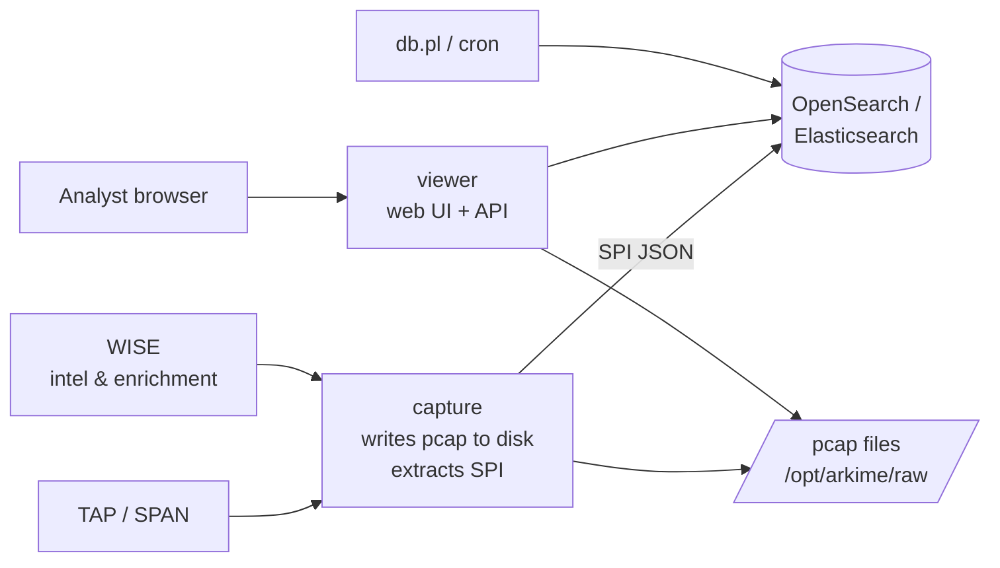

# Arkime { #arkime }

<div class="dfir-meta" markdown>
**분류:** 전체 패킷 캡처와 색인 · **플랫폼:** Linux 센서 + 웹 UI · **최종 수정:** 2026-09-16
</div>

!!! abstract "하는 일"
    Arkime(옛 이름 Moloch)은 **모든 패킷**을 디스크에 캡처하고, 세션별 메타데이터(SPI — Session Profile Information)를 **OpenSearch/Elasticsearch**에 추출하며, 수백만 세션을 몇 초 만에 검색하고 원하는 세션의 pcap을 정확히 꺼낼 수 있는 웹 UI를 제공합니다. Zeek은 *무슨 일이 있었는지* 알려 주고, Arkime는 몇 달 뒤에도 **패킷으로 증명**하게 해 줍니다.

## Zeek, Suricata와의 관계 { #how-it-fits-with-zeek-and-suricata }

| | Zeek | Suricata | Arkime |
|---|---|---|---|
| 출력 | 프로토콜별 구조화된 로그 | 경보(시그니처) + `eve.json` 메타데이터 | 색인된 **세션** + **전체 pcap** |
| 강점 | 로그로 이해하고 헌팅 | 알려진 악성 탐지 | 원시 트래픽을 꺼내고 검색; 시각적 피벗 |
| 보존 | 텍스트 — 저렴하고 길게 | 경보 — 아주 작음 | pcap — 비쌈, 며칠~몇 주; SPI — 몇 주~몇 달 |
| 결합 키 | `uid`, `community_id` | `flow_id`, `community_id` | 세션 `id`, `community_id`, 5-튜플 + 시각 |

전형적인 스택: Suricata 경보 → Zeek 로그로 맥락 확인 → Arkime에서 세션 열기 → pcap 다운로드 → Wireshark. Arkime는 **Suricata 경보를 세션 레코드에** 넣을 수 있고(`suricata` 뷰어 플러그인), **WISE**(위협 인텔리전스, Zeek 기반 태그)로 보강할 수 있어서 검색 한 번에 경보 + 세션 + 인텔리전스가 함께 보입니다.

## 아키텍처 (무엇이 어디서 도나) { #architecture-whats-running-where }



| 구성 요소 | 역할 | 위치 |
|---|---|---|
| **capture** | 패킷을 읽고(AF_PACKET/PF_RING/DPDK 또는 `-r` pcap 파일), 세션을 재조립하고, SPI를 추출하고, pcap을 쓰고, SPI를 DB로 보냄 | 센서 노드 |
| **viewer** | Node.js 웹 UI + REST API; 센서 디스크를 읽어서(또는 클러스터의 다른 viewer를 통해) pcap을 제공 | 센서 또는 중앙 |
| **OpenSearch / Elasticsearch** | 일/시간 단위 `sessions3-*` 인덱스에 SPI 저장; `files`, `stats`, `users`, `hunts`, `views` 인덱스 | 중앙 |
| **WISE** | "With Intelligence See Everything" — 보강 플러그인: 위협 피드, Zeek 기반 태그, 사용자 정의 조회, 우클릭 동작 | 중앙 |
| **cont3xt** (선택) | 지표 조사 UI, Arkime에서 피벗 | 중앙 |
| **Parliament** (선택) | 여러 클러스터 대시보드 | 중앙 |
| `db.pl` | 인덱스 유지 관리, `expire` (디스크를 한도 내로 유지), `upgrade`, `backup` | 중앙의 cron |

**보존**은 별개의 손잡이 두 개입니다: 디스크의 pcap(`config.ini`의 `freeSpaceG` → capture가 가장 오래된 파일을 삭제)과 DB의 SPI(`db.pl expire daily 30` 형태). SPI를 패킷보다 훨씬 오래 보관하는 경우가 많습니다 — pcap 없는 메타데이터도 훌륭한 검색 대상입니다.

## "세션"이란 { #what-a-session-is }

세션은 Arkime의 저장 단위입니다: 타임아웃으로 경계가 정해진 양방향 플로우(5-튜플)이며, **수백 개의 추출 필드**를 갖습니다 — IP, 포트, 프로토콜, 방향별 바이트/데이터 바이트/패킷, GeoIP/ASN, 그리고 프로토콜 상세: HTTP 호스트/URI/UA/메서드/상태 코드/헤더, DNS 이름/응답, TLS SNI/JA3/JA4/버전/암호/인증서, SMB 파일명/사용자, SSH 버전/해시, Kerberos/NTLM 사용자, 이메일 주소/제목/파일명, DHCP 호스트명, 태그, Suricata 경보, WISE 보강 — 그리고 필요할 때 pcap을 재조립할 수 있도록 **패킷의 바이트 오프셋**.

중요한 기본값: 긴 TCP 연결은 `maxStreams`/`tcpTimeout`/`tcpSaveTimeout`(기본 ~8분) 이후 여러 세션으로 나뉩니다 — 6시간짜리 SSH 터널은 세션 여러 개로 보입니다. UDP 세션은 빨리 끝납니다(`udpTimeout` 60초). 나뉜 연결을 이어 붙이려면 `rootId`를 쓰세요.

## UI 한 문단씩 { #the-ui-in-one-paragraph-each }

**Sessions** — 메인 목록: 시간 범위 선택기, 검색식 입력창, 세션당 한 줄. 줄을 펼치면 모든 SPI 필드, 패킷, 재조립된 페이로드(HTTP, SMTP 등은 프로토콜별 디코딩)가 보입니다. 아무 값이나 우클릭 → 필터, 또는 WISE/cont3xt로 보내기.

**SPIView** — 현재 검색의 모든 필드와 상위 값, 개수. "이 트래픽에 어떤 User-Agent가 있나"나 "어떤 JA3가 이 IP에 접속했나"를 보는 가장 빠른 방법. 값을 클릭하면 검색식에 추가됩니다.

**SPIGraph** — 필드 하나(예: `ip.dst`, `http.host`, `tls.ja3`)를 시간축으로 그리고, 값마다 작은 그래프를 보여 줍니다. 비콘이 빗살무늬를 그리는 곳입니다.

**Connections** — 고른 필드 쌍(IP ↔ IP, IP ↔ `host.http`, 사용자 ↔ IP)의 `src ↔ dst` 힘 기반 그래프. 횡적 이동이 그림으로 보입니다.

**Hunt** — 많은 세션에 걸쳐 (SPI만이 아니라) **패킷 페이로드**를 검색합니다: ASCII/16진수/정규식/YARA, 검색식에 맞는 세션으로만 제한 가능. 결과는 세션에 태그로 붙습니다. 3주 치 pcap에서 문자열을 찾는 방법입니다.

**Files / Stats / Users / Settings / History / Cron Queries** — pcap 파일 목록, 센서 상태(드롭!), 계정, 저장한 뷰와 단축키, 내 쿼리 기록, 그리고 일치하면 세션에 태그를 붙이거나 웹훅으로 보내는 예약 쿼리.

## 랩 장비에서 빠르게 시작하기 { #quick-start-on-a-lab-box }

```bash
# Ingest a pcap into a running instance (offline, keeps timestamps from the file)
/opt/arkime/bin/capture -c /opt/arkime/etc/config.ini -r /data/capture.pcap --copy
#  -R /dir      recurse a directory      --copy  copy pcap into Arkime's raw dir so viewer can serve it
#  --skip      skip files already processed (use with -R and a monitor cron)
#  -t tagname  tag every session from this file — do this per case/exercise

# Sanity: sessions arrived?
curl -s -u admin:pass 'http://localhost:8005/api/sessions?date=-1&expression=tags==case01&length=5' | jq '.data[] | {firstPacket, source, destination, protocol}'

# Reindex / maintenance / retention
/opt/arkime/db/db.pl http://localhost:9200 info
/opt/arkime/db/db.pl http://localhost:9200 expire daily 30       # keep 30 days of SPI
```

"없다"는 결과를 믿기 전에 **Stats → Capture**에서 `Dropped` 카운터를 확인하세요 — 패킷을 20% 놓치는 센서는 페이로드가 빠진 세션을 만들고, Hunt를 조용히 망가뜨립니다.

## 페이지 { #pages }

- [검색 문법 치트시트](search-syntax.md) — 검색식 언어, 필드 이름, 시간 요령
- [침입 탐지와 헌팅 워크플로](hunting-workflows.md) — Sessions, SPIView, SPIGraph, Connections, Hunt로 침입 찾기; Suricata/WISE 연동

## 참고 자료 { #references }

- [Arkime documentation](https://arkime.com/) · [Settings reference](https://arkime.com/settings) · [API](https://arkime.com/apiv3)
- [Arkime FAQ (retention, sizing, drops)](https://arkime.com/faq)
- [65sch00l lessons 3–5 — Arkime basics, advanced, integration](https://github.com/G1useppe/65sch00l)
