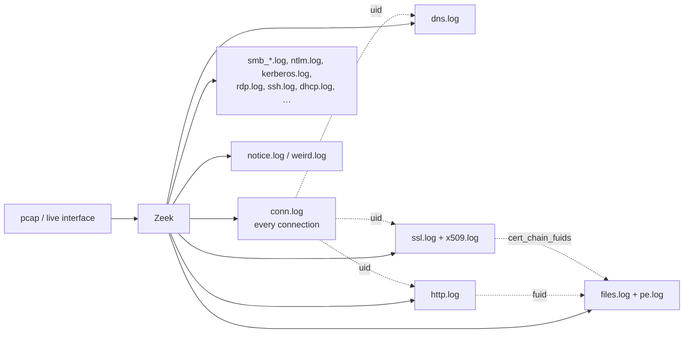

# Zeek { #zeek }

Zeek(옛 이름 Bro)는 패킷을 **구조화된, 프로토콜을 이해하는 로그**로 바꿉니다 — 연결, DNS 쿼리, HTTP 요청, TLS 핸드셰이크, 파일 전송마다 한 줄씩. 네트워크 포렌식에서는 대개 pcap 자체보다 더 유용합니다. 한 달 치 트래픽을 몇 초 만에 grep하고, 중요한 몇 개 플로우만 패킷으로 돌아가 보면 되기 때문입니다.

## 로그가 서로 연결되는 방식 { #how-the-logs-fit-together }



한 연결에 대한 모든 로그 줄은 `conn.log` 행과 같은 **`uid`**(예: `CHhAvVGS1DHFjwGM9`)를 가집니다 — 이것이 결합 키입니다. 파일에는 **`fuid`**가 붙고, `http.log`(`orig_fuids`/`resp_fuids`), `smtp.log`, `ssl.log`(`cert_chain_fuids`)가 이를 가리킵니다. 호스트는 `id.orig_h`(클라이언트) / `id.resp_h`(서버), 포트는 `id.orig_p` / `id.resp_p`로 나타납니다.

## 실제로 열어 보게 될 로그 파일 { #log-files-you-will-actually-open }

| 로그 | 한 줄 = … | 이런 질문이 있을 때 보세요 |
|---|---|---|
| [`conn.log`](conn-log.md) | TCP/UDP/ICMP 연결 | 누가 누구와, 얼마나 오래, 얼마나 많이 통신했나, 핸드셰이크가 완전했나? |
| [`dns.log`](dns-log.md) | DNS 쿼리/응답 | 어떤 이름을 조회했고 무엇으로 해석됐나, 터널링은? |
| [`http.log`](http-log.md) | HTTP 요청/응답 쌍 | URI, User-Agent, 호스트, 상태 코드, 다운로드한 파일 ID |
| [`ssl.log` / `x509.log`](ssl-x509.md) | TLS 핸드셰이크 / 인증서 | SNI, JA3/JA4, 인증서 주체/발급자/유효기간, 자체 서명된 C2 인증서 |
| [`files.log` / `pe.log`](files-log.md) | 모든 프로토콜에서 본 파일 / Windows 실행 파일 | 해시, MIME 타입, 크기, 어느 연결이 EXE를 실어 날랐나 |
| `notice.log` | Zeek의 "뭔가 흥미로운 것" | 스캔, 무차별 대입, 자체 서명 인증서, 잘못된 인증서, SSH 추측 |
| `weird.log` | 프로토콜 이상 | 잘못된 트래픽, 회피, 고장 난 도구 |
| `smb_mapping.log`, `smb_files.log`, `ntlm.log`, `kerberos.log`, `dce_rpc.log` | Windows 횡적 이동 프로토콜 | 공유 접근, SMB 파일 작업, NTLM/Kerberos 인증 (사용자!), RPC 호출 (PsExec/WMI/서비스 생성) |
| `rdp.log`, `ssh.log`, `ftp.log`, `smtp.log`, `dhcp.log`, `dpd.log`, `software.log`, `known_*.log` | 이름 그대로 | — |

## 로그 읽기 — 두 가지 포맷 { #reading-logs-the-two-formats }

=== "TSV (대부분 환경의 기본값)"

    ```bash
    # Headers start with '#'. #fields names the columns, #types their types.
    head -8 conn.log
    # #separator \x09
    # #set_separator ,
    # #empty_field  (empty)
    # #unset_field  -
    # #path conn
    # #open 2026-09-16-10-00-00
    # #fields ts uid id.orig_h id.orig_p id.resp_h id.resp_p proto service duration orig_bytes resp_bytes conn_state ...
    # #types  time string addr port addr port enum string interval count count string ...
    ```

    **zeek-cut**은 이름으로 열을 고르고 epoch를 읽기 쉬운 시간으로 바꿔 줍니다:

    ```bash
    zeek-cut -d ts id.orig_h id.resp_h id.resp_p service < conn.log | head
    #            ^-- -d = readable UTC time; -D "%Y-%m-%d %H:%M:%S" for a custom format; -u forces UTC
    ```

=== "JSON (`LogAscii::use_json=T`, Security Onion, Corelight)"

    ```bash
    # jq is your zeek-cut
    jq -r '[.ts, ."id.orig_h", ."id.resp_h", ."id.resp_p", .service] | @tsv' conn.log | head
    jq -c 'select(."id.resp_p"==445)' conn.log
    ```

    JSON 로그는 필드 이름 그대로 Splunk / Elastic에 바로 들어갑니다 — `id.resp_h`가 `stats`를 걸 수 있는 필드가 됩니다.

## pcap에 Zeek 돌리기 { #running-zeek-on-a-pcap }

```bash
# Writes *.log into the current directory. -C ignores bad checksums (common in lab captures / offloaded NICs).
zeek -C -r capture.pcap

# Use the local site policy (loads JA3/JA4, file hashing, etc. if installed) and a custom script
zeek -C -r capture.pcap local my-script.zeek

# Enable all file hashes (md5/sha1/sha256) — very useful, off by default for sha1/sha256
zeek -C -r capture.pcap local "Files::analyze_by_default" policy/frameworks/files/hash-all-files

# Extract every file Zeek sees into ./extract_files/
zeek -C -r capture.pcap policy/frameworks/files/extract-all-files
```

로그의 시간은 **UTC epoch**(`ts`)입니다. Zeek은 시간대를 바꿔 주지 않습니다.

## 분석 반사 신경 { #analysis-reflexes }

- **`conn.log`에서 시작**해서 집계하고(`sort | uniq -c`, Splunk라면 `stats count by`), 튀는 것만 `uid`로 프로토콜 로그로 피벗하세요.
- **`service`는 포트가 아니라 Zeek이 *본* 것입니다.** `id.resp_p=443`인데 `service=-`나 `service=ssh`라면 사연이 있는 겁니다.
- **긴 지속 시간 + 적은 바이트** = 대화형 셸 / keep-alive. **일정한 간격** = 비콘 ([비코닝과 C2](../beaconing-c2.md) 참고).
- **바이트 비대칭**: 아웃바운드 연결에서 `orig_bytes >> resp_bytes` = 업로드 / 유출.
- `conn.log`의 **`history`** 문자열이 핸드셰이크 이야기를 해 줍니다 — 스캔은 `S`만, 거부는 `Sr`, 양방향 데이터는 `ShADadFf`.
- Zeek 로그에는 **페이로드가 없습니다** — 실제 명령이나 파일 내용은 pcap([Wireshark / tshark](../wireshark-tshark.md))이나 `extract_files/`로 가야 합니다.

## 참고 자료 { #references }

- [Zeek documentation — log files](https://docs.zeek.org/en/master/logs/index.html)
- [Zeek log cheat sheets (Corelight)](https://corelight.com/resources/zeek-cheatsheets)
- [65sch00l lesson series — Zeek / Arkime / Suricata](https://github.com/G1useppe/65sch00l)
