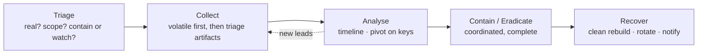

# 플레이북 { #playbooks }

자주 만나는 사고 유형별 반복 가능한 대응 절차입니다. 모두 같은 모양 — **언제 쓰나 → 트리아지 (첫 15분) → 수집 → 분석 → 봉쇄/제거 → 복구 → 유용한 쿼리** — 을 따르고, 자세한 내용은 [Windows](../windows/index.md), [네트워크](../network/index.md), [Splunk](../splunk/index.md), [공격 기법](../adversary/index.md), [도구](../tools/index.md) 섹션으로 연결됩니다.

## 플레이북 고르기 { #pick-a-playbook }

| 이런 상황이라면… | 플레이북 |
|---|---|
| 파일 암호화 / 랜섬 노트 / 대량 이름 변경 | [랜섬웨어](ransomware.md) |
| 호스트 하나: 경보, 수상한 프로세스, 사용자 신고 | [침해된 워크스테이션](compromised-workstation.md) |
| 수상한 로그인, 사서함 규칙, 실제 계정을 이용한 사기 | [계정 탈취와 BEC](account-compromise.md) |
| 공격자가 호스트에서 호스트로 이동, 또는 DC / Domain Admin 침해 | [횡적 이동과 도메인 침해](lateral-domain.md) |
| 데이터 탈취 — 큰 업로드, 압축 파일 준비, DLP 경보 | [데이터 유출](data-exfiltration.md) |
| 웹 서버: 웹셸, 익스플로잇된 앱, RCE | [웹셸과 서버 침해](webshell-server.md) |

## 공통 모양 { #the-universal-shape }

모든 플레이북에 흐르는 원칙 두 가지: **조치하기 전에 휘발성 증거를 보존하라**(RAM, 실행 상태 — 기회는 한 번뿐), 그리고 **봉쇄하기 전에 범위를 파악하라**(일부만 봉쇄하면 살아 있는 공격자가 다시 들어옵니다; 전체 범위를 찾은 뒤 한 번에 모두 끊으세요).

## 첫 15분의 반사 신경 (모든 사고) { #first-15-minutes-reflexes-any-incident }

- **진짜**인가? 사람을 모으기 전에 실제 탐지 내용을 읽으세요.
- 지금까지의 **범위**는 — 호스트, 계정, 데이터, 시간 창?
- **봉쇄할까, 지켜볼까?** 퍼지고 있다면 격리하세요(네트워크 봉쇄, RAM 유지). 잠잠하고 범위 파악이 필요하다면 조용히 지켜보세요.
- **보존**: 무언가 바뀌기 전에 RAM / 샘플 / 핵심 로그를 확보하세요.
- 내가 결정할 일이 아닌 것은 **보고·상향**하세요: 몸값 지불, 법적/규제상 통지, 운영 시스템 중단 — 이런 것은 일찍 경영진/법무로 넘기세요.

## 페이지 { #pages }

-   **[랜섬웨어](ransomware.md)** — 암호화는 N단계; 1…N−1단계를 재구성, 백업 보호, krbtgt 교체
-   **[침해된 워크스테이션](compromised-workstation.md)** — 호스트 하나에 대한 초동 대응자의 트리아지 순서
-   **[계정 탈취와 BEC](account-compromise.md)** — 클라우드 ID 로그, 받은 편지함 규칙, 토큰 폐기, OAuth
-   **[횡적 이동과 도메인](lateral-domain.md)** — 이동 그래프, DCSync, 골든 티켓, 조율된 재설정
-   **[데이터 유출](data-exfiltration.md)** — 통지 결정을 위한 무엇을/얼마나/어디로/언제
-   **[웹셸과 서버](webshell-server.md)** — 모든 셸 찾기, 침투 경로 막기, 비밀 정보 교체

!!! info "플레이북 추가하기"
    `python new.py playbooks/<name> -t playbook` — 템플릿에 이미 트리아지→수집→분석→봉쇄→복구 구조가 들어 있습니다. 사이드바에 자동으로 나타납니다.
