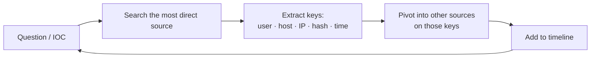

# BOTSv3 조사 워크플로 { #botsv3-investigation-workflow }

<div class="dfir-meta" markdown>
**분류:** Splunk 연습 · **데이터셋:** Boss of the SOC v3 (Frothly, 2018년 8월) · **최종 수정:** 2026-09-17
</div>

!!! abstract "한 줄 요약"
    BOTSv3는 여러 출처가 섞인 현실적인 사고 데이터셋입니다. 여기서 배우는 방법은 답을 외우는 게 아니라 **조사 루프** — 출처를 파악하고, 공통 키로 피벗하고, 타임라인을 만들기 — 를 연습하는 것입니다. 그래서 이 페이지는 방법과 데이터 지도이며, 일부러 답은 넣지 않았습니다.

## 방향 잡기 (매번 가장 먼저) { #get-oriented-do-this-first-every-time }

```spl
| metadata type=sourcetypes index=botsv3
| eval first=strftime(firstTime,"%Y-%m-%d"), last=strftime(lastTime,"%Y-%m-%d")
| table sourcetype, totalCount, first, last | sort - totalCount
```

날짜 범위를 기억하세요 — 검색은 `earliest=0`이나 **2018년 8월**의 절대 구간을 써야 합니다. 그다음 호스트 목록:

```spl
| tstats count where index=botsv3 by host, sourcetype | sort - count
```

## 데이터 지도 { #data-map }

| 출처 계열 | 소스타입 (BOTSv3 이름) | 알 수 있는 것 |
|---|---|---|
| Windows Security | `WinEventLog` (`source`로 Security/System/Application 구분), `XmlWinEventLog:*` | 로그온, 프로세스 생성, 서비스, 계정 변경, 로그 삭제 |
| Sysmon | `XmlWinEventLog:Microsoft-Windows-Sysmon/Operational` | 프로세스 트리, 프로세스별 네트워크 연결, 파일 쓰기, 레지스트리, DNS (22) |
| PowerShell | `XmlWinEventLog:Microsoft-Windows-PowerShell/Operational` | 스크립트 블록 텍스트 `4104` |
| 와이어 데이터 | `stream:tcp`, `stream:udp`, `stream:http`, `stream:dns`, `stream:smb`, `stream:smtp`, `stream:ip`, `stream:icmp`, `stream:ftp`, `stream:ldap`, `stream:mysql`, `stream:ssl` | 누가 누구와 통신했나; HTTP URI/UA; DNS 쿼리; SMB 파일명; 메일 |
| 클라우드 | `aws:cloudtrail`, `aws:cloudwatchlogs:vpcflow`, `aws:s3:accesslogs`, `aws:config`, `aws:metadata`, `aws:description` | API 호출, AWS에서 누가 무엇을 했나, S3 버킷 접근, VPC 플로우 |
| M365 | `ms:o365:management`, `ms:o365:reporting:messagetrace`, `ms:aad:*` | 사서함/SharePoint 활동, 메일 추적, Azure AD 로그인 |
| 엔드포인트 / 인벤토리 | `osquery:results`, `symantec:ep:*`, `code42:*` | 프로세스/소켓 스냅샷, AV 탐지, 파일 유출 모니터링 |
| Linux | `linux_secure`, `syslog`, `bash_history`?, `osquery` | SSH 인증, sudo, 명령 |
| 웹/앱 | `iis`, `apache:access`?, `nginx*`, `hadoop*`?, `mysql*` | 웹 서버 접근, DB |
| 인프라 | `cisco:asa`?, `pan:*`?, `dhcpd`, `dns`? | 경계, DHCP 임대 |

(`?` = 내 인스턴스에서 `metadata`로 확인 — 데이터셋 앱은 버전마다 조금씩 다릅니다.) 가상 회사 **Frothly**의 사용자, 호스트명, IP가 이 모든 출처에 반복해서 나옵니다 — 그게 핵심입니다.

## 조사 루프 { #the-investigation-loop }



찾은 답마다 새 **키**가 생기고, 키마다 다른 소스타입이 열립니다. 키와 피벗할 곳:

| 키 | 피벗할 곳 |
|---|---|
| **사용자명** | `4624/4625/4648/4672` (Security), Sysmon `User`, `stream:smb` / `stream:ldap` user fields, `aws:cloudtrail userIdentity.*`, `ms:o365 UserId`, `linux_secure` |
| **호스트명** | 모든 곳의 `host=`; Sysmon `Computer`; Security `Workstation_Name`; DHCP → IP |
| **IP** | `stream:*` `src_ip/dest_ip`; Security `Source_Network_Address`; Sysmon `3` `DestinationIp`; `aws:*:vpcflow`; firewall; `iplocation` |
| **프로세스 / 해시** | Sysmon `1` `Image`/`Hashes`; `4688`; osquery `columns.path`; Symantec; VirusTotal (외부에서) |
| **파일명** | Sysmon `11` `TargetFilename`; `stream:smb` `filename`; `stream:http` `uri_path`; `5145 Relative_Target_Name`; Code42 |
| **도메인 / URL** | `stream:dns query`; `stream:http site/uri_path`; Sysmon `22` `QueryName`; proxy |
| **시간 창** | 모든 것 — 호스트 타임라인 만들기 ([보안 검색 → 호스트 타임라인](security-searches.md#build-a-host-timeline-everything-about-one-machine)) |

## BOTS 문제 하나를 푸는 단계별 방법 { #step-by-step-method-for-a-bots-question }

1. **질문을 필드로 바꿔 쓰세요**: "어떤 사용자…" → `Account_Name`/`User`/`user`; "어떤 IP…" → `src_ip`/`Source_Network_Address`; "어떤 파일…" → `TargetFilename`/`uri_path`/`filename`; "언제…" → `_time` + `convert ctime`.
2. 데이터 지도에서 **가장 직접적인 소스타입을 고르세요**. 가진 것 중 가장 좁은 필터로 검색하고, 먼저 `| head 20`으로 모양을 보세요.
3. **`table`보다 `stats` 먼저**: `stats count by <후보 필드>` — 답은 보통 흔한 값이 아니라 튀는 값입니다.
4. **두 번째 출처로 확인하세요**. `4624`의 사용자명은 그 호스트의 Sysmon `User`에도 나와야 하고, `stream:http`의 IP는 `stream:tcp`와 아마 Sysmon `3`에도 나와야 합니다.
5. 다음으로 넘어가기 전에 **키와 시각을 적으세요**. 메모가 곧 타임라인이 됩니다.
6. **막혔나요? 넓히세요** — 필터 하나를 빼거나, 시간을 늘리거나, 소스타입에 `fieldsummary`를 돌려 몰랐던 필드를 보세요.

## 출처별 유용한 "첫 확인" 검색 { #useful-first-look-searches-per-source }

```spl
# Which users exist / are active (Security)
index=botsv3 sourcetype=WinEventLog EventCode=4624 earliest=0
| eval user=mvindex(Account_Name,1) | stats dc(host) as hosts, count by user | sort - count

# Which hosts run Sysmon, and how chatty
index=botsv3 sourcetype="XmlWinEventLog:Microsoft-Windows-Sysmon/Operational" earliest=0
| stats count by host, EventID | sort host, EventID

# Top external destinations (wire data)
index=botsv3 sourcetype=stream:tcp earliest=0
| where NOT cidrmatch("10.0.0.0/8",dest_ip) AND NOT cidrmatch("172.16.0.0/12",dest_ip) AND NOT cidrmatch("192.168.0.0/16",dest_ip)
| stats count, sum(bytes_out) as out by dest_ip, dest_port | sort - out

# HTTP sites and user agents
index=botsv3 sourcetype=stream:http earliest=0 | stats count by site, http_user_agent | sort - count

# DNS: rare names
index=botsv3 sourcetype=stream:dns earliest=0 record_type=A
| stats count by query | sort count | head 50

# AWS: who did what
index=botsv3 sourcetype=aws:cloudtrail earliest=0
| stats count by userIdentity.arn, eventName, sourceIPAddress | sort - count

# AWS: errors (recon / denied actions)
index=botsv3 sourcetype=aws:cloudtrail earliest=0 errorCode=*
| stats count by userIdentity.arn, eventName, errorCode

# M365: mail trace
index=botsv3 sourcetype=ms:o365:reporting:messagetrace earliest=0
| table _time, SenderAddress, RecipientAddress, Subject, Status

# osquery: processes with listening sockets
index=botsv3 sourcetype=osquery:results earliest=0 name=*listening* | spath | table _time, host, columns.name, columns.port, columns.path

# Symantec detections
index=botsv3 sourcetype=symantec:ep:security:file earliest=0 | table _time, host, Risk_Name, File_Path, Actual_Action

# Code42 (file exfil monitoring)
index=botsv3 sourcetype=code42:* earliest=0 | stats count by sourcetype | sort - count
```

각각 그 출처의 이야기를 정의하는 필드 두세 개로 하는 `stats … by`입니다. 한 번씩 돌려 두면 문제를 하나도 읽기 전에 어떤 사용자, 호스트, 목적지가 중요한지 알게 됩니다.

## BOTS 특유의 다중값과 필드 함정 { #multivalue-field-traps-specific-to-bots }

- `4624`/`4688`의 `Account_Name`은 다중값입니다 — `mvindex`를 쓰세요.
- `stream:http`에는 `site`(Host 헤더)와 `dest_ip`가 모두 있습니다; `uri_path` vs `url` vs `uri` — 어느 것이 있는지 확인하세요.
- `stream:dns` `query`는 다중값일 수 있고, `record_type`으로 A/TXT 등을 거릅니다.
- Sysmon 필드는 애드온이 필요합니다. 없으면 `rex`/`spath`를 쓰세요 ([rex와 필드](rex-and-fields.md)).
- CloudTrail 필드는 중첩 JSON입니다: `userIdentity.arn`, `requestParameters.bucketName` — 자동 추출이 꺼져 있으면 `spath`.
- 시간대: 클라우드와 온프레미스 출처를 비교할 때는 UTC로 표시하세요.

## 푼 문제를 핸드북 내용으로 바꾸기 { #turning-a-solved-question-into-handbook-content }

시나리오를 끝내면 짧은 항목 하나를 쓰세요 (`playbook`이나 `concept` 페이지, 또는 여기 표의 한 행): **질문**, 답을 준 **소스타입과 필드**, **최종 SPL**, 그리고 **잘못 든 길은 어떻게 보였는지**. 그러면 CTF 한 시간이 실제 사고에 재사용할 수 있는 절차가 됩니다.

## 참고 자료 { #references }

- [BOTSv3 dataset & guide](https://github.com/splunk/botsv3)
- [Splunk BOTS overview](https://www.splunk.com/en_us/blog/security/boss-of-the-soc-scoring-server-questions-and-answers-and-dataset-open-sourced-and-ready-for-download.html)
- 관련 페이지: [데이터 탐색](data-discovery.md) · [SPL 치트시트](spl-cheatsheet.md) · [보안 검색](security-searches.md) · [헌팅 패턴](hunting-patterns.md)
