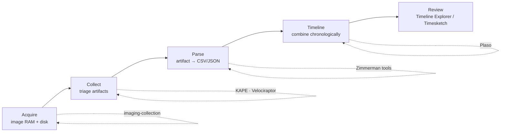

# 도구 { #tools }

DFIR 도구 상자 — 각 도구가 무엇을 위한 것인지, 중요한 명령, 서로 어떻게 이어지는지. 흐름은 거의 언제나 **수집(이미징) → 아티팩트 수집 → 파싱 → 타임라인 → 검토**이고, 이 페이지들이 각 단계를 다룹니다.

## 파이프라인 { #the-pipeline }

## 단계별 { #by-stage }

| 단계 | 도구 | 페이지 |
|---|---|---|
| 방어 가능한 이미지 **확보** (RAM + 디스크) | WinPmem, FTK Imager, dd/dc3dd, Guymager, AVML | [이미징과 수집](imaging-collection.md) |
| 호스트 하나에서 트리아지 아티팩트 **수집** | KAPE (Targets) | [KAPE](kape.md) |
| 전체 PC에서 라이브로 **수집 / 헌팅** | Velociraptor | [Velociraptor](velociraptor.md) |
| 아티팩트를 CSV로 **파싱** | Eric Zimmerman 도구 모음 (+ KAPE `!EZParser`) | [Zimmerman 도구](zimmerman-tools.md) |
| 모든 것을 한 번에 **타임라인**으로 | Plaso / log2timeline, Timesketch | [Plaso와 타임라인](plaso-timelines.md) |
| **검토** | Timeline Explorer | [Zimmerman 도구](zimmerman-tools.md#timeline-explorer-the-review-front-end) |
| Sigma로 EVTX **헌팅** | Chainsaw, Hayabusa | [이벤트 로그](../windows/event-logs.md#how-to-parse) |

## 어떤 수집 도구를 언제? { #which-collector-when }

| 상황 | 사용 |
|---|---|
| 라이브/마운트된 Windows 한 대, 빠른 트리아지 | [KAPE](kape.md) `!SANS_Triage` |
| 엔드포인트가 많고, 모두에게 같은 질문 하나 | [Velociraptor](velociraptor.md) 헌트 |
| 망 분리 / 서버 없음 | [Velociraptor 오프라인 수집기](velociraptor.md) 또는 KAPE를 USB로 |
| 할당되지 않은 공간, 카빙, 법정용 이미지 필요 | [전체 디스크 이미지](imaging-collection.md) (E01) |
| 휘발성 데이터 / 암호화 디스크가 잠금 해제된 상태 | [RAM 이미지 먼저](imaging-collection.md), 그다음 [메모리 포렌식](../memory/index.md) |

## 페이지 { #pages }

-   **[이미징과 수집](imaging-collection.md)** — 휘발성 순서, RAM/디스크 이미징, E01 vs raw, 쓰기 방지와 해시
-   **[KAPE](kape.md)** — Targets와 Modules, `!SANS_Triage` + `!EZParser`, 호스트에서 수집하고 다른 곳에서 파싱
-   **[Velociraptor](velociraptor.md)** — VQL, 아티팩트, 전사 헌트, 오프라인 수집기
-   **[Zimmerman 도구](zimmerman-tools.md)** — 아티팩트마다 파서 하나, Timeline Explorer, 레시피
-   **[Plaso와 슈퍼 타임라인](plaso-timelines.md)** — log2timeline/psort, 필터링, Timesketch

!!! info "도구 추가하기"
    `python new.py tools/<name> -t tool` — 템플릿에 치트시트 구조가 들어 있습니다. 사이드바에 자동으로 나타납니다.
