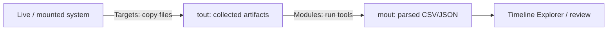

# KAPE { #kape }

<div class="dfir-meta" markdown>
**분류:** 트리아지 수집과 파싱 · **플랫폼:** Windows · **최종 수정:** 2026-09-17
</div>

!!! abstract "하는 일"
    KAPE(Kroll Artifact Parser and Extractor)는 두 가지를 합니다: **Targets**는 라이브 또는 마운트된 시스템에서 포렌식 아티팩트를 복사하고(빠르며, 원시 NTFS 읽기로 파일 잠금을 우회), **Modules**는 수집한 것에 서드파티 도구를 돌려 CSV/JSON 출력을 만듭니다. 명령 하나로 실행 중인 머신이 몇 분 만에 파싱된 증거 폴더가 됩니다. 무료로 쓸 수 있고, GUI(`gkape.exe`)와 CLI(`kape.exe`)가 있습니다.

## 머릿속 그림 { #the-mental-model }



- **Target** = *무엇을 복사할지* (경로/마스크를 나열한 `.tkape` 파일). `--tsource`는 읽을 곳, `--tdest`는 쓸 곳.
- **Module** = *무엇을 실행할지* (도구 + 인수를 감싼 `.mkape` 파일). `--msource`(보통 = tdest)와 출력이 갈 `--mdest`.
- Targets만, Modules만, 또는 둘 다 한 번에 돌릴 수 있습니다.

## 실제로 쓰는 명령 { #the-commands-you-actually-use }

```powershell
# Full triage of C: — the "just collect the important stuff" command
kape.exe --tsource C: --tdest E:\%d\tout --target !SANS_Triage --vss

# Collect AND parse in one pass (triage → CSVs ready for Timeline Explorer)
kape.exe --tsource C: --tdest E:\%d\tout --target !SANS_Triage `
         --msource E:\%d\tout --mdest E:\%d\mout --module !EZParser --vss

# One artifact family
kape.exe --tsource C: --tdest E:\out --target EventLogs --mdest E:\out\m --module EvtxECmd
kape.exe --tsource C: --tdest E:\out --target RegistryHives --mdest E:\out\m --module RECmd_BatchExamples

# Parse an already-collected folder (Modules only)
kape.exe --msource E:\out\tout --mdest E:\out\mout --module !EZParser

# Mounted image (E01/VHD mounted read-only as F:)
kape.exe --tsource F: --tdest E:\out --target !SANS_Triage
```

편리한 플래그: 경로의 `%d` / `%m`은 날짜 / 머신 이름으로 바뀝니다(사건별로 분리); `--vss`는 볼륨 섀도 복사본에서도 가져옵니다(파일의 이전 버전 — 로그/저널 이력을 늘리는 데 큼); `--vhdx CASE`는 낱개 파일 대신 VHDX 컨테이너에 수집합니다; `--zip NAME`은 압축; `--gui`는 파일 선택기를 엽니다; `--debug`/`--trace`는 문제 해결용; `--tflush`/`--mflush`는 목적지를 먼저 비웁니다.

## 알아 둘 만한 Targets { #targets-worth-knowing }

| Target | 수집 대상 |
|---|---|
| `!SANS_Triage` | 종합 세트: `$MFT`, `$J`, `$LogFile`, 레지스트리 하이브 + 로그, EVTX, Prefetch, Amcache, SRUM, LNK/JumpLists, 예약 작업, 브라우저 데이터, PowerShell 히스토리, WMI 등 — 여기서 시작 |
| `!BasicCollection` | 더 작은 핵심 세트 |
| `KapeTriage` | 비슷한 넓은 범위의 트리아지 복합 타깃 |
| `FileSystem` | `$MFT`, `$J`, `$LogFile`, `$Boot`, `$SDS` |
| `RegistryHives`, `RegistryHivesSystem`, `RegistryHivesUser` | SYSTEM/SOFTWARE/SAM/SECURITY, NTUSER.DAT, UsrClass.dat + 트랜잭션 로그 |
| `EventLogs` | 모든 `.evtx` |
| `Prefetch`, `Amcache`, `SRUM` | 이름 그대로의 아티팩트 |
| `LNKFilesAndJumpLists`, `RecentFileCache` | 파일 인지 |
| `WebBrowsers`, `Chrome`, `Edge`, `Firefox` | 브라우저 기록/캐시/다운로드 |
| `ScheduledTasks`, `WindowsTimeline`, `PowerShellConsole` | 이름 그대로 |
| `RDPCache`, `EventTraceLogs`, `MFTMirror` | 특수하지만 유용 |

Targets는 조합됩니다: `!SANS_Triage`는 다른 타깃 수십 개를 끌어오는 *복합* 타깃입니다. `--tlist`로 나열하거나 `Targets\` 폴더를 둘러보세요.

## 알아 둘 만한 Modules { #modules-worth-knowing }

| Module | 실행하는 것 |
|---|---|
| `!EZParser` | 복합 모듈 — 트리아지 수집물에 Eric Zimmerman 파서를 모두 돌림 (MFTECmd, EvtxECmd, PECmd, AmcacheParser, AppCompatCacheParser, RECmd, LECmd, JLECmd, SrumECmd, SBECmd, …) → 아티팩트마다 CSV 하나 |
| `EvtxECmd`, `PECmd`, `MFTECmd`, `AmcacheParser`, `AppCompatCacheParser`, `RECmd_*`, `LECmd`, `JLECmd`, `SrumECmd`, `SBECmd` | 개별 [Zimmerman 도구](zimmerman-tools.md) |
| `hayabusa`, `Chainsaw` | Sigma 기반 EVTX 헌팅 → 탐지 CSV |
| `Nirsoft_*`, `RegRipper` | 대체 파서 |
| `VirusTotal`, `Loki`, `capa` | 보강 / 악성코드 트리아지 (일부는 모듈 `bin` 폴더에 키/바이너리 필요) |

Modules는 실제 도구 바이너리가 있어야 합니다 — KAPE는 `Modules\bin\`을 찾습니다. `--mlist`로 나열하고, `Get-KAPEUpdate.ps1`(KAPE에 포함)로 커뮤니티 저장소에서 Targets/Modules를 업데이트합니다.

## 일반적인 워크플로 { #typical-workflow }

1. 대상 시스템으로 부팅하고(또는 이미지를 읽기 전용으로 마운트하고) 증거 드라이브 `E:`를 연결.
2. `kape.exe --tsource C: --tdest E:\%d\tout --target !SANS_Triage --vss` — 수집 (몇 분).
3. `kape.exe --msource E:\%d\tout --mdest E:\%d\mout --module !EZParser` — 파싱 (나중에, 다른 호스트에서 해도 됨).
4. **Timeline Explorer**로 `mout`을 열고 `MFTECmd`(`$MFT`/`$J`), EVTX, Prefetch, Amcache부터 시작.
5. 헌팅을 하려면 EVTX에 `--module hayabusa`나 `Chainsaw`도 돌리세요.

!!! tip "수집은 대상 호스트에서, 파싱은 다른 곳에서"
    Targets는 빠르고 라이브 머신에서 돌려도 안전하지만, Modules는 더 무겁고 서드파티 도구를 끌어옵니다. 표준 방법: 대상에서 이동식/네트워크 드라이브로 **Targets**를 돌리고, 분석 워크스테이션에서 그 수집물에 **Modules**를 돌리세요. 대상에 남는 흔적을 줄이고, 대상을 다시 건드리지 않고 재파싱할 수 있습니다.

## 주의할 점 { #gotchas }

- **관리자로 실행하세요** — 원시 볼륨 읽기와 잠긴 파일에 필요합니다.
- `--tdest`는 `--tsource`와 **다른 볼륨**이어야 합니다 (대상에 증거를 쓰지 마세요).
- `--vss`는 수집 크기와 시간을 몇 배로 늘립니다. 이력이 필요할 때는 가치가 있고, 빠르게 볼 때는 생략하세요.
- `Modules\bin\`에 도구 바이너리가 없으면 Modules는 조용히 아무것도 안 합니다 — `--mlist`와 콘솔 출력을 확인하세요.
- KAPE는 NTFS를 직접 읽어서 잠긴/시스템 파일도 복사하지만 전체 디스크 이미지는 **아닙니다** — 포렌식 이미지는 [이미징 도구](imaging-collection.md)를 쓰세요.
- 출력 타임스탬프는 UTC입니다(Zimmerman 파서 기본값); Timeline Explorer에서 확인하세요.

## 참고 자료 { #references }

- [KAPE documentation (Kroll)](https://www.kroll.com/en/services/cyber-risk/incident-response-litigation-support/kroll-artifact-parser-extractor-kape)
- [KapeFiles — community Targets & Modules](https://github.com/EricZimmerman/KapeFiles)
- [KAPE docs site](https://ericzimmerman.github.io/KapeDocs/)
- 관련 페이지: [Zimmerman 도구](zimmerman-tools.md) · [Velociraptor](velociraptor.md) · [이미징과 수집](imaging-collection.md) · [Windows 포렌식](../windows/index.md)
