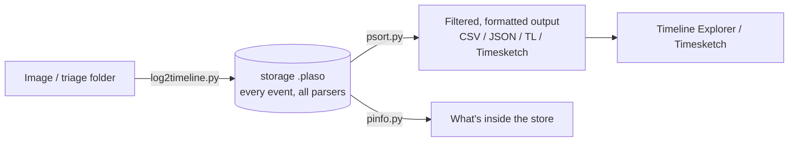

# Plaso와 슈퍼 타임라인 { #plaso-super-timelines }

<div class="dfir-meta" markdown>
**분류:** 타임라인 · **플랫폼:** Linux / Windows / Docker · **최종 수정:** 2026-09-17
</div>

!!! abstract "하는 일"
    Plaso(`log2timeline`)는 **찾을 수 있는 모든 타임스탬프 아티팩트** — 파일시스템, 레지스트리, 이벤트 로그, 브라우저, prefetch 등 수백 가지 — 를 하나의 정규화된 타임라인으로 파싱해서, 시스템에서 일어난 모든 일을 시간순으로 볼 수 있게 합니다. "슈퍼 타임라인"은 어디를 봐야 할지 아직 모를 때 *무슨 일이, 어떤 순서로 있었나*에 답합니다. 대가는 양이고, 그래서 거르는 것이 기술의 전부입니다.

## 파이프라인 { #the-pipeline }



- **`log2timeline.py`**는 소스를 `.plaso` 저장 파일로 가져옵니다 (많은 파서를 실행).
- **`psort.py`**는 후처리합니다: 시간/파서/필드로 거르기, 중복 제거, 원하는 포맷으로 출력.
- **`pinfo.py`**는 `.plaso`에 무엇이 들었는지 보고합니다 (파서, 개수, 시간 범위).
- **`psteal.py`** = log2timeline + psort를 명령 하나로 (처음부터 끝까지 빠르게).

## 명령 { #commands }

```bash
# Ingest a mounted image or triage folder (Docker keeps deps clean)
log2timeline.py --storage-file case.plaso /evidence/

# Only the parsers you need (faster, smaller) — e.g. Windows triage
log2timeline.py --parsers "win7,!filestat" --storage-file case.plaso /evidence/
log2timeline.py --parsers "mft,usnjrnl,winevtx,winreg,prefetch,amcache,lnk,olecf" --storage-file case.plaso /evidence/

# See what's in the store
pinfo.py case.plaso

# Output a filtered CSV for Timeline Explorer (l2tcsv is the classic wide format)
psort.py -o l2tcsv -w timeline.csv case.plaso "date > '2026-08-20 00:00:00' AND date < '2026-08-21 00:00:00'"

# Only certain parsers / sources, dedupe
psort.py -o dynamic -w tl.csv case.plaso "parser contains 'winevtx' OR parser contains 'mft'"

# One-shot ingest + output
psteal.py --source /evidence/ -o l2tcsv -w timeline.csv

# Push straight into Timesketch for browser-based analysis
psort.py -o timesketch --name "Case01" case.plaso
```

파서 프리셋(`win7`, `winxp`, `linux`, `macos`, `webhist`)은 적당한 묶음을 불러오고, `--parsers`에 `!name`을 쓰면 제외합니다. `filestat`(파일 MACB마다 이벤트 하나)은 엄청나게 크니 필요하지 않으면 빼세요.

## 거르기 — 진짜 기술 { #filtering-the-actual-skill }

원시 슈퍼 타임라인은 수백만 행이라 아무도 다 읽지 않습니다. **기준점을 잡고 창을 여세요**:

```bash
# Everything within ±1 hour of a known-bad event, then read outward
psort.py -o l2tcsv -w window.csv case.plaso \
  "date > '2026-08-20 14:00:00' AND date < '2026-08-20 16:00:00'"

# Only execution/persistence-relevant sources
psort.py -o dynamic -w exec.csv case.plaso \
  "parser contains 'prefetch' OR parser contains 'amcache' OR parser contains 'winevtx' OR parser contains 'winreg'"
```

그다음 **Timeline Explorer**(또는 Timesketch)에서: `source`/`parser` 열을 거르고, 사용자/호스트/경로를 검색하고, 중요한 행에 색을 칠하고, 순서를 따라가세요. l2tcsv 포맷의 `MACB` 열은 각 행이 수정/접근/변경/생성 중 어떤 타임스탬프인지 알려 줍니다.

## Plaso vs. Zimmerman 타임라인 { #plaso-vs-the-zimmerman-timeline }

| | Plaso 슈퍼 타임라인 | [MFTECmd](zimmerman-tools.md) `--body` + 그 외 |
|---|---|---|
| 범위 | 모든 것, 파일 하나 | 직접 합치는 아티팩트별 CSV |
| 양 | 거대함 — 강하게 걸러야 함 | 목표가 분명함 — 각 CSV를 읽을 수 있음 |
| 좋을 때 | 어디를 볼지 모름; 전체 그림이 필요 | 아티팩트를 앎; 깔끔한 열 단위 상세가 필요 |
| 검토 | Timeline Explorer / Timesketch | 탭마다 Timeline Explorer |

실제로는: 특정 아티팩트를 집중 분석할 때는 Zimmerman CSV를, 모든 출처를 *합친* 연대기가 한 번에 필요할 때는 Plaso를 쓰세요. 둘 다 Timeline Explorer로 열립니다.

## Timesketch (협업 타임라인) { #timesketch-collaborative-timelines }

Timesketch는 Plaso 타임라인을 탐색하는 웹 앱입니다: `.plaso`(또는 CSV/JSONL)를 가져온 뒤 Lucene 비슷한 문법으로 검색하고, 뷰를 저장하고, 이벤트에 태그를 달고, 발견에 별표를 치고, 스케치를 팀과 공유합니다. 분석기(커뮤니티)가 알려진 패턴에 자동으로 태그를 답니다. 팀이 큰 타임라인 하나를 함께 볼 때 좋고, 빠른 트리아지 하나에는 과합니다.

## 주의할 점 { #gotchas }

- **시간대**: 이벤트가 올바르게 정규화되도록 `log2timeline.py`에 `-z` / `--timezone`으로 *원본의* 시간대를 지정하세요; 따로 지정하지 않으면 출력은 UTC입니다 — 보고서에 항상 시간대를 밝히세요.
- **`filestat` 비대화**: 파일마다 네 행을 냅니다. 파일별 MACB가 목적이 아니라면 빼세요 (`--parsers '!filestat'`).
- **실행 시간**: 전체 이미지는 몇 시간 걸릴 수 있습니다. 가능하면 파서 프리셋을 쓰고, 디스크 전체가 아니라 **트리아지 수집물**([KAPE](kape.md) 출력)을 대상으로 하세요.
- **중복**: `psort.py`가 중복을 제거하지만 겹치는 파서는 여전히 거의 같은 행을 만듭니다 — `source`로 거르세요.
- **버전 차이**: Python 의존성 문제를 피하려면 공식 **Docker** 이미지로 Plaso를 실행하세요.
- 슈퍼 타임라인은 최종 아티팩트가 아니라 *단서 생성기*입니다 — 발견은 원래 아티팩트에서 확인하세요 ([Windows 페이지](../windows/index.md)).

## 참고 자료 { #references }

- [Plaso documentation](https://plaso.readthedocs.io/)
- [log2timeline/plaso GitHub](https://github.com/log2timeline/plaso) · [Docker usage](https://plaso.readthedocs.io/en/latest/sources/user/Installing-with-docker.html)
- [Timesketch](https://timesketch.org/)
- 관련 페이지: [Zimmerman 도구](zimmerman-tools.md) · [MFT/USN](../windows/mft-usn.md) · [이벤트 로그](../windows/event-logs.md)
