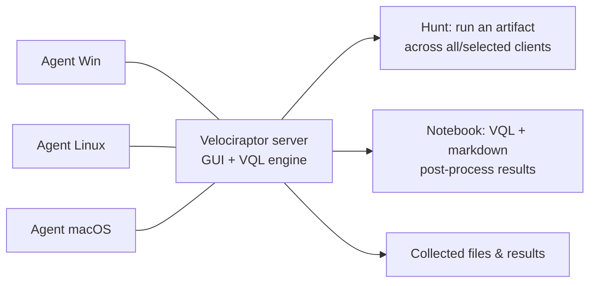

# Velociraptor { #velociraptor }

<div class="dfir-meta" markdown>
**분류:** 엔드포인트 가시성, 헌팅, 수집 · **플랫폼:** Windows / Linux / macOS · **최종 수정:** 2026-09-17
</div>

!!! abstract "하는 일"
    Velociraptor는 오픈 소스 DFIR 플랫폼입니다: 서버와 가벼운 에이전트로 VQL(Velociraptor Query Language)을 써서 **수천 대의 엔드포인트에 한 번에 질의**하고, 아티팩트를 수집하고, 지표를 헌팅하고, 파일을 가져옵니다 — 라이브로, 전사에 걸쳐, 몇 분 만에. [KAPE](kape.md)가 머신 하나를 트리아지한다면 Velociraptor는 모든 머신에 질문을 던집니다. 서버 없이 독립 수집기로 **오프라인** 실행도 됩니다.

## 구성 { #how-its-put-together }



- **아티팩트** = 이름과 파라미터가 있는 VQL 쿼리 (예: `Windows.Forensics.Prefetch`) — 수집/탐지의 단위. 수백 개가 내장돼 있고 직접 만들 수도 있습니다.
- **헌트** = 많은 클라이언트에 아티팩트를 돌리고 결과를 중앙에 모으기.
- **클라이언트 수집** = 엔드포인트 하나에 대화식으로 아티팩트 돌리기.
- **노트북** = 결과를 잘라 보는 VQL + 마크다운 작업 공간 (DFIR판 Jupyter 같은 것).
- **오프라인 수집기** = GUI에서 만드는 독립 실행 `.exe`. 서버 없는 머신에서 고른 아티팩트를 돌리고 ZIP을 남깁니다 — 망 분리 환경이나 일회성 트리아지에 좋습니다.

## 시작하기 (랩) { #getting-started-lab }

```powershell
# One binary is server, client and collector depending on args.
# Generate a server config, run the server (GUI on https://127.0.0.1:8889)
velociraptor.exe config generate > server.yaml
velociraptor.exe --config server.yaml frontend -v

# Build a client MSI/config from the GUI, deploy to endpoints (or run one client manually)
velociraptor.exe --config client.yaml client -v

# Standalone: query the local machine with no server at all
velociraptor.exe query "SELECT Name, Pid, Exe FROM pslist()"
velociraptor.exe artifacts collect Windows.Forensics.Prefetch --output pf.zip
```

## 한 화면으로 보는 VQL { #vql-in-one-screen }

VQL은 SQL처럼 생겼지만 모든 데이터 소스가 **플러그인 함수**(`pslist()`, `glob()`, `parse_evtx()`)이고, 행을 `WHERE`/`SELECT`/`ORDER BY`로 흘려보냅니다. 열 함수가 값을 변환합니다.

```sql
-- Processes whose binary lives in a user-writable path
SELECT Pid, Name, Exe, CommandLine
FROM pslist()
WHERE Exe =~ "(?i)\\\\(Users|ProgramData|Windows\\\\Temp)\\\\"

-- Search every EVTX for a logon type 10 (RDP) from a given IP
SELECT *
FROM parse_evtx(filename="C:/Windows/System32/winevt/Logs/Security.evtx")
WHERE System.EventID.Value = 4624
  AND EventData.LogonType = 10
  AND EventData.IpAddress = "10.0.0.66"

-- Find files by glob, hash them
SELECT FullPath, Size, hash(path=FullPath).SHA256 AS SHA256
FROM glob(globs="C:/Users/*/AppData/Local/Temp/*.exe")
```

`=~`는 정규식 일치, `=`는 정확히 일치; `hash()`, `parse_evtx()`, `parse_pe()`, `stat()`, `upload()` 같은 함수가 기본 블록입니다. GUI에 VQL 레퍼런스가 있고 플러그인을 자동 완성합니다.

## 알아 둘 만한 아티팩트 { #artifacts-worth-knowing }

| 아티팩트 | 얻는 것 |
|---|---|
| `Windows.KapeFiles.Targets` | KAPE Targets 로직을 자체 실행 — KAPE 없이 트리아지 수집 |
| `Windows.Forensics.Prefetch` / `.Usn` / `.Timeline` | 파싱된 [Prefetch](../windows/prefetch.md), [USN 저널](../windows/mft-usn.md), 슈퍼 타임라인 |
| `Windows.Registry.*` (`AppCompatCache`, `RunMRU`, `Sysinternals.Eulacheck`, …) | [레지스트리 아티팩트](../windows/registry-keys.md) |
| `Windows.EventLogs.Evtx` / `.EvtxHunter` | EVTX 전반을 필터/헌팅; 자주 묻는 질문용 `.RDPAuth`, `.PowershellScriptblock` |
| `Windows.System.Pslist` / `.Services` / `.TaskScheduler` / `.Amcache` | 라이브 시스템 상태 + [지속성](../adversary/persistence.md) |
| `Windows.Forensics.SRUM` | [SRUM](../windows/srum.md) 네트워크/실행 사용량 |
| `Windows.NTFS.MFT` / `.Recover` | `$MFT` 파싱, 엔트리 id로 삭제된 파일 내용 복구 |
| `Windows.Detection.*`, `Generic.Detection.Yara.*` | 전사의 파일/프로세스 메모리를 YARA로 스캔 |
| `Windows.Sysinternals.Autoruns` | 전체 ASEP 목록 |
| `Linux.*`, `MacOS.*` | 크로스 플랫폼 대응 아티팩트 (인증 로그, cron, launchd 등) |
| `Server.Utils.CreateCollector` | **오프라인 수집기** exe 만들기 |

GUI의 **View Artifacts**에서 전부 둘러보세요. `Exchange` 아티팩트(커뮤니티)가 수백 개를 더 제공합니다.

## 일반적인 워크플로 { #typical-workflows }

**IOC로 전사 헌트**

1. **Hunt → New Hunt**, 아티팩트 선택(예: 내 규칙을 넣은 `Windows.Detection.Yara.Process`, 또는 해시/경로용 `Windows.Search.FileFinder`), OS/레이블로 범위 지정, 시작.
2. 모든 클라이언트에서 결과가 들어오는 것을 보고, 일치한 파일을 중앙에서 내려받으세요.
3. **노트북**에서 후처리 (`SELECT ClientId, FullPath FROM hunt_results(...) WHERE ...`).

**호스트 하나를 원격 트리아지**

1. 클라이언트를 검색하고 **Collect Artifacts → `Windows.KapeFiles.Targets`** (SANS_Triage 프로필) 또는 특정 아티팩트.
2. 수집물을 내려받고 [Zimmerman 도구](zimmerman-tools.md)나 내장 파서로 파싱.

**오프라인 / 망 분리**

1. 서버 GUI → 원하는 아티팩트로 **오프라인 수집기** exe 만들기.
2. 대상에서 실행하면 ZIP이 나옵니다; 서버로 다시 가져오거나 바로 파싱하세요.

## 주의할 점 { #gotchas }

- **같은 바이너리**가 서버, 클라이언트, 수집기입니다 — 모드는 하위 명령/설정으로 정해지니 설정을 헷갈리지 마세요.
- 클라이언트 배포에는 서버의 CA/설정이 클라이언트 설정이나 MSI에 들어가 있어야 합니다 — 클라이언트는 그 서버만 신뢰합니다.
- 헌트는 무거울 수 있습니다; **레이블**로 범위를 정하고 먼저 몇 대에서 시험하세요. 거대한 트리를 glob하거나 모든 것을 해시하는 VQL은 엔드포인트를 혹사시킵니다.
- 라이브 대응은 휘발성 상태를 읽습니다; 법정에서 방어 가능한 이미지가 필요하면 여전히 전체 [디스크/메모리 이미지](imaging-collection.md)가 필요합니다.
- 결과와 업로드된 파일이 서버에 쌓입니다 — 디스크와 보존 기간을 신경 쓰세요.
- 타임스탬프는 UTC이고, VQL `timestamp()` 도우미로 변환합니다.

## 참고 자료 { #references }

- [Velociraptor documentation](https://docs.velociraptor.app/)
- [VQL reference](https://docs.velociraptor.app/vql_reference/) · [Artifact reference](https://docs.velociraptor.app/artifact_references/)
- [Velociraptor Exchange (community artifacts)](https://docs.velociraptor.app/exchange/)
- 관련 페이지: [KAPE](kape.md) · [Zimmerman 도구](zimmerman-tools.md) · [이미징과 수집](imaging-collection.md)
