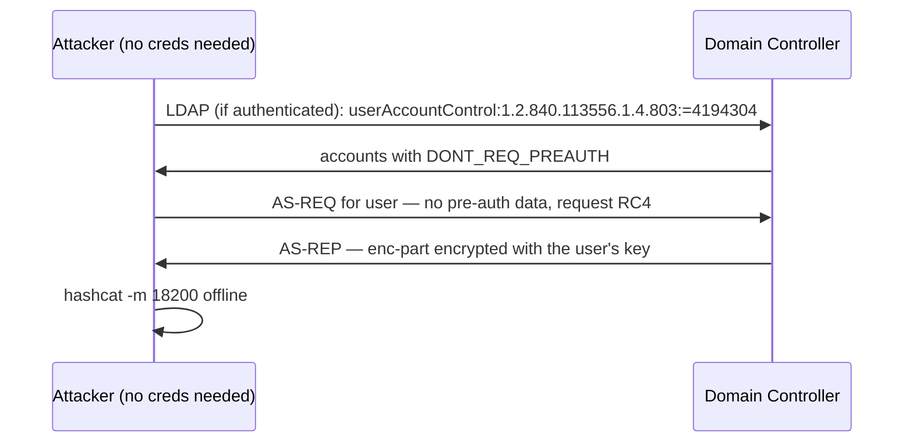

# AS-REP Roasting

<div class="dfir-meta" markdown>
**MITRE ATT&CK:** T1558.004 (Steal or Forge Kerberos Tickets: AS-REP Roasting) · **Tactic:** Credential Access · **Last updated:** 2026-10-07
</div>

!!! abstract "Summary"
    Normally a user must prove they know their password (**Kerberos pre-authentication**) before the DC returns an AS-REP. If an account has **"Do not require Kerberos preauthentication"** set (`DONT_REQ_PREAUTH`, userAccountControl flag `0x400000`), *anyone* can ask the DC for that account's AS-REP — and part of it is encrypted with the account's password hash. The attacker cracks it offline, just like [Kerberoasting](kerberoasting.md). The difference: AS-REP roasting works **without any domain credentials** if the attacker can reach the DC and guess or enumerate usernames.

## How the attack works



Why the flag exists: very old Kerberos clients and some Unix/legacy integrations could not do pre-authentication. In most environments today it is a **misconfiguration** — often set once during troubleshooting and forgotten.

## Attacker tooling / commands

```text
# Enumerate + roast with domain creds
Rubeus.exe asreproast /format:hashcat /outfile:asrep.txt
Get-DomainUser -PreauthNotRequired      # PowerView

# Without creds — supply a username list
GetNPUsers.py corp.local/ -usersfile users.txt -no-pass -dc-ip 10.0.0.1 -format hashcat

# Crack
hashcat -m 18200 asrep.txt wordlist.txt
```

## Affected Windows versions

A configuration weakness in **every Active Directory version**. Accounts are only exposed if `DONT_REQ_PREAUTH` is set — it is **off by default** for new accounts in all versions. Exposure depends on the domain's encryption settings: if RC4 is disabled, the attacker gets an AES-encrypted AS-REP (`etype 18`) that is much slower to crack, but still crackable for weak passwords.

## Artifacts left behind

| Where | Artifact | What to look for |
|---|---|---|
| DC Security log | **4768** (TGT requested) with **`Pre_Authentication_Type=0`** and `Ticket_Encryption_Type=0x17` | A TGT issued without pre-auth, with RC4 — the roast |
| DC Security log | Many **4768** with `Result_Code=0x6` (unknown principal) from one IP | Username enumeration with a list (no-cred variant) |
| AD | `userAccountControl` containing `0x400000` | The exposure itself — audit it |
| DC Security log | **4738** (user account changed) where the change set `Don't Require Preauth` | Someone enabling the flag (attackers sometimes set it on a target they control, "targeted AS-REP roasting") |
| Network | [Zeek `kerberos.log`](../network/zeek/index.md) — `request_type=AS`, success, cipher RC4, from a non-domain host | On the wire |

## Detection

=== "Splunk — AS-REP without pre-auth"

    ```spl
    index=botsv3 sourcetype=WinEventLog EventCode=4768 Result_Code=0x0 Pre_Authentication_Type=0
    | stats count, values(Ticket_Encryption_Type) as etype, values(Client_Address) as src by Account_Name
    | sort - count
    ```

    `4768` = a Kerberos TGT was requested. `Result_Code=0x0` = success. `Pre_Authentication_Type=0` means no pre-authentication was supplied (normal logons show `2` for password or `15`/`16` for smart card/PKINIT). Every hit is either a known legacy integration (allow-list it) or a roast.

=== "Splunk — enumeration"

    ```spl
    index=botsv3 sourcetype=WinEventLog EventCode=4768 Result_Code=0x6
    | bin _time span=5m
    | stats dc(Account_Name) as users by _time, Client_Address
    | where users > 20
    ```

    `Result_Code=0x6` = `KDC_ERR_C_PRINCIPAL_UNKNOWN` (username does not exist). Many distinct unknown names from one IP in five minutes is a username spray before roasting.

=== "PowerShell — find exposed accounts"

    ```powershell
    Get-ADUser -Filter 'DoesNotRequirePreAuth -eq $true' -Properties DoesNotRequirePreAuth, PasswordLastSet |
      Select-Object SamAccountName, PasswordLastSet
    ```

    Run as a hygiene check. The list should be empty or contain only documented legacy accounts with very long passwords.

## Response

Clear the flag on every account that does not truly need it, and **reset the password** of any account that was roasted (assume it will be cracked). If the account must keep the flag, give it a 30+ character random password and restrict where it can log on.

### Remediation by Windows version

| Control | What it stops | Available on |
|---|---|---|
| Remove `DONT_REQ_PREAUTH` from all accounts; alert on 4738 setting it | The exposure entirely | All AD versions |
| Long random passwords on any exception account | Makes cracking infeasible | All |
| Disable RC4 for Kerberos (AES only) | Forces slow AES cracking | Configurable 7 / 2008 R2+ |
| Audit **Kerberos Authentication Service** (success + failure) | Generates 4768 with pre-auth type | Advanced audit policy **2008 R2+** (basic account logon auditing on 2003) |
| **Protected Users** for privileged accounts | Always requires pre-auth with AES | DFL 2012 R2+ |

## References

- [MITRE ATT&CK — T1558.004](https://attack.mitre.org/techniques/T1558/004/)
- Pages: [Kerberoasting](kerberoasting.md) · [Windows Event IDs](../basics/windows-event-ids.md) · [Hardening by version](hardening-by-version.md)
