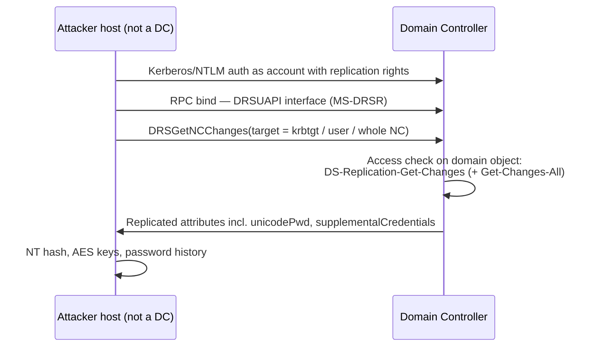

# DCSync

<div class="dfir-meta" markdown>
**MITRE ATT&CK:** T1003.006 (OS Credential Dumping: DCSync) · **Tactic:** Credential Access · **Last updated:** 2026-10-07
</div>

!!! abstract "Summary"
    Domain controllers keep each other in sync with the **Directory Replication Service (DRS) Remote Protocol**. Any account holding the *replication* rights on the domain object can call `DRSGetNCChanges` and receive password hashes — exactly as a DC would. DCSync abuses this: from an ordinary workstation, with no code running on the DC and no file copied, the attacker pulls the hash of `krbtgt`, a Domain Admin, or the whole domain. It is quieter than [NTDS.dit extraction](sam-ntds-extraction.md) and is usually the step right before a [Golden Ticket](golden-silver-tickets.md).

## How the attack works



Three extended rights matter, all granted on the **domain naming context root** (`DC=corp,DC=local`):

| Right | GUID | Why it matters |
|---|---|---|
| DS-Replication-Get-Changes | `1131f6aa-9c07-11d1-f79f-00c04fc2dcd2` | Needed for any replication |
| DS-Replication-Get-Changes-All | `1131f6ad-9c07-11d1-f79f-00c04fc2dcd2` | Needed to receive **secret** attributes (password hashes) |
| DS-Replication-Get-Changes-In-Filtered-Set | `89e95b76-444d-4c62-991a-0facbeda640c` | Filtered attribute set (RODC-related) |

By default these are held by **Domain Controllers, Enterprise DCs, Administrators, Domain Admins and Enterprise Admins**. Attackers either use a stolen DA credential, or quietly **grant the rights to a low-profile account** as persistence — the ACL change is the stealthiest part of the whole technique.

## Attacker tooling / commands

```text
# Mimikatz
lsadump::dcsync /domain:corp.local /user:krbtgt
lsadump::dcsync /domain:corp.local /all /csv

# Impacket
secretsdump.py -just-dc        CORP/da_user@dc01.corp.local
secretsdump.py -just-dc-user krbtgt CORP/da_user@dc01.corp.local

# Persistence variant — grant DCSync rights to a normal account (PowerView)
Add-DomainObjectAcl -TargetIdentity "DC=corp,DC=local" -PrincipalIdentity svc_backup -Rights DCSync
```

## Affected Windows versions

DCSync is not an OS bug — it is the replication protocol working as designed. It works against **every Active Directory version from Windows 2000 Server to Server 2025**. The *client* the attacker runs from can be any OS (Windows or Linux with Impacket). What changes by version is only your ability to detect and restrict it (see the remediation table).

## Artifacts left behind

| Where | Artifact | What to look for |
|---|---|---|
| **DC** Security log | **4662** (an operation was performed on an object) with `Properties` containing the Get-Changes / Get-Changes-All GUIDs above, and `Account_Name` that is **not a DC computer account (`...$`)** | The core detection. Requires **Audit Directory Service Access** enabled and an auditing SACL on the domain object |
| DC Security log | **4624 Type 3** from the attacker's IP shortly before, same account | Ties the replication request to a source host |
| DC Security log | **5136** (directory object modified) on the domain root, `nTSecurityDescriptor` changed | Someone **granted** DCSync rights — the persistence variant |
| Network | [Zeek `dce_rpc.log`](../network/zeek/index.md) — `endpoint=drsuapi`, `operation=DRSGetNCChanges` from an IP that is **not a DC** | Same signal on the wire, catches it even if 4662 auditing is off |
| Network | Zeek `conn.log` — 135/tcp then a high dynamic RPC port from a workstation to a DC | Supporting context |
| Attacker host | [Prefetch](../windows/prefetch.md)/[Amcache](../windows/amcache.md) for mimikatz/renamed binaries; Python for Impacket on a Linux jump box | Where the request came from |

## Detection

=== "Splunk — 4662 replication from non-DC"

    ```spl
    index=botsv3 sourcetype=WinEventLog EventCode=4662
    | where match(Properties,"(?i)1131f6aa-9c07-11d1-f79f-00c04fc2dcd2|1131f6ad-9c07-11d1-f79f-00c04fc2dcd2|89e95b76-444d-4c62-991a-0facbeda640c")
    | where NOT match(Account_Name,"\$$")
    | stats count, values(Properties) as rights by host, Account_Name, Logon_ID
    ```

    `4662` = an operation was performed on an AD object. `Properties` holds the GUIDs of the rights exercised; the first `where` keeps only replication rights. The second `where` drops accounts ending in `$` (DC computer accounts, which replicate legitimately). A **user** account doing replication is DCSync — or an AD Connect / backup service you must baseline and allow-list by name. `Logon_ID` lets you join to the matching 4624 to find the source IP.

=== "Splunk — rights granted (persistence)"

    ```spl
    index=botsv3 sourcetype=WinEventLog EventCode=5136 LDAP_Display_Name=nTSecurityDescriptor
    | where match(Value,"(?i)1131f6aa|1131f6ad|89e95b76")
    | table _time, host, Account_Name, DN, Value
    ```

    `5136` = a directory service object was modified. When the modified attribute is the security descriptor and the new value contains a replication-right GUID, someone has just granted DCSync to a principal. `DN` shows which object was changed (should be the domain root).

=== "Zeek — dce_rpc.log"

    ```bash
    zeek-cut ts id.orig_h id.resp_h endpoint operation < dce_rpc.log \
      | awk '$5=="DRSGetNCChanges"' \
      | grep -v -F -f known_dc_ips.txt
    ```

    `dce_rpc.log` records each RPC call. Keep only `DRSGetNCChanges` and remove lines whose source is a known DC — what remains is replication requested by a non-DC.

## Response

Assume every hash requested is compromised. If `krbtgt` was pulled, start the **double krbtgt reset** immediately (see [Golden & Silver tickets](golden-silver-tickets.md)). Reset the account used for the DCSync and investigate how it got the rights — run a full ACL review of the domain root (`Get-Acl "AD:DC=corp,DC=local"` or BloodHound) and **remove any non-default principal holding replication rights**.

### Remediation by Windows version

| Control | What it does | Available on |
|---|---|---|
| Audit **Directory Service Access** + SACL on domain root | Generates 4662 for replication rights | Advanced audit policy: **2008 R2+** DCs (basic DS Access auditing exists on 2003) |
| Audit **Directory Service Changes** | Generates 5136 for ACL changes | **2008+** DCs |
| Minimise holders of replication rights; quarterly ACL review | Fewer accounts that can DCSync | All AD versions |
| **Tiered administration** — DA credentials only on Tier 0 | Prevents DA hashes being harvested on workstations in the first place | Process control — all versions |
| **Protected Users** group for admins | No NTLM, no RC4, no delegation, short TGT → harder to obtain a usable DA credential | Domain functional level **2012 R2+**; client protections on 8.1 / 2012 R2+ (7 / 2008 R2 via KB2871997) |
| Network ACL: only DCs may reach other DCs' RPC dynamic ports | Workstations cannot call DRSUAPI directly | Firewall / host firewall — all versions |
| Microsoft Defender for Identity (or equivalent) | Built-in "suspected DCSync" detection on DC traffic | DCs **2012 R2+** (sensor support) |

## References

- [MITRE ATT&CK — T1003.006](https://attack.mitre.org/techniques/T1003/006/)
- [Microsoft — MS-DRSR IDL_DRSGetNCChanges](https://learn.microsoft.com/openspecs/windows_protocols/ms-drsr/)
- Pages: [SAM & NTDS extraction](sam-ntds-extraction.md) · [Golden & Silver tickets](golden-silver-tickets.md) · [Lateral movement / domain playbook](../playbooks/lateral-domain.md)
