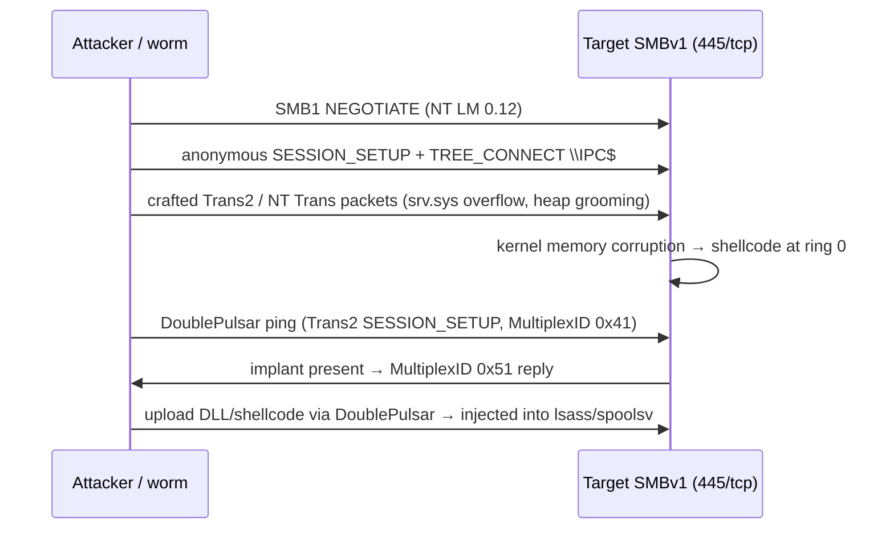

# EternalBlue & SMBv1 Exploitation

<div class="dfir-meta" markdown>
**MITRE ATT&CK:** T1210 (Exploitation of Remote Services) · T1190 (Exploit Public-Facing Application, if 445 is exposed) · **CVE / bulletin:** MS17-010 (CVE-2017-0143 → 0148) · **Tactic:** Lateral Movement / Initial Access · **Last updated:** 2026-10-07
</div>

!!! abstract "Summary"
    **EternalBlue** exploits a buffer overflow in the **SMBv1** server (`srv.sys`) to run code in the kernel as SYSTEM — **no credentials, no user interaction**. Leaked from the NSA's toolset by the Shadow Brokers in April 2017, it powered the **WannaCry** and **NotPetya** worms within weeks and remains in use against unpatched internal hosts, OT/embedded Windows and forgotten servers. Its companion **DoublePulsar** is a kernel backdoor implant that EternalBlue usually installs. On a modern patched network this page is mostly about **legacy hosts** — which is why it matters for a version-by-version view.

## How the attack works



## Attacker tooling / commands

```text
nmap -p445 --script smb-vuln-ms17-010 10.0.0.0/24     # scanning (also used by defenders)
msfconsole: exploit/windows/smb/ms17_010_eternalblue    # 7 / 2008 R2 x64 most reliable
            exploit/windows/smb/ms17_010_psexec         # EternalRomance/Synergy/Champion — older + 2012/2016
            auxiliary/scanner/smb/smb_ms17_010
# Worms: WannaCry, NotPetya (also used PsExec/WMI with stolen creds), various coin miners
```

## Affected Windows versions

| Version | MS17-010 status | Notes |
|---|---|---|
| **XP / Server 2003** | Vulnerable — **out-of-band patch KB4012598** released May 2017 after WannaCry | Exploits less stable (often BSOD) but works |
| **Vista / 2008** | Vulnerable — patched March 2017 | |
| **7 / 2008 R2** | Vulnerable — patched March 2017 | **Primary target**; most reliable exploit path |
| **8 / 8.1 / 2012 / 2012 R2** | Vulnerable — patched (8 via KB4012598 OOB) | EternalBlue less reliable; EternalRomance/Synergy variants used |
| **10 ≤ 1607 / 2016** | Vulnerable — patched March 2017 | |
| **10 1703+ / 2019 / 11 / 2022 / 2025** | Not vulnerable as shipped | SMBv1 **not installed by default** on clean installs of 10 1709+ / 2016 1709+ (server component), and absent from modern 11 |

The protocol, not just the bug, is the problem: SMBv1 also lacks pre-auth integrity and modern encryption, and other SMBv1 bugs exist. Microsoft's guidance since 2014 has been to **remove SMBv1 entirely**.

## Artifacts left behind

| Where | Artifact | What to look for |
|---|---|---|
| Network | IDS signatures (Suricata/Snort ET `ETERNALBLUE`, `DOUBLEPULSAR`) | Exploit and implant traffic — the most reliable detection |
| Network | [Zeek `conn.log`](../network/zeek/conn-log.md) — one source to **many** hosts on 445; SMB1 dialect in `smb` analyzer logs | Worm-style scanning |
| Network | Trans2 `SESSION_SETUP` with MultiplexID **0x41** request / **0x51 / 0x52** response | DoublePulsar check-in |
| Host | System log **BSOD / unexpected reboot** (41, 1001 BugCheck) on old hosts | Failed exploit attempts crash the kernel |
| Host | Payload behaviour — new services (7045), `lsass.exe` / `spoolsv.exe` spawning `cmd.exe` or `rundll32.exe` | Post-exploitation from kernel-injected code |
| Host | WannaCry: `tasksche.exe`, `mssecsvc.exe` service, `@WanaDecryptor@.exe`, `.WNCRY` files | Known family artifacts |
| Memory | DoublePulsar hooks in `srv.sys` dispatch table (Volatility) | Implant in kernel |
| Host config | `Get-SmbServerConfiguration`: `EnableSMB1Protocol=True` | Exposure |

## Detection

=== "Splunk — SMB fan-out"

    ```spl
    index=botsv3 sourcetype=bro:conn:json id.resp_p=445
    | bin _time span=5m
    | stats dc(id.resp_h) as targets by _time, id.orig_h
    | where targets > 25
    | sort - targets
    ```

    Zeek `conn.log` in Splunk (`bro:conn:json`): every connection with source (`id.orig_h`), destination (`id.resp_h`) and destination port (`id.resp_p`). Counting distinct destinations on 445 per source per five minutes finds worms and scanners; normal clients talk to a handful of file servers.

=== "Splunk — services / lsass children after exploitation"

    ```spl
    index=botsv3 sourcetype="XmlWinEventLog:Microsoft-Windows-Sysmon/Operational" EventID=1
    | eval parent=lower(replace(ParentImage,".*\\\\",""))
    | where parent IN ("lsass.exe","spoolsv.exe","services.exe") AND match(lower(Image),"cmd\.exe|powershell\.exe|rundll32\.exe")
    | table _time, host, parent, Image, CommandLine
    ```

    DoublePulsar typically injects into `lsass.exe` or `spoolsv.exe`. Those processes almost never start shells.

=== "PowerShell — find SMBv1 exposure"

    ```powershell
    Get-SmbServerConfiguration | Select EnableSMB1Protocol        # 8 / 2012+
    Get-WindowsOptionalFeature -Online -FeatureName SMB1Protocol  # 8.1 / 10 / 11
    # 7 / 2008 R2: HKLM\SYSTEM\CurrentControlSet\Services\LanmanServer\Parameters\SMB1 (absent or 1 = enabled)
    ```

## Response

Isolate infected hosts at the network level immediately — this is wormable. Block 445 between workstation subnets, patch or isolate every host found with SMBv1 + missing MS17-010, and scan memory of suspect hosts for DoublePulsar. For WannaCry-type ransomware, follow the [Ransomware playbook](../playbooks/ransomware.md).

### Remediation by Windows version

| Control | What it stops | Available on |
|---|---|---|
| **MS17-010** (March 2017) / **KB4012598** for XP, 2003, 8 | EternalBlue/Romance/Synergy | All listed versions |
| **Remove SMBv1** — `Disable-WindowsOptionalFeature -FeatureName SMB1Protocol` / `Set-SmbServerConfiguration -EnableSMB1Protocol $false` | The whole SMBv1 attack class | 8.1 / 2012 R2+ as feature; 7 / 2008 R2 via registry; **XP / 2003 cannot run without SMBv1** → isolate |
| Audit SMBv1 usage first (`Set-SmbServerConfiguration -AuditSmb1Access $true`, event **3000** in `SMBServer/Audit`) | Find legacy clients before removing | 10 / 2016+ |
| Block **445/139** at the perimeter and between workstation segments | External exposure & worm spread | All (host firewall Vista+; XP SP2 basic firewall) |
| Network segmentation / isolation for un-patchable legacy (OT, medical, embedded XP) | Exposure of hosts you cannot fix | All |
| IDS with ET rules at internal choke points | Detection | Network |

## References

- [Microsoft — MS17-010](https://learn.microsoft.com/security-updates/securitybulletins/2017/ms17-010)
- [Microsoft — Customer guidance for WannaCrypt (XP/2003 OOB patch)](https://msrc.microsoft.com/blog/2017/05/customer-guidance-for-wannacrypt-attacks/)
- [Microsoft — How to detect, enable and disable SMBv1](https://learn.microsoft.com/windows-server/storage/file-server/troubleshoot/detect-enable-and-disable-smbv1-v2-v3)
- Pages: [PsExec & SMB](psexec-smb.md) · [Zeek conn.log](../network/zeek/conn-log.md) · [Ransomware playbook](../playbooks/ransomware.md)
