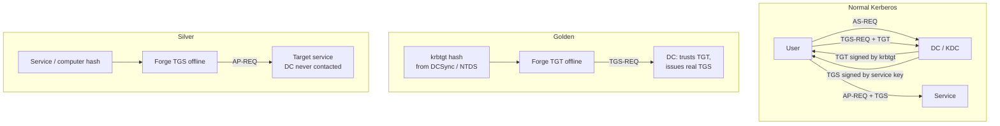

# Golden, Silver Tickets & Pass-the-Ticket

<div class="dfir-meta" markdown>
**MITRE ATT&CK:** T1558.001 (Golden Ticket) · T1558.002 (Silver Ticket) · T1550.003 (Pass the Ticket) · **Tactic:** Credential Access / Lateral Movement · **Last updated:** 2026-10-07
</div>

!!! abstract "Summary"
    Kerberos trusts any ticket encrypted with the right key. **Pass-the-Ticket** reuses a real ticket stolen from memory. A **Golden Ticket** is a *forged TGT* signed with the `krbtgt` key — it lets the attacker be any user, in any group, to any service in the domain, for as long as the `krbtgt` password is unchanged. A **Silver Ticket** is a *forged service ticket (TGS)* signed with one service account's or computer account's key — narrower, but it never touches the DC, so DC logs see nothing. These are the techniques that turn a one-time compromise into long-term domain persistence.

## How the attack works



| Variant | Key needed | What it gives | Touches the DC? |
|---|---|---|---|
| Pass-the-Ticket | None — steal an existing ticket from LSASS | That user's access until the ticket expires (default 10 h, renewable 7 days) | Only for new TGS requests |
| **Golden** | `krbtgt` NT hash or AES key | Any identity, any group, domain-wide | Yes — for TGS requests (but **no AS-REQ / 4768**) |
| **Silver** | Target service account / computer account key | Any identity to **that one service** (CIFS, HOST, HTTP, MSSQL…) | **No** |
| Diamond / Sapphire | `krbtgt` key + a real TGT | Modifies a *real* TGT's PAC instead of forging from scratch — evades "TGS without TGT" detections | Yes |

## Attacker tooling / commands

```text
# Pass-the-Ticket — export and inject
mimikatz  sekurlsa::tickets /export
mimikatz  kerberos::ptt  ticket.kirbi
Rubeus.exe dump  /  Rubeus.exe ptt /ticket:<base64>

# Golden ticket (needs krbtgt key + domain SID)
mimikatz  kerberos::golden /user:Administrator /domain:corp.local /sid:S-1-5-21-... /krbtgt:<hash> /ptt
ticketer.py -nthash <krbtgt> -domain-sid S-1-5-21-... -domain corp.local Administrator

# Silver ticket (service key + SPN)
mimikatz  kerberos::golden /user:x /domain:corp.local /sid:S-1-5-21-... /target:fs01.corp.local /service:cifs /rc4:<fs01$ hash> /ptt
```

## Affected Windows versions

Kerberos ticket forging works against **every Active Directory domain (2000 → 2025)** because it uses valid keys. Some modern updates make *sloppy* forgeries fail:

| Change | Effect on forged tickets | Applies to |
|---|---|---|
| **KB5008380** (Nov 2021, CVE-2021-42287 "noPac") — PAC *requestor* validation; enforced by default from Oct 2022 | Golden tickets for **non-existent usernames / mismatched RIDs** are rejected; attacker must forge a real account | All supported DCs (2012 R2 → 2022 at the time) |
| **KB5020805** (Nov 2022, CVE-2022-37967) — new PAC signatures; enforcement phased in through 2023 | Older tools that do not compute the new full-PAC signature produce tickets patched DCs reject | Supported DCs patched to 2023+ |
| Disabling RC4 / AES-only domain | RC4-encrypted forged tickets (`/rc4:`) stand out or fail; attacker must use AES keys | Configurable 2008+; RC4 deprecation continuing in 2025-era Windows Server |

None of these stop a forgery built with **current tools and the real `krbtgt` AES key**. The only real fix after `krbtgt` theft is rotating it.

## Artifacts left behind

| Where | Artifact | What to look for |
|---|---|---|
| DC Security log | **4769** (service ticket requested) for an account with **no preceding 4768** (TGT requested) from that host | Golden ticket — the TGT was never issued by this DC |
| DC Security log | 4769 / 4624 where `Account_Domain` is odd (lowercase FQDN, blank, `eo.oe.kiwi`), or the account name does not exist | Classic forgery mistakes |
| Target host Security log | **4624 Type 3** with Kerberos auth for a user, but **no 4769 on any DC** for that service at that time | **Silver ticket** — only visible on the target |
| Target host | **4627** group membership in the logon showing unexpected privileged groups (e.g. RID 512, 519) for a normal user | Forged PAC claims |
| Host (attacker) | `klist` showing TGT lifetime of **10 years** (mimikatz default) | Golden ticket in the session |
| Memory | Kerberos tickets in LSASS — see [Memory: credentials](../memory/credentials-registry.md) | Injected tickets |
| Network | [Zeek `kerberos.log`](../network/zeek/index.md) — TGS-REQ from a client with no AS-REQ in the window; `till` far in the future | Golden ticket on the wire |

## Detection

=== "Splunk — TGS without TGT (golden)"

    ```spl
    index=botsv3 sourcetype=WinEventLog (EventCode=4768 OR EventCode=4769) Failure_Code=0x0
    | eval user=lower(mvindex(split(Account_Name,"@"),0))
    | eval ip=replace(Client_Address,"::ffff:","")
    | stats values(EventCode) as codes, min(_time) as first by user, ip
    | where mvcount(codes)=1 AND codes="4769"
    | where NOT match(user,"\$$")
    | convert ctime(first)
    ```

    `4768` = a TGT was requested (AS-REQ); `4769` = a service ticket was requested (TGS-REQ). `split(...,"@")` + `mvindex(...,0)` strips the `@DOMAIN` suffix. `stats values(EventCode)` collects which event types each user/IP pair produced; `mvcount(codes)=1 AND codes="4769"` keeps pairs that asked for service tickets but **never** got a TGT. Run over a window longer than the TGT lifetime (e.g. 24 h) to avoid false positives from tickets issued before the search window.

=== "Splunk — impossible account details"

    ```spl
    index=botsv3 sourcetype=WinEventLog ((EventCode=4624 Authentication_Package=Kerberos) OR EventCode=4769)
    | where Account_Domain!="CORP" AND Account_Domain!="corp.local" AND isnotnull(Account_Domain)
    | stats count by EventCode, Account_Name, Account_Domain, host
    ```

    Replace `CORP` / `corp.local` with your NetBIOS and DNS domain names. Forged tickets often carry a domain field that no real logon would produce.

=== "Splunk — silver ticket (target side)"

    ```spl
    index=botsv3 sourcetype=WinEventLog EventCode=4624 Logon_Type=3 Authentication_Package=Kerberos
    | eval key=lower(Account_Name)."|".lower(host)
    | join type=left key
        [ search index=botsv3 sourcetype=WinEventLog EventCode=4769
          | eval key=lower(mvindex(split(Account_Name,"@"),0))."|".lower(mvindex(split(Service_Name,"$"),0))
          | stats count as tgs by key ]
    | where isnull(tgs)
    | table _time, host, Account_Name, Source_Network_Address
    ```

    For every Kerberos network logon on a server, look for a matching 4769 on the DCs for the same user and that server. `join type=left` keeps logons even when no match exists; `isnull(tgs)` keeps only those with no DC-issued ticket — a silver-ticket candidate. Expensive; scope to high-value servers.

## Response

**Pass-the-Ticket:** purge tickets (`klist purge`) on affected hosts, reset the user, and find where the ticket was stolen (the LSASS access). **Golden ticket:** reset `krbtgt` **twice**, waiting for replication (and at least the maximum ticket lifetime, default 10 h) between resets — the first reset leaves the old key valid as "previous password", the second removes it. Use Microsoft's `New-KrbtgtKeys.ps1` script to do this safely. **Silver ticket:** reset the targeted computer/service account password (computer accounts: `Reset-ComputerMachinePassword` or rejoin). In all cases, find the original key theft ([DCSync](dcsync.md), [NTDS](sam-ntds-extraction.md), [LSASS](lsass-dumping.md)) or you will be forged again.

### Remediation by Windows version

| Control | What it stops | Available on |
|---|---|---|
| Rotate `krbtgt` routinely (e.g. every 180 days) and after any DC compromise | Limits Golden ticket lifetime | All AD versions |
| Patch DCs (KB5008380, KB5020805 and later) | Rejects many naive forgeries | Supported DCs — out-of-support DCs (2003/2008/2012) **cannot** get these protections |
| **Credential Guard** on endpoints | TGTs and keys isolated from LSASS — limits PtT theft | 10 Enterprise/Education 1511+, Server 2016+; default-on for qualifying 11 22H2+ Enterprise |
| **Protected Users** | 4-hour non-renewable TGT, AES only, no delegation | DFL 2012 R2+ |
| Disable **RC4** for Kerberos (`msDS-SupportedEncryptionTypes`, GPO "Configure encryption types allowed for Kerberos") | RC4-based forgeries and roasting | Configurable 7 / 2008 R2+ |
| Rotate computer account passwords (default 30 days — don't disable) | Silver ticket lifetime | All versions |
| **PAC validation** on services | Service asks the DC to verify the PAC — kills silver tickets for that service | Configurable; off by default for services running as LocalSystem |

## References

- [MITRE ATT&CK — T1558.001](https://attack.mitre.org/techniques/T1558/001/) · [T1558.002](https://attack.mitre.org/techniques/T1558/002/) · [T1550.003](https://attack.mitre.org/techniques/T1550/003/)
- [Microsoft — KB5008380 PAC changes](https://support.microsoft.com/help/5008380) · [KB5020805](https://support.microsoft.com/help/5020805)
- Pages: [DCSync](dcsync.md) · [Kerberoasting](kerberoasting.md) · [Windows Event IDs](../basics/windows-event-ids.md)
