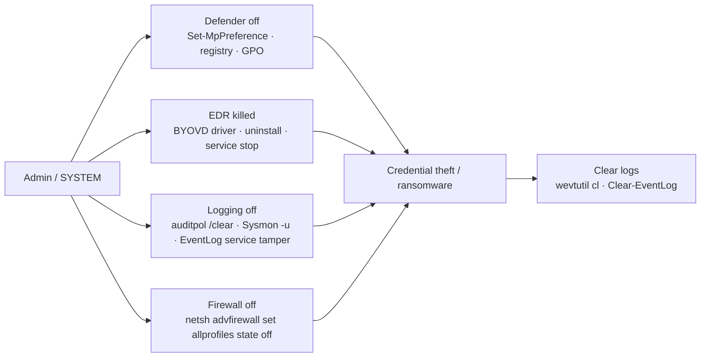

# Impair Defenses & Log Clearing

<div class="dfir-meta" markdown>
**MITRE ATT&CK:** T1562.001 (Disable or Modify Tools) · T1562.002 (Disable Windows Event Logging) · T1562.004 (Disable or Modify System Firewall) · T1070.001 (Clear Windows Event Logs) · **Tactic:** Defense Evasion · **Last updated:** 2026-10-07
</div>

!!! abstract "Summary"
    Before the noisy part of an intrusion — credential dumping, mass encryption — attackers switch off what would see them: Defender real-time protection, EDR agents, Sysmon, audit policy, the firewall. Afterwards they clear event logs to slow the investigation. Ransomware operators do both as standard procedure, often by script across hundreds of hosts at once. The good news: **turning off a sensor is itself loud**, and logs already forwarded off the host cannot be cleared.

## How the attack works



**BYOVD (Bring Your Own Vulnerable Driver)** deserves special mention: the attacker loads a legitimately signed but vulnerable kernel driver, then uses it to kill protected EDR processes from kernel mode. Tools like *EDRSandBlast*, *Terminator* / *Spyboy*, *AuKill* and the drivers they use (`RTCore64.sys`, `gdrv.sys`, `procexp152.sys`, `zamguard64.sys`) are now routine in ransomware intrusions.

## Attacker tooling / commands

```text
# Defender
Set-MpPreference -DisableRealtimeMonitoring $true -DisableIOAVProtection $true
Add-MpPreference -ExclusionPath C:\ -ExclusionExtension .exe
reg add "HKLM\SOFTWARE\Policies\Microsoft\Windows Defender" /v DisableAntiSpyware /t REG_DWORD /d 1
"C:\Program Files\Windows Defender\MpCmdRun.exe" -RemoveDefinitions -All

# Logging
auditpol /clear /y          ·   auditpol /set /category:* /success:disable /failure:disable
sysmon64.exe -u force
wevtutil sl Security /e:false
# EventLog service thread killing (Invoke-Phant0m) — service stays "running" but logs nothing

# Clearing
wevtutil cl Security  ·  wevtutil el | foreach { wevtutil cl $_ }
Clear-EventLog -LogName Security,System,Application

# Firewall
netsh advfirewall set allprofiles state off
```

## Affected Windows versions

| Version | Notes |
|---|---|
| **XP / 2003** | Event logs are `.evt` files; no built-in AV (Windows Firewall from XP SP2). Clearing logs any admin; **517** = "audit log was cleared" (old ID) |
| **Vista / 2008 → 7** | `.evtx`, `wevtutil`, Windows Firewall with Advanced Security. **1102** (Security cleared) / **104** (other logs cleared) introduced. Defender = anti-spyware only; MSE optional on 7 |
| **8 / 8.1 / 2012 R2** | Defender becomes full AV (8+); `Set-MpPreference` available |
| **10 / 2016 / 2019** | Tamper Protection (1903+); ETW-TI; Vulnerable Driver Blocklist (opt-in on older builds) |
| **11 / 2022 / 2025** | **Vulnerable Driver Blocklist on by default** (11 22H2+ / with HVCI); Tamper Protection on by default for consumer and many managed devices; `DisableAntiSpyware` policy ignored on modern Defender platforms |

## Artifacts left behind

| Where | Artifact | What to look for |
|---|---|---|
| Security log | **1102** — the audit log was cleared (includes **who** cleared it) | Always investigate; legitimate clears are extremely rare |
| System log | **104** — a log (System, Application, PowerShell, Sysmon…) was cleared | Same, for non-Security logs |
| Security log | **1100** — event logging service shut down | Logging stopped (or the host shut down — check System 6006/6008) |
| Security log | **4719** — system audit policy was changed (subcategory success/failure removed) | `auditpol` tampering |
| Defender Operational | **5001** (real-time protection disabled), **5007** (configuration changed — shows old/new value incl. exclusions), **5010/5012** (scanning disabled), **5013** (Tamper Protection blocked a change) | Defender tampering; 5013 = attempt blocked |
| System log | **7036/7040** service stopped/start type changed for `WinDefend`, `Sense`, `Sysmon64`, EDR services; **7045** new kernel-driver service (BYOVD) | Sensor shutdown / vulnerable driver load |
| Sysmon | **4** (Sysmon service state changed), **16** (Sysmon config changed), **6** (driver loaded — check `Signature` and hash against loldrivers.io) | Sysmon tampering and BYOVD |
| Firewall | `Microsoft-Windows-Windows Firewall With Advanced Security/Firewall` **2003** (profile setting changed), **2004/2005/2006** rule added/modified/deleted | Firewall disabled or rule added for C2 |
| SIEM side | **A host that stops sending events** while it is still on the network | The most robust detection of all — heartbeat monitoring |

## Detection

=== "Splunk — log clearing"

    ```spl
    index=botsv3 ((sourcetype=WinEventLog:Security EventCode=1102) OR (sourcetype=WinEventLog:System EventCode=104) OR (sourcetype=WinEventLog EventCode IN (1102,104)))
    | eval who=coalesce(Account_Name, SubjectUserName, user)
    | table _time, host, EventCode, who, Message
    ```

    `1102` = Security log cleared; `104` = any other log cleared. `coalesce()` picks the first non-empty user field because the field name differs by event and TA version. Alert on every hit.

=== "Splunk — Defender tampering"

    ```spl
    index=botsv3 source="*Windows Defender/Operational*" EventCode IN (5001,5007,5010,5012,5013)
    | eval detail=coalesce(New_Value, Message)
    | table _time, host, EventCode, detail
    | sort 0 host _time
    ```

    `5007` is the most useful: its `New_Value` shows the exact setting changed, e.g. `...\Exclusions\Paths\C:\` — an attacker excluding the whole drive. `5013` means Tamper Protection blocked the change (attempted, not successful — still a compromise indicator).

=== "Splunk — silent hosts (heartbeat)"

    ```spl
    | tstats latest(_time) as last_seen where index=botsv3 by host
    | eval hours_silent=round((now()-last_seen)/3600,1)
    | where hours_silent > 2
    | sort - hours_silent
    | convert ctime(last_seen)
    ```

    `tstats` reads indexed metadata very fast (no raw events). It returns each host's most recent event time; hosts silent for more than two hours are either off — or blinded. Cross-check with DHCP/network data that the host is still alive.

## Response

A 1102/104 or Defender disable during an incident means the attacker is active **right now** on that host — prioritise containment. Recover the cleared events from your SIEM/WEF copy; on the host, carve `.evtx` records from unallocated space and check the VSS copies of `C:\Windows\System32\winevt\Logs`. Remove any Defender exclusions added (`Get-MpPreference | Select Exclusion*`), and check for vulnerable driver services (7045 with `Type: kernel mode driver`).

### Remediation by Windows version

| Control | What it stops | Available on |
|---|---|---|
| **Forward logs off-host** in near real time (WEF → collector, or SIEM agent) | Makes clearing ineffective | WEF Vista / 2008+ (XP SP2 / 2003 SP1 with WinRM add-on) |
| **Tamper Protection** | Defender settings changes from local admin/scripts | 10 1903+, 11, Server 2016+ onboarded to Defender for Endpoint |
| **Vulnerable Driver Blocklist** + **HVCI** | BYOVD EDR killers | 10 (opt-in, 1809+), **default on 11 22H2+** |
| EDR tamper protection / uninstall password | Agent removal | Vendor-dependent |
| Audit-policy change auditing (4719) + GPO-enforced audit policy re-applied every refresh | `auditpol /clear` persisting | 2008+ advanced audit policy |
| SIEM **heartbeat / missing-host** alert | Every blinding technique, including Invoke-Phant0m | All |
| Restrict local admin, LAPS, Tiering | All of the above require admin | All |

## References

- [MITRE ATT&CK — T1562.001](https://attack.mitre.org/techniques/T1562/001/) · [T1070.001](https://attack.mitre.org/techniques/T1070/001/)
- [LOLDrivers — vulnerable driver list](https://www.loldrivers.io/)
- [Microsoft — Vulnerable driver blocklist](https://learn.microsoft.com/windows/security/application-security/application-control/app-control-for-business/design/microsoft-recommended-driver-block-rules)
- Pages: [Event logs](../windows/event-logs.md) · [Ransomware playbook](../playbooks/ransomware.md) · [Windows Event IDs](../basics/windows-event-ids.md)
