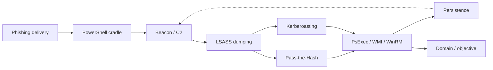

# Adversary Techniques

Attack techniques mapped to MITRE ATT&CK, each written the same way: **how the attack works → attacker commands → artifacts left behind (host + network) → detection (Splunk/Zeek) → response**. Every page links back to the [Windows](../windows/index.md), [Network](../network/index.md) and [Splunk](../splunk/index.md) sections where the underlying artifacts and queries live.

## By ATT&CK tactic

| Tactic | Technique | Page |
|---|---|---|
| Initial Access / Execution | Phishing → user execution (macro, LNK, ISO, cradle) | [Phishing delivery](phishing-delivery.md) |
| Execution / Defense Evasion | PowerShell download cradles & encoded commands | [PowerShell cradles](powershell-cradles.md) |
| Credential Access | LSASS memory dumping | [LSASS dumping](lsass-dumping.md) |
| Credential Access | Kerberoasting | [Kerberoasting](kerberoasting.md) |
| Lateral Movement / Defense Evasion | Pass-the-Hash | [Pass-the-Hash](pass-the-hash.md) |
| Lateral Movement / Execution | PsExec & SMB admin shares | [PsExec & SMB](psexec-smb.md) |
| Lateral Movement / Execution | WMI & WinRM remote execution | [WMI & WinRM](wmi-winrm.md) |
| Persistence | Services, scheduled tasks, Run keys | [Persistence](persistence.md) |

## A typical intrusion, in this section's pages

Read left to right: a lure runs a cradle, the cradle plants a beacon, the operator dumps LSASS for credentials, uses those to Kerberoast or pass-the-hash, moves laterally with PsExec/WMI/WinRM, and drops persistence on each new host. Each box is a page; each transition is a place to detect and contain.

## Pages

-   **[Phishing delivery](phishing-delivery.md)** — macro/LNK/ISO → shell, download cradles, Mark-of-the-Web
-   **[PowerShell cradles](powershell-cradles.md)** — `-enc` decoding, 4104 scoring, in-memory loading
-   **[LSASS dumping](lsass-dumping.md)** — Sysmon 10 access masks, comsvcs/procdump, credential theft
-   **[Kerberoasting](kerberoasting.md)** — 4769 RC4, SPN enumeration, offline cracking
-   **[Pass-the-Hash](pass-the-hash.md)** — NTLM type-3/type-9, hash reuse
-   **[PsExec & SMB](psexec-smb.md)** — ADMIN$ write + 7045 service chain
-   **[WMI & WinRM](wmi-winrm.md)** — wmiprvse/wsmprovhost parents, WMI persistence
-   **[Persistence](persistence.md)** — services, tasks, Run keys, and the wider ASEP list

## How to use these pages in an investigation

Start from what you observed (a suspicious process, an alert, a beacon) and read the matching page's **artifacts** table to know what else to collect, then run its **detection** queries to scope how far it spread. The **response** section says what to contain and rotate. For the underlying mechanics — what a given event ID means, how an artifact is parsed, the exact SPL commands — follow the links into [Windows](../windows/index.md), [Network](../network/index.md) and [Splunk](../splunk/index.md).

!!! info "Adding a technique"
    `python new.py adversary/<name> -t technique` — the template already has the five-part structure. It appears in the sidebar automatically.
