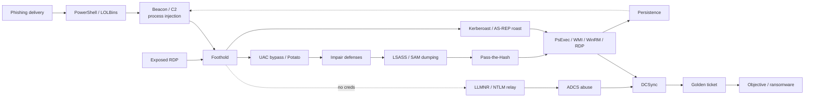

# Adversary Techniques

Attack techniques mapped to MITRE ATT&CK, each written the same way: **how the attack works → attacker commands → affected Windows versions → artifacts left behind (host + network) → detection (Splunk/Zeek) → response and remediation by Windows version**. Every page links back to the [Windows](../windows/index.md), [Network](../network/index.md) and [Splunk](../splunk/index.md) sections where the underlying artifacts and queries live.

!!! tip "Start here for mixed-version environments"
    [Hardening by Windows version](hardening-by-version.md) is the cross-reference: every control from XP / 2003 to 11 / Server 2025 in one matrix, plus a technique → control map.

## By ATT&CK tactic

| Tactic | Technique | ATT&CK | Page |
|---|---|---|---|
| Initial Access / Execution | Phishing → user execution (macro, LNK, ISO, cradle) | T1566, T1204 | [Phishing delivery](phishing-delivery.md) |
| Execution / Defense Evasion | PowerShell download cradles & encoded commands | T1059.001 | [PowerShell cradles](powershell-cradles.md) |
| Execution / Defense Evasion | Signed binary proxy execution (mshta, regsvr32, certutil…) | T1218, T1105 | [LOLBins](lolbins.md) |
| Credential Access | LSASS memory dumping | T1003.001 | [LSASS dumping](lsass-dumping.md) |
| Credential Access | SAM, LSA Secrets & NTDS.dit extraction | T1003.002/.003/.004 | [SAM & NTDS](sam-ntds-extraction.md) |
| Credential Access | DCSync | T1003.006 | [DCSync](dcsync.md) |
| Credential Access | Kerberoasting | T1558.003 | [Kerberoasting](kerberoasting.md) |
| Credential Access | AS-REP roasting | T1558.004 | [AS-REP roasting](asrep-roasting.md) |
| Credential Access / Persistence | Golden, Silver tickets & Pass-the-Ticket | T1558.001/.002, T1550.003 | [Golden & Silver tickets](golden-silver-tickets.md) |
| Credential Access / Lateral Movement | LLMNR/NBT-NS poisoning, NTLM relay, coercion | T1557.001, T1187 | [LLMNR & NTLM relay](llmnr-ntlm-relay.md) |
| Credential Access / Priv Esc | AD Certificate Services abuse (ESC1/ESC8) | T1649 | [ADCS abuse](adcs-abuse.md) |
| Lateral Movement / Defense Evasion | Pass-the-Hash | T1550.002 | [Pass-the-Hash](pass-the-hash.md) |
| Lateral Movement / Execution | PsExec & SMB admin shares | T1021.002, T1569.002 | [PsExec & SMB](psexec-smb.md) |
| Lateral Movement / Execution | WMI & WinRM remote execution | T1047, T1021.006 | [WMI & WinRM](wmi-winrm.md) |
| Initial Access / Lateral Movement | RDP brute force, lateral RDP, session hijack | T1021.001, T1133, T1563.002 | [RDP](rdp.md) |
| Privilege Escalation | UAC bypass | T1548.002 | [UAC bypass](uac-bypass.md) |
| Privilege Escalation | Token impersonation & Potato attacks | T1134 | [Token & Potato](token-impersonation-potato.md) |
| Defense Evasion / Priv Esc | Process injection & hollowing | T1055 | [Process injection](process-injection.md) |
| Defense Evasion | Disabling AV/EDR/logging, BYOVD, log clearing | T1562, T1070.001 | [Impair defenses](impair-defenses-log-clearing.md) |
| Persistence | Services, scheduled tasks, Run keys | T1543.003, T1053.005, T1547.001 | [Persistence](persistence.md) |
| Lateral Movement (exploit) | EternalBlue / SMBv1 (MS17-010) | T1210 | [EternalBlue](eternalblue-smbv1.md) |
| Priv Esc / Lateral (exploit) | PrintNightmare & Print Spooler | T1068, T1210 | [PrintNightmare](printnightmare.md) |

## A typical intrusion, in this section's pages

```mermaid
flowchart LR
    P[Phishing delivery] --> PS[PowerShell / LOLBins]
    EXT[Exposed RDP] --> H
    PS --> BEA[Beacon / C2<br/>process injection]
    BEA --> H[Foothold]
    H --> ESC[UAC bypass / Potato]
    ESC --> EV[Impair defenses]
    EV --> L[LSASS / SAM dumping]
    H -.no creds.-> REL[LLMNR / NTLM relay]
    H --> K[Kerberoast / AS-REP roast]
    REL --> ADCS[ADCS abuse]
    L --> PTH[Pass-the-Hash]
    PTH --> LM[PsExec / WMI / WinRM / RDP]
    K --> LM
    LM --> PER[Persistence]
    ADCS --> DOM[DCSync]
    LM --> DOM
    DOM --> GT[Golden ticket]
    GT --> OBJ[Objective / ransomware]
    PER -.-> BEA
```

Read left to right: a lure or exposed RDP gives a foothold, the operator elevates and blinds sensors, steals credentials (from memory, disk, Kerberos or the network), moves laterally, reaches a DC via DCSync, and forges tickets for persistence. Each box is a page; each arrow is a place to detect and contain.

## Pages

-   **[Hardening by version](hardening-by-version.md)** — control matrix XP → 11, technique → control map
-   **[Phishing delivery](phishing-delivery.md)** — macro/LNK/ISO → shell, Mark-of-the-Web
-   **[PowerShell cradles](powershell-cradles.md)** — `-enc` decoding, 4104 scoring, in-memory loading
-   **[LOLBins](lolbins.md)** — mshta, regsvr32, certutil, BITS; parent/child and network tells
-   **[LSASS dumping](lsass-dumping.md)** — Sysmon 10 access masks, comsvcs/procdump
-   **[SAM & NTDS](sam-ntds-extraction.md)** — reg save, VSS, ntdsutil IFM, HiveNightmare
-   **[DCSync](dcsync.md)** — 4662 replication GUIDs, DRSUAPI on the wire
-   **[Kerberoasting](kerberoasting.md)** — 4769 RC4, SPN enumeration, offline cracking
-   **[AS-REP roasting](asrep-roasting.md)** — 4768 pre-auth type 0, DONT_REQ_PREAUTH
-   **[Golden & Silver tickets](golden-silver-tickets.md)** — TGS without TGT, krbtgt double reset
-   **[LLMNR & NTLM relay](llmnr-ntlm-relay.md)** — Responder, ntlmrelayx, name/IP mismatch
-   **[ADCS abuse](adcs-abuse.md)** — ESC1/ESC8, 4886/4887, PKINIT logons
-   **[Pass-the-Hash](pass-the-hash.md)** — NTLM type-3/type-9, hash reuse
-   **[PsExec & SMB](psexec-smb.md)** — ADMIN$ write + 7045 service chain
-   **[WMI & WinRM](wmi-winrm.md)** — wmiprvse/wsmprovhost parents, WMI persistence
-   **[RDP](rdp.md)** — Type 10, 1149, bitmap cache, tscon hijack
-   **[UAC bypass](uac-bypass.md)** — fodhelper/eventvwr registry hijacks
-   **[Token & Potato](token-impersonation-potato.md)** — SeImpersonate → SYSTEM
-   **[Process injection](process-injection.md)** — Sysmon 8/10/25, argument-less rundll32
-   **[Impair defenses](impair-defenses-log-clearing.md)** — 1102/104, Defender 5001/5007, BYOVD
-   **[Persistence](persistence.md)** — services, tasks, Run keys, ASEPs
-   **[EternalBlue](eternalblue-smbv1.md)** — MS17-010, SMBv1 removal by version
-   **[PrintNightmare](printnightmare.md)** — Spooler driver load, PrinterBug coercion

## How to use these pages in an investigation

Start from what you observed (a suspicious process, an alert, a beacon) and read the matching page's **artifacts** table to know what else to collect, then run its **detection** queries to scope how far it spread. The **response** section says what to contain and rotate, and the **remediation by Windows version** table says which fixes the affected hosts can actually take. For the underlying mechanics — what a given event ID means, how an artifact is parsed, the exact SPL commands — follow the links into [Windows](../windows/index.md), [Network](../network/index.md) and [Splunk](../splunk/index.md).

!!! info "Adding a technique"
    `python new.py adversary/<name> -t technique` — the template already has the five-part structure. Add an *Affected Windows versions* section and a *Remediation by Windows version* table to match the pages above, then add a row to [Hardening by version](hardening-by-version.md#technique-controls). It appears in the sidebar automatically.
