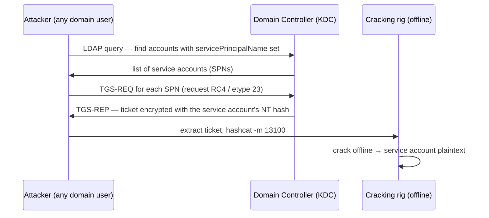

# Kerberoasting

<div class="dfir-meta" markdown>
**MITRE ATT&CK:** T1558.003 (Steal or Forge Kerberos Tickets: Kerberoasting) · **Tactic:** Credential Access · **Last updated:** 2026-09-17
</div>

!!! abstract "Summary"
    Any domain user can request a Kerberos service ticket (TGS) for any account that has a Service Principal Name (SPN). Part of that ticket is encrypted with the **service account's password hash**. The attacker requests tickets for service accounts, exports them, and cracks them **offline** — no traffic to the target service, no failed logons, just normal-looking Kerberos requests. Service accounts often have weak, never-expiring passwords, which is why this works.

## How the attack works



The DC hands out the ticket to *any* authenticated user — that is by design. Requesting **RC4 (etype 0x17/23)** instead of AES makes the hash far faster to crack, so tools downgrade on purpose.

## Attacker tooling / commands

```text
# Rubeus (Windows)
Rubeus.exe kerberoast /outfile:hashes.txt
Rubeus.exe kerberoast /rc4opsec        # only accounts that support RC4, quieter

# Impacket (Linux)
GetUserSPNs.py CORP/user:password -dc-ip 10.0.0.1 -request

# PowerView — enumerate first
Get-DomainUser -SPN | select samaccountname, serviceprincipalname

# Crack offline
hashcat -m 13100 hashes.txt wordlist.txt
```

## Artifacts left behind

| Where | Artifact | What to look for |
|---|---|---|
| **DC** event log | Security **4769** (Kerberos service ticket requested) with **`Ticket_Encryption_Type = 0x17`** (RC4) and `Failure_Code = 0x0` | Normal apps mostly use AES (0x12); a burst of RC4 requests for many SPNs from one user is the signal |
| DC event log | **4768** (TGT requested) preceding the spree; **4769** volume spike | The account authenticated, then harvested |
| DC / LDAP | **4662** or directory-service logs: LDAP query filtering `servicePrincipalName=*` | The enumeration step (PowerView/Rubeus discovering SPNs) |
| Network | [Zeek `kerberos.log`](../network/zeek/index.md) — `request_type=TGS`, `cipher` RC4, many distinct `service` from one `client` | Same pattern on the wire; and [`ldap.log`](../network/zeek/index.md) for the SPN enumeration |
| Host | [Prefetch](../windows/prefetch.md)/[Amcache](../windows/amcache.md) for `Rubeus.exe`/renamed; [PowerShell 4104](../splunk/security-searches.md) for PowerView | Where the tool ran |

!!! warning "AES-only environments change the signal"
    If the domain enforces AES, RC4 tickets (0x17) become the anomaly by themselves. But attackers can still Kerberoast with AES (`-m 19700`) — slower to crack, and the RC4 filter misses it. Fall back to the **behavioural** signal: one account requesting service tickets for an unusually large number of distinct SPNs in a short window, regardless of etype.

## Detection

=== "Splunk — RC4 TGS spree"

    ```spl
    index=botsv3 sourcetype=WinEventLog EventCode=4769 Ticket_Encryption_Type=0x17 Failure_Code=0x0
    | where NOT match(Service_Name, "\\$$|krbtgt")
    | bin _time span=10m
    | stats dc(Service_Name) as spns, values(Service_Name) as services by _time, Account_Name, Client_Address
    | where spns >= 5
    | sort - spns
    ```

    `4769` = a Kerberos service ticket was requested (logged on the DC). `Ticket_Encryption_Type=0x17` is RC4 — what cracking tools request; `Failure_Code=0x0` keeps only successful issuances. Excluding names ending in `$` and `krbtgt` drops computer accounts and the TGT-signing account. `bin _time span=10m` buckets to 10 minutes; `dc(Service_Name)` counts distinct SPNs. One user asking for five or more distinct service tickets in ten minutes is Kerberoasting; `values(Service_Name)` shows which accounts were targeted so you know what to rotate.

=== "Splunk — behavioural (etype-agnostic)"

    ```spl
    index=botsv3 sourcetype=WinEventLog EventCode=4769 Failure_Code=0x0
    | where NOT match(Service_Name, "\\$$|krbtgt")
    | stats dc(Service_Name) as spns, values(Ticket_Encryption_Type) as etypes by Account_Name, Client_Address
    | eventstats avg(spns) as avg, stdev(spns) as sd
    | eval z=round((spns-avg)/if(sd=0,1,sd),1)
    | where spns >= 10 OR z > 3
    | sort - spns
    ```

    Same event, but instead of trusting the encryption type it flags accounts whose distinct-SPN count is high in absolute terms or far above the population norm (`eventstats` gives the fleet average/stdev, `z` is the standard-deviation distance). This catches AES Kerberoasting too.

=== "Zeek — kerberos.log"

    ```bash
    zeek-cut -d ts id.orig_h client service cipher request_type < kerberos.log \
      | awk '$6=="TGS"' | sort | uniq -c | sort -rn | head
    # cluster by client to see one principal pulling many distinct services with RC4
    ```

    `kerberos.log` records `client`, `service`, `cipher` and `request_type`. Many distinct `service` values requested by one `client`, especially with RC4 cipher, mirrors the DC-side detection on the network.

## Response

The cracked credential is a service account password, so **rotate every SPN account that was requested** (the `values(Service_Name)` list), and treat any privileged service account as fully compromised. Because service accounts are often reused across systems, hunt for logons by those accounts after the roast timestamp. Harden: give service accounts **long random passwords** or move to **group Managed Service Accounts (gMSA)** which rotate automatically, enforce **AES** and disable RC4 where possible, monitor `4769` RC4 continuously, and reduce the number of accounts with SPNs. Remove SPNs from high-privilege accounts entirely (a Domain Admin with an SPN is a catastrophe waiting to be roasted).

## References

- [MITRE ATT&CK — T1558.003](https://attack.mitre.org/techniques/T1558/003/)
- [Microsoft — Detecting Kerberoasting activity](https://techcommunity.microsoft.com/t5/microsoft-security-baselines/bg-p/Microsoft-Security-Baselines)
- Pages: [Windows Event IDs](../basics/windows-event-ids.md) · [Zeek kerberos/ldap](../network/zeek/index.md) · [Security searches](../splunk/security-searches.md)
