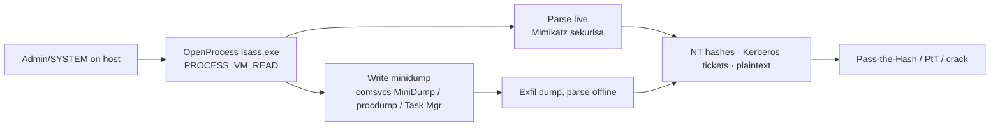

# LSASS Credential Dumping

<div class="dfir-meta" markdown>
**MITRE ATT&CK:** T1003.001 (OS Credential Dumping: LSASS Memory) · **Tactic:** Credential Access · **Last updated:** 2026-09-17
</div>

!!! abstract "Summary"
    The Local Security Authority Subsystem Service (`lsass.exe`) holds, in memory, the credential material of everyone logged on — NT hashes, Kerberos tickets, and (if WDigest is on) plaintext passwords. An attacker with admin/SYSTEM reads or dumps LSASS memory and extracts those secrets, feeding directly into [Pass-the-Hash](pass-the-hash.md), pass-the-ticket, and Kerberoast cracking. This is the pivot from "one box" to "the domain".

## How the attack works

The attacker opens a handle to `lsass.exe` with `PROCESS_VM_READ` (and usually `PROCESS_QUERY_INFORMATION`), then either parses memory live (Mimikatz `sekurlsa::logonpasswords`) or writes a **minidump** to disk and parses it offline. Living-off-the-land variants use signed Windows binaries (`comsvcs.dll` `MiniDump`, Task Manager, `procdump`) so nothing obviously malicious touches disk.



## Attacker tooling / commands

```text
# Mimikatz (live)
privilege::debug
sekurlsa::logonpasswords

# LOLBin minidump via comsvcs.dll (very common, signed binary)
rundll32.exe C:\Windows\System32\comsvcs.dll, MiniDump <lsass_PID> C:\Temp\l.dmp full

# procdump (signed Sysinternals)
procdump.exe -accepteula -ma lsass.exe lsass.dmp

# Task Manager: right-click lsass -> Create dump file  (GUI, no CLI trace)
# nanodump / dumpert  — direct syscalls to evade EDR hooks
```

## Artifacts left behind

| Where | Artifact | What to look for |
|---|---|---|
| Host **Sysmon** | **10** (ProcessAccess) `TargetImage=...\lsass.exe`, `GrantedAccess` `0x1010`, `0x1410`, `0x143a`, `0x1fffff` | The strongest signal — a process opening LSASS with read/dump rights. `SourceImage`/`CallTrace` names the tool |
| Host Sysmon | **11** (FileCreate) of `*.dmp` in temp/user paths; **1** for `procdump`, `rundll32 ... comsvcs ... MiniDump`, renamed mimikatz | The dump file and the tool |
| Host Security log | **4688** with command line containing `comsvcs`, `MiniDump`, `procdump -ma lsass`, `-ma lsass` | LOLBin invocation |
| Host Defender | `Microsoft-Windows-Windows Defender/Operational` **1116/1117** (`Behavior:Win32/…LSASS…`) | AV/EDR behavioural hit |
| Host | [Prefetch](../windows/prefetch.md)/[Amcache](../windows/amcache.md) for the tool; [$MFT/$UsnJrnl](../windows/mft-usn.md) create+delete of the `.dmp`; `Zone.Identifier` if downloaded | File-system trail, survives cleanup |
| Registry | [WDigest `UseLogonCredential=1`](../windows/registry-keys.md#system-identity-timing) set beforehand | Attacker enabling plaintext caching |
| Network | Exfil of the `.dmp` — [SRUM](../windows/srum.md) bytes per app, [Zeek `files.log`](../network/zeek/files-log.md) if copied over SMB/HTTP | Where the dump went |

!!! warning "GrantedAccess is noisy but decisive"
    Legitimate software (AV, EDR, some backup and monitoring agents) opens LSASS too. The trick is to **allow-list the known-good `SourceImage`s** and alert on the rest. Access masks that include `0x10` (VM_READ) or `0x0400` (QUERY_INFORMATION) with a dump — `0x1010`, `0x1410`, `0x143a` — from an unexpected process are the ones to chase.

## Detection

=== "Splunk — LSASS access (Sysmon 10)"

    ```spl
    index=botsv3 sourcetype="XmlWinEventLog:Microsoft-Windows-Sysmon/Operational" EventID=10 TargetImage="*\\lsass.exe"
    | eval src=lower(replace(SourceImage,".*\\\\",""))
    | search NOT src IN ("wmiprvse.exe","csrss.exe","wininit.exe","services.exe","msmpeng.exe","mssense.exe","sensecncproxy.exe","taniumclient.exe")
    | stats count, values(GrantedAccess) as access, values(CallTrace) as calls by host, SourceImage
    | sort - count
    ```

    Sysmon `10` = one process opened a handle to another. Filtering `TargetImage` to `lsass.exe` and excluding a baseline of legitimate accessors leaves the suspicious openers; `GrantedAccess` shows the rights requested and `CallTrace` often reveals `dbghelp.dll`/`comsvcs.dll` (minidump) or unbacked memory (injected tooling). Tune the exclusion list to your EDR/AV.

=== "Splunk — dump via LOLBin / procdump"

    ```spl
    index=botsv3 (sourcetype="XmlWinEventLog:Microsoft-Windows-Sysmon/Operational" EventID=1) OR (sourcetype=WinEventLog EventCode=4688)
    | eval cmd=lower(coalesce(CommandLine, Process_Command_Line))
    | where match(cmd,"comsvcs.*minidump|procdump.*(-ma\s+)?lsass|-ma\s+lsass|rundll32.*minidump|dumpert|nanodump|sqldumper.*lsass|createdump.*lsass")
    | table _time, host, User, Image, New_Process_Name, cmd
    | sort 0 _time
    ```

    Matches the common dumping command lines — `comsvcs.dll MiniDump`, `procdump -ma lsass`, and named tools — across both Sysmon and Security process-creation events.

=== "Splunk — .dmp file creation"

    ```spl
    index=botsv3 sourcetype="XmlWinEventLog:Microsoft-Windows-Sysmon/Operational" EventID=11 TargetFilename="*.dmp"
    | where match(TargetFilename,"(?i)\\\\(temp|users\\\\public|programdata|windows\\\\temp|perflogs)\\\\")
    | table _time, host, Image, User, TargetFilename
    ```

    Sysmon `11` = a file was created. A `.dmp` written to a staging directory, especially by `rundll32`/`taskmgr`/`procdump`, is the on-disk half of the dump.

## Response

Assume **every credential cached on that host is compromised** — this is the highest-severity credential event. Rotate all accounts that were logged on at dump time (interactive users, service accounts, and any admin), and if a Domain Admin or the `krbtgt`-adjacent material was exposed, plan a domain-wide credential reset. Trace where the `.dmp` went ([SRUM](../windows/srum.md), [Zeek files.log](../network/zeek/files-log.md)) and what the stolen creds were then used for ([Pass-the-Hash](pass-the-hash.md) hunts). Harden: enable **LSASS protection** (`RunAsPPL`) and **Credential Guard**, turn WDigest **off** (`UseLogonCredential=0`), deploy Attack Surface Reduction rule "Block credential stealing from lsass.exe", ensure EDR monitors LSASS handle opens, and disable plaintext caching. Detection here is worth investing in — it is the choke point before lateral movement.

## References

- [MITRE ATT&CK — T1003.001](https://attack.mitre.org/techniques/T1003/001/)
- [Microsoft — Configuring additional LSA protection (RunAsPPL)](https://learn.microsoft.com/en-us/windows-server/security/credentials-protection-and-management/configuring-additional-lsa-protection)
- Pages: [Pass-the-Hash](pass-the-hash.md) · [Registry keys](../windows/registry-keys.md) · [SRUM](../windows/srum.md) · [Security searches](../splunk/security-searches.md)
