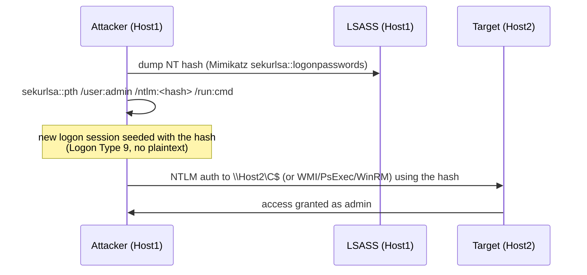

# Pass-the-Hash (PtH)

<div class="dfir-meta" markdown>
**MITRE ATT&CK:** T1550.002 (Use Alternate Authentication Material: Pass the Hash) · **Tactic:** Lateral Movement / Defense Evasion · **Last updated:** 2026-09-17
</div>

!!! abstract "Summary"
    NTLM authentication proves you know a password by proving you hold its **NT hash** — it never checks the plaintext. So an attacker who steals the NT hash (from LSASS, the SAM, or a DC) can authenticate as that user **without ever cracking it**, by feeding the hash straight into the NTLM handshake. No password, full access.

## How the attack works

NTLM is a challenge–response protocol: the server sends a random challenge, the client encrypts it with the user's NT hash, the server (or DC) verifies. The plaintext password is only ever used to *derive* the NT hash locally — the wire protocol and the verification both operate on the hash. That is the design flaw PtH abuses.



The prerequisite is admin/SYSTEM on the first host to read LSASS. After that, the hash works anywhere that account is privileged and where NTLM is accepted.

## Attacker tooling / commands

For recognition, not replication:

```text
# Mimikatz — spawn a process with the hash injected into a new logon session
sekurlsa::pth /user:Administrator /domain:CORP /ntlm:<32-hex-NT-hash> /run:"cmd.exe"

# Impacket (from Linux) — auth with -hashes LMHASH:NTHASH
psexec.py CORP/Administrator@10.0.0.5 -hashes :<NThash>
wmiexec.py CORP/Administrator@10.0.0.5 -hashes :<NThash>
smbexec.py / atexec.py  -hashes :<NThash>

# CrackMapExec / NetExec
nxc smb 10.0.0.0/24 -u Administrator -H <NThash> --local-auth
```

## Artifacts left behind

| Where | Artifact | What to look for |
|---|---|---|
| **Source host** event log | Security **4624 Logon Type 9** (NewCredentials), `Logon Process = seclogo`, `Authentication Package = Negotiate` | Mimikatz `pth` seeds a type-9 session on the attacker's box |
| Source host Sysmon | **10** (ProcessAccess) targeting `lsass.exe` with access `0x1010`/`0x1410`; **1** for `mimikatz`/renamed | Hash was dumped here first — see [LSASS dumping](lsass-dumping.md) |
| **Target host** event log | **4624 Logon Type 3**, `Authentication Package = NTLM`, `Key Length = 0` | Workstation-to-workstation **NTLM** logon in a Kerberos domain is abnormal |
| Target host | **4672** (admin privileges) with the same Logon ID; **5140/5145** (`ADMIN$`/`C$` access); **7045** if PsExec | The lateral-movement fallout — see [PsExec & SMB](psexec-smb.md) |
| Network | [Zeek `ntlm.log`](../network/zeek/index.md) — `username`, `hostname`, `domainname`; SMB (`445`) internal→internal | NTLM auth to a host the source never normally touches |
| Host artifacts | [Prefetch](../windows/prefetch.md)/[Amcache](../windows/amcache.md) for the dumping tool; [Registry](../windows/registry-keys.md) `WDigest UseLogonCredential=1` (cleartext-cred prep) | Credential-theft precursors |

!!! warning "Type 3 NTLM is the tell, not type 9"
    Type 9 only appears on the attacker's own machine and only for some tooling. The durable, cross-host signal is a **Logon Type 3 with Authentication Package = NTLM** from one workstation to another in an environment that should be all-Kerberos. Baseline which hosts legitimately use NTLM (some apps, some appliances) so the anomalies stand out.

## Detection

=== "Splunk — target-side NTLM lateral movement"

    ```spl
    index=botsv3 sourcetype=WinEventLog EventCode=4624 Logon_Type=3 Authentication_Package=NTLM
    | eval src=Source_Network_Address, user=mvindex(Account_Name,1)
    | where NOT cidrmatch("0.0.0.0/32", src) AND src!="-" AND NOT match(user,"\\$$")
    | stats dc(host) as targets, values(host) as where, count by user, src
    | where targets >= 2
    | sort - targets
    ```

    `4624` = a logon succeeded; `Logon_Type=3` = network logon (SMB/WMI/WinRM); `Authentication_Package=NTLM` narrows to NTLM rather than Kerberos. `mvindex(Account_Name,1)` takes the account that logged on; excluding names ending in `$` drops computer accounts. `dc(host)` counts how many distinct machines that user+source pair reached — one credential hitting several hosts over NTLM is the PtH shape.

=== "Splunk — source-side pth (type 9)"

    ```spl
    index=botsv3 sourcetype=WinEventLog EventCode=4624 Logon_Type=9 Logon_Process=seclogo Authentication_Package=Negotiate
    | table _time, host, Account_Name, Logon_ID, Process_Name
    | sort 0 _time
    ```

    Logon Type 9 (NewCredentials) with logon process `seclogo` and package `Negotiate` is the exact signature Mimikatz `sekurlsa::pth` leaves on the machine that ran it.

=== "Zeek — NTLM over SMB"

    ```bash
    # Internal->internal NTLM auth: who authenticated as whom, where
    zeek-cut -d ts id.orig_h id.resp_h username domainname hostname success < ntlm.log \
      | awk '$2 ~ /^10\./ && $3 ~ /^10\./'
    ```

    `ntlm.log` records the NTLM `username`/`domain`/`hostname` in the clear (the hash is not, but the identity is). Internal-to-internal NTLM to a host the source never normally contacts is the network-side signal; pivot the `uid` into [`conn.log`](../network/zeek/conn-log.md) for timing and bytes.

## Response

Contain by isolating the source host and disabling/rotating the compromised account — **and reset it twice** or the old NT hash still works. Because the hash is the credential, remediation means **credential hygiene**, not password complexity: rotate the account (twice for `krbtgt`-adjacent and privileged accounts), and hunt every host that account touched. Collect from the source host: LSASS access events, the dumping tool ([Prefetch](../windows/prefetch.md)/[Amcache](../windows/amcache.md)), and the full [host timeline](../splunk/security-searches.md#build-a-host-timeline-everything-about-one-machine). Harden going forward: LSASS protection (RunAsPPL, Credential Guard), disable WDigest, deny NTLM where possible, tier admin accounts so a workstation hash can't reach a server, and use the **Protected Users** group and LAPS so local admin hashes aren't shared across machines.

## References

- [MITRE ATT&CK — T1550.002](https://attack.mitre.org/techniques/T1550/002/)
- [Microsoft — Mitigating Pass-the-Hash and Other Credential Theft (v2)](https://www.microsoft.com/en-us/download/details.aspx?id=36036)
- Pages: [LSASS dumping](lsass-dumping.md) · [PsExec & SMB](psexec-smb.md) · [Windows Event IDs](../basics/windows-event-ids.md) · [Security searches](../splunk/security-searches.md)
