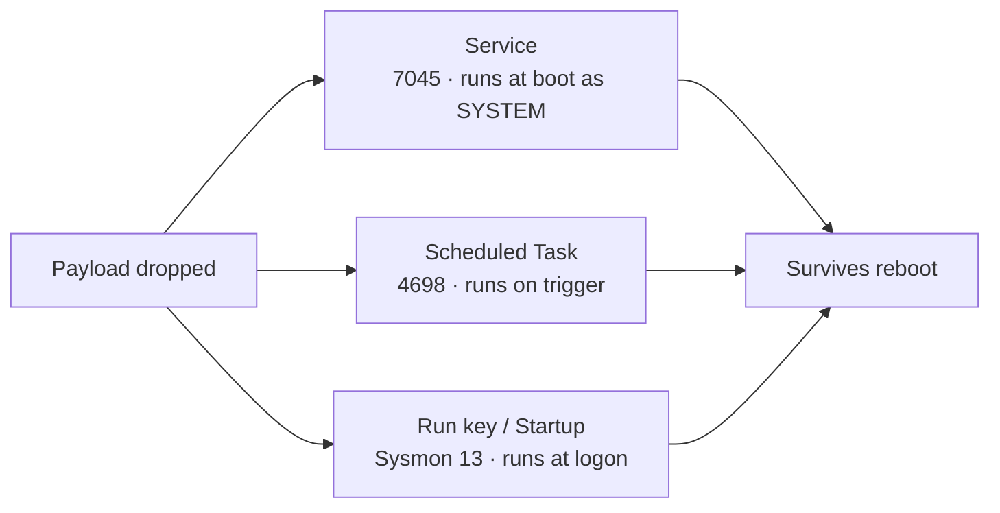

# Persistence — Services, Tasks & Run Keys

<div class="dfir-meta" markdown>
**MITRE ATT&CK:** T1543.003 (Windows Service) · T1053.005 (Scheduled Task) · T1547.001 (Registry Run Keys) · **Tactic:** Persistence · **Last updated:** 2026-09-17
</div>

!!! abstract "Summary"
    Persistence is how an attacker survives a reboot or a logoff. The three most common Windows mechanisms are a **service** (runs at boot as SYSTEM), a **scheduled task** (runs on a trigger — logon, time, event), and a **Run key** (runs at user logon). Each leaves a clear, auditable record, and each has a legitimate twin — so detection is about spotting the *abnormal* instance, not the mechanism.

## How the attack works

The attacker registers an autostart entry pointing at their payload — a binary in a user-writable path, an encoded PowerShell one-liner, or a LOLBin download cradle. On the next trigger (boot, logon, scheduled time), Windows runs it for them. Good tradecraft picks names that blend in (`WindowsUpdater`, `GoogleUpdateTask`) and paths that look plausible.



The [Registry keys → ASEP](../windows/registry-keys.md#autostart-persistence-asep) page lists dozens more autostart locations (Winlogon, IFEO, COM hijack, WMI, AppInit, etc.); this page covers the three that dominate real incidents.

## Attacker tooling / commands

```text
# Service
sc create WindowsHealth binPath= "C:\Users\Public\svc.exe" start= auto
sc create X binPath= "cmd /c powershell -nop -w hidden -enc <b64>"    # Cobalt Strike style

# Scheduled task
schtasks /create /tn "GoogleUpdateTaskMachine" /tr "powershell -enc <b64>" /sc onlogon /ru SYSTEM
schtasks /create /tn Updater /tr "C:\ProgramData\u.exe" /sc minute /mo 30

# Run key
reg add HKCU\Software\Microsoft\Windows\CurrentVersion\Run /v Updater /d "C:\Users\Public\u.exe"
# Startup folder
copy payload.exe "%APPDATA%\Microsoft\Windows\Start Menu\Programs\Startup\"
```

## Artifacts left behind

| Mechanism | Where | Artifact |
|---|---|---|
| **Service** | System log | **7045** (service installed) — `Service_Name`, `Service_File_Name`, `Service_Start_Type` |
| | Security log | **4697** (service installed — needs audit policy) |
| | Registry | `HKLM\SYSTEM\CurrentControlSet\Services\<name>` — [Registry keys](../windows/registry-keys.md#autostart-persistence-asep) |
| | System log | **7034/7036/7040** (service crash/state/start-type change) |
| **Scheduled task** | Security log | **4698** (created), **4702** (updated), **4699** (deleted), **4700/4701** (enabled/disabled) — task XML in `Task_Content` |
| | TaskScheduler/Operational | **106** (registered), **140** (updated), **200/201** (action run/completed) |
| | Disk | `C:\Windows\System32\Tasks\<name>` XML + registry `...\Schedule\TaskCache\Tree` — a task in one but not the other = **hidden task** |
| **Run key / Startup** | Sysmon | **13** (registry value set) on `...\CurrentVersion\Run`, `RunOnce`, Winlogon `Shell`/`Userinit` |
| | Registry | The key's LastWrite time; value data = payload path |
| | Disk / autoruns | Startup-folder `.lnk`/`.exe`; **Autoruns** offline scan |
| All | Host | [Prefetch](../windows/prefetch.md)/[Amcache](../windows/amcache.md) for the payload; [$MFT](../windows/mft-usn.md) for when it was dropped; [UserAssist/BAM](../windows/registry-keys.md#program-execution-per-user-unless-noted) for execution |

## Detection

=== "Splunk — suspicious services"

    ```spl
    index=botsv3 sourcetype="WinEventLog:System" EventCode=7045
    | eval bin=lower(Service_File_Name)
    | where match(bin,"-enc |frombase64|powershell|%comspec%|cmd\.exe|\\\\users\\\\|\\\\programdata\\\\|\\\\temp\\\\|\\\\public\\\\|\\\\appdata\\\\|rundll32|regsvr32|mshta")
        OR match(lower(Service_Name),"^[a-z0-9]{8}$")
    | table _time, host, Service_Name, Service_File_Name, Service_Start_Type, Account_Name
    | sort 0 _time
    ```

    `7045` = a service was installed. Legitimate services run signed binaries from `Program Files`/`System32`; the regex flags services whose binary is an encoded PowerShell one-liner, a LOLBin, or a file in a user-writable path — and random 8-character service names, a Cobalt Strike default.

=== "Splunk — scheduled tasks with command extraction"

    ```spl
    index=botsv3 sourcetype=WinEventLog EventCode IN (4698,4702)
    | rex field=Task_Content "<Command>(?<cmd>[^<]+)</Command>"
    | rex field=Task_Content "<Arguments>(?<args>[^<]+)</Arguments>"
    | eval full=cmd." ".args
    | where match(lower(full),"-enc |frombase64|powershell|mshta|rundll32|regsvr32|\\\\users\\\\|\\\\temp\\\\|\\\\public\\\\|http") OR isnull(cmd)
    | table _time, host, Subject_Account_Name, Task_Name, cmd, args
    | sort 0 _time
    ```

    `4698` = task created, `4702` = task updated. The task's action is buried in the `Task_Content` XML; two `rex` extractions pull out `<Command>` and `<Arguments>`, then the same suspicious-command filter applies. Watch for tasks that impersonate real ones (`GoogleUpdateTask*`, `Windows*`) but run from odd paths.

=== "Splunk — Run key writes (Sysmon 13)"

    ```spl
    index=botsv3 sourcetype="XmlWinEventLog:Microsoft-Windows-Sysmon/Operational" EventID=13
    | where match(TargetObject,"(?i)\\\\CurrentVersion\\\\Run(Once)?\\\\|\\\\Winlogon\\\\(Shell|Userinit)|\\\\Policies\\\\Explorer\\\\Run")
    | table _time, host, User, Image, TargetObject, Details
    | sort 0 _time
    ```

    Sysmon `13` = a registry value was set. `TargetObject` is the key path (Run/RunOnce/Winlogon), `Details` the value written (the payload path), and `Image` the process that wrote it — a non-installer process writing a Run key is suspicious.

## Response

Remove the persistence (delete the service/task/value **after** capturing it), then find and remove the **payload** it points to and figure out **how it got there** — persistence is a symptom, not the root. Sweep the whole environment for the same service name, task name, or Run value: attackers deploy identical persistence across many hosts. Run **Autoruns** (offline mode on an image) for a full ASEP inventory — the three mechanisms here are common but the [Registry ASEP list](../windows/registry-keys.md#autostart-persistence-asep) has many more. Preserve [Prefetch](../windows/prefetch.md)/[Amcache](../windows/amcache.md)/[$MFT](../windows/mft-usn.md) to date the payload. Harden: audit service and task creation (`4697`/`4698`), alert on `7045` for non-standard binaries, restrict who can create services/tasks, and monitor Run-key writes with Sysmon.

## References

- [MITRE ATT&CK — T1543.003](https://attack.mitre.org/techniques/T1543/003/) · [T1053.005](https://attack.mitre.org/techniques/T1053/005/) · [T1547.001](https://attack.mitre.org/techniques/T1547/001/)
- [Sysinternals Autoruns](https://learn.microsoft.com/en-us/sysinternals/downloads/autoruns)
- Pages: [Registry keys — ASEP](../windows/registry-keys.md#autostart-persistence-asep) · [Event logs](../windows/event-logs.md) · [Security searches](../splunk/security-searches.md)
